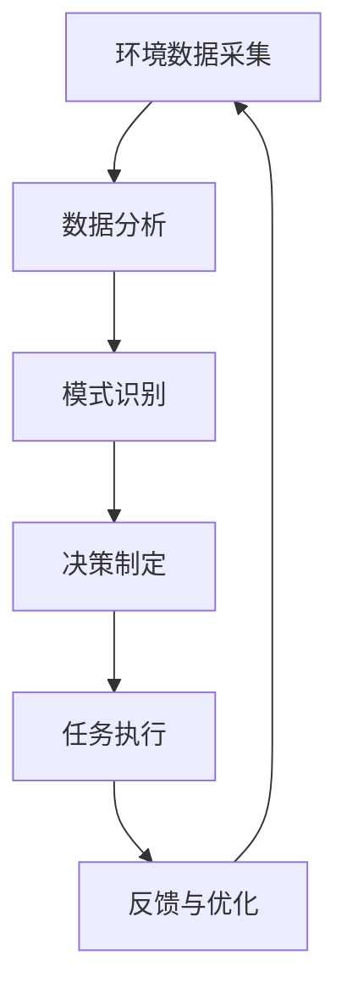
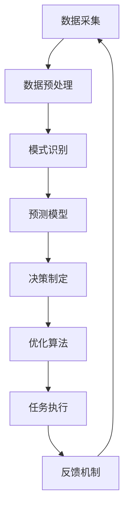
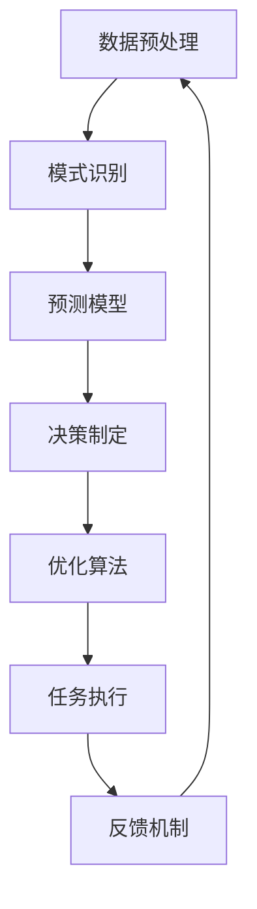

# AI人工智能代理工作流 AI Agent WorkFlow：在环保行业中的应用

## 1.背景介绍

### 1.1 环保行业的现状与挑战

环保行业在全球范围内面临着巨大的挑战，包括气候变化、污染控制、资源管理等。传统的环保方法往往依赖于大量的人力和时间，效率低下且成本高昂。随着数据量的增加和复杂性的提升，传统方法已经难以应对现代环保需求。

### 1.2 人工智能在环保中的潜力

人工智能（AI）技术的迅猛发展为环保行业带来了新的希望。AI可以通过数据分析、模式识别和预测模型等手段，提供更高效、更精准的解决方案。特别是AI代理（AI Agent）工作流的引入，使得自动化和智能化的环保管理成为可能。

### 1.3 本文的目的与结构

本文旨在探讨AI代理工作流在环保行业中的应用，详细介绍其核心概念、算法原理、数学模型、项目实践、实际应用场景、工具和资源推荐，并展望其未来发展趋势与挑战。

## 2.核心概念与联系

### 2.1 AI代理的定义

AI代理是一种能够自主感知环境、做出决策并执行任务的智能系统。它们可以通过学习和适应，不断优化自身的行为，以达到预定的目标。

### 2.2 工作流的定义

工作流是指一系列有序的任务和活动，通过预定义的规则和逻辑进行协调和管理，以实现特定的业务目标。在环保行业中，工作流可以涵盖数据采集、分析、决策和执行等多个环节。

### 2.3 AI代理工作流的联系

AI代理工作流将AI代理与工作流管理结合起来，使得整个流程更加智能化和自动化。通过AI代理的感知和决策能力，工作流可以动态调整和优化，从而提高效率和效果。

### 2.4 核心概念的联系图示



## 3.核心算法原理具体操作步骤

### 3.1 数据采集与预处理

数据采集是AI代理工作流的起点，涉及传感器数据、卫星影像、历史记录等多种数据源。预处理步骤包括数据清洗、归一化和特征提取。

### 3.2 模式识别与预测

模式识别是通过机器学习算法，从数据中提取有用的信息和模式。常用的算法包括决策树、支持向量机和神经网络等。预测模型则用于预测未来的环境变化和趋势。

### 3.3 决策制定与优化

基于模式识别和预测结果，AI代理可以制定相应的决策。优化算法如遗传算法、粒子群优化等，可以进一步优化决策方案，以达到最佳效果。

### 3.4 任务执行与反馈

任务执行是将决策转化为具体的行动，如污染控制措施、资源分配等。反馈机制则用于监控执行效果，并根据反馈信息进行调整和优化。

### 3.5 核心算法流程图



## 4.数学模型和公式详细讲解举例说明

### 4.1 数据预处理的数学模型

数据预处理包括数据清洗、归一化和特征提取。假设原始数据为 $X = \{x_1, x_2, \ldots, x_n\}$，归一化后的数据为 $X' = \{x'_1, x'_2, \ldots, x'_n\}$，则归一化公式为：

$$
x'_i = \frac{x_i - \min(X)}{\max(X) - \min(X)}
$$

### 4.2 模式识别的数学模型

以支持向量机（SVM）为例，假设训练数据集为 $D = \{(x_1, y_1), (x_2, y_2), \ldots, (x_n, y_n)\}$，其中 $x_i$ 为特征向量，$y_i$ 为标签。SVM 的目标是找到一个超平面，使得数据点被正确分类。其优化目标为：

$$
\min \frac{1}{2} \|w\|^2 + C \sum_{i=1}^n \xi_i
$$

其中，$w$ 为权重向量，$\xi_i$ 为松弛变量，$C$ 为惩罚参数。

### 4.3 预测模型的数学模型

以线性回归为例，假设数据集为 $D = \{(x_1, y_1), (x_2, y_2), \ldots, (x_n, y_n)\}$，线性回归模型为：

$$
y = w_0 + w_1 x_1 + w_2 x_2 + \ldots + w_n x_n
$$

其损失函数为：

$$
L(w) = \sum_{i=1}^n (y_i - (w_0 + w_1 x_{i1} + w_2 x_{i2} + \ldots + w_n x_{in}))^2
$$

### 4.4 决策制定的数学模型

以遗传算法为例，假设初始种群为 $P = \{p_1, p_2, \ldots, p_n\}$，适应度函数为 $f(p)$，则遗传算法的目标是通过选择、交叉和变异操作，不断优化种群，使得适应度函数达到最大值。

### 4.5 数学模型流程图



## 5.项目实践：代码实例和详细解释说明

### 5.1 数据采集与预处理

```python
import pandas as pd
from sklearn.preprocessing import MinMaxScaler

# 数据采集
data = pd.read_csv('environmental_data.csv')

# 数据预处理
scaler = MinMaxScaler()
data_scaled = scaler.fit_transform(data)

# 特征提取
features = data_scaled[:, :-1]
labels = data_scaled[:, -1]
```

### 5.2 模式识别与预测

```python
from sklearn.svm import SVR
from sklearn.model_selection import train_test_split

# 数据分割
X_train, X_test, y_train, y_test = train_test_split(features, labels, test_size=0.2, random_state=42)

# 模式识别与预测
model = SVR(kernel='rbf')
model.fit(X_train, y_train)
predictions = model.predict(X_test)
```

### 5.3 决策制定与优化

```python
import numpy as np
from scipy.optimize import differential_evolution

# 决策制定
def decision_function(params):
    # 模拟决策函数
    return np.sum(params**2)

# 优化算法
bounds = [(0, 1) for _ in range(len(features[0]))]
result = differential_evolution(decision_function, bounds)
optimal_params = result.x
```

### 5.4 任务执行与反馈

```python
# 任务执行
def execute_task(params):
    # 模拟任务执行
    print(f"Executing task with params: {params}")

execute_task(optimal_params)

# 反馈机制
def feedback():
    # 模拟反馈机制
    return np.random.rand()

feedback_score = feedback()
print(f"Feedback score: {feedback_score}")
```

## 6.实际应用场景

### 6.1 空气质量监测与预测

AI代理工作流可以用于实时监测和预测空气质量，通过传感器数据和历史记录，识别污染源并制定相应的控制措施。

### 6.2 水资源管理

在水资源管理中，AI代理工作流可以优化水资源的分配和使用，预测水质变化，制定应对措施，确保水资源的可持续利用。

### 6.3 垃圾分类与回收

AI代理工作流可以通过图像识别和分类算法，自动识别和分类垃圾，提高垃圾回收效率，减少环境污染。

### 6.4 能源管理

在能源管理中，AI代理工作流可以优化能源的生产和使用，预测能源需求，制定节能措施，降低能源消耗和碳排放。

## 7.工具和资源推荐

### 7.1 数据采集工具

- 传感器网络：用于实时采集环境数据。
- 卫星影像：用于大范围环境监测。

### 7.2 数据分析工具

- Pandas：用于数据处理和分析。
- Scikit-learn：用于机器学习和模式识别。

### 7.3 优化算法工具

- SciPy：提供多种优化算法。
- DEAP：用于遗传算法和进化计算。

### 7.4 可视化工具

- Matplotlib：用于数据可视化。
- Seaborn：用于高级数据可视化。

## 8.总结：未来发展趋势与挑战

### 8.1 未来发展趋势

随着AI技术的不断进步，AI代理工作流在环保行业中的应用将越来越广泛。未来的发展趋势包括：

- 更加智能化的决策系统：通过深度学习和强化学习，AI代理将能够做出更加精准和高效的决策。
- 更加自动化的工作流：通过自动化技术，减少人工干预，提高工作流的效率和可靠性。
- 更加个性化的解决方案：通过个性化的数据分析和预测，提供针对性的环保解决方案。

### 8.2 挑战与应对

尽管AI代理工作流在环保行业中具有巨大的潜力，但也面临一些挑战：

- 数据质量与隐私：确保数据的准确性和隐私保护是一个重要的挑战。
- 算法的复杂性：复杂的算法可能需要大量的计算资源和时间。
- 系统的可靠性：确保系统的稳定性和可靠性，避免因系统故障导致的环境问题。

应对这些挑战，需要不断优化算法，提高数据质量，增强系统的稳定性和可靠性。

## 9.附录：常见问题与解答

### 9.1 如何选择合适的AI算法？

选择合适的AI算法需要考虑数据的特点、问题的复杂性和计算资源等因素。可以通过实验和比较不同算法的性能，选择最优的算法。

### 9.2 如何确保数据的准确性和隐私？

确保数据的准确性可以通过数据清洗和验证等方法。隐私保护可以通过数据加密和访问控制等技术手段实现。

### 9.3 如何提高系统的可靠性？

提高系统的可靠性可以通过冗余设计、故障检测和恢复机制等方法实现。同时，定期进行系统测试和维护也是必要的。

### 9.4 如何应对算法的复杂性？

应对算法的复杂性可以通过优化算法、并行计算和分布式计算等方法，提高计算效率和性能。

### 9.5 如何实现个性化的环保解决方案？

实现个性化的环保解决方案需要通过个性化的数据分析和预测，结合具体的环境特点和需求，制定针对性的解决方案。

---

作者：禅与计算机程序设计艺术 / Zen and the Art of Computer Programming