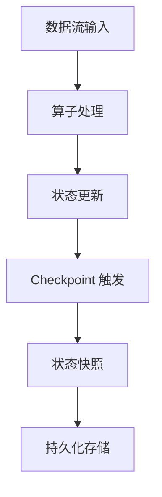

# Flink State状态管理原理与代码实例讲解

## 1.背景介绍

Apache Flink 是一个分布式流处理框架，广泛应用于实时数据处理、事件驱动应用和数据分析等领域。Flink 的核心优势之一在于其强大的状态管理功能。状态管理是流处理系统的关键，因为它允许系统在处理数据流时保持上下文信息，从而实现复杂的计算和业务逻辑。

在这篇文章中，我们将深入探讨 Flink 的状态管理原理，介绍核心概念和算法，提供数学模型和公式，展示代码实例，并讨论实际应用场景和未来发展趋势。

## 2.核心概念与联系

### 2.1 状态的定义

在 Flink 中，状态是指在流处理过程中需要持久化的中间结果或上下文信息。状态可以是简单的计数器、复杂的数据结构，甚至是整个数据库表。

### 2.2 状态的类型

Flink 提供了两种主要的状态类型：

- **Keyed State**：与特定的键关联的状态。每个键都有独立的状态。
- **Operator State**：与整个算子关联的状态，不区分具体的键。

### 2.3 状态后端

状态后端决定了状态的存储方式和位置。Flink 支持多种状态后端，包括内存、文件系统和 RocksDB。

### 2.4 Checkpoint 和 Savepoint

- **Checkpoint**：定期保存的状态快照，用于故障恢复。
- **Savepoint**：手动触发的状态快照，用于程序升级或迁移。

### 2.5 状态一致性

Flink 提供了多种一致性保证，包括精确一次（Exactly-once）和至少一次（At-least-once）。

## 3.核心算法原理具体操作步骤

### 3.1 状态的创建与使用

在 Flink 中，状态的创建和使用通常通过 `ValueState`、`ListState` 等接口实现。以下是一个简单的示例：

```java
public class StatefulMapFunction extends RichMapFunction<String, String> {
    private transient ValueState<Integer> countState;

    @Override
    public void open(Configuration parameters) {
        ValueStateDescriptor<Integer> descriptor = new ValueStateDescriptor<>(
            "countState",
            TypeInformation.of(new TypeHint<Integer>() {})
        );
        countState = getRuntimeContext().getState(descriptor);
    }

    @Override
    public String map(String value) throws Exception {
        Integer count = countState.value();
        if (count == null) {
            count = 0;
        }
        count++;
        countState.update(count);
        return value + " count: " + count;
    }
}
```

### 3.2 Checkpoint 机制

Flink 的 Checkpoint 机制确保了状态的一致性。以下是 Checkpoint 的工作流程：



### 3.3 状态恢复

当作业失败时，Flink 会从最近的 Checkpoint 恢复状态，从而保证数据处理的一致性。

## 4.数学模型和公式详细讲解举例说明

### 4.1 状态转移模型

Flink 的状态管理可以用状态转移模型来描述。假设 $S_t$ 表示时间 $t$ 的状态，$E_t$ 表示时间 $t$ 的事件，则状态转移函数 $f$ 可以表示为：

$$
S_{t+1} = f(S_t, E_t)
$$

### 4.2 一致性保证

Flink 提供的精确一次语义可以用以下公式表示：

$$
P(E_t | S_t) = P(E_t | S_{t-1}, E_{t-1})
$$

这意味着在每个时间点 $t$，事件 $E_t$ 的处理结果只依赖于当前状态 $S_t$ 和当前事件 $E_t$，而不受之前事件的影响。

## 5.项目实践：代码实例和详细解释说明

### 5.1 项目背景

假设我们有一个实时流处理项目，需要统计每个用户的点击次数，并在每次点击时输出当前的点击总数。

### 5.2 代码实例

以下是一个完整的 Flink 程序示例：

```java
import org.apache.flink.api.common.state.ValueState;
import org.apache.flink.api.common.state.ValueStateDescriptor;
import org.apache.flink.api.common.typeinfo.TypeHint;
import org.apache.flink.api.common.typeinfo.TypeInformation;
import org.apache.flink.configuration.Configuration;
import org.apache.flink.streaming.api.environment.StreamExecutionEnvironment;
import org.apache.flink.streaming.api.functions.KeyedProcessFunction;
import org.apache.flink.util.Collector;

public class ClickCount {
    public static void main(String[] args) throws Exception {
        StreamExecutionEnvironment env = StreamExecutionEnvironment.getExecutionEnvironment();

        env.socketTextStream("localhost", 9999)
            .keyBy(value -> value.split(",")[0])
            .process(new KeyedProcessFunction<String, String, String>() {
                private transient ValueState<Integer> countState;

                @Override
                public void open(Configuration parameters) {
                    ValueStateDescriptor<Integer> descriptor = new ValueStateDescriptor<>(
                        "countState",
                        TypeInformation.of(new TypeHint<Integer>() {})
                    );
                    countState = getRuntimeContext().getState(descriptor);
                }

                @Override
                public void processElement(String value, Context ctx, Collector<String> out) throws Exception {
                    Integer count = countState.value();
                    if (count == null) {
                        count = 0;
                    }
                    count++;
                    countState.update(count);
                    out.collect(value + " count: " + count);
                }
            });

        env.execute("Click Count");
    }
}
```

### 5.3 详细解释

1. **环境设置**：创建 Flink 流执行环境。
2. **数据源**：从本地 socket 读取数据流。
3. **键控流**：根据用户 ID 对数据流进行键控。
4. **状态管理**：在 `processElement` 方法中使用 `ValueState` 记录每个用户的点击次数。
5. **输出结果**：每次点击时输出当前的点击总数。

## 6.实际应用场景

### 6.1 实时数据分析

Flink 的状态管理功能广泛应用于实时数据分析场景，如实时用户行为分析、实时监控和告警等。

### 6.2 事件驱动应用

在事件驱动应用中，状态管理可以帮助系统保持上下文信息，从而实现复杂的业务逻辑。例如，电商网站的实时推荐系统。

### 6.3 数据流 ETL

在数据流 ETL（Extract, Transform, Load）过程中，状态管理可以用于记录中间结果和处理进度，从而提高数据处理的可靠性和一致性。

## 7.工具和资源推荐

### 7.1 开发工具

- **IntelliJ IDEA**：强大的 Java 开发工具，支持 Flink 开发。
- **Docker**：用于部署和测试 Flink 集群。

### 7.2 学习资源

- **Flink 官方文档**：详细的 API 文档和使用指南。
- **Flink 社区**：活跃的社区讨论和技术支持。
- **技术博客和书籍**：如《Stream Processing with Apache Flink》。

## 8.总结：未来发展趋势与挑战

### 8.1 未来发展趋势

- **更高的性能**：随着硬件和算法的进步，Flink 的性能将不断提升。
- **更丰富的功能**：Flink 将继续扩展其功能，支持更多的应用场景。
- **更好的易用性**：Flink 将致力于提高开发者的使用体验，简化开发和部署流程。

### 8.2 挑战

- **状态管理的复杂性**：随着应用场景的复杂化，状态管理的复杂性也在增加，需要更好的工具和方法来管理状态。
- **一致性保证**：在分布式系统中保证状态的一致性仍然是一个挑战，需要不断优化算法和架构。

## 9.附录：常见问题与解答

### 9.1 如何选择合适的状态后端？

选择状态后端时需要考虑数据量、访问频率和持久化需求。对于小数据量和高访问频率的场景，可以选择内存状态后端；对于大数据量和持久化需求高的场景，可以选择 RocksDB 状态后端。

### 9.2 如何优化状态的性能？

可以通过以下方法优化状态的性能：

- 合理选择状态后端。
- 使用增量 Checkpoint 减少状态快照的开销。
- 优化状态的访问和更新逻辑，减少不必要的操作。

### 9.3 如何处理状态的升级和迁移？

可以使用 Savepoint 功能进行状态的升级和迁移。在程序升级或迁移前，手动触发 Savepoint，并在新版本程序中从 Savepoint 恢复状态。

---

作者：禅与计算机程序设计艺术 / Zen and the Art of Computer Programming