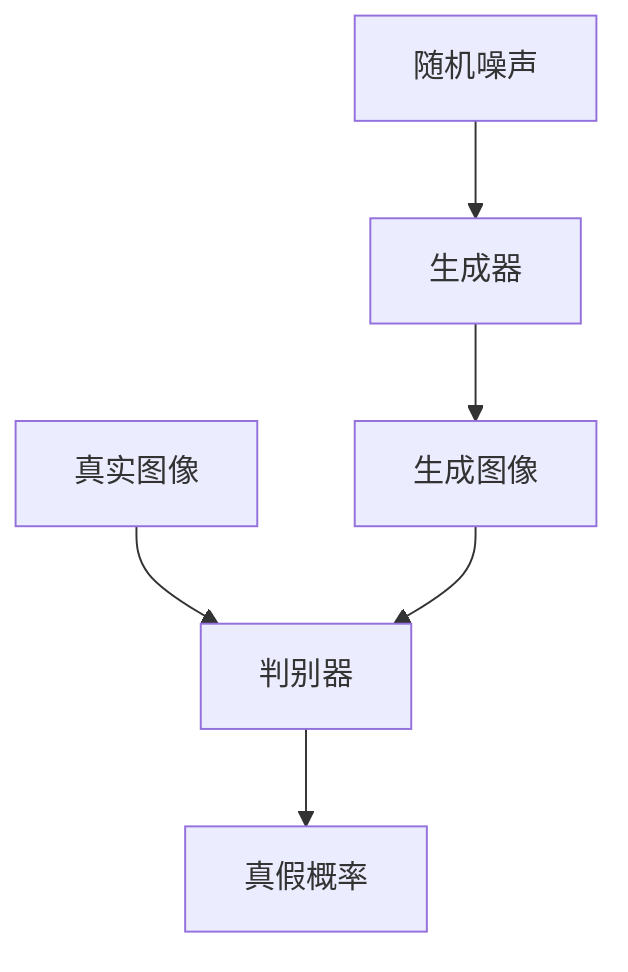

# Midjourney原理与代码实例讲解

## 1.背景介绍

在人工智能和深度学习的快速发展中，生成对抗网络（GANs）和变分自编码器（VAEs）等技术已经成为图像生成领域的核心技术。Midjourney作为一种新兴的图像生成技术，结合了多种先进的算法和模型，能够生成高质量的图像。本文将深入探讨Midjourney的原理、核心算法、数学模型，并通过代码实例展示其实际应用。

## 2.核心概念与联系

### 2.1 生成对抗网络（GANs）

生成对抗网络由生成器（Generator）和判别器（Discriminator）组成。生成器负责生成图像，而判别器则负责区分生成图像和真实图像。两者通过对抗训练不断提升生成图像的质量。

### 2.2 变分自编码器（VAEs）

变分自编码器是一种生成模型，通过编码器将输入图像编码为潜在变量，再通过解码器将潜在变量解码为图像。VAEs通过最大化证据下界（ELBO）来训练模型。

### 2.3 Midjourney的独特之处

Midjourney结合了GANs和VAEs的优点，通过多层次的生成和判别机制，实现了高质量图像的生成。其核心在于多尺度特征提取和多层次判别器的设计。

## 3.核心算法原理具体操作步骤

### 3.1 数据预处理

数据预处理是图像生成的第一步，包括图像的归一化、数据增强等操作。通过这些操作，可以提高模型的泛化能力。

### 3.2 生成器设计

生成器采用多层卷积神经网络（CNN），通过逐层上采样生成高分辨率图像。生成器的输入是随机噪声，通过多层卷积和反卷积操作，逐步生成图像。

### 3.3 判别器设计

判别器同样采用多层卷积神经网络，通过多层卷积操作提取图像特征，并通过全连接层输出图像的真假概率。判别器的设计需要考虑多尺度特征的提取，以提高判别的准确性。

### 3.4 对抗训练

生成器和判别器通过对抗训练不断提升生成图像的质量。生成器的目标是生成能够欺骗判别器的图像，而判别器的目标是准确区分生成图像和真实图像。



## 4.数学模型和公式详细讲解举例说明

### 4.1 生成对抗网络的损失函数

生成对抗网络的损失函数包括生成器的损失和判别器的损失。生成器的损失函数为：

$$
L_G = -\mathbb{E}_{z \sim p_z(z)}[\log D(G(z))]
$$

判别器的损失函数为：

$$
L_D = -\mathbb{E}_{x \sim p_{data}(x)}[\log D(x)] - \mathbb{E}_{z \sim p_z(z)}[\log (1 - D(G(z)))]
$$

### 4.2 变分自编码器的损失函数

变分自编码器的损失函数包括重构损失和KL散度。重构损失为：

$$
L_{recon} = \mathbb{E}_{q(z|x)}[\log p(x|z)]
$$

KL散度为：

$$
L_{KL} = D_{KL}(q(z|x) || p(z))
$$

总损失函数为：

$$
L_{VAE} = L_{recon} + L_{KL}
$$

### 4.3 Midjourney的损失函数

Midjourney结合了GANs和VAEs的损失函数，通过多层次的生成和判别机制，实现了高质量图像的生成。其损失函数为：

$$
L_{Midjourney} = L_G + L_D + L_{VAE}
$$

## 5.项目实践：代码实例和详细解释说明

### 5.1 数据预处理

```python
import torch
import torchvision.transforms as transforms
from torchvision.datasets import CIFAR10

transform = transforms.Compose([
    transforms.Resize(64),
    transforms.ToTensor(),
    transforms.Normalize(mean=[0.5, 0.5, 0.5], std=[0.5, 0.5, 0.5])
])

dataset = CIFAR10(root='./data', train=True, transform=transform, download=True)
dataloader = torch.utils.data.DataLoader(dataset, batch_size=64, shuffle=True)
```

### 5.2 生成器设计

```python
import torch.nn as nn

class Generator(nn.Module):
    def __init__(self):
        super(Generator, self).__init__()
        self.main = nn.Sequential(
            nn.ConvTranspose2d(100, 512, 4, 1, 0, bias=False),
            nn.BatchNorm2d(512),
            nn.ReLU(True),
            nn.ConvTranspose2d(512, 256, 4, 2, 1, bias=False),
            nn.BatchNorm2d(256),
            nn.ReLU(True),
            nn.ConvTranspose2d(256, 128, 4, 2, 1, bias=False),
            nn.BatchNorm2d(128),
            nn.ReLU(True),
            nn.ConvTranspose2d(128, 64, 4, 2, 1, bias=False),
            nn.BatchNorm2d(64),
            nn.ReLU(True),
            nn.ConvTranspose2d(64, 3, 4, 2, 1, bias=False),
            nn.Tanh()
        )

    def forward(self, input):
        return self.main(input)
```

### 5.3 判别器设计

```python
class Discriminator(nn.Module):
    def __init__(self):
        super(Discriminator, self).__init__()
        self.main = nn.Sequential(
            nn.Conv2d(3, 64, 4, 2, 1, bias=False),
            nn.LeakyReLU(0.2, inplace=True),
            nn.Conv2d(64, 128, 4, 2, 1, bias=False),
            nn.BatchNorm2d(128),
            nn.LeakyReLU(0.2, inplace=True),
            nn.Conv2d(128, 256, 4, 2, 1, bias=False),
            nn.BatchNorm2d(256),
            nn.LeakyReLU(0.2, inplace=True),
            nn.Conv2d(256, 512, 4, 2, 1, bias=False),
            nn.BatchNorm2d(512),
            nn.LeakyReLU(0.2, inplace=True),
            nn.Conv2d(512, 1, 4, 1, 0, bias=False),
            nn.Sigmoid()
        )

    def forward(self, input):
        return self.main(input)
```

### 5.4 对抗训练

```python
import torch.optim as optim

device = torch.device("cuda" if torch.cuda.is_available() else "cpu")

netG = Generator().to(device)
netD = Discriminator().to(device)

criterion = nn.BCELoss()
optimizerD = optim.Adam(netD.parameters(), lr=0.0002, betas=(0.5, 0.999))
optimizerG = optim.Adam(netG.parameters(), lr=0.0002, betas=(0.5, 0.999))

for epoch in range(25):
    for i, data in enumerate(dataloader, 0):
        netD.zero_grad()
        real = data[0].to(device)
        batch_size = real.size(0)
        label = torch.full((batch_size,), 1, device=device)
        output = netD(real).view(-1)
        errD_real = criterion(output, label)
        errD_real.backward()
        noise = torch.randn(batch_size, 100, 1, 1, device=device)
        fake = netG(noise)
        label.fill_(0)
        output = netD(fake.detach()).view(-1)
        errD_fake = criterion(output, label)
        errD_fake.backward()
        errD = errD_real + errD_fake
        optimizerD.step()

        netG.zero_grad()
        label.fill_(1)
        output = netD(fake).view(-1)
        errG = criterion(output, label)
        errG.backward()
        optimizerG.step()

        if i % 50 == 0:
            print(f'[{epoch}/{25}][{i}/{len(dataloader)}] Loss_D: {errD.item()} Loss_G: {errG.item()}')
```

## 6.实际应用场景

Midjourney技术在多个领域有广泛的应用，包括但不限于：

### 6.1 图像生成

通过Midjourney技术，可以生成高质量的图像，应用于艺术创作、广告设计等领域。

### 6.2 数据增强

在数据不足的情况下，可以通过Midjourney技术生成更多的训练数据，提高模型的泛化能力。

### 6.3 图像修复

通过Midjourney技术，可以对损坏的图像进行修复，恢复图像的原始质量。

## 7.工具和资源推荐

### 7.1 开发工具

- **PyTorch**：一个开源的深度学习框架，支持动态计算图，适合进行Midjourney的开发。
- **TensorFlow**：另一个流行的深度学习框架，支持静态计算图，适合进行大规模的模型训练。

### 7.2 数据集

- **CIFAR-10**：一个常用的图像分类数据集，包含10个类别的60000张32x32彩色图像。
- **ImageNet**：一个大规模的图像分类数据集，包含1000个类别的超过100万张图像。

### 7.3 资源推荐

- **《深度学习》**：一本由Ian Goodfellow等人编写的经典深度学习教材，详细介绍了深度学习的基本概念和算法。
- **《生成对抗网络》**：一本专门介绍生成对抗网络的书籍，详细讲解了GANs的原理和应用。

## 8.总结：未来发展趋势与挑战

Midjourney技术在图像生成领域展现了巨大的潜力，但也面临一些挑战。未来的发展趋势包括：

### 8.1 模型优化

通过改进生成器和判别器的结构，可以进一步提高生成图像的质量。

### 8.2 训练效率

通过优化训练算法和硬件加速，可以提高模型的训练效率，缩短训练时间。

### 8.3 应用扩展

Midjourney技术可以应用于更多的领域，如视频生成、3D模型生成等，进一步拓展其应用范围。

## 9.附录：常见问题与解答

### 9.1 Midjourney与传统GANs的区别是什么？

Midjourney结合了GANs和VAEs的优点，通过多层次的生成和判别机制，实现了高质量图像的生成。

### 9.2 如何提高生成图像的质量？

可以通过改进生成器和判别器的结构、优化训练算法等方式，提高生成图像的质量。

### 9.3 Midjourney技术的应用场景有哪些？

Midjourney技术可以应用于图像生成、数据增强、图像修复等多个领域。

---

作者：禅与计算机程序设计艺术 / Zen and the Art of Computer Programming