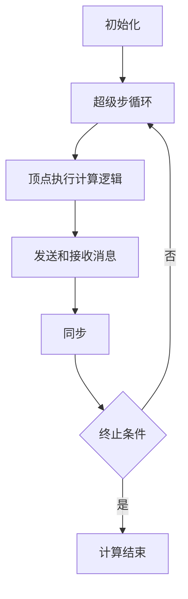

# Pregel原理与代码实例讲解

## 1.背景介绍

在大数据时代，图计算成为了处理复杂关系和结构化数据的关键技术。图计算广泛应用于社交网络分析、推荐系统、网络安全等领域。Google在2009年提出的Pregel框架，为大规模图计算提供了一种高效、可扩展的解决方案。Pregel基于BSP（Bulk Synchronous Parallel）模型，能够在分布式环境中高效地处理大规模图数据。

## 2.核心概念与联系

### 2.1 BSP模型

BSP模型是Pregel的基础。BSP模型将计算过程分为多个超级步（Superstep），每个超级步包括三个阶段：计算、通信和同步。每个节点在计算阶段执行本地计算，在通信阶段发送和接收消息，在同步阶段等待所有节点完成当前超级步。

### 2.2 Pregel的基本元素

Pregel的基本元素包括顶点（Vertex）、边（Edge）、消息（Message）和超级步（Superstep）。顶点是图的基本单位，边表示顶点之间的关系，消息用于顶点之间的通信，超级步是计算的基本单位。

### 2.3 Pregel的工作流程

Pregel的工作流程如下：

1. 初始化：加载图数据，初始化顶点和边。
2. 超级步循环：在每个超级步中，顶点执行计算逻辑，发送和接收消息。
3. 终止条件：当所有顶点都处于非活动状态且没有消息传递时，计算结束。

以下是Pregel工作流程的Mermaid流程图：



## 3.核心算法原理具体操作步骤

### 3.1 初始化

在初始化阶段，Pregel加载图数据并初始化顶点和边。每个顶点被分配一个唯一的ID，并初始化其状态和边列表。

### 3.2 超级步循环

在每个超级步中，顶点执行以下操作：

1. 接收消息：顶点接收来自上一超级步的消息。
2. 计算逻辑：根据接收到的消息和自身状态，顶点执行计算逻辑，更新状态。
3. 发送消息：顶点向相邻顶点发送消息。
4. 状态更新：顶点更新自身状态，决定是否进入非活动状态。

### 3.3 终止条件

当所有顶点都处于非活动状态且没有消息传递时，计算结束。Pregel框架会自动检测这一条件，并终止计算。

## 4.数学模型和公式详细讲解举例说明

### 4.1 PageRank算法

PageRank是Pregel中常用的图算法之一，用于计算网页的重要性。PageRank的基本思想是通过迭代计算，每个网页的PageRank值由其入链网页的PageRank值决定。

PageRank的数学公式如下：

$$
PR(v) = \frac{1 - d}{N} + d \sum_{u \in In(v)} \frac{PR(u)}{L(u)}
$$

其中，$PR(v)$ 是顶点 $v$ 的PageRank值，$d$ 是阻尼因子，$N$ 是顶点总数，$In(v)$ 是指向顶点 $v$ 的顶点集合，$L(u)$ 是顶点 $u$ 的出链数。

### 4.2 PageRank算法在Pregel中的实现

在Pregel中，PageRank算法的实现步骤如下：

1. 初始化：每个顶点的PageRank值初始化为 $\frac{1}{N}$。
2. 超级步循环：
   - 接收消息：顶点接收来自相邻顶点的PageRank值。
   - 计算逻辑：根据接收到的PageRank值和自身状态，顶点计算新的PageRank值。
   - 发送消息：顶点向相邻顶点发送新的PageRank值。
   - 状态更新：顶点更新自身PageRank值，决定是否进入非活动状态。
3. 终止条件：当所有顶点的PageRank值收敛时，计算结束。

## 5.项目实践：代码实例和详细解释说明

### 5.1 环境准备

首先，我们需要准备Pregel的运行环境。可以使用Apache Giraph，这是一个基于Pregel的开源图计算框架。以下是Giraph的安装步骤：

1. 下载并解压Giraph源码：
   ```bash
   wget http://apache.mirrors.tds.net/giraph/giraph-1.3.0/giraph-1.3.0-src.tar.gz
   tar -xzf giraph-1.3.0-src.tar.gz
   cd giraph-1.3.0
   ```

2. 编译Giraph：
   ```bash
   mvn -DskipTests clean install
   ```

### 5.2 PageRank算法实现

以下是使用Giraph实现PageRank算法的代码示例：

```java
import org.apache.giraph.graph.BasicComputation;
import org.apache.giraph.graph.Vertex;
import org.apache.giraph.edge.Edge;
import org.apache.hadoop.io.DoubleWritable;
import org.apache.hadoop.io.LongWritable;
import org.apache.hadoop.io.NullWritable;

public class PageRankComputation extends BasicComputation<LongWritable, DoubleWritable, NullWritable, DoubleWritable> {
    private static final double DAMPING_FACTOR = 0.85;
    private static final int MAX_SUPERSTEPS = 30;

    @Override
    public void compute(Vertex<LongWritable, DoubleWritable, NullWritable> vertex, Iterable<DoubleWritable> messages) {
        if (getSuperstep() >= 1) {
            double sum = 0;
            for (DoubleWritable message : messages) {
                sum += message.get();
            }
            double newValue = (1 - DAMPING_FACTOR) / getTotalNumVertices() + DAMPING_FACTOR * sum;
            vertex.setValue(new DoubleWritable(newValue));
        }

        if (getSuperstep() < MAX_SUPERSTEPS) {
            double value = vertex.getValue().get() / vertex.getNumEdges();
            sendMessageToAllEdges(vertex, new DoubleWritable(value));
        } else {
            vertex.voteToHalt();
        }
    }
}
```

### 5.3 代码解释

1. `PageRankComputation` 类继承自 `BasicComputation`，实现了PageRank算法的核心逻辑。
2. `compute` 方法是每个超级步中执行的计算逻辑。
3. 在第一个超级步中，顶点初始化PageRank值，并向相邻顶点发送消息。
4. 在后续超级步中，顶点接收相邻顶点的PageRank值，计算新的PageRank值，并向相邻顶点发送消息。
5. 当达到最大超级步数时，顶点进入非活动状态。

## 6.实际应用场景

### 6.1 社交网络分析

在社交网络中，Pregel可以用于计算用户之间的影响力、发现社区结构、推荐好友等。例如，使用PageRank算法可以计算用户的影响力，帮助社交平台推荐热门用户。

### 6.2 推荐系统

在推荐系统中，Pregel可以用于计算用户和物品之间的相似度、生成推荐列表等。例如，使用协同过滤算法可以计算用户之间的相似度，生成个性化推荐。

### 6.3 网络安全

在网络安全中，Pregel可以用于检测网络攻击、分析网络流量等。例如，使用图聚类算法可以检测异常流量，识别潜在的网络攻击。

## 7.工具和资源推荐

### 7.1 Apache Giraph

Apache Giraph是一个基于Pregel的开源图计算框架，支持大规模图计算。Giraph具有高扩展性和高性能，适用于各种图计算任务。

### 7.2 GraphX

GraphX是Apache Spark的图计算库，支持Pregel模型。GraphX具有高效的数据处理能力和丰富的图算法库，适用于大规模图计算。

### 7.3 Neo4j

Neo4j是一个高性能的图数据库，支持图计算和图查询。Neo4j具有丰富的图算法库和强大的查询语言，适用于各种图计算任务。

## 8.总结：未来发展趋势与挑战

### 8.1 未来发展趋势

随着大数据和人工智能的发展，图计算将会在更多领域得到应用。未来，图计算将会更加智能化、高效化和可扩展化。Pregel作为一种高效的图计算框架，将会在大规模图计算中发挥重要作用。

### 8.2 挑战

尽管Pregel具有高效性和可扩展性，但在实际应用中仍然面临一些挑战。例如，如何处理动态图数据、如何优化计算性能、如何提高容错性等。这些挑战需要进一步的研究和探索。

## 9.附录：常见问题与解答

### 9.1 Pregel与MapReduce的区别是什么？

Pregel和MapReduce都是分布式计算框架，但它们的设计理念和应用场景不同。Pregel基于BSP模型，适用于图计算；MapReduce基于键值对处理，适用于大规模数据处理。

### 9.2 Pregel如何处理大规模图数据？

Pregel通过分布式计算和消息传递机制，能够高效地处理大规模图数据。Pregel将图数据分布到多个计算节点上，每个节点独立执行计算逻辑，并通过消息传递进行通信和同步。

### 9.3 Pregel的容错机制是什么？

Pregel通过检查点机制实现容错。在每个超级步结束时，Pregel会保存当前状态的检查点。如果计算过程中出现故障，Pregel可以从最近的检查点恢复计算，保证计算的正确性和完整性。

---

作者：禅与计算机程序设计艺术 / Zen and the Art of Computer Programming