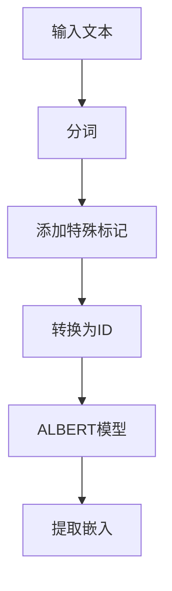

# Transformer大模型实战 从ALBERT 中提取嵌入

## 1.背景介绍

在自然语言处理（NLP）领域，Transformer模型已经成为了主流架构。自从Vaswani等人提出Transformer以来，许多变种模型如BERT、GPT、ALBERT等相继问世。这些模型在各种NLP任务中表现出色，尤其是在文本分类、问答系统和机器翻译等任务中。本文将聚焦于ALBERT（A Lite BERT），并详细介绍如何从ALBERT中提取嵌入。

ALBERT是BERT的轻量级版本，通过参数共享和因子化嵌入矩阵等技术，显著减少了模型参数数量，同时保持了性能。本文将详细介绍ALBERT的核心概念、算法原理、数学模型，并通过代码实例展示如何从ALBERT中提取嵌入。

## 2.核心概念与联系

### 2.1 Transformer架构

Transformer架构是基于自注意力机制的深度学习模型，主要由编码器和解码器组成。编码器负责将输入序列转换为一组上下文相关的表示，解码器则将这些表示转换为目标序列。

### 2.2 BERT与ALBERT

BERT（Bidirectional Encoder Representations from Transformers）是基于Transformer编码器的双向语言模型，通过掩码语言模型（MLM）和下一句预测（NSP）任务进行预训练。ALBERT在BERT的基础上进行了优化，主要包括以下两点：

1. **参数共享**：在所有层之间共享参数，减少了模型参数数量。
2. **因子化嵌入矩阵**：将词嵌入矩阵分解为两个较小的矩阵，进一步减少参数数量。

### 2.3 嵌入的概念

嵌入是将高维稀疏数据（如单词）映射到低维稠密向量空间的过程。在NLP中，嵌入通常用于表示单词、句子或段落的语义信息。通过从ALBERT中提取嵌入，我们可以获得输入文本的语义表示，用于下游任务。

## 3.核心算法原理具体操作步骤

### 3.1 数据预处理

在使用ALBERT之前，需要对输入文本进行预处理。主要步骤包括：

1. **分词**：将文本分割成单词或子词。
2. **添加特殊标记**：在文本的开头和结尾添加特殊标记（如[CLS]和[SEP]）。
3. **转换为ID**：将分词后的文本转换为词汇表中的ID。

### 3.2 模型前向传播

将预处理后的文本输入ALBERT模型，进行前向传播。模型的每一层都会生成一组嵌入表示，通常使用最后一层的输出作为最终嵌入。

### 3.3 提取嵌入

从模型的输出中提取嵌入。可以选择提取[CLS]标记的嵌入，作为整个文本的表示，也可以提取每个单词的嵌入。

以下是ALBERT模型的前向传播和嵌入提取的Mermaid流程图：



## 4.数学模型和公式详细讲解举例说明

### 4.1 自注意力机制

自注意力机制是Transformer的核心组件。它通过计算输入序列中每个位置的注意力权重，捕捉全局依赖关系。自注意力机制的计算公式如下：

$$
\text{Attention}(Q, K, V) = \text{softmax}\left(\frac{QK^T}{\sqrt{d_k}}\right)V
$$

其中，$Q$、$K$、$V$分别表示查询、键和值矩阵，$d_k$是键的维度。

### 4.2 多头自注意力

多头自注意力通过并行计算多个自注意力机制，增强模型的表达能力。其计算公式为：

$$
\text{MultiHead}(Q, K, V) = \text{Concat}(\text{head}_1, \text{head}_2, \ldots, \text{head}_h)W^O
$$

其中，$\text{head}_i = \text{Attention}(QW_i^Q, KW_i^K, VW_i^V)$，$W_i^Q$、$W_i^K$、$W_i^V$和$W^O$是可训练的权重矩阵。

### 4.3 参数共享与因子化嵌入

ALBERT通过在所有层之间共享参数，减少了模型参数数量。其因子化嵌入矩阵的计算公式为：

$$
E = E_1E_2
$$

其中，$E_1$和$E_2$是两个较小的矩阵，$E$是词嵌入矩阵。

## 5.项目实践：代码实例和详细解释说明

### 5.1 环境配置

首先，确保安装了必要的库，如Transformers和Torch。

```bash
pip install transformers torch
```

### 5.2 加载ALBERT模型和分词器

```python
from transformers import AlbertTokenizer, AlbertModel

# 加载ALBERT分词器和模型
tokenizer = AlbertTokenizer.from_pretrained('albert-base-v2')
model = AlbertModel.from_pretrained('albert-base-v2')
```

### 5.3 数据预处理

```python
# 输入文本
text = "这是一个示例文本。"

# 分词并转换为ID
inputs = tokenizer(text, return_tensors='pt')
```

### 5.4 前向传播和提取嵌入

```python
# 前向传播
outputs = model(**inputs)

# 提取[CLS]标记的嵌入
cls_embedding = outputs.last_hidden_state[:, 0, :]
```

### 5.5 嵌入的应用

提取的嵌入可以用于各种下游任务，如文本分类、相似度计算等。以下是一个简单的文本分类示例：

```python
import torch.nn as nn

# 定义分类器
class TextClassifier(nn.Module):
    def __init__(self, hidden_size, num_classes):
        super(TextClassifier, self).__init__()
        self.fc = nn.Linear(hidden_size, num_classes)

    def forward(self, x):
        return self.fc(x)

# 实例化分类器
classifier = TextClassifier(hidden_size=cls_embedding.size(-1), num_classes=2)

# 进行分类
logits = classifier(cls_embedding)
```

## 6.实际应用场景

### 6.1 文本分类

通过提取文本的嵌入，可以将其输入分类器进行文本分类任务，如情感分析、垃圾邮件检测等。

### 6.2 文本相似度计算

嵌入可以用于计算文本之间的相似度，应用于信息检索、推荐系统等领域。

### 6.3 问答系统

在问答系统中，嵌入可以用于表示问题和答案的语义信息，帮助模型更好地匹配问题和答案。

## 7.工具和资源推荐

### 7.1 工具

1. **Transformers库**：由Hugging Face提供的开源库，支持多种预训练模型。
2. **PyTorch**：深度学习框架，支持动态计算图和自动微分。

### 7.2 资源

1. **ALBERT论文**：了解ALBERT的详细设计和实验结果。
2. **Hugging Face文档**：提供Transformers库的详细使用说明和示例代码。

## 8.总结：未来发展趋势与挑战

Transformer模型及其变种如ALBERT在NLP领域取得了显著进展。然而，随着模型规模的不断增大，计算资源和训练时间的需求也在增加。未来的发展趋势包括：

1. **模型压缩**：通过剪枝、量化等技术，进一步减少模型参数和计算量。
2. **高效训练**：开发更高效的训练算法和硬件，加速模型训练过程。
3. **多模态学习**：结合文本、图像、音频等多种模态的信息，提升模型的表现。

## 9.附录：常见问题与解答

### 9.1 如何选择合适的预训练模型？

选择预训练模型时，需要考虑任务的具体需求和计算资源。对于资源有限的场景，ALBERT是一个不错的选择。

### 9.2 如何处理长文本？

对于超过模型最大输入长度的文本，可以采用截断、滑动窗口等方法进行处理。

### 9.3 如何提升模型的性能？

可以通过微调预训练模型、使用更大的数据集、调整超参数等方法提升模型性能。

---

作者：禅与计算机程序设计艺术 / Zen and the Art of Computer Programming