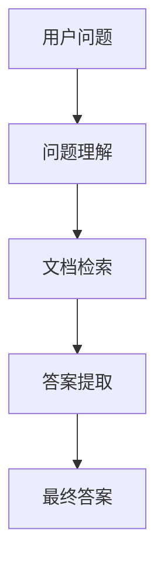

# 【LangChain编程：从入门到实践】基于文档问答场景

## 1.背景介绍

在当今信息爆炸的时代，如何高效地从海量文档中提取有用信息成为了一个重要的研究课题。传统的搜索引擎虽然能够提供关键词匹配的结果，但在理解上下文和提供精准答案方面仍有很大局限。LangChain作为一种新兴的编程框架，结合了自然语言处理（NLP）和机器学习技术，能够在文档问答场景中提供更智能、更精准的解决方案。

LangChain的核心思想是通过链式结构将多个语言模型和处理模块串联起来，从而实现复杂的语言理解和生成任务。本文将深入探讨LangChain在文档问答场景中的应用，详细介绍其核心概念、算法原理、数学模型、项目实践、实际应用场景、工具和资源推荐，并展望其未来发展趋势与挑战。

## 2.核心概念与联系

### 2.1 LangChain简介

LangChain是一种用于构建复杂语言处理任务的编程框架。它通过将多个语言模型和处理模块串联起来，形成一个链式结构，从而实现复杂的语言理解和生成任务。LangChain的核心组件包括：

- **语言模型（Language Model）**：用于理解和生成自然语言文本。
- **处理模块（Processing Module）**：用于对文本进行预处理、特征提取和后处理。
- **链式结构（Chain Structure）**：将多个语言模型和处理模块串联起来，形成一个完整的处理流程。

### 2.2 文档问答场景

文档问答场景是指从一组文档中提取出与用户问题相关的答案。这一过程通常包括以下几个步骤：

1. **问题理解**：理解用户提出的问题，并将其转化为可处理的形式。
2. **文档检索**：从文档库中检索出与问题相关的文档。
3. **答案提取**：从检索到的文档中提取出最相关的答案。

### 2.3 核心概念之间的联系

在LangChain框架中，语言模型和处理模块通过链式结构紧密结合，共同完成文档问答任务。具体来说，问题理解模块将用户问题转化为可处理的形式，文档检索模块从文档库中检索相关文档，答案提取模块从检索到的文档中提取答案。各个模块之间通过链式结构进行数据传递和处理，形成一个完整的文档问答流程。

## 3.核心算法原理具体操作步骤

### 3.1 问题理解

问题理解是文档问答任务的第一步，其目的是将用户提出的自然语言问题转化为可处理的形式。常用的方法包括：

- **词嵌入（Word Embedding）**：将问题中的词语转化为向量表示。
- **句子嵌入（Sentence Embedding）**：将整个问题转化为一个向量表示。
- **意图识别（Intent Recognition）**：识别问题的意图，如询问事实、寻求解释等。

### 3.2 文档检索

文档检索是文档问答任务的第二步，其目的是从文档库中检索出与问题相关的文档。常用的方法包括：

- **关键词匹配（Keyword Matching）**：根据问题中的关键词检索相关文档。
- **向量检索（Vector Retrieval）**：根据问题的向量表示检索相关文档。
- **语义检索（Semantic Retrieval）**：根据问题的语义信息检索相关文档。

### 3.3 答案提取

答案提取是文档问答任务的最后一步，其目的是从检索到的文档中提取出最相关的答案。常用的方法包括：

- **文本匹配（Text Matching）**：在文档中匹配与问题相关的文本片段。
- **答案生成（Answer Generation）**：根据问题和文档生成答案。
- **答案排序（Answer Ranking）**：对候选答案进行排序，选择最优答案。

以下是LangChain在文档问答场景中的流程图：



## 4.数学模型和公式详细讲解举例说明

### 4.1 词嵌入

词嵌入是将词语转化为向量表示的过程。常用的方法包括Word2Vec、GloVe和FastText。词嵌入的数学表示为：

$$
\mathbf{v}_w = f(w)
$$

其中，$\mathbf{v}_w$ 是词语 $w$ 的向量表示，$f$ 是词嵌入模型。

### 4.2 句子嵌入

句子嵌入是将整个句子转化为向量表示的过程。常用的方法包括BERT、GPT和Sentence-BERT。句子嵌入的数学表示为：

$$
\mathbf{v}_s = g(s)
$$

其中，$\mathbf{v}_s$ 是句子 $s$ 的向量表示，$g$ 是句子嵌入模型。

### 4.3 向量检索

向量检索是根据问题的向量表示检索相关文档的过程。常用的方法包括余弦相似度和欧氏距离。向量检索的数学表示为：

$$
\text{sim}(\mathbf{v}_q, \mathbf{v}_d) = \frac{\mathbf{v}_q \cdot \mathbf{v}_d}{\|\mathbf{v}_q\| \|\mathbf{v}_d\|}
$$

其中，$\mathbf{v}_q$ 是问题的向量表示，$\mathbf{v}_d$ 是文档的向量表示，$\text{sim}$ 是相似度函数。

### 4.4 答案生成

答案生成是根据问题和文档生成答案的过程。常用的方法包括Seq2Seq模型和Transformer模型。答案生成的数学表示为：

$$
\mathbf{a} = h(\mathbf{v}_q, \mathbf{v}_d)
$$

其中，$\mathbf{a}$ 是生成的答案，$h$ 是答案生成模型。

## 5.项目实践：代码实例和详细解释说明

### 5.1 环境配置

首先，我们需要配置开发环境。假设我们使用Python进行开发，以下是所需的库和工具：

```bash
pip install transformers
pip install faiss-cpu
pip install torch
```

### 5.2 问题理解模块

以下是一个简单的BERT模型用于问题理解的代码示例：

```python
from transformers import BertTokenizer, BertModel
import torch

tokenizer = BertTokenizer.from_pretrained('bert-base-uncased')
model = BertModel.from_pretrained('bert-base-uncased')

def encode_question(question):
    inputs = tokenizer(question, return_tensors='pt')
    outputs = model(**inputs)
    return outputs.last_hidden_state.mean(dim=1)

question = "What is the capital of France?"
question_vector = encode_question(question)
print(question_vector)
```

### 5.3 文档检索模块

以下是一个使用FAISS进行向量检索的代码示例：

```python
import faiss
import numpy as np

# 假设我们有一组文档向量
document_vectors = np.random.rand(100, 768).astype('float32')

# 创建FAISS索引
index = faiss.IndexFlatL2(768)
index.add(document_vectors)

# 检索与问题向量最相似的文档
D, I = index.search(question_vector.detach().numpy(), k=5)
print(I)
```

### 5.4 答案提取模块

以下是一个简单的答案提取代码示例：

```python
def extract_answer(document, question):
    # 简单的文本匹配方法
    if question.lower() in document.lower():
        return document
    return "No answer found."

# 假设我们有一个文档
document = "Paris is the capital of France."
answer = extract_answer(document, question)
print(answer)
```

## 6.实际应用场景

### 6.1 企业知识库问答

企业内部通常有大量的文档和知识库，LangChain可以帮助员工快速找到所需的信息，提高工作效率。

### 6.2 在线教育问答

在在线教育平台中，LangChain可以帮助学生快速找到课程相关的答案，提升学习体验。

### 6.3 客户服务问答

在客户服务场景中，LangChain可以帮助客服人员快速找到客户问题的答案，提高客户满意度。

## 7.工具和资源推荐

### 7.1 开发工具

- **Jupyter Notebook**：用于交互式开发和调试。
- **PyCharm**：用于Python开发的集成开发环境。

### 7.2 资源推荐

- **Hugging Face Transformers**：提供了丰富的预训练语言模型。
- **FAISS**：用于高效的向量检索。
- **LangChain官方文档**：详细介绍了LangChain的使用方法和最佳实践。

## 8.总结：未来发展趋势与挑战

LangChain在文档问答场景中展现了强大的能力，但仍面临一些挑战，如处理长文本、提高答案准确性和处理多语言问题。未来，随着NLP和机器学习技术的不断发展，LangChain有望在更多应用场景中发挥重要作用。

## 9.附录：常见问题与解答

### 9.1 LangChain是否支持多语言？

是的，LangChain支持多语言处理，但需要相应的多语言预训练模型。

### 9.2 如何提高答案的准确性？

可以通过使用更强大的语言模型、增加训练数据和优化算法来提高答案的准确性。

### 9.3 LangChain是否适用于实时应用？

是的，LangChain可以通过优化模型和算法，实现实时应用场景中的高效处理。

---

作者：禅与计算机程序设计艺术 / Zen and the Art of Computer Programming