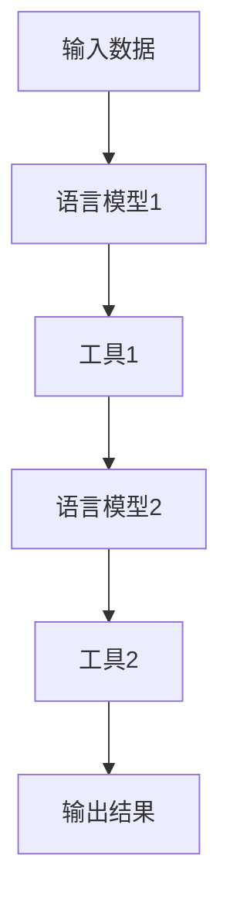
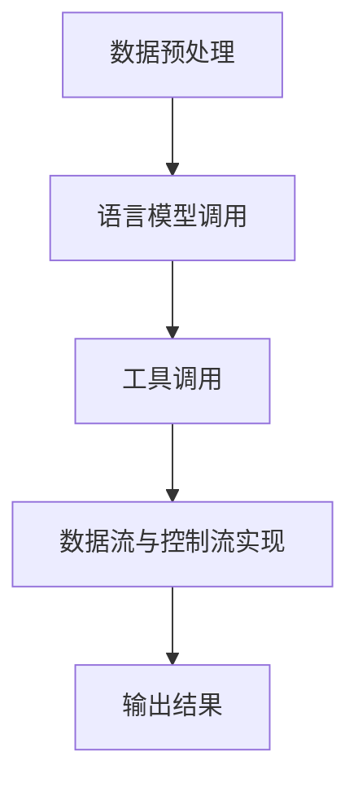

# 【LangChain编程：从入门到实践】工具Chain

## 1.背景介绍

在当今的人工智能和自然语言处理领域，语言模型（Language Model, LM）已经成为了不可或缺的工具。随着GPT-3等大型语言模型的出现，如何高效地利用这些模型成为了一个重要的研究方向。LangChain作为一种新兴的编程范式，旨在通过链式调用不同的语言模型和工具，来实现复杂的任务。本文将深入探讨LangChain的核心概念、算法原理、数学模型、实际应用以及未来发展趋势。

## 2.核心概念与联系

### 2.1 LangChain的定义

LangChain是一种编程范式，旨在通过链式调用不同的语言模型和工具，来实现复杂的任务。它的核心思想是将多个语言模型和工具组合在一起，通过数据流和控制流的方式，实现复杂的功能。

### 2.2 语言模型与工具的关系

在LangChain中，语言模型和工具是两个核心组件。语言模型负责生成文本，而工具则负责处理文本。两者通过数据流和控制流的方式进行交互，从而实现复杂的任务。

### 2.3 数据流与控制流

数据流是指数据在不同组件之间的传递，而控制流则是指程序的执行顺序。在LangChain中，数据流和控制流是通过链式调用的方式实现的。



## 3.核心算法原理具体操作步骤

### 3.1 数据预处理

在LangChain中，数据预处理是一个重要的步骤。它包括数据清洗、数据转换和数据增强等操作。数据预处理的目的是为了提高语言模型和工具的性能。

### 3.2 语言模型调用

语言模型调用是LangChain的核心步骤之一。通过调用不同的语言模型，可以生成不同的文本。语言模型的选择和调用顺序对最终结果有着重要的影响。

### 3.3 工具调用

工具调用是LangChain的另一个核心步骤。工具可以对文本进行处理，如文本分类、情感分析等。工具的选择和调用顺序同样对最终结果有着重要的影响。

### 3.4 数据流与控制流的实现

数据流和控制流的实现是LangChain的关键。通过链式调用不同的语言模型和工具，可以实现复杂的任务。



## 4.数学模型和公式详细讲解举例说明

### 4.1 语言模型的数学原理

语言模型的核心是概率模型。假设有一个词汇表 $V$，语言模型的目标是计算一个句子 $S = (w_1, w_2, ..., w_n)$ 的概率 $P(S)$。根据链式法则，这个概率可以分解为：

$$
P(S) = P(w_1) \cdot P(w_2 | w_1) \cdot P(w_3 | w_1, w_2) \cdot ... \cdot P(w_n | w_1, w_2, ..., w_{n-1})
$$

### 4.2 工具的数学原理

工具的核心是函数映射。假设有一个输入文本 $T$，工具的目标是将输入文本映射到一个输出结果 $R$。这个映射可以表示为一个函数 $f$：

$$
R = f(T)
$$

### 4.3 数据流与控制流的数学表示

数据流和控制流可以用图论来表示。假设有一个有向图 $G = (V, E)$，其中 $V$ 是节点集合，$E$ 是边集合。数据流和控制流的实现可以表示为图 $G$ 的遍历过程。


## 5.项目实践：代码实例和详细解释说明

### 5.1 数据预处理代码示例

```python
import re

def preprocess_data(text):
    # 数据清洗
    text = re.sub(r'\s+', ' ', text)
    # 数据转换
    text = text.lower()
    # 数据增强
    text = text + " [END]"
    return text

input_text = "This is a sample text."
processed_text = preprocess_data(input_text)
print(processed_text)
```

### 5.2 语言模型调用代码示例

```python
from transformers import GPT2LMHeadModel, GPT2Tokenizer

def generate_text(model, tokenizer, input_text):
    inputs = tokenizer.encode(input_text, return_tensors='pt')
    outputs = model.generate(inputs, max_length=50, num_return_sequences=1)
    return tokenizer.decode(outputs[0], skip_special_tokens=True)

model = GPT2LMHeadModel.from_pretrained('gpt2')
tokenizer = GPT2Tokenizer.from_pretrained('gpt2')

input_text = "Once upon a time"
generated_text = generate_text(model, tokenizer, input_text)
print(generated_text)
```

### 5.3 工具调用代码示例

```python
from textblob import TextBlob

def analyze_sentiment(text):
    blob = TextBlob(text)
    return blob.sentiment

input_text = "I love programming."
sentiment = analyze_sentiment(input_text)
print(sentiment)
```

### 5.4 数据流与控制流实现代码示例

```python
def langchain_pipeline(input_text):
    # 数据预处理
    processed_text = preprocess_data(input_text)
    
    # 语言模型调用
    generated_text = generate_text(model, tokenizer, processed_text)
    
    # 工具调用
    sentiment = analyze_sentiment(generated_text)
    
    return sentiment

input_text = "This is a sample text."
result = langchain_pipeline(input_text)
print(result)
```

## 6.实际应用场景

### 6.1 文本生成

LangChain可以用于文本生成，如新闻生成、故事生成等。通过链式调用不同的语言模型，可以生成高质量的文本。

### 6.2 文本分类

LangChain可以用于文本分类，如垃圾邮件分类、情感分析等。通过链式调用不同的工具，可以实现高精度的文本分类。

### 6.3 问答系统

LangChain可以用于构建问答系统。通过链式调用不同的语言模型和工具，可以实现高效的问答系统。

### 6.4 机器翻译

LangChain可以用于机器翻译。通过链式调用不同的语言模型和工具，可以实现高质量的机器翻译。

## 7.工具和资源推荐

### 7.1 编程语言和库

- Python：LangChain的主要编程语言
- Transformers：用于调用语言模型的库
- TextBlob：用于文本处理的库

### 7.2 数据集

- OpenAI GPT-3 数据集：用于训练和评估语言模型
- IMDB 数据集：用于情感分析的文本数据集

### 7.3 在线资源

- LangChain 官方文档：提供LangChain的详细介绍和使用指南
- GitHub：提供LangChain的开源代码和示例

## 8.总结：未来发展趋势与挑战

LangChain作为一种新兴的编程范式，具有广阔的应用前景。未来，随着语言模型和工具的不断发展，LangChain将会在更多的领域得到应用。然而，LangChain也面临着一些挑战，如数据隐私、模型解释性等问题。如何解决这些问题，将是未来研究的重点。

## 9.附录：常见问题与解答

### 9.1 LangChain的优势是什么？

LangChain的优势在于其灵活性和高效性。通过链式调用不同的语言模型和工具，可以实现复杂的任务。

### 9.2 如何选择合适的语言模型和工具？

选择合适的语言模型和工具需要根据具体的任务和数据来决定。可以通过实验和评估来选择最优的模型和工具。

### 9.3 LangChain的应用场景有哪些？

LangChain的应用场景包括文本生成、文本分类、问答系统、机器翻译等。

### 9.4 LangChain的未来发展趋势是什么？

LangChain的未来发展趋势包括更多的应用场景、更高的模型性能和更好的用户体验。

### 9.5 LangChain的主要挑战是什么？

LangChain的主要挑战包括数据隐私、模型解释性和计算资源等问题。

---

作者：禅与计算机程序设计艺术 / Zen and the Art of Computer Programming