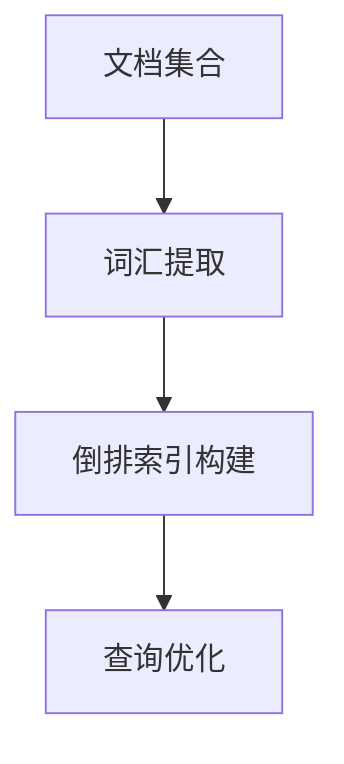

# 【大模型应用开发 动手做AI Agent】说说LlamaIndex

## 1.背景介绍

在人工智能领域，特别是自然语言处理（NLP）和生成式预训练模型（GPT）方面，近年来取得了显著的进展。大模型（Large Models）如GPT-3、BERT等已经在多个应用场景中展现了其强大的能力。然而，如何有效地利用这些大模型进行实际应用开发，特别是构建AI Agent，仍然是一个具有挑战性的问题。LlamaIndex作为一个新兴的工具，提供了一种高效的方式来管理和查询大规模数据集，从而为大模型的应用开发提供了强有力的支持。

## 2.核心概念与联系

### 2.1 LlamaIndex是什么

LlamaIndex是一个专门用于管理和查询大规模数据集的工具。它通过构建高效的索引结构，使得在大规模数据集上的查询操作变得更加快速和高效。LlamaIndex的核心思想是利用倒排索引（Inverted Index）和其他高级数据结构来优化查询性能。

### 2.2 大模型与LlamaIndex的关系

大模型，如GPT-3，通常需要处理大量的文本数据。LlamaIndex可以帮助这些大模型更高效地管理和查询数据，从而提高整体性能和响应速度。通过将LlamaIndex与大模型结合，可以构建出功能强大的AI Agent，实现复杂的自然语言处理任务。

### 2.3 AI Agent的定义

AI Agent是指能够自主执行任务的智能系统。它通常具备感知、决策和执行的能力。在大模型的支持下，AI Agent可以处理复杂的自然语言任务，如对话生成、文本摘要、情感分析等。

## 3.核心算法原理具体操作步骤

### 3.1 倒排索引的基本原理

倒排索引是一种用于快速全文检索的数据结构。它将文档中的每个词汇映射到包含该词汇的文档列表，从而实现快速查询。



### 3.2 LlamaIndex的索引构建过程

1. **数据预处理**：对原始数据进行清洗和标准化处理。
2. **词汇提取**：从预处理后的数据中提取词汇。
3. **索引构建**：构建倒排索引，将词汇映射到文档列表。
4. **查询优化**：通过优化算法提高查询效率。

### 3.3 查询操作步骤

1. **查询解析**：将用户输入的查询解析为词汇。
2. **索引查找**：在倒排索引中查找相关文档。
3. **结果排序**：根据相关性对查询结果进行排序。
4. **结果返回**：将排序后的结果返回给用户。

## 4.数学模型和公式详细讲解举例说明

### 4.1 倒排索引的数学模型

倒排索引的核心是一个映射关系，可以表示为：

$$
I(w) = \{d_1, d_2, \ldots, d_n\}
$$

其中，$I(w)$表示词汇$w$的倒排索引，$d_i$表示包含词汇$w$的文档。

### 4.2 查询优化的数学公式

为了提高查询效率，可以使用TF-IDF（Term Frequency-Inverse Document Frequency）来衡量词汇的重要性：

$$
\text{TF-IDF}(t, d) = \text{TF}(t, d) \times \text{IDF}(t)
$$

其中，$\text{TF}(t, d)$表示词汇$t$在文档$d$中的频率，$\text{IDF}(t)$表示词汇$t$的逆文档频率：

$$
\text{IDF}(t) = \log \frac{N}{|\{d \in D : t \in d\}|}
$$

其中，$N$表示文档总数，$|\{d \in D : t \in d\}|$表示包含词汇$t$的文档数。

### 4.3 实例说明

假设我们有以下三个文档：

- 文档1：AI is the future.
- 文档2：AI and machine learning.
- 文档3：The future of AI.

构建倒排索引后，我们可以得到如下结果：

- AI: {1, 2, 3}
- is: {1}
- the: {1, 3}
- future: {1, 3}
- and: {2}
- machine: {2}
- learning: {2}
- of: {3}

## 5.项目实践：代码实例和详细解释说明

### 5.1 环境准备

首先，确保你已经安装了Python和必要的库，如Numpy和Pandas。

```bash
pip install numpy pandas
```

### 5.2 数据预处理

```python
import pandas as pd

# 示例数据
data = [
    "AI is the future.",
    "AI and machine learning.",
    "The future of AI."
]

# 数据预处理
def preprocess(text):
    return text.lower().split()

preprocessed_data = [preprocess(doc) for doc in data]
print(preprocessed_data)
```

### 5.3 构建倒排索引

```python
from collections import defaultdict

# 构建倒排索引
def build_inverted_index(data):
    inverted_index = defaultdict(list)
    for doc_id, doc in enumerate(data):
        for word in doc:
            inverted_index[word].append(doc_id)
    return inverted_index

inverted_index = build_inverted_index(preprocessed_data)
print(inverted_index)
```

### 5.4 查询操作

```python
# 查询操作
def search(query, inverted_index):
    query_words = query.lower().split()
    result = set(inverted_index[query_words[0]])
    for word in query_words[1:]:
        result.intersection_update(inverted_index[word])
    return result

query = "AI future"
result = search(query, inverted_index)
print(result)
```

## 6.实际应用场景

### 6.1 文本检索

LlamaIndex可以用于构建高效的文本检索系统，特别是在需要处理大规模文档集的场景中，如搜索引擎和文档管理系统。

### 6.2 自然语言处理

在自然语言处理任务中，如文本分类、情感分析和对话生成，LlamaIndex可以帮助大模型更高效地管理和查询数据，从而提高整体性能。

### 6.3 数据分析

LlamaIndex还可以用于大规模数据分析，特别是在需要快速查询和分析大量数据的场景中，如市场分析和用户行为分析。

## 7.工具和资源推荐

### 7.1 开源工具

- **Elasticsearch**：一个分布式搜索引擎，适用于大规模数据集的全文检索。
- **Apache Lucene**：一个高性能的文本搜索引擎库，提供了构建倒排索引的基本功能。

### 7.2 在线资源

- **Coursera**：提供了多门关于自然语言处理和大模型的在线课程。
- **Kaggle**：一个数据科学竞赛平台，提供了丰富的数据集和代码示例。

### 7.3 书籍推荐

- **《深度学习》**：Ian Goodfellow等人编写，详细介绍了深度学习的基本原理和应用。
- **《自然语言处理入门》**：Daniel Jurafsky和James H. Martin编写，全面介绍了自然语言处理的基本概念和技术。

## 8.总结：未来发展趋势与挑战

### 8.1 未来发展趋势

随着大模型和AI技术的不断发展，LlamaIndex等工具将在大规模数据管理和查询中发挥越来越重要的作用。未来，我们可以期待更多高效的索引结构和优化算法的出现，从而进一步提高查询性能和数据管理效率。

### 8.2 挑战

尽管LlamaIndex在大规模数据管理中展现了其强大的能力，但仍然面临一些挑战，如数据隐私和安全问题、索引构建的计算复杂度以及查询优化的难度。解决这些问题将是未来研究的重点。

## 9.附录：常见问题与解答

### 9.1 LlamaIndex适用于哪些场景？

LlamaIndex适用于需要高效管理和查询大规模数据集的场景，如搜索引擎、文档管理系统和自然语言处理任务。

### 9.2 如何提高LlamaIndex的查询性能？

可以通过优化倒排索引结构、使用高级数据结构（如B树和哈希表）以及采用查询优化算法（如TF-IDF）来提高查询性能。

### 9.3 LlamaIndex与其他索引工具有何不同？

LlamaIndex专注于大规模数据集的管理和查询，提供了高效的索引结构和优化算法。与其他索引工具相比，LlamaIndex在处理大规模数据集时具有更高的性能和效率。

---

作者：禅与计算机程序设计艺术 / Zen and the Art of Computer Programming