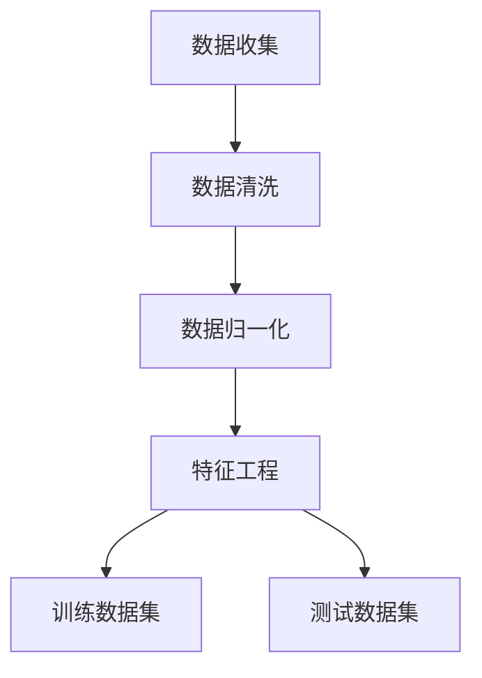

# 一切皆是映射：利用深度学习提升个性化营销策略

## 1.背景介绍

在当今数字化时代，个性化营销已经成为企业获取竞争优势的关键手段。传统的营销策略往往依赖于广泛的市场调研和经验判断，然而，这种方法在面对海量数据和复杂的用户行为时显得力不从心。深度学习作为人工智能的一个重要分支，凭借其强大的数据处理和模式识别能力，为个性化营销带来了新的可能性。

深度学习通过构建多层神经网络，能够从大量数据中自动提取特征和模式，从而实现对用户行为的精准预测和个性化推荐。本文将深入探讨如何利用深度学习技术提升个性化营销策略，帮助企业更好地理解用户需求，提供更具针对性的产品和服务。

## 2.核心概念与联系

### 2.1 深度学习概述

深度学习是一种基于人工神经网络的机器学习方法，其核心在于通过多层网络结构对数据进行逐层抽象和特征提取。常见的深度学习模型包括卷积神经网络（CNN）、循环神经网络（RNN）和生成对抗网络（GAN）等。

### 2.2 个性化营销的定义

个性化营销是指根据用户的个体特征和行为数据，提供定制化的产品、服务和内容。其目标是通过精准的用户画像和行为预测，提高用户满意度和转化率。

### 2.3 深度学习与个性化营销的联系

深度学习在个性化营销中的应用主要体现在以下几个方面：

- 用户画像构建：通过深度学习模型对用户数据进行分析，提取用户特征，构建精准的用户画像。
- 行为预测：利用深度学习模型对用户行为进行预测，提前了解用户需求。
- 个性化推荐：基于用户画像和行为预测，提供个性化的产品和服务推荐。

## 3.核心算法原理具体操作步骤

### 3.1 数据预处理

数据预处理是深度学习的基础步骤，主要包括数据清洗、数据归一化和特征工程等。以下是一个典型的数据预处理流程：



### 3.2 模型选择与构建

根据具体的应用场景选择合适的深度学习模型。以下是几种常见的模型及其应用场景：

- 卷积神经网络（CNN）：适用于图像数据的处理和分析。
- 循环神经网络（RNN）：适用于时间序列数据和自然语言处理。
- 生成对抗网络（GAN）：适用于数据生成和增强。

### 3.3 模型训练与优化

模型训练是指通过反向传播算法调整模型参数，使其在训练数据上的表现达到最优。常见的优化方法包括梯度下降、Adam优化器等。

### 3.4 模型评估与验证

模型评估是指通过测试数据集对模型的性能进行评估，常用的评估指标包括准确率、召回率、F1值等。

## 4.数学模型和公式详细讲解举例说明

### 4.1 神经网络的基本结构

一个典型的神经网络由输入层、隐藏层和输出层组成。每一层由若干个神经元构成，神经元之间通过权重连接。

$$
y = f(Wx + b)
$$

其中，$y$ 是输出，$W$ 是权重矩阵，$x$ 是输入，$b$ 是偏置，$f$ 是激活函数。

### 4.2 反向传播算法

反向传播算法是深度学习模型训练的核心，其基本思想是通过计算损失函数的梯度，逐层更新模型参数。

$$
\Delta W = -\eta \frac{\partial L}{\partial W}
$$

其中，$\Delta W$ 是权重的更新量，$\eta$ 是学习率，$L$ 是损失函数。

### 4.3 卷积神经网络的卷积操作

卷积神经网络通过卷积操作提取图像的局部特征，其数学表达式为：

$$
y_{i,j} = \sum_{m=0}^{M-1} \sum_{n=0}^{N-1} x_{i+m,j+n} \cdot w_{m,n}
$$

其中，$y_{i,j}$ 是输出特征图的元素，$x_{i+m,j+n}$ 是输入图像的元素，$w_{m,n}$ 是卷积核的元素。

## 5.项目实践：代码实例和详细解释说明

### 5.1 数据预处理代码示例

```python
import pandas as pd
from sklearn.preprocessing import StandardScaler

# 读取数据
data = pd.read_csv('user_data.csv')

# 数据清洗
data = data.dropna()

# 数据归一化
scaler = StandardScaler()
data_scaled = scaler.fit_transform(data)

# 特征工程
data['feature'] = data['feature1'] * data['feature2']
```

### 5.2 模型构建与训练代码示例

```python
import tensorflow as tf
from tensorflow.keras.models import Sequential
from tensorflow.keras.layers import Dense

# 构建模型
model = Sequential()
model.add(Dense(64, input_dim=10, activation='relu'))
model.add(Dense(32, activation='relu'))
model.add(Dense(1, activation='sigmoid'))

# 编译模型
model.compile(loss='binary_crossentropy', optimizer='adam', metrics=['accuracy'])

# 训练模型
model.fit(data_scaled, labels, epochs=10, batch_size=32, validation_split=0.2)
```

### 5.3 模型评估代码示例

```python
# 评估模型
loss, accuracy = model.evaluate(test_data, test_labels)
print(f'Loss: {loss}, Accuracy: {accuracy}')
```

## 6.实际应用场景

### 6.1 电商平台的个性化推荐

电商平台可以利用深度学习技术对用户的浏览和购买行为进行分析，提供个性化的商品推荐。例如，亚马逊通过推荐系统为用户推荐相关商品，从而提高用户的购买率。

### 6.2 社交媒体的内容推荐

社交媒体平台可以通过深度学习模型分析用户的兴趣和行为，提供个性化的内容推荐。例如，Facebook和Instagram通过推荐算法为用户推荐感兴趣的帖子和视频。

### 6.3 金融行业的风险评估

金融机构可以利用深度学习技术对用户的交易行为和信用记录进行分析，进行风险评估和欺诈检测。例如，银行可以通过深度学习模型预测用户的信用风险，从而制定相应的信贷策略。

## 7.工具和资源推荐

### 7.1 深度学习框架

- TensorFlow：谷歌开发的开源深度学习框架，支持多种平台和语言。
- PyTorch：Facebook开发的开源深度学习框架，具有灵活的动态计算图和强大的社区支持。

### 7.2 数据集

- ImageNet：一个大型图像数据集，常用于图像分类和目标检测任务。
- MovieLens：一个电影评分数据集，常用于推荐系统的研究和开发。

### 7.3 在线课程和书籍

- Coursera上的深度学习课程：由吴恩达教授主讲，涵盖深度学习的基础知识和应用。
- 《深度学习》：Ian Goodfellow等人编写的经典教材，详细介绍了深度学习的理论和实践。

## 8.总结：未来发展趋势与挑战

深度学习在个性化营销中的应用前景广阔，但也面临一些挑战。未来的发展趋势包括：

- 更加智能的用户画像：通过多源数据融合和深度学习模型，构建更加全面和精准的用户画像。
- 实时个性化推荐：通过在线学习和实时数据处理，实现实时的个性化推荐。
- 隐私保护与数据安全：在个性化营销中，如何保护用户隐私和数据安全是一个重要的挑战。

## 9.附录：常见问题与解答

### 9.1 深度学习模型的训练时间过长怎么办？

可以通过以下几种方法加速模型训练：

- 使用GPU或TPU进行加速。
- 采用分布式训练方法。
- 使用更高效的优化算法，如Adam优化器。

### 9.2 如何处理数据不平衡问题？

可以通过以下几种方法处理数据不平衡问题：

- 采用过采样或欠采样方法。
- 使用数据增强技术。
- 采用加权损失函数。

### 9.3 如何选择合适的深度学习模型？

选择合适的深度学习模型需要考虑以下几个因素：

- 数据类型：根据数据的类型选择合适的模型，如图像数据选择CNN，时间序列数据选择RNN。
- 任务需求：根据具体的任务需求选择合适的模型，如分类任务选择分类模型，生成任务选择生成对抗网络。

---

作者：禅与计算机程序设计艺术 / Zen and the Art of Computer Programming