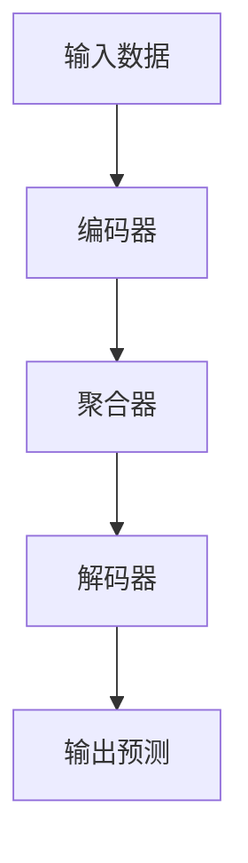

# 一切皆是映射：深入剖析条件神经过程（CNPs）

## 1.背景介绍

条件神经过程（Conditional Neural Processes, CNPs）是近年来在机器学习领域中崭露头角的一种新型模型。它结合了神经网络和高斯过程的优点，能够在不需要大量数据的情况下进行高效的函数拟合和预测。CNPs的出现为许多实际应用场景提供了新的解决方案，特别是在小样本学习、元学习和不确定性估计等领域。

### 1.1 什么是条件神经过程

条件神经过程是一种基于神经网络的概率模型，旨在通过学习数据的分布来进行预测。与传统的神经网络不同，CNPs不仅关注输入和输出之间的映射关系，还考虑了输入数据的上下文信息。通过这种方式，CNPs能够在给定少量数据点的情况下，生成对新数据点的预测。

### 1.2 发展历程

CNPs的概念最早由Garnelo等人在2018年提出。其初衷是为了克服高斯过程在大规模数据集上的计算瓶颈，同时保留其在小样本学习中的优势。自提出以来，CNPs在多个领域得到了广泛应用和研究，逐渐成为一种重要的机器学习工具。

### 1.3 研究意义

CNPs的研究意义在于其能够在小样本情况下进行高效的预测，这对于许多实际应用场景具有重要意义。例如，在医疗诊断中，获取大量标注数据往往非常困难，而CNPs能够在少量数据的情况下提供可靠的预测。此外，CNPs还能够提供不确定性估计，这对于决策过程中的风险评估非常重要。

## 2.核心概念与联系

### 2.1 神经网络与高斯过程

神经网络是一种通过模拟人脑神经元连接方式进行信息处理的模型，具有强大的非线性映射能力。高斯过程则是一种非参数化的贝叶斯模型，能够通过先验分布和似然函数进行函数拟合。CNPs结合了这两者的优点，通过神经网络进行高效的函数拟合，同时保留了高斯过程的概率性质。

### 2.2 条件神经过程的基本结构

CNPs的基本结构包括编码器、聚合器和解码器三个部分。编码器负责将输入数据映射到高维空间，聚合器将这些高维表示进行汇总，解码器则根据汇总结果生成对新数据点的预测。



### 2.3 条件神经过程与其他模型的关系

CNPs与传统的神经网络和高斯过程有着密切的联系。与神经网络相比，CNPs能够在少量数据的情况下进行有效的预测；与高斯过程相比，CNPs在大规模数据集上的计算效率更高。此外，CNPs还与元学习和小样本学习有着紧密的联系，能够在这些领域中发挥重要作用。

## 3.核心算法原理具体操作步骤

### 3.1 数据预处理

在进行CNPs的训练之前，首先需要对数据进行预处理。具体步骤包括数据清洗、归一化和分割等。数据清洗是为了去除噪声和异常值，归一化是为了将数据映射到统一的范围内，分割则是为了将数据划分为训练集和测试集。

### 3.2 编码器的设计

编码器的设计是CNPs的关键步骤之一。编码器的作用是将输入数据映射到高维空间，以便后续的聚合和解码。常见的编码器设计包括卷积神经网络（CNN）和循环神经网络（RNN）等。

### 3.3 聚合器的实现

聚合器的作用是将编码器生成的高维表示进行汇总，以便解码器进行预测。常见的聚合器实现包括平均池化和最大池化等。聚合器的选择对CNPs的性能有着重要影响，需要根据具体应用场景进行选择。

### 3.4 解码器的设计

解码器的作用是根据聚合器的输出生成对新数据点的预测。解码器的设计通常采用全连接神经网络（FCN）等。解码器的性能直接影响CNPs的预测精度，因此需要进行精心设计和调优。

### 3.5 模型训练与优化

模型训练是CNPs实现的最后一步。训练过程中需要选择合适的损失函数和优化算法，以确保模型能够有效地拟合数据。常见的损失函数包括均方误差（MSE）和交叉熵等，常见的优化算法包括随机梯度下降（SGD）和Adam等。

## 4.数学模型和公式详细讲解举例说明

### 4.1 条件神经过程的数学定义

条件神经过程的数学定义可以表示为：

$$
p(y|x, \mathcal{D}) = \int p(y|x, r) p(r|\mathcal{D}) dr
$$

其中，$x$ 是输入数据，$y$ 是输出预测，$\mathcal{D}$ 是训练数据集，$r$ 是通过编码器和聚合器生成的高维表示。

### 4.2 编码器的数学表示

编码器的作用是将输入数据映射到高维空间，其数学表示为：

$$
h_i = f_{\theta}(x_i)
$$

其中，$h_i$ 是第 $i$ 个数据点的高维表示，$f_{\theta}$ 是编码器的映射函数，$\theta$ 是编码器的参数。

### 4.3 聚合器的数学表示

聚合器的作用是将编码器生成的高维表示进行汇总，其数学表示为：

$$
r = \text{Aggregate}(h_1, h_2, \ldots, h_n)
$$

其中，$r$ 是聚合器的输出，$\text{Aggregate}$ 是聚合函数，$h_1, h_2, \ldots, h_n$ 是编码器的输出。

### 4.4 解码器的数学表示

解码器的作用是根据聚合器的输出生成对新数据点的预测，其数学表示为：

$$
y = g_{\phi}(x, r)
$$

其中，$y$ 是输出预测，$g_{\phi}$ 是解码器的映射函数，$\phi$ 是解码器的参数。

### 4.5 具体例子说明

假设我们有一个简单的回归问题，输入数据为 $x$，输出数据为 $y$。我们可以通过以下步骤实现CNPs：

1. 编码器将输入数据 $x$ 映射到高维表示 $h$：
   $$
   h = f_{\theta}(x)
   $$

2. 聚合器将所有高维表示 $h$ 进行汇总，生成聚合表示 $r$：
   $$
   r = \text{Aggregate}(h_1, h_2, \ldots, h_n)
   $$

3. 解码器根据输入数据 $x$ 和聚合表示 $r$ 生成输出预测 $y$：
   $$
   y = g_{\phi}(x, r)
   $$

通过以上步骤，我们可以实现对新数据点的预测。

## 5.项目实践：代码实例和详细解释说明

### 5.1 环境配置

在进行CNPs的项目实践之前，我们需要配置好开发环境。常见的开发环境包括Python、TensorFlow和PyTorch等。以下是一个简单的环境配置示例：

```bash
# 安装Python
sudo apt-get install python3

# 安装TensorFlow
pip install tensorflow

# 安装PyTorch
pip install torch
```

### 5.2 数据准备

在进行CNPs的训练之前，我们需要准备好训练数据。以下是一个简单的数据准备示例：

```python
import numpy as np

# 生成训练数据
x_train = np.linspace(-1, 1, 100)
y_train = np.sin(x_train * np.pi)

# 生成测试数据
x_test = np.linspace(-1, 1, 100)
y_test = np.sin(x_test * np.pi)
```

### 5.3 编码器实现

以下是一个简单的编码器实现示例：

```python
import tensorflow as tf

class Encoder(tf.keras.Model):
    def __init__(self):
        super(Encoder, self).__init__()
        self.dense1 = tf.keras.layers.Dense(128, activation='relu')
        self.dense2 = tf.keras.layers.Dense(128, activation='relu')

    def call(self, x):
        x = self.dense1(x)
        x = self.dense2(x)
        return x
```

### 5.4 聚合器实现

以下是一个简单的聚合器实现示例：

```python
class Aggregator(tf.keras.Model):
    def __init__(self):
        super(Aggregator, self).__init__()

    def call(self, h):
        return tf.reduce_mean(h, axis=0)
```

### 5.5 解码器实现

以下是一个简单的解码器实现示例：

```python
class Decoder(tf.keras.Model):
    def __init__(self):
        super(Decoder, self).__init__()
        self.dense1 = tf.keras.layers.Dense(128, activation='relu')
        self.dense2 = tf.keras.layers.Dense(1)

    def call(self, x, r):
        x = tf.concat([x, r], axis=-1)
        x = self.dense1(x)
        x = self.dense2(x)
        return x
```

### 5.6 模型训练与优化

以下是一个简单的模型训练与优化示例：

```python
# 实例化模型
encoder = Encoder()
aggregator = Aggregator()
decoder = Decoder()

# 定义损失函数和优化器
loss_fn = tf.keras.losses.MeanSquaredError()
optimizer = tf.keras.optimizers.Adam()

# 训练模型
for epoch in range(100):
    with tf.GradientTape() as tape:
        h = encoder(x_train)
        r = aggregator(h)
        y_pred = decoder(x_train, r)
        loss = loss_fn(y_train, y_pred)
    
    gradients = tape.gradient(loss, encoder.trainable_variables + decoder.trainable_variables)
    optimizer.apply_gradients(zip(gradients, encoder.trainable_variables + decoder.trainable_variables))
    
    print(f'Epoch {epoch}, Loss: {loss.numpy()}')
```

### 5.7 模型评估

以下是一个简单的模型评估示例：

```python
# 评估模型
h = encoder(x_test)
r = aggregator(h)
y_pred = decoder(x_test, r)
mse = loss_fn(y_test, y_pred)
print(f'Mean Squared Error: {mse.numpy()}')
```

通过以上步骤，我们可以实现一个简单的CNPs模型，并进行训练和评估。

## 6.实际应用场景

### 6.1 小样本学习

在许多实际应用中，获取大量标注数据往往非常困难。CNPs能够在少量数据的情况下进行有效的预测，因此在小样本学习中具有重要应用。例如，在医疗诊断中，CNPs可以在少量病历数据的情况下提供可靠的诊断结果。

### 6.2 元学习

元学习是一种通过学习多个任务的经验来提高新任务学习效率的方法。CNPs能够通过学习不同任务的数据分布，生成对新任务的预测，因此在元学习中具有重要应用。例如，在推荐系统中，CNPs可以通过学习用户的历史行为，生成对新物品的推荐。

### 6.3 不确定性估计

在许多决策过程中，不确定性估计是非常重要的。CNPs能够通过生成概率分布来进行不确定性估计，从而提供对预测结果的置信度。例如，在自动驾驶中，CNPs可以通过不确定性估计来判断道路状况，从而提高驾驶安全性。

## 7.工具和资源推荐

### 7.1 开发工具

- **TensorFlow**：一个开源的机器学习框架，适用于大规模数据处理和深度学习模型的开发。
- **PyTorch**：一个开源的深度学习框架，具有灵活的动态计算图和强大的GPU加速能力。
- **Jupyter Notebook**：一个交互式的开发环境，适用于数据分析和模型开发。

### 7.2 学习资源

- **《深度学习》**：一本由Ian Goodfellow等人编写的经典教材，详细介绍了深度学习的基本概念和算法。
- **Coursera**：一个在线学习平台，提供了许多关于机器学习和深度学习的课程。
- **arXiv**：一个学术论文预印本平台，可以获取最新的研究成果和技术报告。

### 7.3 数据集

- **UCI机器学习库**：一个包含了许多常用数据集的在线资源，适用于机器学习模型的训练和评估。
- **Kaggle**：一个数据科学竞赛平台，提供了许多高质量的数据集和竞赛题目。

## 8.总结：未来发展趋势与挑战

### 8.1 未来发展趋势

随着机器学习技术的不断发展，CNPs在未来有着广阔的应用前景。特别是在小样本学习、元学习和不确定性估计等领域，CNPs将发挥越来越重要的作用。此外，随着计算资源的不断提升，CNPs的训练和推理效率也将不断提高，从而进一步扩大其应用范围。

### 8.2 面临的挑战

尽管CNPs具有许多优点，但在实际应用中仍然面临一些挑战。首先，CNPs的模型设计和参数调优需要较高的专业知识和经验，这对开发者提出了较高的要求。其次，CNPs在处理高维数据和复杂任务时，可能会面临计算资源和时间成本的限制。最后，CNPs的预测结果依赖于训练数据的质量和数量，因此在数据获取和标注方面仍然需要投入大量的精力。

## 9.附录：常见问题与解答

### 9.1 什么是条件神经过程？

条件神经过程是一种基于神经网络的概率模型，旨在通过学习数据的分布来进行预测。与传统的神经网络不同，CNPs不仅关注输入和输出之间的映射关系，还考虑了输入数据的上下文信息。

### 9.2 CNPs与高斯过程有什么区别？

高斯过程是一种非参数化的贝叶斯模型，能够通过先验分布和似然函数进行函数拟合。CNPs结合了神经网络和高斯过程的优点，通过神经网络进行高效的函数拟合，同时保留了高斯过程的概率性质。

### 9.3 如何实现一个简单的CNPs模型？

实现一个简单的CNPs模型包括以下步骤：数据预处理、编码器设计、聚合器实现、解码器设计、模型训练与优化。具体代码示例可以参考本文的项目实践部分。

### 9.4 CNPs的实际应用场景有哪些？

CNPs在小样本学习、元学习和不确定性估计等领域具有广泛的应用。例如，在医疗诊断中，CNPs可以在少量病历数据的情况下提供可靠的诊断结果；在推荐系统中，CNPs可以通过学习用户的历史行为，生成对新物品的推荐；在自动驾驶中，CNPs可以通过不确定性估计来判断道路状况，从而提高驾驶安全性。

### 9.5 CNPs的未来发展趋势是什么？

随着机器学习技术的不断发展，CNPs在未来有着广阔的应用前景。特别是在小样本学习、元学习和不确定性估计等领域，CNPs将发挥越来越重要的作用。此外，随着计算资源的不断提升，CNPs的训练和推理效率也将不断提高，从而进一步扩大其应用范围。

---

作者：禅与计算机程序设计艺术 / Zen and the Art of Computer Programming