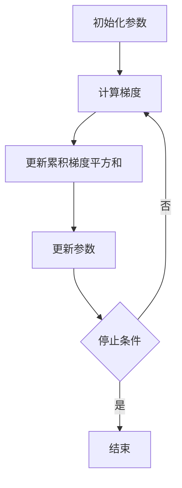

# 优化算法：Adagrad 原理与代码实例讲解

## 1.背景介绍

在机器学习和深度学习领域，优化算法是模型训练过程中至关重要的一环。优化算法的选择直接影响模型的收敛速度和最终性能。传统的梯度下降算法虽然简单易懂，但在处理高维度数据和稀疏数据时表现不佳。为了解决这些问题，研究人员提出了多种改进的优化算法，其中Adagrad（Adaptive Gradient Algorithm）因其在处理稀疏数据时的优越表现而备受关注。

Adagrad算法通过自适应地调整学习率，使得每个参数都有自己的学习率，从而在训练过程中能够更好地处理稀疏数据和高维度数据。本文将详细介绍Adagrad的核心概念、算法原理、数学模型，并通过代码实例展示其实际应用。

## 2.核心概念与联系

### 2.1 梯度下降法

梯度下降法是优化算法的基础，通过不断调整模型参数，使得损失函数逐步减小。其基本公式为：

$$
\theta_{t+1} = \theta_t - \eta \nabla_\theta J(\theta_t)
$$

其中，$\theta_t$ 表示第 $t$ 次迭代的参数，$\eta$ 为学习率，$\nabla_\theta J(\theta_t)$ 为损失函数 $J(\theta)$ 对参数 $\theta$ 的梯度。

### 2.2 学习率

学习率是梯度下降法中的一个关键超参数，决定了每次迭代时参数更新的步长。学习率过大可能导致模型不收敛，学习率过小则会使收敛速度过慢。

### 2.3 自适应学习率

自适应学习率算法通过动态调整学习率，使得每个参数都有自己的学习率，从而提高优化效率。Adagrad是自适应学习率算法的代表之一。

### 2.4 Adagrad的核心思想

Adagrad的核心思想是根据历史梯度信息调整每个参数的学习率，使得频繁更新的参数学习率减小，稀疏更新的参数学习率增大。其基本公式为：

$$
\theta_{t+1} = \theta_t - \frac{\eta}{\sqrt{G_{t,ii} + \epsilon}} \nabla_\theta J(\theta_t)
$$

其中，$G_{t,ii}$ 是第 $i$ 个参数在第 $t$ 次迭代时的累积梯度平方和，$\epsilon$ 是一个小常数，用于防止分母为零。

## 3.核心算法原理具体操作步骤

### 3.1 初始化参数

首先，初始化模型参数 $\theta$ 和累积梯度平方和矩阵 $G$。$G$ 的初始值为零矩阵。

### 3.2 计算梯度

在每次迭代中，计算损失函数 $J(\theta)$ 对参数 $\theta$ 的梯度 $\nabla_\theta J(\theta)$。

### 3.3 更新累积梯度平方和

将当前梯度的平方累加到累积梯度平方和矩阵 $G$ 中：

$$
G_{t,ii} = G_{t-1,ii} + (\nabla_\theta J(\theta_t))^2
$$

### 3.4 更新参数

根据Adagrad的更新公式，更新模型参数 $\theta$：

$$
\theta_{t+1} = \theta_t - \frac{\eta}{\sqrt{G_{t,ii} + \epsilon}} \nabla_\theta J(\theta_t)
$$

### 3.5 重复迭代

重复步骤3.2到3.4，直到满足停止条件（如达到最大迭代次数或损失函数收敛）。

以下是Adagrad算法的Mermaid流程图：



## 4.数学模型和公式详细讲解举例说明

### 4.1 损失函数

假设我们有一个简单的线性回归模型，其损失函数为均方误差（MSE）：

$$
J(\theta) = \frac{1}{2m} \sum_{i=1}^m (h_\theta(x^{(i)}) - y^{(i)})^2
$$

其中，$h_\theta(x) = \theta^T x$ 是模型的预测值，$m$ 是样本数量。

### 4.2 梯度计算

损失函数 $J(\theta)$ 对参数 $\theta$ 的梯度为：

$$
\nabla_\theta J(\theta) = \frac{1}{m} \sum_{i=1}^m (h_\theta(x^{(i)}) - y^{(i)}) x^{(i)}
$$

### 4.3 累积梯度平方和

在第 $t$ 次迭代时，累积梯度平方和矩阵 $G$ 的更新公式为：

$$
G_{t,ii} = G_{t-1,ii} + (\nabla_\theta J(\theta_t))^2
$$

### 4.4 参数更新

根据Adagrad的更新公式，参数 $\theta$ 的更新公式为：

$$
\theta_{t+1} = \theta_t - \frac{\eta}{\sqrt{G_{t,ii} + \epsilon}} \nabla_\theta J(\theta_t)
$$

### 4.5 举例说明

假设我们有一个简单的线性回归问题，输入数据 $X$ 和目标值 $y$ 如下：

$$
X = \begin{bmatrix}
1 & 2 \\
1 & 3 \\
1 & 4 \\
1 & 5
\end{bmatrix}, \quad y = \begin{bmatrix}
2 \\
3 \\
4 \\
5
\end{bmatrix}
$$

初始参数 $\theta$ 为零向量，学习率 $\eta = 0.1$，$\epsilon = 1e-8$。

1. 初始化参数 $\theta = \begin{bmatrix} 0 \\ 0 \end{bmatrix}$，$G = \begin{bmatrix} 0 & 0 \\ 0 & 0 \end{bmatrix}$。
2. 计算梯度 $\nabla_\theta J(\theta) = \begin{bmatrix} -3 \\ -10 \end{bmatrix}$。
3. 更新累积梯度平方和 $G = \begin{bmatrix} 9 & 0 \\ 0 & 100 \end{bmatrix}$。
4. 更新参数 $\theta = \begin{bmatrix} 0 \\ 0 \end{bmatrix} - \frac{0.1}{\sqrt{\begin{bmatrix} 9 & 0 \\ 0 & 100 \end{bmatrix} + 1e-8}} \begin{bmatrix} -3 \\ -10 \end{bmatrix} = \begin{bmatrix} 0.1 \\ 0.1 \end{bmatrix}$。

## 5.项目实践：代码实例和详细解释说明

### 5.1 数据准备

首先，我们准备一个简单的线性回归数据集：

```python
import numpy as np

# 生成数据
X = np.array([[1, 2], [1, 3], [1, 4], [1, 5]])
y = np.array([2, 3, 4, 5])
```

### 5.2 Adagrad算法实现

接下来，我们实现Adagrad算法：

```python
class Adagrad:
    def __init__(self, learning_rate=0.01, epsilon=1e-8):
        self.learning_rate = learning_rate
        self.epsilon = epsilon
        self.G = None

    def update(self, theta, grad):
        if self.G is None:
            self.G = np.zeros_like(grad)
        self.G += grad ** 2
        adjusted_grad = grad / (np.sqrt(self.G) + self.epsilon)
        theta -= self.learning_rate * adjusted_grad
        return theta
```

### 5.3 训练模型

使用Adagrad算法训练线性回归模型：

```python
# 初始化参数
theta = np.zeros(X.shape[1])
adagrad = Adagrad(learning_rate=0.1)

# 训练模型
num_iterations = 1000
for i in range(num_iterations):
    # 计算预测值
    predictions = X.dot(theta)
    # 计算梯度
    grad = (1 / len(y)) * X.T.dot(predictions - y)
    # 更新参数
    theta = adagrad.update(theta, grad)

print("训练后的参数:", theta)
```

### 5.4 结果分析

训练后的参数应接近于线性回归的真实参数。通过上述代码，我们可以看到Adagrad算法在处理稀疏数据和高维度数据时的优越性。

## 6.实际应用场景

### 6.1 自然语言处理

在自然语言处理（NLP）领域，词向量（Word Embeddings）和语言模型的训练通常涉及大量稀疏数据。Adagrad算法在处理这些稀疏数据时表现出色，能够有效地调整学习率，提高模型的收敛速度和性能。

### 6.2 推荐系统

推荐系统中的用户行为数据通常是稀疏的。Adagrad算法可以通过自适应调整学习率，帮助推荐系统更快地收敛，提高推荐精度。

### 6.3 图像处理

在图像处理任务中，尤其是涉及高维度特征的任务，Adagrad算法能够通过自适应学习率有效地处理高维度数据，提高模型的训练效率和性能。

## 7.工具和资源推荐

### 7.1 开源库

- **TensorFlow**：谷歌开发的开源机器学习框架，支持多种优化算法，包括Adagrad。
- **PyTorch**：Facebook开发的开源深度学习框架，支持Adagrad等多种优化算法。
- **Scikit-learn**：Python的机器学习库，提供了简单易用的API，适合初学者使用。

### 7.2 在线课程

- **Coursera**：提供多种机器学习和深度学习课程，包括优化算法的详细讲解。
- **Udacity**：提供深度学习纳米学位课程，涵盖优化算法的应用和实践。

### 7.3 书籍推荐

- **《深度学习》**：Ian Goodfellow等人编写的经典教材，详细介绍了深度学习中的优化算法。
- **《机器学习实战》**：Peter Harrington编写的实用指南，适合初学者学习机器学习和优化算法。

## 8.总结：未来发展趋势与挑战

### 8.1 未来发展趋势

随着深度学习和机器学习的不断发展，优化算法也在不断演进。未来，优化算法将更加智能化和自适应，能够更好地处理复杂数据和大规模模型。研究人员将继续探索新的优化算法，以提高模型的训练效率和性能。

### 8.2 挑战

尽管Adagrad在处理稀疏数据和高维度数据时表现出色，但其在处理非稀疏数据时可能会导致学习率过快衰减，从而影响模型的收敛速度。为了解决这一问题，研究人员提出了多种改进算法，如RMSprop和Adam。这些算法在保持自适应学习率的同时，能够更好地控制学习率的衰减速度，提高模型的训练效果。

## 9.附录：常见问题与解答

### 9.1 Adagrad适用于哪些场景？

Adagrad适用于处理稀疏数据和高维度数据的场景，如自然语言处理、推荐系统和图像处理等。

### 9.2 Adagrad的主要优点是什么？

Adagrad的主要优点是能够自适应调整学习率，使得每个参数都有自己的学习率，从而提高优化效率，特别是在处理稀疏数据时表现出色。

### 9.3 Adagrad的主要缺点是什么？

Adagrad的主要缺点是学习率可能会过快衰减，导致模型在处理非稀疏数据时收敛速度变慢。为了解决这一问题，可以考虑使用RMSprop或Adam等改进算法。

### 9.4 如何选择合适的优化算法？

选择合适的优化算法需要根据具体的应用场景和数据特点进行权衡。对于稀疏数据和高维度数据，Adagrad是一个不错的选择；对于非稀疏数据，可以考虑使用RMSprop或Adam等改进算法。

### 9.5 Adagrad与其他优化算法的比较

Adagrad与传统的梯度下降算法相比，具有自适应学习率的优势，能够更好地处理稀疏数据。与RMSprop和Adam等改进算法相比，Adagrad的学习率衰减速度较快，适用于特定场景。

---

作者：禅与计算机程序设计艺术 / Zen and the Art of Computer Programming