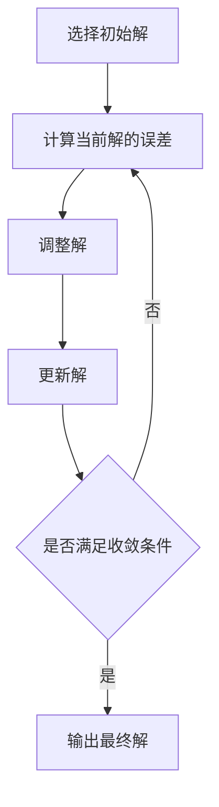

# 像数学家一样思考：步步逼近原则

## 1.背景介绍

在计算机科学和软件工程领域，解决复杂问题的能力是衡量一个技术人员水平的重要标准。复杂问题往往需要我们具备深厚的数学思维和逻辑推理能力。步步逼近原则（Iterative Refinement）是一种有效的解决复杂问题的方法，它借鉴了数学家解决问题的思维方式，通过逐步细化和优化解决方案，最终达到理想的结果。

步步逼近原则不仅在算法设计中有广泛应用，还在软件开发、系统架构设计、数据分析等多个领域发挥着重要作用。本文将深入探讨步步逼近原则的核心概念、算法原理、数学模型，并通过实际项目实例展示其应用价值。

## 2.核心概念与联系

### 2.1 步步逼近原则的定义

步步逼近原则是一种通过逐步改进和优化解决方案的方法。它的核心思想是从一个初始的、可能不完美的解决方案开始，通过不断地进行小幅度的调整和优化，逐步逼近最终的理想解决方案。

### 2.2 数学思维与步步逼近

数学家在解决问题时，通常会从一个简单的模型或假设出发，通过逐步增加复杂性和精度，最终得到一个精确的解。步步逼近原则正是借鉴了这种思维方式，将其应用到计算机科学和软件工程中。

### 2.3 迭代与递归的关系

步步逼近原则与迭代和递归有着密切的联系。迭代是一种通过重复执行某一过程来逐步逼近目标的方法，而递归则是通过函数自身的调用来实现逐步逼近。两者在实现步步逼近原则时都发挥着重要作用。

## 3.核心算法原理具体操作步骤

### 3.1 初始解的选择

步步逼近原则的第一步是选择一个初始解。初始解可以是一个简单的、易于计算的解，或者是一个基于经验和直觉的解。初始解的选择对最终结果的收敛速度和精度有重要影响。

### 3.2 迭代过程

在迭代过程中，我们通过不断地调整和优化初始解，使其逐步逼近理想解。每次迭代都需要进行以下几个步骤：

1. **计算当前解的误差**：通过某种度量方法计算当前解与理想解之间的误差。
2. **调整解**：根据误差的大小和方向，对当前解进行调整。
3. **更新解**：将调整后的解作为新的当前解，进入下一次迭代。

### 3.3 收敛条件

迭代过程需要设定收敛条件，即当误差小于某个阈值时，停止迭代。收敛条件的设定需要根据具体问题的要求来确定。

### 3.4 算法流程图

以下是步步逼近原则的算法流程图：



## 4.数学模型和公式详细讲解举例说明

### 4.1 误差计算

误差计算是步步逼近原则中的关键步骤。误差可以通过多种方法计算，例如欧几里得距离、曼哈顿距离等。假设当前解为 $x_i$，理想解为 $x^*$，则误差 $e_i$ 可以表示为：

$$
e_i = \| x_i - x^* \|
$$

### 4.2 调整解的方法

调整解的方法可以根据具体问题的不同而有所不同。常见的方法包括梯度下降法、牛顿法等。以梯度下降法为例，调整解的公式为：

$$
x_{i+1} = x_i - \eta \nabla f(x_i)
$$

其中，$\eta$ 为学习率，$\nabla f(x_i)$ 为当前解的梯度。

### 4.3 收敛条件

收敛条件通常设定为误差小于某个阈值 $\epsilon$，即：

$$
\| e_i \| < \epsilon
$$

### 4.4 举例说明

假设我们要找到一个函数 $f(x)$ 的最小值，可以使用步步逼近原则进行求解。初始解 $x_0$ 可以随机选择，误差计算为当前函数值与最小值的差值，调整解的方法可以使用梯度下降法，收敛条件设定为误差小于某个阈值。

## 5.项目实践：代码实例和详细解释说明

### 5.1 问题描述

假设我们要找到函数 $f(x) = x^2 + 4x + 4$ 的最小值。我们可以使用步步逼近原则进行求解。

### 5.2 代码实例

以下是使用 Python 实现的代码实例：

```python
import numpy as np

# 定义目标函数
def f(x):
    return x**2 + 4*x + 4

# 定义目标函数的梯度
def grad_f(x):
    return 2*x + 4

# 步步逼近算法
def iterative_refinement(initial_x, learning_rate, epsilon, max_iterations):
    x = initial_x
    for i in range(max_iterations):
        gradient = grad_f(x)
        new_x = x - learning_rate * gradient
        if np.abs(f(new_x) - f(x)) < epsilon:
            break
        x = new_x
    return x

# 参数设置
initial_x = 10
learning_rate = 0.1
epsilon = 1e-6
max_iterations = 1000

# 求解最小值
min_x = iterative_refinement(initial_x, learning_rate, epsilon, max_iterations)
print(f"函数的最小值出现在 x = {min_x}")
```

### 5.3 详细解释

1. **定义目标函数**：我们定义了目标函数 $f(x) = x^2 + 4x + 4$。
2. **定义梯度**：我们定义了目标函数的梯度 $\nabla f(x) = 2x + 4$。
3. **步步逼近算法**：我们实现了步步逼近算法，初始解为 `initial_x`，学习率为 `learning_rate`，收敛条件为误差小于 `epsilon`，最大迭代次数为 `max_iterations`。
4. **求解最小值**：我们调用步步逼近算法，求解函数的最小值。

## 6.实际应用场景

### 6.1 机器学习中的应用

在机器学习中，步步逼近原则广泛应用于模型训练和参数优化。例如，梯度下降法就是一种典型的步步逼近算法，通过不断调整模型参数，使损失函数逐步逼近最小值。

### 6.2 软件开发中的应用

在软件开发中，步步逼近原则可以用于代码优化和性能调优。通过逐步改进代码结构和算法，实现性能的逐步提升。

### 6.3 数据分析中的应用

在数据分析中，步步逼近原则可以用于数据清洗和特征工程。通过逐步改进数据处理方法，提高数据质量和分析结果的准确性。

## 7.工具和资源推荐

### 7.1 编程语言和库

- **Python**：Python 是一种广泛使用的编程语言，适用于实现步步逼近算法。常用库包括 NumPy、SciPy 等。
- **R**：R 是一种专门用于统计分析和数据挖掘的编程语言，适用于实现步步逼近算法。

### 7.2 在线资源

- **Coursera**：Coursera 提供了大量关于算法和数学思维的在线课程，适合学习步步逼近原则。
- **Khan Academy**：Khan Academy 提供了丰富的数学和计算机科学课程，适合学习步步逼近原则。

### 7.3 书籍推荐

- **《算法导论》**：这本书详细介绍了各种算法，包括步步逼近算法，适合深入学习。
- **《机器学习》**：这本书介绍了机器学习中的各种算法和技术，包括步步逼近算法，适合学习其在机器学习中的应用。

## 8.总结：未来发展趋势与挑战

步步逼近原则作为一种有效的解决复杂问题的方法，在计算机科学和软件工程中有着广泛的应用。随着技术的发展，步步逼近原则在以下几个方面有着重要的发展趋势和挑战：

### 8.1 自动化和智能化

未来，步步逼近原则将更加自动化和智能化。通过引入人工智能和机器学习技术，可以实现自动选择初始解、自动调整学习率等，提高算法的效率和精度。

### 8.2 大数据和高性能计算

随着大数据和高性能计算技术的发展，步步逼近原则在处理大规模数据和复杂计算任务时将面临新的挑战。如何在保证精度的同时提高计算效率，将是未来研究的重点。

### 8.3 多领域应用

步步逼近原则在多个领域都有广泛的应用前景。未来，如何将其应用到更多领域，如生物信息学、金融工程等，将是一个重要的发展方向。

## 9.附录：常见问题与解答

### 9.1 步步逼近原则与其他优化算法有何不同？

步步逼近原则是一种逐步改进和优化解决方案的方法，与其他优化算法相比，其特点是从一个初始解出发，通过不断调整和优化，逐步逼近理想解。其他优化算法如遗传算法、模拟退火等，通常采用全局搜索的方法，适用于解决全局最优问题。

### 9.2 如何选择初始解？

初始解的选择对最终结果的收敛速度和精度有重要影响。一般来说，可以根据经验和直觉选择一个合理的初始解，或者通过随机选择初始解，并进行多次迭代，选择最优解。

### 9.3 如何设定收敛条件？

收敛条件的设定需要根据具体问题的要求来确定。一般来说，可以设定误差小于某个阈值，或者迭代次数达到某个上限时停止迭代。

### 9.4 步步逼近原则在实际应用中有哪些注意事项？

在实际应用中，需要注意以下几点：
- 合理选择初始解和学习率，避免陷入局部最优解。
- 设定合理的收敛条件，避免过度迭代。
- 根据具体问题的特点，选择合适的误差计算方法和调整解的方法。

---

作者：禅与计算机程序设计艺术 / Zen and the Art of Computer Programming