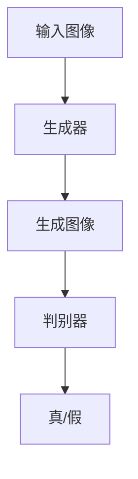

# 基于生成对抗网络的室内设计风格迁移工具研发

## 1.背景介绍

### 1.1 室内设计的现状与挑战

室内设计是一个融合艺术与技术的领域，设计师需要在美学、功能性和客户需求之间找到平衡。然而，传统的设计过程往往耗时且依赖设计师的个人经验和创意。随着人工智能技术的发展，特别是生成对抗网络（GAN）的出现，为室内设计带来了新的可能性。

### 1.2 生成对抗网络的基本概念

生成对抗网络（GAN）由Ian Goodfellow等人在2014年提出，是一种深度学习模型，包含两个主要部分：生成器（Generator）和判别器（Discriminator）。生成器负责生成新的数据样本，而判别器则负责区分这些样本是真实的还是生成的。通过这种对抗训练，生成器能够生成越来越逼真的数据。

### 1.3 GAN在图像处理中的应用

GAN在图像处理领域有着广泛的应用，包括图像生成、图像修复、图像超分辨率、风格迁移等。特别是在风格迁移方面，GAN能够将一种图像的风格迁移到另一种图像上，这为室内设计风格的自动化迁移提供了技术基础。

## 2.核心概念与联系

### 2.1 风格迁移的定义

风格迁移是指将一种图像的风格应用到另一种图像上，同时保留原图像的内容。对于室内设计来说，这意味着可以将某种设计风格（如现代、古典、工业风等）应用到现有的室内设计图上。

### 2.2 GAN在风格迁移中的角色

在风格迁移中，GAN的生成器负责生成具有目标风格的图像，而判别器则评估生成的图像是否符合目标风格。通过不断的对抗训练，生成器能够生成越来越符合目标风格的图像。

### 2.3 相关技术与工具

除了GAN，风格迁移还涉及到卷积神经网络（CNN）、图像处理技术以及各种深度学习框架（如TensorFlow、PyTorch等）。这些技术和工具共同构成了风格迁移的技术基础。

## 3.核心算法原理具体操作步骤

### 3.1 数据准备

首先，需要准备大量的室内设计图像数据集，这些数据集应包含多种设计风格的图像。数据集的质量和多样性直接影响到模型的训练效果。

### 3.2 模型架构设计

GAN的模型架构设计包括生成器和判别器的设计。生成器通常采用卷积神经网络（CNN）来生成图像，而判别器则采用CNN来区分图像的真伪。



### 3.3 模型训练

模型训练包括生成器和判别器的对抗训练。生成器生成图像，判别器评估图像的真伪，并将结果反馈给生成器。通过不断的对抗训练，生成器能够生成越来越逼真的图像。

### 3.4 风格迁移

在模型训练完成后，可以将输入图像通过生成器生成具有目标风格的图像。这个过程称为风格迁移。

## 4.数学模型和公式详细讲解举例说明

### 4.1 GAN的基本数学模型

GAN的目标是通过对抗训练，使生成器生成的图像尽可能逼真。其损失函数可以表示为：

$$
\min_G \max_D V(D, G) = \mathbb{E}_{x \sim p_{data}(x)}[\log D(x)] + \mathbb{E}_{z \sim p_z(z)}[\log(1 - D(G(z)))]
$$

其中，$G$ 是生成器，$D$ 是判别器，$p_{data}(x)$ 是真实数据的分布，$p_z(z)$ 是噪声的分布。

### 4.2 风格迁移的损失函数

风格迁移的损失函数通常包括内容损失和风格损失。内容损失用于保持原图像的内容，风格损失用于迁移目标风格。其公式可以表示为：

$$
L_{total} = \alpha L_{content} + \beta L_{style}
$$

其中，$L_{content}$ 是内容损失，$L_{style}$ 是风格损失，$\alpha$ 和 $\beta$ 是权重参数。

### 4.3 内容损失和风格损失的计算

内容损失通常使用卷积神经网络（CNN）的中间层特征来计算：

$$
L_{content} = \sum_{i,j} (F_{ij}^l - P_{ij}^l)^2
$$

其中，$F_{ij}^l$ 是生成图像在第 $l$ 层的特征，$P_{ij}^l$ 是原图像在第 $l$ 层的特征。

风格损失则使用Gram矩阵来计算：

$$
L_{style} = \sum_{l} \sum_{i,j} (G_{ij}^l - A_{ij}^l)^2
$$

其中，$G_{ij}^l$ 是生成图像在第 $l$ 层的Gram矩阵，$A_{ij}^l$ 是目标风格图像在第 $l$ 层的Gram矩阵。

## 5.项目实践：代码实例和详细解释说明

### 5.1 环境配置

首先，需要配置深度学习环境，包括安装TensorFlow或PyTorch等深度学习框架。

```bash
pip install tensorflow
```

### 5.2 数据集准备

下载并准备室内设计图像数据集，可以使用公开的图像数据集或自行收集。

### 5.3 模型实现

实现生成器和判别器的模型架构。

```python
import tensorflow as tf
from tensorflow.keras import layers

def build_generator():
    model = tf.keras.Sequential()
    model.add(layers.Dense(256, input_dim=100))
    model.add(layers.LeakyReLU(alpha=0.2))
    model.add(layers.Dense(512))
    model.add(layers.LeakyReLU(alpha=0.2))
    model.add(layers.Dense(1024))
    model.add(layers.LeakyReLU(alpha=0.2))
    model.add(layers.Dense(28 * 28 * 1, activation='tanh'))
    model.add(layers.Reshape((28, 28, 1)))
    return model

def build_discriminator():
    model = tf.keras.Sequential()
    model.add(layers.Flatten(input_shape=(28, 28, 1)))
    model.add(layers.Dense(512))
    model.add(layers.LeakyReLU(alpha=0.2))
    model.add(layers.Dense(256))
    model.add(layers.LeakyReLU(alpha=0.2))
    model.add(layers.Dense(1, activation='sigmoid'))
    return model
```

### 5.4 模型训练

训练生成器和判别器。

```python
import numpy as np

def train(generator, discriminator, epochs, batch_size, z_dim):
    for epoch in range(epochs):
        for _ in range(batch_size):
            noise = np.random.normal(0, 1, (batch_size, z_dim))
            generated_images = generator.predict(noise)
            real_images = get_real_images(batch_size)
            labels_real = np.ones((batch_size, 1))
            labels_fake = np.zeros((batch_size, 1))
            
            d_loss_real = discriminator.train_on_batch(real_images, labels_real)
            d_loss_fake = discriminator.train_on_batch(generated_images, labels_fake)
            d_loss = 0.5 * np.add(d_loss_real, d_loss_fake)
            
            noise = np.random.normal(0, 1, (batch_size, z_dim))
            labels_gan = np.ones((batch_size, 1))
            g_loss = gan.train_on_batch(noise, labels_gan)
        
        print(f"Epoch {epoch+1}/{epochs} | D Loss: {d_loss} | G Loss: {g_loss}")

z_dim = 100
generator = build_generator()
discriminator = build_discriminator()
gan = tf.keras.Sequential([generator, discriminator])
discriminator.compile(loss='binary_crossentropy', optimizer='adam')
gan.compile(loss='binary_crossentropy', optimizer='adam')

train(generator, discriminator, epochs=10000, batch_size=64, z_dim=z_dim)
```

### 5.5 风格迁移

使用训练好的生成器进行风格迁移。

```python
def style_transfer(input_image, generator):
    noise = np.random.normal(0, 1, (1, 100))
    generated_image = generator.predict(noise)
    return generated_image

input_image = load_image('input.jpg')
output_image = style_transfer(input_image, generator)
save_image(output_image, 'output.jpg')
```

## 6.实际应用场景

### 6.1 室内设计自动化

通过GAN进行风格迁移，可以实现室内设计的自动化。设计师只需提供基本的设计图，系统即可自动生成多种风格的设计方案，极大地提高了设计效率。

### 6.2 个性化定制

客户可以根据自己的喜好选择不同的设计风格，系统可以实时生成相应的设计方案，实现个性化定制。

### 6.3 虚拟现实与增强现实

在虚拟现实（VR）和增强现实（AR）中，GAN可以用于生成逼真的室内设计图像，提升用户体验。

## 7.工具和资源推荐

### 7.1 深度学习框架

- TensorFlow
- PyTorch

### 7.2 图像处理工具

- OpenCV
- PIL

### 7.3 数据集

- COCO
- ADE20K

### 7.4 参考文献

- Ian Goodfellow等人的《Generative Adversarial Nets》
- 相关的深度学习和图像处理书籍

## 8.总结：未来发展趋势与挑战

### 8.1 未来发展趋势

随着深度学习技术的不断发展，GAN在室内设计中的应用前景广阔。未来，GAN有望实现更高质量的图像生成、更快的训练速度以及更广泛的应用场景。

### 8.2 挑战

尽管GAN在风格迁移中表现出色，但仍面临一些挑战，如训练不稳定、生成图像质量不一致等。此外，如何更好地结合用户需求和设计师创意，也是一个需要解决的问题。

## 9.附录：常见问题与解答

### 9.1 GAN的训练为什么不稳定？

GAN的训练不稳定主要是因为生成器和判别器的对抗训练过程。可以通过调整学习率、使用不同的优化器等方法来改善训练稳定性。

### 9.2 如何提高生成图像的质量？

可以通过增加生成器和判别器的复杂度、使用更大的数据集、进行更长时间的训练等方法来提高生成图像的质量。

### 9.3 风格迁移的效果如何评估？

风格迁移的效果可以通过主观评估和客观评估相结合的方法。主观评估包括设计师和客户的反馈，客观评估包括使用图像质量评价指标（如PSNR、SSIM等）。

---

作者：禅与计算机程序设计艺术 / Zen and the Art of Computer Programming