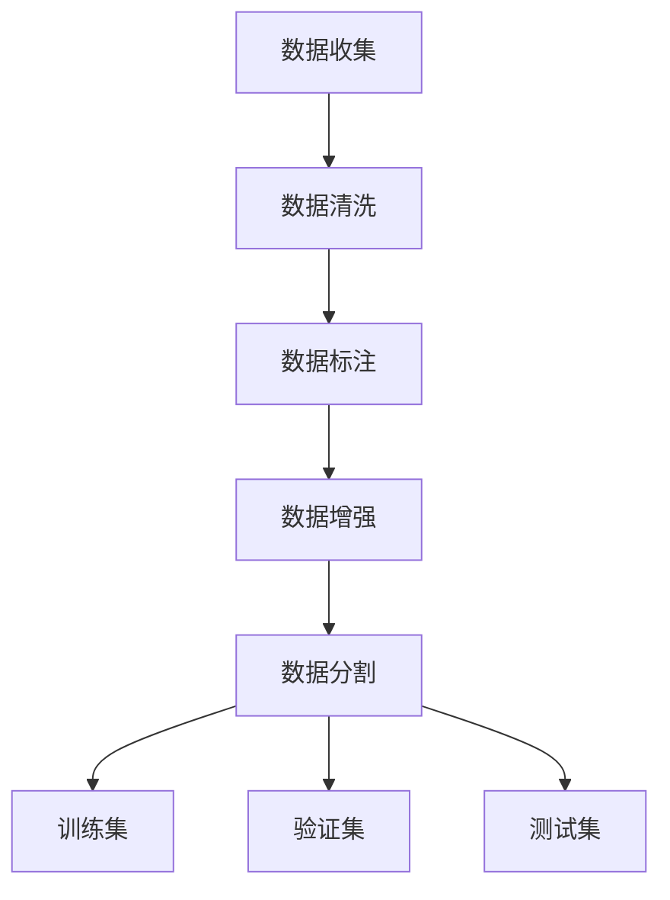
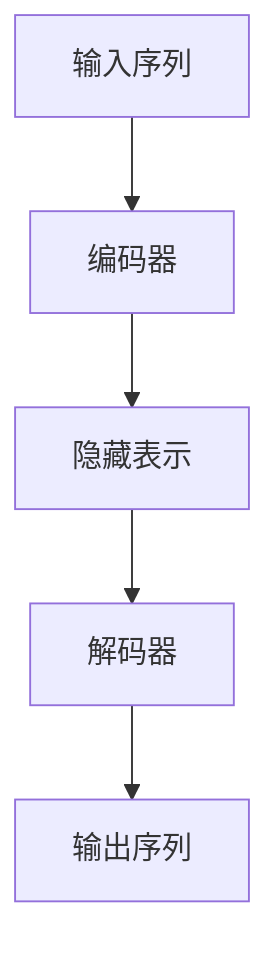

# 大语言模型原理与工程实践：数据的常见类别及其来源

## 1.背景介绍

大语言模型（Large Language Model, LLM）是近年来人工智能领域的一个重要突破。它们通过处理和生成自然语言文本，已经在多个应用场景中展现出强大的能力，如机器翻译、文本生成、对话系统等。大语言模型的成功离不开大量高质量的数据，这些数据不仅决定了模型的性能，还影响了模型的泛化能力和应用效果。

在本文中，我们将深入探讨大语言模型所需数据的常见类别及其来源。通过对数据的详细分析和分类，我们可以更好地理解如何选择和处理数据，以提升模型的性能和实用性。

## 2.核心概念与联系

### 2.1 数据的定义与分类

数据是大语言模型训练的基础。根据数据的来源和性质，我们可以将其分为以下几类：

- **文本数据**：包括新闻文章、书籍、社交媒体帖子等。
- **对话数据**：包括聊天记录、客服对话等。
- **结构化数据**：如数据库中的表格数据。
- **半结构化数据**：如JSON、XML等格式的数据。
- **多模态数据**：包括图像、视频与文本的结合。

### 2.2 数据与模型的关系

数据的质量和多样性直接影响大语言模型的性能。高质量的数据可以帮助模型更好地理解和生成自然语言，而多样化的数据可以提升模型的泛化能力，使其在不同的应用场景中表现出色。

### 2.3 数据预处理的重要性

在将数据用于模型训练之前，必须进行预处理。预处理步骤包括数据清洗、去重、分词、标注等。这些步骤可以提高数据的质量，减少噪声，从而提升模型的训练效果。

## 3.核心算法原理具体操作步骤

### 3.1 数据收集

数据收集是大语言模型训练的第一步。常见的数据来源包括：

- **公开数据集**：如Wikipedia、Common Crawl等。
- **自有数据**：企业内部的文档、邮件等。
- **网络爬虫**：从互联网上抓取数据。

### 3.2 数据清洗

数据清洗是指去除数据中的噪声和错误。常见的清洗步骤包括：

- **去重**：删除重复的文本。
- **去除特殊字符**：如HTML标签、表情符号等。
- **拼写检查**：纠正拼写错误。

### 3.3 数据标注

数据标注是指为数据添加额外的信息，如词性标注、命名实体识别等。标注后的数据可以用于监督学习，提升模型的性能。

### 3.4 数据增强

数据增强是指通过对现有数据进行变换，生成新的数据。常见的数据增强方法包括：

- **同义词替换**：将词语替换为其同义词。
- **随机插入**：在句子中随机插入词语。
- **随机删除**：随机删除句子中的词语。

### 3.5 数据分割

在训练模型之前，需要将数据分为训练集、验证集和测试集。常见的分割比例为8:1:1。



## 4.数学模型和公式详细讲解举例说明

### 4.1 语言模型的基本原理

语言模型的目标是估计一个给定序列的概率。对于一个序列 $w_1, w_2, ..., w_n$，其概率可以表示为：

$$
P(w_1, w_2, ..., w_n) = P(w_1) \cdot P(w_2|w_1) \cdot P(w_3|w_1, w_2) \cdot ... \cdot P(w_n|w_1, w_2, ..., w_{n-1})
$$

### 4.2 神经网络语言模型

神经网络语言模型通过使用神经网络来估计上述条件概率。常见的神经网络结构包括前馈神经网络（Feedforward Neural Network, FNN）和循环神经网络（Recurrent Neural Network, RNN）。

#### 4.2.1 前馈神经网络

前馈神经网络通过多个隐藏层来学习输入和输出之间的关系。其基本结构如下：

$$
h = f(Wx + b)
$$

其中，$h$ 是隐藏层的输出，$W$ 是权重矩阵，$x$ 是输入，$b$ 是偏置，$f$ 是激活函数。

#### 4.2.2 循环神经网络

循环神经网络通过引入循环连接来处理序列数据。其基本结构如下：

$$
h_t = f(Wx_t + Uh_{t-1} + b)
$$

其中，$h_t$ 是时间步 $t$ 的隐藏状态，$W$ 和 $U$ 是权重矩阵，$x_t$ 是时间步 $t$ 的输入，$b$ 是偏置，$f$ 是激活函数。

### 4.3 变换器模型

变换器模型（Transformer）是近年来广泛应用于大语言模型的一种结构。其核心思想是通过自注意力机制（Self-Attention）来捕捉序列中各个位置之间的依赖关系。

#### 4.3.1 自注意力机制

自注意力机制通过计算输入序列中每个位置与其他位置的相似度来生成注意力权重。其计算公式如下：

$$
\text{Attention}(Q, K, V) = \text{softmax}\left(\frac{QK^T}{\sqrt{d_k}}\right)V
$$

其中，$Q$ 是查询矩阵，$K$ 是键矩阵，$V$ 是值矩阵，$d_k$ 是键向量的维度。

#### 4.3.2 变换器的结构

变换器由编码器（Encoder）和解码器（Decoder）组成。编码器负责将输入序列编码为隐藏表示，解码器则根据隐藏表示生成输出序列。



## 5.项目实践：代码实例和详细解释说明

### 5.1 数据收集与预处理

以下是一个简单的数据收集与预处理的代码示例：

```python
import requests
from bs4 import BeautifulSoup
import re

# 数据收集
def collect_data(url):
    response = requests.get(url)
    soup = BeautifulSoup(response.text, 'html.parser')
    text = soup.get_text()
    return text

# 数据清洗
def clean_data(text):
    text = re.sub(r'\s+', ' ', text)  # 去除多余的空白字符
    text = re.sub(r'[^\w\s]', '', text)  # 去除标点符号
    return text

url = 'https://example.com'
raw_data = collect_data(url)
cleaned_data = clean_data(raw_data)
print(cleaned_data)
```

### 5.2 模型训练

以下是一个简单的模型训练代码示例，使用PyTorch框架：

```python
import torch
import torch.nn as nn
import torch.optim as optim

# 定义前馈神经网络
class FeedforwardNN(nn.Module):
    def __init__(self, input_size, hidden_size, output_size):
        super(FeedforwardNN, self).__init__()
        self.fc1 = nn.Linear(input_size, hidden_size)
        self.relu = nn.ReLU()
        self.fc2 = nn.Linear(hidden_size, output_size)

    def forward(self, x):
        out = self.fc1(x)
        out = self.relu(out)
        out = self.fc2(out)
        return out

# 初始化模型、损失函数和优化器
input_size = 100
hidden_size = 50
output_size = 10
model = FeedforwardNN(input_size, hidden_size, output_size)
criterion = nn.CrossEntropyLoss()
optimizer = optim.Adam(model.parameters(), lr=0.001)

# 训练模型
def train_model(model, data, labels, epochs):
    for epoch in range(epochs):
        outputs = model(data)
        loss = criterion(outputs, labels)
        optimizer.zero_grad()
        loss.backward()
        optimizer.step()
        print(f'Epoch [{epoch+1}/{epochs}], Loss: {loss.item():.4f}')

# 示例数据
data = torch.randn(100, input_size)
labels = torch.randint(0, output_size, (100,))
train_model(model, data, labels, epochs=10)
```

## 6.实际应用场景

### 6.1 机器翻译

大语言模型在机器翻译中表现出色。通过训练模型在多语言数据集上，模型可以学习不同语言之间的对应关系，实现高质量的翻译。

### 6.2 文本生成

大语言模型可以用于生成高质量的文本，如新闻文章、小说等。通过输入一个开头，模型可以生成连贯的后续内容。

### 6.3 对话系统

大语言模型在对话系统中也有广泛应用。通过训练模型在对话数据集上，模型可以生成自然、流畅的对话内容，提升用户体验。

### 6.4 情感分析

大语言模型可以用于情感分析，通过分析文本中的情感倾向，帮助企业了解用户的情感反馈，优化产品和服务。

## 7.工具和资源推荐

### 7.1 数据集

- **Common Crawl**：一个包含大量网页数据的公开数据集。
- **Wikipedia**：一个包含多语言百科全书文章的数据集。
- **OpenSubtitles**：一个包含电影字幕的对话数据集。

### 7.2 工具

- **NLTK**：一个用于自然语言处理的Python库，提供了丰富的文本处理工具。
- **spaCy**：一个高效的自然语言处理库，支持多种语言的文本处理。
- **Transformers**：一个由Hugging Face提供的库，支持多种预训练的大语言模型。

### 7.3 平台

- **Kaggle**：一个数据科学竞赛平台，提供了丰富的数据集和代码示例。
- **Google Colab**：一个免费的在线Jupyter Notebook环境，支持GPU加速。

## 8.总结：未来发展趋势与挑战

大语言模型在自然语言处理领域展现出巨大的潜力，但也面临一些挑战。未来的发展趋势和挑战包括：

### 8.1 数据隐私与安全

随着数据量的增加，数据隐私和安全问题变得越来越重要。如何在保证数据隐私的前提下，获取和使用高质量的数据，是一个亟待解决的问题。

### 8.2 模型的可解释性

大语言模型的复杂性使得其内部机制难以解释。提高模型的可解释性，有助于增强用户对模型的信任，促进模型在实际应用中的推广。

### 8.3 计算资源的需求

大语言模型的训练需要大量的计算资源。如何提高模型的训练效率，降低计算成本，是一个重要的研究方向。

### 8.4 多模态学习

未来，大语言模型将不仅限于处理文本数据，还将扩展到多模态数据的处理，如图像、视频等。多模态学习将为大语言模型带来更多的应用场景和可能性。

## 9.附录：常见问题与解答

### 9.1 大语言模型需要多少数据？

大语言模型的性能与数据量密切相关。一般来说，数据量越大，模型的性能越好。但数据的质量和多样性同样重要。

### 9.2 如何选择合适的数据集？

选择数据集时，应考虑数据的质量、覆盖范围和与任务的相关性。公开数据集如Common Crawl和Wikipedia是常见的选择。

### 9.3 如何处理数据中的噪声？

数据中的噪声可以通过数据清洗步骤来处理，如去重、去除特殊字符、拼写检查等。

### 9.4 大语言模型的训练需要多长时间？

大语言模型的训练时间取决于数据量、模型的复杂度和计算资源。一般来说，训练一个大语言模型需要数天到数周的时间。

### 9.5 如何评估大语言模型的性能？

大语言模型的性能可以通过多种指标来评估，如困惑度（Perplexity）、BLEU分数等。选择合适的评估指标取决于具体的任务和应用场景。

---

作者：禅与计算机程序设计艺术 / Zen and the Art of Computer Programming