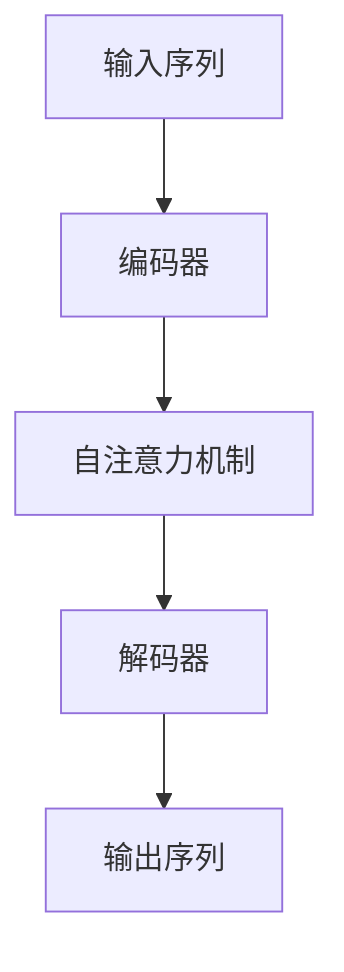

# 大语言模型应用指南：入门

## 1.背景介绍

大语言模型（Large Language Model, LLM）是近年来人工智能领域的一个重要突破。它们通过训练在大量文本数据上，能够生成高质量的自然语言文本，完成各种语言任务，如翻译、问答、文本生成等。大语言模型的代表作包括OpenAI的GPT系列、Google的BERT等。这些模型的出现不仅推动了自然语言处理（NLP）技术的发展，也在各行各业中找到了广泛的应用。

## 2.核心概念与联系

### 2.1 什么是大语言模型

大语言模型是一种基于深度学习的模型，通常使用变压器（Transformer）架构。它们通过在大规模文本数据上进行训练，学习到语言的语法、语义和上下文关系，从而能够生成和理解自然语言。

### 2.2 变压器架构

变压器架构是大语言模型的核心。它通过自注意力机制（Self-Attention Mechanism）来捕捉输入序列中各个位置之间的依赖关系。变压器架构的主要组成部分包括编码器（Encoder）和解码器（Decoder）。



### 2.3 预训练与微调

大语言模型的训练过程通常分为两个阶段：预训练（Pre-training）和微调（Fine-tuning）。在预训练阶段，模型在大规模无标签文本数据上进行训练，学习语言的基本结构和知识。在微调阶段，模型在特定任务的数据上进行训练，以适应具体的应用场景。

## 3.核心算法原理具体操作步骤

### 3.1 数据预处理

数据预处理是大语言模型训练的第一步。它包括文本清洗、分词、词嵌入等步骤。文本清洗包括去除噪音数据，如HTML标签、特殊字符等。分词是将文本分割成单词或子词。词嵌入是将单词转换为向量表示。

### 3.2 模型训练

模型训练是大语言模型的核心步骤。它包括前向传播（Forward Propagation）、损失计算（Loss Calculation）和反向传播（Backward Propagation）。前向传播是将输入数据通过模型，生成预测结果。损失计算是计算预测结果与真实结果之间的差异。反向传播是通过梯度下降算法，更新模型参数，以最小化损失。

### 3.3 模型评估

模型评估是验证模型性能的重要步骤。常用的评估指标包括准确率（Accuracy）、精确率（Precision）、召回率（Recall）和F1分数（F1 Score）。这些指标可以帮助我们了解模型在不同任务上的表现。

## 4.数学模型和公式详细讲解举例说明

### 4.1 词嵌入

词嵌入是将单词转换为向量表示的过程。常用的词嵌入方法包括Word2Vec、GloVe等。词嵌入的目标是将语义相似的单词映射到相近的向量空间。

$$
\text{Word2Vec:} \quad \mathbf{v}(w) = \frac{1}{|C(w)|} \sum_{c \in C(w)} \mathbf{v}(c)
$$

### 4.2 自注意力机制

自注意力机制是变压器架构的核心。它通过计算输入序列中各个位置之间的相似度，来捕捉序列中的依赖关系。

$$
\text{Attention}(Q, K, V) = \text{softmax}\left(\frac{QK^T}{\sqrt{d_k}}\right)V
$$

### 4.3 损失函数

损失函数是衡量模型预测结果与真实结果之间差异的函数。常用的损失函数包括交叉熵损失（Cross-Entropy Loss）和均方误差（Mean Squared Error, MSE）。

$$
\text{Cross-Entropy Loss:} \quad L = -\sum_{i} y_i \log(\hat{y}_i)
$$

## 5.项目实践：代码实例和详细解释说明

### 5.1 数据预处理

```python
import re
import nltk
from nltk.tokenize import word_tokenize

# 下载NLTK数据
nltk.download('punkt')

# 文本清洗
def clean_text(text):
    text = re.sub(r'<.*?>', '', text)  # 去除HTML标签
    text = re.sub(r'[^a-zA-Z\s]', '', text)  # 去除特殊字符
    text = text.lower()  # 转换为小写
    return text

# 分词
def tokenize_text(text):
    return word_tokenize(text)

# 示例文本
text = "<p>Hello, world! This is a test.</p>"
cleaned_text = clean_text(text)
tokens = tokenize_text(cleaned_text)
print(tokens)
```

### 5.2 模型训练

```python
import torch
import torch.nn as nn
import torch.optim as optim

# 定义变压器模型
class TransformerModel(nn.Module):
    def __init__(self, vocab_size, d_model, nhead, num_encoder_layers, num_decoder_layers):
        super(TransformerModel, self).__init__()
        self.transformer = nn.Transformer(d_model, nhead, num_encoder_layers, num_decoder_layers)
        self.embedding = nn.Embedding(vocab_size, d_model)
        self.fc = nn.Linear(d_model, vocab_size)

    def forward(self, src, tgt):
        src = self.embedding(src)
        tgt = self.embedding(tgt)
        output = self.transformer(src, tgt)
        output = self.fc(output)
        return output

# 超参数
vocab_size = 10000
d_model = 512
nhead = 8
num_encoder_layers = 6
num_decoder_layers = 6

# 初始化模型
model = TransformerModel(vocab_size, d_model, nhead, num_encoder_layers, num_decoder_layers)

# 损失函数和优化器
criterion = nn.CrossEntropyLoss()
optimizer = optim.Adam(model.parameters(), lr=0.001)

# 训练循环
for epoch in range(10):
    for src, tgt in data_loader:
        optimizer.zero_grad()
        output = model(src, tgt)
        loss = criterion(output.view(-1, vocab_size), tgt.view(-1))
        loss.backward()
        optimizer.step()
    print(f'Epoch {epoch+1}, Loss: {loss.item()}')
```

### 5.3 模型评估

```python
from sklearn.metrics import accuracy_score, precision_score, recall_score, f1_score

# 预测结果
y_true = [0, 1, 1, 0, 1]
y_pred = [0, 1, 0, 0, 1]

# 计算评估指标
accuracy = accuracy_score(y_true, y_pred)
precision = precision_score(y_true, y_pred)
recall = recall_score(y_true, y_pred)
f1 = f1_score(y_true, y_pred)

print(f'Accuracy: {accuracy}')
print(f'Precision: {precision}')
print(f'Recall: {recall}')
print(f'F1 Score: {f1}')
```

## 6.实际应用场景

### 6.1 文本生成

大语言模型可以用于生成高质量的自然语言文本，如新闻报道、小说、技术文档等。通过输入一个开头，模型可以自动生成后续内容。

### 6.2 机器翻译

大语言模型在机器翻译领域表现出色。它们可以将一种语言的文本翻译成另一种语言，支持多种语言对。

### 6.3 问答系统

大语言模型可以用于构建智能问答系统。通过输入问题，模型可以生成准确的答案，应用于客服、教育等领域。

### 6.4 情感分析

大语言模型可以用于情感分析，判断文本的情感倾向，如正面、负面或中性。它们在市场分析、舆情监控等领域有广泛应用。

## 7.工具和资源推荐

### 7.1 开源框架

- **TensorFlow**：谷歌开发的开源机器学习框架，支持大语言模型的训练和部署。
- **PyTorch**：Facebook开发的开源深度学习框架，广泛应用于大语言模型的研究和应用。

### 7.2 数据集

- **Common Crawl**：一个包含大量网页数据的开源数据集，常用于大语言模型的预训练。
- **Wikipedia**：维基百科的文本数据，常用于大语言模型的预训练和微调。

### 7.3 在线资源

- **Hugging Face**：一个提供预训练大语言模型和NLP工具的开源平台。
- **Kaggle**：一个数据科学竞赛平台，提供大量公开数据集和代码示例。

## 8.总结：未来发展趋势与挑战

大语言模型在自然语言处理领域取得了显著进展，但仍面临一些挑战。未来的发展趋势包括：

### 8.1 模型规模与计算资源

随着模型规模的增加，训练大语言模型所需的计算资源也在不断增加。如何在保证模型性能的同时，降低计算成本，是一个重要的研究方向。

### 8.2 数据隐私与安全

大语言模型的训练需要大量数据，如何保护用户隐私和数据安全，是一个亟待解决的问题。未来需要在数据隐私保护和模型性能之间找到平衡。

### 8.3 模型解释性

大语言模型的内部机制复杂，缺乏解释性。如何提高模型的可解释性，使其决策过程透明，是一个重要的研究方向。

## 9.附录：常见问题与解答

### 9.1 大语言模型的训练需要多长时间？

大语言模型的训练时间取决于模型规模、数据量和计算资源。通常需要数周甚至数月的时间。

### 9.2 如何选择合适的大语言模型？

选择大语言模型时，需要考虑具体应用场景、模型性能和计算资源等因素。可以通过实验比较不同模型的表现，选择最适合的模型。

### 9.3 大语言模型是否可以处理多语言任务？

是的，大语言模型可以处理多语言任务。通过在多语言数据上进行训练，模型可以支持多种语言的处理和生成。

### 9.4 如何提高大语言模型的性能？

提高大语言模型性能的方法包括增加模型规模、优化训练算法、使用更好的数据预处理方法等。

### 9.5 大语言模型的应用是否有局限性？

大语言模型在处理长文本、复杂语义和特定领域知识时，可能存在局限性。需要结合具体应用场景，选择合适的模型和方法。

---

作者：禅与计算机程序设计艺术 / Zen and the Art of Computer Programming