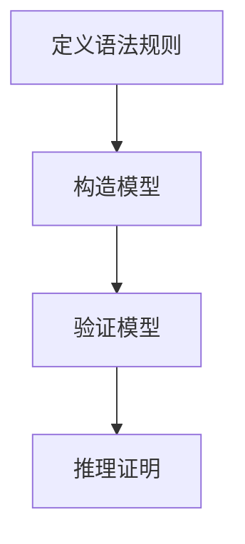

# 数理逻辑：谓词逻辑的完备性（二）

## 1.背景介绍

谓词逻辑是数理逻辑的一个重要分支，它在计算机科学、人工智能、数学等领域有着广泛的应用。谓词逻辑的完备性是指在一个逻辑系统中，如果一个公式是语义上有效的，那么它在该系统中也是可证明的。完备性定理是数理逻辑中的一个核心结果，它由库尔特·哥德尔在1930年首次提出。本文将深入探讨谓词逻辑的完备性，详细介绍其核心概念、算法原理、数学模型、实际应用以及未来发展趋势。

## 2.核心概念与联系

### 2.1 谓词逻辑

谓词逻辑（Predicate Logic）是对命题逻辑的扩展，它引入了量词（如全称量词 $\forall$ 和存在量词 $\exists$）和谓词（如 $P(x)$）。谓词逻辑能够表达更复杂的命题，例如“所有人都是凡人”可以表示为 $\forall x (人(x) \rightarrow 凡人(x))$。

### 2.2 完备性

完备性（Completeness）是指在一个逻辑系统中，如果一个公式是语义上有效的（即在所有模型中都为真），那么它在该系统中也是可证明的。完备性定理确保了语义和语法之间的一致性。

### 2.3 语法与语义

- **语法**：指逻辑公式的形式结构和推理规则。
- **语义**：指逻辑公式在模型中的解释和真值。

### 2.4 关系

完备性定理建立了语法和语义之间的桥梁，确保了在一个逻辑系统中，语义上有效的公式都可以通过语法推理得到证明。

## 3.核心算法原理具体操作步骤

### 3.1 证明策略

完备性定理的证明通常采用归纳法和构造法。主要步骤包括：

1. **归纳假设**：假设对于所有长度小于 $n$ 的公式，完备性成立。
2. **构造模型**：对于长度为 $n$ 的公式，构造一个模型使其为真。
3. **归纳证明**：证明在该模型下，公式可以通过语法推理得到证明。

### 3.2 具体操作步骤

1. **定义语法规则**：定义谓词逻辑的语法规则，包括公式的构造规则和推理规则。
2. **构造模型**：对于给定的公式，构造一个模型使其为真。
3. **验证模型**：验证在该模型下，公式的语义是否成立。
4. **推理证明**：通过语法推理，证明公式在该系统中是可证明的。

### 3.3 Mermaid 流程图



## 4.数学模型和公式详细讲解举例说明

### 4.1 数学模型

谓词逻辑的数学模型包括一个域 $D$ 和一个解释函数 $I$。解释函数 $I$ 将谓词符号映射到域 $D$ 上的关系，将函数符号映射到域 $D$ 上的函数。

### 4.2 公式表示

谓词逻辑公式可以表示为：

$$
\forall x (P(x) \rightarrow Q(x))
$$

其中，$P(x)$ 和 $Q(x)$ 是谓词，$x$ 是变量。

### 4.3 举例说明

假设我们有一个公式 $\forall x (人(x) \rightarrow 凡人(x))$，其数学模型可以定义为：

- 域 $D$：所有人
- 解释函数 $I$：$人(x)$ 表示 $x$ 是人，$凡人(x)$ 表示 $x$ 是凡人

在该模型下，公式 $\forall x (人(x) \rightarrow 凡人(x))$ 是语义上有效的。

## 5.项目实践：代码实例和详细解释说明

### 5.1 代码实例

以下是一个简单的Python代码示例，使用SymPy库来验证谓词逻辑公式的有效性：

```python
from sympy import symbols, Implies, ForAll
from sympy.logic.boolalg import Predicate

# 定义变量和谓词
x = symbols('x')
P = Predicate('P')
Q = Predicate('Q')

# 定义公式
formula = ForAll(x, Implies(P(x), Q(x)))

# 验证公式
print(formula)
```

### 5.2 详细解释

1. **定义变量和谓词**：使用SymPy库定义变量 $x$ 和谓词 $P(x)$ 和 $Q(x)$。
2. **定义公式**：使用SymPy库定义谓词逻辑公式 $\forall x (P(x) \rightarrow Q(x))$。
3. **验证公式**：输出公式，验证其语法正确性。

## 6.实际应用场景

### 6.1 人工智能

在人工智能领域，谓词逻辑用于知识表示和推理。例如，专家系统使用谓词逻辑来表示规则和事实，并通过推理引擎进行推理。

### 6.2 数据库

在数据库领域，谓词逻辑用于查询优化和数据一致性检查。例如，SQL查询可以看作是谓词逻辑公式，数据库系统通过逻辑推理优化查询执行计划。

### 6.3 形式化验证

在软件工程领域，谓词逻辑用于形式化验证和模型检查。例如，使用谓词逻辑验证软件系统的正确性和安全性。

## 7.工具和资源推荐

### 7.1 工具

- **SymPy**：Python库，用于符号数学计算和逻辑推理。
- **Prover9**：自动定理证明工具，支持谓词逻辑。
- **Coq**：交互式定理证明器，支持形式化验证。

### 7.2 资源

- **《数理逻辑导论》**：经典教材，详细介绍数理逻辑的基本概念和定理。
- **《人工智能：一种现代方法》**：介绍人工智能中的逻辑推理和知识表示。
- **在线课程**：Coursera和edX上有许多关于数理逻辑和形式化验证的在线课程。

## 8.总结：未来发展趋势与挑战

### 8.1 未来发展趋势

- **自动化推理**：随着计算能力的提升，自动化推理工具将变得更加高效和智能。
- **跨领域应用**：谓词逻辑将在更多领域得到应用，如生物信息学、物联网等。
- **形式化验证**：形式化验证技术将进一步发展，提高软件系统的可靠性和安全性。

### 8.2 挑战

- **计算复杂性**：谓词逻辑推理的计算复杂性较高，需要高效的算法和工具支持。
- **模型构造**：构造符合实际应用的数学模型是一个挑战，需要深入理解应用领域的知识。
- **语义与语法一致性**：确保语义和语法的一致性是一个长期的研究课题。

## 9.附录：常见问题与解答

### 9.1 什么是谓词逻辑的完备性？

谓词逻辑的完备性是指在一个逻辑系统中，如果一个公式是语义上有效的，那么它在该系统中也是可证明的。

### 9.2 如何验证谓词逻辑公式的有效性？

可以使用自动定理证明工具（如Prover9）或符号计算库（如SymPy）来验证谓词逻辑公式的有效性。

### 9.3 谓词逻辑在实际应用中有哪些挑战？

主要挑战包括计算复杂性、模型构造和语义与语法的一致性。

### 9.4 谓词逻辑的未来发展趋势是什么？

未来发展趋势包括自动化推理、跨领域应用和形式化验证技术的进一步发展。

---

作者：禅与计算机程序设计艺术 / Zen and the Art of Computer Programming