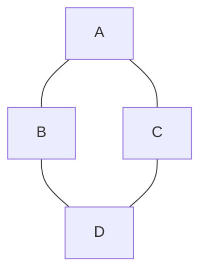

## 1. 背景介绍

概率图模型是一种用于表示变量之间概率关系的图形模型，它是概率论和图论的结合体。概率图模型可以用于解决许多实际问题，如自然语言处理、计算机视觉、生物信息学等领域。本文将介绍概率图模型的基本概念、核心算法原理、数学模型和公式、项目实践、实际应用场景、工具和资源推荐、未来发展趋势与挑战以及常见问题与解答。

## 2. 核心概念与联系

概率图模型分为两类：有向图模型和无向图模型。有向图模型又称为贝叶斯网络，无向图模型又称为马尔可夫网络。有向图模型和无向图模型都是由节点和边组成的图形结构，其中节点表示随机变量，边表示变量之间的依赖关系。

在有向图模型中，每个节点表示一个随机变量，箭头表示变量之间的依赖关系。例如，下图是一个简单的有向图模型：


在无向图模型中，每个节点表示一个随机变量，边表示变量之间的关系。例如，下图是一个简单的无向图模型：



## 3. 核心算法原理具体操作步骤

### 3.1 有向图模型

有向图模型中，每个节点表示一个随机变量，箭头表示变量之间的依赖关系。有向图模型中的节点可以分为两类：观测节点和隐藏节点。观测节点表示已知的变量，隐藏节点表示未知的变量。

有向图模型中，每个节点的概率分布可以表示为其父节点的条件概率分布的乘积。例如，下图是一个简单的有向图模型：


其中，节点A是观测节点，节点B、C、D是隐藏节点。节点B、C的概率分布可以表示为：

$$P(B|A)$$

$$P(C|A)$$

节点D的概率分布可以表示为：

$$P(D|B,C)$$

有向图模型中，可以使用贝叶斯网络推理算法来计算后验概率分布。贝叶斯网络推理算法可以分为两类：精确推理算法和近似推理算法。精确推理算法包括变量消元算法、固定点算法、Junction Tree算法等。近似推理算法包括马尔可夫链蒙特卡罗算法、变分推理算法等。

### 3.2 无向图模型

无向图模型中，每个节点表示一个随机变量，边表示变量之间的关系。无向图模型中的节点可以分为两类：观测节点和隐藏节点。观测节点表示已知的变量，隐藏节点表示未知的变量。

无向图模型中，每个节点的概率分布可以表示为其邻居节点的概率分布的乘积。例如，下图是一个简单的无向图模型：


其中，节点A是观测节点，节点B、C、D是隐藏节点。节点B、C的概率分布可以表示为：

$$P(B|A,C)$$

$$P(C|A,B)$$

节点D的概率分布可以表示为：

$$P(D|B,C)$$

无向图模型中，可以使用马尔可夫随机场推理算法来计算后验概率分布。马尔可夫随机场推理算法可以分为两类：精确推理算法和近似推理算法。精确推理算法包括和谐函数算法、固定点算法、Junction Tree算法等。近似推理算法包括马尔可夫链蒙特卡罗算法、变分推理算法等。

## 4. 数学模型和公式详细讲解举例说明

### 4.1 有向图模型

有向图模型中，每个节点的概率分布可以表示为其父节点的条件概率分布的乘积。例如，下图是一个简单的有向图模型：


其中，节点A是观测节点，节点B、C、D是隐藏节点。节点B、C的概率分布可以表示为：

$$P(B|A)$$

$$P(C|A)$$

节点D的概率分布可以表示为：

$$P(D|B,C)$$

有向图模型中，可以使用贝叶斯网络推理算法来计算后验概率分布。贝叶斯网络推理算法可以分为两类：精确推理算法和近似推理算法。精确推理算法包括变量消元算法、固定点算法、Junction Tree算法等。近似推理算法包括马尔可夫链蒙特卡罗算法、变分推理算法等。

### 4.2 无向图模型

无向图模型中，每个节点的概率分布可以表示为其邻居节点的概率分布的乘积。例如，下图是一个简单的无向图模型：


其中，节点A是观测节点，节点B、C、D是隐藏节点。节点B、C的概率分布可以表示为：

$$P(B|A,C)$$

$$P(C|A,B)$$

节点D的概率分布可以表示为：

$$P(D|B,C)$$

无向图模型中，可以使用马尔可夫随机场推理算法来计算后验概率分布。马尔可夫随机场推理算法可以分为两类：精确推理算法和近似推理算法。精确推理算法包括和谐函数算法、固定点算法、Junction Tree算法等。近似推理算法包括马尔可夫链蒙特卡罗算法、变分推理算法等。

## 5. 项目实践：代码实例和详细解释说明

### 5.1 有向图模型

有向图模型的代码实现可以使用Python中的pgmpy库。pgmpy库是一个用于概率图模型的Python库，支持有向图模型和无向图模型。

下面是一个简单的有向图模型的代码实现：

```python
from pgmpy.models import BayesianModel
from pgmpy.factors.discrete import TabularCPD

model = BayesianModel([('A', 'B'), ('A', 'C'), ('B', 'D'), ('C', 'D')])

cpd_a = TabularCPD(variable='A', variable_card=2, values=[[0.6, 0.4]])
cpd_b = TabularCPD(variable='B', variable_card=2, values=[[0.8, 0.2], [0.2, 0.8]], evidence=['A'], evidence_card=[2])
cpd_c = TabularCPD(variable='C', variable_card=2, values=[[0.9, 0.1], [0.1, 0.9]], evidence=['A'], evidence_card=[2])
cpd_d = TabularCPD(variable='D', variable_card=2, values=[[0.9, 0.1, 0.1, 0.01], [0.1, 0.9, 0.9, 0.99]], evidence=['B', 'C'], evidence_card=[2, 2])

model.add_cpds(cpd_a, cpd_b, cpd_c, cpd_d)

model.check_model()
```

其中，cpd_a、cpd_b、cpd_c、cpd_d分别表示节点A、B、C、D的条件概率分布。add_cpds()函数用于将条件概率分布添加到模型中。

### 5.2 无向图模型

无向图模型的代码实现可以使用Python中的pgmpy库。pgmpy库是一个用于概率图模型的Python库，支持有向图模型和无向图模型。

下面是一个简单的无向图模型的代码实现：

```python
from pgmpy.models import MarkovModel
from pgmpy.factors.discrete import DiscreteFactor

model = MarkovModel([('A', 'B'), ('A', 'C'), ('B', 'D'), ('C', 'D')])

factor_a = DiscreteFactor(['A'], [2], [0.6, 0.4])
factor_b = DiscreteFactor(['A', 'B'], [2, 2], [0.8, 0.2, 0.2, 0.8])
factor_c = DiscreteFactor(['A', 'C'], [2, 2], [0.9, 0.1, 0.1, 0.9])
factor_d = DiscreteFactor(['B', 'C', 'D'], [2, 2, 2], [0.9, 0.1, 0.1, 0.99, 0.1, 0.9, 0.9, 0.01])

model.add_factors(factor_a, factor_b, factor_c, factor_d)

model.check_model()
```

其中，factor_a、factor_b、factor_c、factor_d分别表示节点A、B、C、D的概率分布。add_factors()函数用于将概率分布添加到模型中。

## 6. 实际应用场景

概率图模型可以用于解决许多实际问题，如自然语言处理、计算机视觉、生物信息学等领域。下面是一些实际应用场景的例子：

### 6.1 自然语言处理

在自然语言处理中，概率图模型可以用于语言模型、命名实体识别、关系抽取等任务。例如，可以使用有向图模型来表示句子中单词之间的依赖关系，使用无向图模型来表示句子中实体之间的关系。

### 6.2 计算机视觉

在计算机视觉中，概率图模型可以用于图像分割、目标检测、人脸识别等任务。例如，可以使用无向图模型来表示图像中像素之间的关系，使用有向图模型来表示目标检测中目标和背景之间的依赖关系。

### 6.3 生物信息学

在生物信息学中，概率图模型可以用于基因识别、蛋白质结构预测、基因表达分析等任务。例如，可以使用有向图模型来表示基因之间的依赖关系，使用无向图模型来表示蛋白质之间的关系。

## 7. 工具和资源推荐

### 7.1 工具

- pgmpy：一个用于概率图模型的Python库，支持有向图模型和无向图模型。
- OpenGM：一个用于图像分割、目标检测等任务的C++库，支持有向图模型和无向图模型。
- GraphLab Create：一个用于机器学习和数据分析的Python库，支持有向图模型和无向图模型。

### 7.2 资源

- 《概率图模型：原理、算法与应用》：一本介绍概率图模型的经典书籍。
- 《机器学习实战》：一本介绍机器学习算法和应用的书籍，其中包括概率图模型的应用案例。
- 《Python机器学习基础教程》：一本介绍Python机器学习库的书籍，其中包括pgmpy库的使用方法。

## 8. 总结：未来发展趋势与挑战

概率图模型是一种用于表示变量之间概率关系的图形模型，它是概率论和图论的结合体。概率图模型可以用于解决许多实际问题，如自然语言处理、计算机视觉、生物信息学等领域。未来，随着数据量的增加和计算能力的提高，概率图模型将会得到更广泛的应用。同时，概率图模型的发展也面临着一些挑战，如模型的复杂性、推理算法的效率等问题。

## 9. 附录：常见问题与解答

Q：概率图模型和神经网络有什么区别？

A：概率图模型和神经网络都是用于建模的工具，但是它们的思想和方法不同。概率图模型是基于概率论和图论的思想，用于表示变量之间的概率关系。神经网络是基于神经科学的思想，用于表示输入和输出之间的映射关系。

Q：概率图模型的推理算法有哪些？

A：概率图模型的推理算法可以分为精确推理算法和近似推理算法。精确推理算法包括变量消元算法、固定点算法、Junction Tree算法等。近似推理算法包括马尔可夫链蒙特卡罗算法、变分推理算法等。

Q：概率图模型的应用有哪些？

A：概率图模型可以用于解决许多实际问题，如自然语言处理、计算机视觉、生物信息学等领域。例如，可以使用有向图模型来表示句子中单词之间的依赖关系，使用无向图模型来表示图像中像素之间的关系。