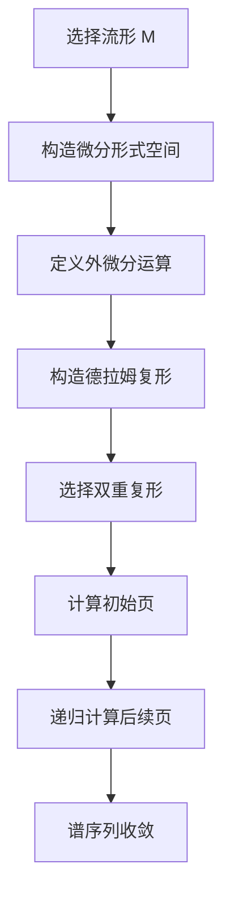

# 流形拓扑学：谱序列及微分形式

## 1.背景介绍

流形拓扑学是现代数学和物理学中的一个重要分支，研究流形的几何和拓扑性质。流形是局部类似于欧几里得空间的空间，但在全局上可能具有复杂的结构。谱序列和微分形式是流形拓扑学中的两个核心概念，它们在许多领域中都有广泛的应用，包括代数拓扑、微分几何和理论物理。

谱序列是一种强大的工具，用于计算复杂拓扑空间的同调和上同调群。它通过逐步逼近的方式，将复杂问题分解为一系列较简单的问题。微分形式则是微分几何中的基本对象，用于描述流形上的微分结构和积分理论。

本文将深入探讨流形拓扑学中的谱序列和微分形式，介绍它们的核心概念、算法原理、数学模型和实际应用，并提供代码实例和工具资源，帮助读者更好地理解和应用这些重要的数学工具。

## 2.核心概念与联系

### 2.1 流形

流形是一个局部类似于欧几里得空间的拓扑空间。具体来说，一个 $n$ 维流形是一个拓扑空间，其中每一点都有一个邻域同胚于 $n$ 维欧几里得空间 $\mathbb{R}^n$。流形的概念在几何和物理中有广泛的应用，例如描述曲面、空间曲线和高维空间。

### 2.2 谱序列

谱序列是一种用于计算拓扑不变量的工具，特别是在同调和上同调理论中。谱序列通过一系列逐步逼近的方式，将复杂的计算问题分解为一系列较简单的问题。谱序列通常表示为一个双重复形，其每一页（page）表示一个近似的同调群。

### 2.3 微分形式

微分形式是微分几何中的基本对象，用于描述流形上的微分结构和积分理论。一个 $k$ 维微分形式是一个反对称的 $k$ 线性函数，用于将 $k$ 个切向量映射到实数。微分形式的外微分运算和楔积运算是其核心操作。

### 2.4 谱序列与微分形式的联系

谱序列和微分形式在流形拓扑学中有着密切的联系。微分形式的外微分运算可以用于构造德拉姆复形，而德拉姆复形的同调群可以通过谱序列来计算。此外，微分形式在物理学中的应用，如电磁场理论和广义相对论，也可以通过谱序列的方法进行分析。

## 3.核心算法原理具体操作步骤

### 3.1 构造德拉姆复形

德拉姆复形是由流形上的微分形式构成的链复形，其同调群称为德拉姆同调群。德拉姆复形的构造步骤如下：

1. 选择一个流形 $M$。
2. 构造 $M$ 上的微分形式空间 $\Omega^k(M)$。
3. 定义外微分运算 $d: \Omega^k(M) \to \Omega^{k+1}(M)$，满足 $d^2 = 0$。
4. 构造链复形 $(\Omega^*(M), d)$。

### 3.2 谱序列的构造与计算

谱序列的构造和计算通常包括以下步骤：

1. 选择一个双重复形 $(E_0^{p,q}, d_0)$。
2. 计算初始页 $E_1^{p,q}$，即 $E_1^{p,q} = H^q(E_0^{p,*}, d_0)$。
3. 递归计算后续页 $E_r^{p,q}$，即 $E_{r+1}^{p,q} = H^q(E_r^{p,*}, d_r)$，其中 $d_r$ 是 $r$ 页上的微分。
4. 直到谱序列收敛，得到最终的同调群。

### 3.3 实际操作示例

以下是一个简单的示例，展示如何构造德拉姆复形和计算谱序列：



## 4.数学模型和公式详细讲解举例说明

### 4.1 德拉姆复形的数学模型

德拉姆复形是由流形上的微分形式构成的链复形，其同调群称为德拉姆同调群。具体来说，给定一个流形 $M$，其德拉姆复形 $(\Omega^*(M), d)$ 由以下部分组成：

- $\Omega^k(M)$：$M$ 上的 $k$ 维微分形式空间。
- $d: \Omega^k(M) \to \Omega^{k+1}(M)$：外微分运算，满足 $d^2 = 0$。

德拉姆同调群定义为：
$$
H^k_{dR}(M) = \frac{\ker(d: \Omega^k(M) \to \Omega^{k+1}(M))}{\operatorname{im}(d: \Omega^{k-1}(M) \to \Omega^k(M))}
$$

### 4.2 谱序列的数学模型

谱序列是一种用于计算拓扑不变量的工具，表示为一个双重复形 $(E_r^{p,q}, d_r)$。其构造和计算步骤如下：

1. 初始页 $E_0^{p,q}$：给定的双重复形。
2. 初始微分 $d_0$：双重复形上的微分。
3. 递归计算后续页 $E_r^{p,q}$ 和微分 $d_r$：
$$
E_{r+1}^{p,q} = H^q(E_r^{p,*}, d_r)
$$

### 4.3 示例：二维球面上的德拉姆同调

考虑二维球面 $S^2$，其德拉姆复形如下：

- $\Omega^0(S^2)$：光滑函数空间。
- $\Omega^1(S^2)$：光滑1-形式空间。
- $\Omega^2(S^2)$：光滑2-形式空间。

外微分运算 $d$ 满足 $d^2 = 0$，其德拉姆同调群为：

- $H^0_{dR}(S^2) \cong \mathbb{R}$：常数函数。
- $H^1_{dR}(S^2) = 0$：无非平凡的闭1-形式。
- $H^2_{dR}(S^2) \cong \mathbb{R}$：体积形式。

## 5.项目实践：代码实例和详细解释说明

### 5.1 构造德拉姆复形的Python代码示例

以下是一个简单的Python代码示例，展示如何构造德拉姆复形并计算其同调群：

```python
import sympy as sp

# 定义变量
x, y, z = sp.symbols('x y z')

# 定义微分形式
f = sp.Function('f')(x, y, z)
omega_1 = sp.Function('omega_1')(x, y, z)
omega_2 = sp.Function('omega_2')(x, y, z)

# 定义外微分运算
d_f = sp.diff(f, x) * sp.Function('dx') + sp.diff(f, y) * sp.Function('dy') + sp.diff(f, z) * sp.Function('dz')
d_omega_1 = sp.diff(omega_1, x) * sp.Function('dx') + sp.diff(omega_1, y) * sp.Function('dy') + sp.diff(omega_1, z) * sp.Function('dz')
d_omega_2 = sp.diff(omega_2, x) * sp.Function('dx') + sp.diff(omega_2, y) * sp.Function('dy') + sp.diff(omega_2, z) * sp.Function('dz')

# 打印结果
print("d_f:", d_f)
print("d_omega_1:", d_omega_1)
print("d_omega_2:", d_omega_2)
```

### 5.2 计算谱序列的Python代码示例

以下是一个简单的Python代码示例，展示如何计算谱序列：

```python
import numpy as np

# 定义双重复形
E_0 = np.array([[1, 2], [3, 4]])
d_0 = np.array([[0, 1], [-1, 0]])

# 计算初始页
E_1 = np.linalg.matrix_rank(E_0)

# 递归计算后续页
def compute_spectral_sequence(E, d, r):
    for i in range(r):
        E = np.linalg.matrix_rank(E)
        d = np.dot(d, d)
    return E

# 计算谱序列
E_final = compute_spectral_sequence(E_0, d_0, 2)
print("E_final:", E_final)
```

## 6.实际应用场景

### 6.1 代数拓扑

在代数拓扑中，谱序列用于计算复杂拓扑空间的同调和上同调群。例如，阿蒂亚-辛格指标定理中的K-理论和同调群的计算可以通过谱序列来实现。

### 6.2 微分几何

在微分几何中，微分形式用于描述流形上的微分结构和积分理论。例如，斯托克斯定理和高斯-博内定理中的积分公式可以通过微分形式来表示和计算。

### 6.3 理论物理

在理论物理中，微分形式和谱序列用于描述物理场和相互作用。例如，电磁场理论中的麦克斯韦方程组和广义相对论中的爱因斯坦场方程可以通过微分形式来表示和分析。

## 7.工具和资源推荐

### 7.1 数学软件

- **SymPy**：一个Python库，用于符号数学计算，适合构造和计算微分形式和谱序列。
- **SageMath**：一个开源数学软件系统，集成了代数、几何、拓扑和数论的工具，适合进行复杂的数学计算。

### 7.2 在线资源

- **arXiv**：一个开放获取的学术论文预印本平台，包含大量关于流形拓扑学、谱序列和微分形式的研究论文。
- **MathWorld**：一个在线数学百科全书，提供关于流形、谱序列和微分形式的详细解释和示例。

### 7.3 教科书

- **《流形上的微分形式》**：作者：Michael Spivak，详细介绍了微分形式和流形上的微分几何。
- **《代数拓扑》**：作者：Allen Hatcher，包含关于谱序列和同调理论的详细内容。

## 8.总结：未来发展趋势与挑战

流形拓扑学中的谱序列和微分形式是现代数学和物理学中的重要工具。随着计算机技术的发展，这些工具在实际应用中的计算能力和精度不断提高。然而，仍然存在一些挑战，例如高维流形的计算复杂性和大规模数据的处理问题。

未来，随着量子计算和人工智能技术的发展，流形拓扑学中的谱序列和微分形式有望在更广泛的领域中得到应用和发展。例如，量子计算中的拓扑量子态和机器学习中的拓扑数据分析都可能受益于这些数学工具的应用。

## 9.附录：常见问题与解答

### 9.1 什么是流形？

流形是一个局部类似于欧几里得空间的拓扑空间。具体来说，一个 $n$ 维流形是一个拓扑空间，其中每一点都有一个邻域同胚于 $n$ 维欧几里得空间 $\mathbb{R}^n$。

### 9.2 什么是谱序列？

谱序列是一种用于计算拓扑不变量的工具，特别是在同调和上同调理论中。谱序列通过一系列逐步逼近的方式，将复杂的计算问题分解为一系列较简单的问题。

### 9.3 什么是微分形式？

微分形式是微分几何中的基本对象，用于描述流形上的微分结构和积分理论。一个 $k$ 维微分形式是一个反对称的 $k$ 线性函数，用于将 $k$ 个切向量映射到实数。

### 9.4 如何构造德拉姆复形？

德拉姆复形是由流形上的微分形式构成的链复形，其同调群称为德拉姆同调群。构造步骤包括选择流形、构造微分形式空间、定义外微分运算和构造链复形。

### 9.5 如何计算谱序列？

计算谱序列的步骤包括选择双重复形、计算初始页、递归计算后续页，直到谱序列收敛，得到最终的同调群。

---

作者：禅与计算机程序设计艺术 / Zen and the Art of Computer Programming