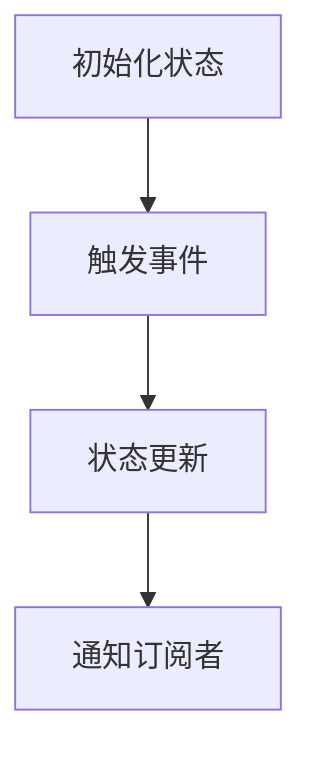

# 状态管理 原理与代码实例讲解

## 1.背景介绍

在现代软件开发中，状态管理是一个至关重要的概念。无论是前端开发、后端开发，还是分布式系统，状态管理都扮演着关键角色。随着应用程序复杂度的增加，如何有效地管理状态成为开发者面临的主要挑战之一。本文将深入探讨状态管理的核心概念、算法原理、数学模型，并通过实际代码实例和应用场景来帮助读者更好地理解和应用状态管理。

## 2.核心概念与联系

### 2.1 状态的定义

状态是指系统在某一时刻的所有信息的集合。它可以是变量的值、对象的属性、数据库的记录等。状态的变化通常由事件驱动，这些事件可以是用户操作、系统内部的定时任务、外部服务的响应等。

### 2.2 状态管理的必要性

在复杂应用中，状态管理的必要性体现在以下几个方面：

- **一致性**：确保系统在不同组件之间保持一致的状态。
- **可维护性**：简化代码的维护和扩展。
- **可测试性**：使得状态变化可以被预测和测试。
- **性能优化**：通过有效的状态管理，减少不必要的计算和渲染。

### 2.3 状态管理的分类

状态管理可以分为以下几类：

- **本地状态管理**：状态仅在单个组件或模块内管理。
- **全局状态管理**：状态在整个应用程序范围内共享。
- **持久化状态管理**：状态在应用程序重启后仍然保留。

## 3.核心算法原理具体操作步骤

### 3.1 状态管理的基本流程

状态管理的基本流程可以用以下步骤来描述：

1. **初始化状态**：定义初始状态。
2. **触发事件**：用户操作或系统事件触发状态变化。
3. **状态更新**：根据事件更新状态。
4. **通知订阅者**：通知所有订阅状态变化的组件或模块。

以下是一个简单的状态管理流程图：



### 3.2 状态更新算法

状态更新算法是状态管理的核心。常见的状态更新算法包括：

- **直接赋值**：适用于简单的本地状态管理。
- **不可变数据结构**：通过创建新状态来避免直接修改原状态。
- **状态机**：通过定义状态和事件的关系来管理复杂状态变化。

## 4.数学模型和公式详细讲解举例说明

### 4.1 状态转移矩阵

状态管理可以用数学模型来描述，其中状态转移矩阵是一个常用的工具。状态转移矩阵定义了系统在不同状态之间的转移关系。

假设系统有 $n$ 个状态，状态转移矩阵 $P$ 是一个 $n \times n$ 的矩阵，其中 $P_{ij}$ 表示从状态 $i$ 转移到状态 $j$ 的概率。

$$
P = \begin{pmatrix}
P_{11} & P_{12} & \cdots & P_{1n} \\
P_{21} & P_{22} & \cdots & P_{2n} \\
\vdots & \vdots & \ddots & \vdots \\
P_{n1} & P_{n2} & \cdots & P_{nn}
\end{pmatrix}
$$

### 4.2 马尔可夫链

马尔可夫链是一种特殊的状态转移模型，其中每个状态的转移只依赖于当前状态，而与之前的状态无关。马尔可夫链可以用来建模许多实际问题，如用户行为预测、系统故障分析等。

假设系统在时间 $t$ 的状态为 $S_t$，马尔可夫链的状态转移概率可以表示为：

$$
P(S_{t+1} = j | S_t = i) = P_{ij}
$$

## 5.项目实践：代码实例和详细解释说明

### 5.1 简单的本地状态管理

以下是一个使用 JavaScript 实现的简单本地状态管理示例：

```javascript
class StateManager {
    constructor(initialState) {
        this.state = initialState;
        this.listeners = [];
    }

    getState() {
        return this.state;
    }

    setState(newState) {
        this.state = newState;
        this.notify();
    }

    subscribe(listener) {
        this.listeners.push(listener);
    }

    notify() {
        this.listeners.forEach(listener => listener(this.state));
    }
}

// 使用示例
const stateManager = new StateManager({ count: 0 });

stateManager.subscribe((state) => {
    console.log('State updated:', state);
});

stateManager.setState({ count: 1 });
```

### 5.2 Redux 状态管理

Redux 是一个流行的 JavaScript 状态管理库，以下是一个使用 Redux 的示例：

```javascript
const { createStore } = require('redux');

// 定义初始状态
const initialState = {
    count: 0
};

// 定义 reducer
function counterReducer(state = initialState, action) {
    switch (action.type) {
        case 'INCREMENT':
            return { count: state.count + 1 };
        case 'DECREMENT':
            return { count: state.count - 1 };
        default:
            return state;
    }
}

// 创建 store
const store = createStore(counterReducer);

// 订阅状态变化
store.subscribe(() => {
    console.log('State updated:', store.getState());
});

// 触发事件
store.dispatch({ type: 'INCREMENT' });
store.dispatch({ type: 'DECREMENT' });
```

## 6.实际应用场景

### 6.1 前端应用

在前端开发中，状态管理用于管理组件之间的状态共享和通信。常见的状态管理库包括 Redux、MobX、Vuex 等。

### 6.2 后端应用

在后端开发中，状态管理用于管理用户会话、缓存、任务调度等。常见的状态管理工具包括 Redis、Memcached 等。

### 6.3 分布式系统

在分布式系统中，状态管理用于管理多个节点之间的状态一致性。常见的状态管理协议包括 Paxos、Raft 等。

## 7.工具和资源推荐

### 7.1 状态管理库

- **Redux**：一个流行的 JavaScript 状态管理库，适用于大型应用。
- **MobX**：一个简单易用的状态管理库，适用于中小型应用。
- **Vuex**：Vue.js 的官方状态管理库，适用于 Vue.js 应用。

### 7.2 状态管理工具

- **Redux DevTools**：一个强大的 Redux 调试工具，帮助开发者调试和分析状态变化。
- **Reactotron**：一个用于调试 React 和 React Native 应用的工具，支持 Redux 和 MobX。

## 8.总结：未来发展趋势与挑战

### 8.1 未来发展趋势

随着应用程序复杂度的增加，状态管理将继续发展。未来的趋势包括：

- **自动化状态管理**：通过机器学习和人工智能技术，实现状态管理的自动化。
- **分布式状态管理**：随着分布式系统的普及，分布式状态管理将成为一个重要的研究方向。
- **实时状态管理**：随着实时应用的增加，实时状态管理将变得越来越重要。

### 8.2 挑战

状态管理面临的主要挑战包括：

- **复杂性**：随着应用程序的复杂度增加，状态管理变得越来越复杂。
- **性能**：如何在保证性能的前提下，进行有效的状态管理。
- **一致性**：在分布式系统中，如何保证状态的一致性。

## 9.附录：常见问题与解答

### 9.1 什么是状态管理？

状态管理是指在软件开发中，管理系统状态的过程。它包括状态的定义、更新、存储和共享。

### 9.2 为什么需要状态管理？

状态管理可以提高系统的一致性、可维护性、可测试性和性能。

### 9.3 常见的状态管理库有哪些？

常见的状态管理库包括 Redux、MobX、Vuex 等。

### 9.4 如何选择合适的状态管理库？

选择状态管理库时，需要考虑应用的复杂度、团队的技术栈和开发经验等因素。

### 9.5 状态管理的未来发展趋势是什么？

未来的趋势包括自动化状态管理、分布式状态管理和实时状态管理。

---

作者：禅与计算机程序设计艺术 / Zen and the Art of Computer Programming