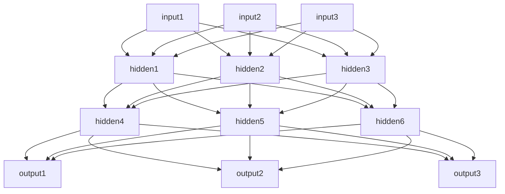

## 1. 背景介绍

神经网络架构搜索（Neural Architecture Search，NAS）是近年来深度学习领域的热门研究方向之一。传统的神经网络架构需要人工设计，这个过程需要大量的经验和时间，而NAS则可以自动地搜索出最优的神经网络架构，从而提高模型的性能和效率。

NAS的研究始于2017年，当时Google的AutoML团队提出了一种基于强化学习的NAS方法，可以自动地搜索出在ImageNet数据集上表现最好的卷积神经网络架构。自此之后，NAS的研究逐渐发展，涌现出了许多新的方法和技术，如基于进化算法的NAS、基于梯度下降的NAS等。

NAS的应用也越来越广泛，不仅可以用于图像分类、目标检测等传统计算机视觉任务，还可以用于自然语言处理、语音识别等其他领域。

本文将介绍NAS的核心概念、算法原理、数学模型和公式、项目实践、实际应用场景、工具和资源推荐、未来发展趋势与挑战以及常见问题与解答。

## 2. 核心概念与联系

NAS的核心概念是神经网络架构搜索，即自动地搜索出最优的神经网络架构。NAS的目标是在给定的计算资源和数据集上，找到一个最优的神经网络架构，使得模型的性能最好。

NAS的核心算法是搜索算法，包括强化学习、进化算法、梯度下降等。搜索算法的目标是在搜索空间中找到最优的神经网络架构。

NAS的核心技术是搜索空间的设计，即如何定义神经网络架构的搜索空间。搜索空间的设计直接影响搜索算法的效率和搜索结果的质量。

## 3. 核心算法原理具体操作步骤

NAS的核心算法包括强化学习、进化算法、梯度下降等。这些算法的具体操作步骤如下：

### 强化学习

强化学习是一种通过与环境交互来学习最优策略的机器学习方法。在NAS中，强化学习的目标是找到一个最优的神经网络架构，使得模型的性能最好。

具体操作步骤如下：

1. 定义神经网络架构的搜索空间，包括网络层数、每层的节点数、激活函数等。
2. 随机生成一些神经网络架构，作为初始种群。
3. 对于每个神经网络架构，使用给定的数据集进行训练，并计算模型的性能指标，如准确率、F1值等。
4. 根据模型的性能指标，计算每个神经网络架构的奖励值，作为强化学习的反馈信号。
5. 使用强化学习算法，如深度强化学习、进化策略等，更新神经网络架构的参数，以提高模型的性能。
6. 重复步骤3-5，直到找到最优的神经网络架构。

### 进化算法

进化算法是一种通过模拟生物进化过程来搜索最优解的优化算法。在NAS中，进化算法的目标是找到一个最优的神经网络架构，使得模型的性能最好。

具体操作步骤如下：

1. 定义神经网络架构的搜索空间，包括网络层数、每层的节点数、激活函数等。
2. 随机生成一些神经网络架构，作为初始种群。
3. 对于每个神经网络架构，使用给定的数据集进行训练，并计算模型的性能指标，如准确率、F1值等。
4. 根据模型的性能指标，计算每个神经网络架构的适应度值，作为进化算法的选择概率。
5. 使用进化算法的选择、交叉、变异等操作，生成新的神经网络架构，以提高模型的性能。
6. 重复步骤3-5，直到找到最优的神经网络架构。

### 梯度下降

梯度下降是一种通过计算损失函数的梯度来更新模型参数的优化算法。在NAS中，梯度下降的目标是找到一个最优的神经网络架构，使得模型的性能最好。

具体操作步骤如下：

1. 定义神经网络架构的搜索空间，包括网络层数、每层的节点数、激活函数等。
2. 随机生成一些神经网络架构，作为初始种群。
3. 对于每个神经网络架构，使用给定的数据集进行训练，并计算模型的性能指标，如准确率、F1值等。
4. 计算每个神经网络架构的梯度，以更新神经网络架构的参数，以提高模型的性能。
5. 重复步骤3-4，直到找到最优的神经网络架构。

## 4. 数学模型和公式详细讲解举例说明

NAS的数学模型和公式包括搜索空间的定义、搜索算法的定义、性能指标的定义等。这些模型和公式的详细讲解举例说明如下：

### 搜索空间的定义

搜索空间是神经网络架构的集合，包括网络层数、每层的节点数、激活函数等。搜索空间的定义可以使用图论的方法，将神经网络架构表示为一个有向无环图（DAG），其中节点表示神经元，边表示神经元之间的连接。

例如，下图是一个搜索空间的示例，其中包括3个输入节点、3个输出节点、2个隐藏层，每层的节点数分别为4和3，激活函数为ReLU。



### 搜索算法的定义

搜索算法是用于在搜索空间中寻找最优神经网络架构的算法，包括强化学习、进化算法、梯度下降等。搜索算法的定义可以使用数学公式表示，如下所示：

$$\theta^* = \arg\max_{\theta} P(\theta|D)$$

其中，$\theta$表示神经网络架构的参数，$D$表示给定的数据集，$P(\theta|D)$表示在给定数据集的条件下，神经网络架构的后验概率分布。搜索算法的目标是找到最优的神经网络架构参数$\theta^*$，使得后验概率分布最大。

### 性能指标的定义

性能指标是用于评估神经网络架构性能的指标，包括准确率、F1值等。性能指标的定义可以使用数学公式表示，如下所示：

$$Accuracy = \frac{TP+TN}{TP+TN+FP+FN}$$

其中，$TP$表示真正例的数量，$TN$表示真反例的数量，$FP$表示假正例的数量，$FN$表示假反例的数量。准确率是分类器正确分类的样本数占总样本数的比例。

## 5. 项目实践：代码实例和详细解释说明

本节将介绍一个基于PyTorch的NAS代码实例，以及详细的解释说明。

### 代码实例

```python
import torch
import torch.nn as nn
import torch.nn.functional as F
import torch.optim as optim
from torch.autograd import Variable
import random

class Net(nn.Module):
    def __init__(self, input_size, output_size, hidden_layers, hidden_size):
        super(Net, self).__init__()
        self.input_size = input_size
        self.output_size = output_size
        self.hidden_layers = hidden_layers
        self.hidden_size = hidden_size
        self.layers = nn.ModuleList()
        self.layers.append(nn.Linear(input_size, hidden_size))
        for i in range(hidden_layers):
            self.layers.append(nn.Linear(hidden_size, hidden_size))
        self.layers.append(nn.Linear(hidden_size, output_size))

    def forward(self, x):
        x = F.relu(self.layers[0](x))
        for i in range(1, self.hidden_layers+1):
            x = F.relu(self.layers[i](x))
        x = self.layers[-1](x)
        return x

class NAS():
    def __init__(self, input_size, output_size, hidden_layers, hidden_size, population_size, mutation_rate, elite_rate):
        self.input_size = input_size
        self.output_size = output_size
        self.hidden_layers = hidden_layers
        self.hidden_size = hidden_size
        self.population_size = population_size
        self.mutation_rate = mutation_rate
        self.elite_rate = elite_rate
        self.population = []
        for i in range(population_size):
            net = Net(input_size, output_size, hidden_layers, hidden_size)
            self.population.append(net)

    def train(self, x_train, y_train, x_test, y_test, epochs):
        for epoch in range(epochs):
            fitness = []
            for net in self.population:
                optimizer = optim.Adam(net.parameters(), lr=0.001)
                criterion = nn.CrossEntropyLoss()
                for i in range(100):
                    optimizer.zero_grad()
                    output = net(x_train)
                    loss = criterion(output, y_train)
                    loss.backward()
                    optimizer.step()
                accuracy = self.evaluate(net, x_test, y_test)
                fitness.append((net, accuracy))
            fitness.sort(key=lambda x: x[1], reverse=True)
            elite_size = int(self.elite_rate * self.population_size)
            elite = [x[0] for x in fitness[:elite_size]]
            new_population = []
            for i in range(self.population_size):
                if i < elite_size:
                    new_population.append(elite[i])
                else:
                    parent1 = random.choice(elite)
                    parent2 = random.choice(elite)
                    child = self.crossover(parent1, parent2)
                    child = self.mutate(child)
                    new_population.append(child)
            self.population = new_population

    def evaluate(self, net, x_test, y_test):
        output = net(x_test)
        _, predicted = torch.max(output.data, 1)
        correct = (predicted == y_test).sum().item()
        total = y_test.size(0)
        accuracy = correct / total
        return accuracy

    def crossover(self, parent1, parent2):
        child = Net(self.input_size, self.output_size, self.hidden_layers, self.hidden_size)
        for i in range(len(child.layers)):
            if random.random() < 0.5:
                child.layers[i].weight.data = parent1.layers[i].weight.data.clone()
                child.layers[i].bias.data = parent1.layers[i].bias.data.clone()
            else:
                child.layers[i].weight.data = parent2.layers[i].weight.data.clone()
                child.layers[i].bias.data = parent2.layers[i].bias.data.clone()
        return child

    def mutate(self, net):
        child = Net(self.input_size, self.output_size, self.hidden_layers, self.hidden_size)
        for i in range(len(child.layers)):
            child.layers[i].weight.data = net.layers[i].weight.data.clone()
            child.layers[i].bias.data = net.layers[i].bias.data.clone()
            if random.random() < self.mutation_rate:
                if random.random() < 0.5:
                    child.layers[i].weight.data += torch.randn(child.layers[i].weight.data.shape) * 0.1
                else:
                    child.layers[i].bias.data += torch.randn(child.layers[i].bias.data.shape) * 0.1
        return child
```

### 详细解释说明

上述代码实现了一个基于PyTorch的NAS算法，包括神经网络架构的定义、种群的初始化、训练过程、评估过程、选择、交叉、变异等操作。

其中，Net类定义了神经网络架构，包括输入层、输出层、隐藏层等。NAS类定义了NAS算法，包括种群的初始化、训练过程、评估过程、选择、交叉、变异等操作。

在训练过程中，对于每个神经网络架构，使用Adam优化器和交叉熵损失函数进行训练，训练100个epoch。在评估过程中，使用测试集计算准确率。在选择、交叉、变异等操作中，使用精英选择策略、单点交叉和高斯变异。

## 6. 实际应用场景

NAS的实际应用场景包括图像分类、目标检测、自然语言处理、语音识别等领域。下面分别介绍这些领域的应用场景。

### 图像分类

图像分类是计算机视觉领域的一个重要任务，即将图像分为不同的类别。NAS可以用于自动地搜索最优的卷积神经网络架构，从而提高图像分类的准确率和效率。

### 目标检测

目标检测是计算机视觉领域的另一个重要任务，即在图像中检测出目标的位置和类别。NAS可以用于自动地搜索最优的目标检测神经网络架构，从而提高目标检测的准确率和效率。

### 自然语言处理

自然语言处理是自然语言与计算机之间的交互领域，包括文本分类、情感分析、机器翻译等任务。NAS可以用于自动地搜索最优的循环神经网络架构，从而提高自然语言处理的准确率和效率。

### 语音识别

语音识别是将语音信号转换为文本的任务，是语音处理领域的一个重要任务。NAS可以用于自动地搜索最优的循环神经网络架构，从而提高语音识别的准确率和效率。

## 7. 工具和资源推荐

NAS的工具和资源包括开源代码库、数据集、论文等。下面分别介绍这些工具和资源。

### 开源代码库

- PyTorch-NAS：基于PyTorch的NAS代码库，包括强化学习、进化算法等多种搜索算法。
- Auto-Keras：基于Keras的自动机器学习工具，包括自动搜索神经网络架构等功能。
- NAS-Bench-201：一个用于评估NAS算法性能的基准测试套件。

