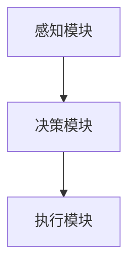

# AI Agent: AI的下一个风口 从软件到硬件的进化

## 1.背景介绍

人工智能（AI）已经成为现代科技的核心驱动力之一。从早期的规则系统到如今的深度学习，AI技术在过去几十年中取得了巨大的进步。然而，随着AI应用的不断扩展，传统的软件解决方案已经无法满足日益增长的需求。AI Agent的出现，标志着AI从软件到硬件的进化，开启了一个全新的时代。

AI Agent不仅仅是一个软件程序，它是一个能够自主学习、决策和执行任务的智能体。它们可以嵌入到各种硬件设备中，从而实现更高效、更智能的操作。这种从软件到硬件的进化，不仅提升了AI的性能，还扩展了其应用范围。

## 2.核心概念与联系

### 2.1 AI Agent的定义

AI Agent是指能够自主感知环境、做出决策并执行任务的智能体。它们通常由感知模块、决策模块和执行模块组成。

### 2.2 从软件到硬件的进化

传统的AI系统主要依赖于软件算法来处理数据和做出决策。然而，随着硬件技术的发展，越来越多的AI功能被集成到硬件中。这种集成不仅提高了系统的性能，还降低了能耗和延迟。

### 2.3 AI Agent的架构

AI Agent的架构通常包括以下几个部分：

- 感知模块：负责收集环境数据，如传感器数据、图像、声音等。
- 决策模块：使用AI算法对感知数据进行分析，并做出决策。
- 执行模块：根据决策结果执行相应的操作。



## 3.核心算法原理具体操作步骤

### 3.1 感知模块

感知模块是AI Agent的“眼睛”和“耳朵”，负责收集环境数据。常见的感知技术包括图像识别、语音识别和传感器数据处理。

### 3.2 决策模块

决策模块是AI Agent的“大脑”，负责对感知数据进行分析并做出决策。常用的算法包括深度学习、强化学习和决策树等。

### 3.3 执行模块

执行模块是AI Agent的“手脚”，负责根据决策结果执行相应的操作。执行模块通常包括机械臂、移动设备和其他执行器。

### 3.4 操作步骤

1. 数据收集：通过感知模块收集环境数据。
2. 数据预处理：对收集到的数据进行清洗和预处理。
3. 模型训练：使用预处理后的数据训练AI模型。
4. 决策执行：将训练好的模型部署到决策模块，根据实时数据做出决策并执行。

## 4.数学模型和公式详细讲解举例说明

### 4.1 感知模块的数学模型

感知模块通常使用卷积神经网络（CNN）进行图像识别。其数学模型可以表示为：

$$
y = f(W \cdot x + b)
$$

其中，$x$ 是输入图像，$W$ 是权重矩阵，$b$ 是偏置，$f$ 是激活函数。

### 4.2 决策模块的数学模型

决策模块可以使用强化学习算法，如Q-learning。其数学模型可以表示为：

$$
Q(s, a) = Q(s, a) + \alpha [r + \gamma \max_{a'} Q(s', a') - Q(s, a)]
$$

其中，$Q(s, a)$ 是状态 $s$ 下采取动作 $a$ 的价值，$\alpha$ 是学习率，$r$ 是奖励，$\gamma$ 是折扣因子。

### 4.3 执行模块的数学模型

执行模块通常使用PID控制器来实现精确控制。其数学模型可以表示为：

$$
u(t) = K_p e(t) + K_i \int e(t) dt + K_d \frac{de(t)}{dt}
$$

其中，$u(t)$ 是控制输出，$e(t)$ 是误差，$K_p$、$K_i$ 和 $K_d$ 分别是比例、积分和微分系数。

## 5.项目实践：代码实例和详细解释说明

### 5.1 感知模块代码实例

以下是一个使用TensorFlow实现图像识别的示例代码：

```python
import tensorflow as tf
from tensorflow.keras import layers, models

# 构建模型
model = models.Sequential()
model.add(layers.Conv2D(32, (3, 3), activation='relu', input_shape=(64, 64, 3)))
model.add(layers.MaxPooling2D((2, 2)))
model.add(layers.Conv2D(64, (3, 3), activation='relu'))
model.add(layers.MaxPooling2D((2, 2)))
model.add(layers.Conv2D(64, (3, 3), activation='relu'))

# 添加全连接层
model.add(layers.Flatten())
model.add(layers.Dense(64, activation='relu'))
model.add(layers.Dense(10, activation='softmax'))

# 编译模型
model.compile(optimizer='adam', loss='sparse_categorical_crossentropy', metrics=['accuracy'])

# 训练模型
model.fit(train_images, train_labels, epochs=10, validation_data=(test_images, test_labels))
```

### 5.2 决策模块代码实例

以下是一个使用Q-learning实现强化学习的示例代码：

```python
import numpy as np

# 初始化Q表
Q = np.zeros((state_size, action_size))

# Q-learning算法
for episode in range(total_episodes):
    state = env.reset()
    for step in range(max_steps):
        action = np.argmax(Q[state, :] + np.random.randn(1, action_size) * (1. / (episode + 1)))
        new_state, reward, done, _ = env.step(action)
        Q[state, action] = Q[state, action] + alpha * (reward + gamma * np.max(Q[new_state, :]) - Q[state, action])
        state = new_state
        if done:
            break
```

### 5.3 执行模块代码实例

以下是一个使用PID控制器实现精确控制的示例代码：

```python
class PID:
    def __init__(self, Kp, Ki, Kd):
        self.Kp = Kp
        self.Ki = Ki
        self.Kd = Kd
        self.prev_error = 0
        self.integral = 0

    def compute(self, setpoint, pv):
        error = setpoint - pv
        self.integral += error
        derivative = error - self.prev_error
        output = self.Kp * error + self.Ki * self.integral + self.Kd * derivative
        self.prev_error = error
        return output

# 使用PID控制器
pid = PID(1.0, 0.1, 0.01)
control = pid.compute(setpoint, pv)
```

## 6.实际应用场景

### 6.1 智能家居

AI Agent可以嵌入到智能家居设备中，实现自动化控制。例如，智能恒温器可以根据环境温度和用户习惯自动调节温度。

### 6.2 自动驾驶

在自动驾驶领域，AI Agent可以实时感知周围环境，做出驾驶决策并控制车辆行驶。

### 6.3 工业自动化

在工业自动化中，AI Agent可以用于监控和控制生产线，提高生产效率和产品质量。

### 6.4 医疗健康

AI Agent可以用于医疗健康领域，如智能诊断系统和健康监测设备，提供个性化的医疗服务。

## 7.工具和资源推荐

### 7.1 开发工具

- TensorFlow：一个开源的机器学习框架，适用于构建和训练AI模型。
- PyTorch：另一个流行的开源机器学习框架，具有灵活性和易用性。
- OpenAI Gym：一个用于开发和比较强化学习算法的工具包。

### 7.2 硬件资源

- NVIDIA Jetson：一个适用于AI应用的嵌入式平台，具有强大的计算能力。
- Raspberry Pi：一个低成本的单板计算机，适用于开发和测试AI Agent。

### 7.3 在线资源

- Coursera和edX：提供大量的AI和机器学习课程，适合初学者和高级用户。
- GitHub：一个开源代码托管平台，包含大量的AI项目和资源。

## 8.总结：未来发展趋势与挑战

### 8.1 未来发展趋势

随着硬件技术的不断进步，AI Agent将会变得更加智能和高效。未来，AI Agent将会在更多的领域得到应用，如智能城市、无人机和机器人等。

### 8.2 挑战

尽管AI Agent具有巨大的潜力，但也面临一些挑战。例如，如何保证AI Agent的安全性和可靠性，如何处理隐私问题，以及如何应对复杂的环境和任务。

## 9.附录：常见问题与解答

### 9.1 什么是AI Agent？

AI Agent是指能够自主感知环境、做出决策并执行任务的智能体。

### 9.2 AI Agent与传统AI系统有什么区别？

传统AI系统主要依赖于软件算法，而AI Agent将AI功能集成到硬件中，实现更高效和智能的操作。

### 9.3 如何开始开发AI Agent？

可以从学习机器学习和深度学习基础知识开始，然后使用TensorFlow或PyTorch等工具进行开发。

### 9.4 AI Agent的应用场景有哪些？

AI Agent可以应用于智能家居、自动驾驶、工业自动化和医疗健康等领域。

### 9.5 AI Agent的未来发展趋势是什么？

随着硬件技术的进步，AI Agent将会变得更加智能和高效，并在更多领域得到应用。

---

作者：禅与计算机程序设计艺术 / Zen and the Art of Computer Programming