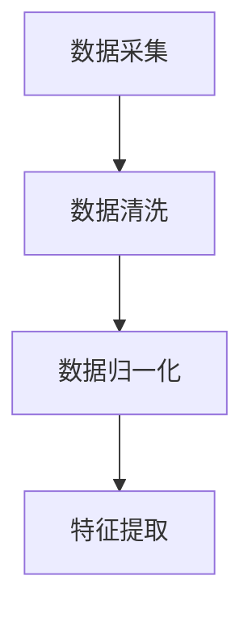
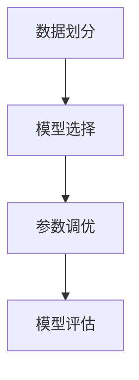
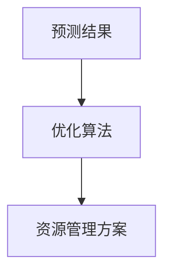
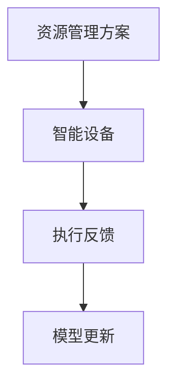

# AI人工智能代理工作流 AI Agent WorkFlow：在自然资源管理中的应用

## 1.背景介绍

在全球范围内，自然资源管理一直是一个复杂且具有挑战性的领域。随着人口增长和经济发展，对自然资源的需求不断增加，导致资源的过度开发和环境的恶化。传统的管理方法往往依赖于人工经验和简单的统计模型，难以应对复杂多变的自然环境和资源利用情况。近年来，人工智能（AI）技术的迅猛发展为自然资源管理带来了新的希望。通过引入AI代理工作流，可以实现对自然资源的智能化、精细化管理，提高资源利用效率，减少环境负担。

## 2.核心概念与联系

### 2.1 人工智能代理

人工智能代理（AI Agent）是指能够自主感知环境、做出决策并执行行动的智能系统。它们通常由感知模块、决策模块和执行模块组成。感知模块负责收集环境信息，决策模块根据预设的算法和规则进行分析和决策，执行模块则将决策转化为具体的行动。

### 2.2 工作流

工作流（Workflow）是指一系列有序的任务或活动，用于完成特定的业务目标。在自然资源管理中，工作流可以包括数据采集、数据处理、模型训练、预测分析和决策执行等多个环节。

### 2.3 自然资源管理

自然资源管理涉及对土地、水、森林、矿产等资源的规划、开发、利用和保护。其目标是实现资源的可持续利用，满足当前和未来的需求。

### 2.4 核心联系

AI代理工作流在自然资源管理中的应用，主要通过以下几个方面实现：

1. 数据采集与处理：利用传感器、遥感技术和物联网设备，实时采集自然资源的相关数据。
2. 模型训练与预测：基于采集的数据，利用机器学习和深度学习算法，训练预测模型，进行资源利用和环境变化的预测。
3. 决策支持：根据预测结果，AI代理可以提供优化的资源管理方案，辅助决策者进行科学决策。
4. 自动化执行：通过智能设备和自动化系统，执行决策方案，实现资源的智能化管理。

## 3.核心算法原理具体操作步骤

### 3.1 数据采集与预处理

数据采集是AI代理工作流的基础。通过传感器、遥感技术和物联网设备，实时采集自然资源的相关数据。这些数据包括气象数据、水文数据、土地利用数据等。数据预处理包括数据清洗、数据归一化和特征提取等步骤。



### 3.2 模型训练与预测

基于预处理后的数据，利用机器学习和深度学习算法，训练预测模型。常用的算法包括线性回归、决策树、随机森林、支持向量机和神经网络等。模型训练的过程包括数据划分、模型选择、参数调优和模型评估等步骤。



### 3.3 决策支持与优化

根据预测结果，AI代理可以提供优化的资源管理方案。常用的优化算法包括线性规划、整数规划和遗传算法等。优化的目标是最大化资源利用效率，最小化环境影响。



### 3.4 自动化执行与反馈

通过智能设备和自动化系统，执行决策方案，实现资源的智能化管理。执行过程中的反馈信息可以用于模型的更新和优化，形成闭环管理。



## 4.数学模型和公式详细讲解举例说明

### 4.1 数据采集与预处理

假设我们需要预测某地区的水资源利用情况，首先需要采集相关数据。设 $X$ 表示采集到的原始数据矩阵，其中每一行表示一个样本，每一列表示一个特征。数据清洗的目的是去除缺失值和异常值，数据归一化的目的是将数据缩放到相同的范围内，特征提取的目的是从原始数据中提取有用的信息。

$$
X_{clean} = \text{clean}(X)
$$

$$
X_{norm} = \text{normalize}(X_{clean})
$$

$$
X_{feat} = \text{extract\_features}(X_{norm})
$$

### 4.2 模型训练与预测

假设我们使用线性回归模型进行预测，模型的形式为：

$$
y = X_{feat} \beta + \epsilon
$$

其中，$y$ 表示预测值，$\beta$ 表示模型参数，$\epsilon$ 表示误差项。模型训练的目标是最小化误差项的平方和：

$$
\min_{\beta} \sum_{i=1}^{n} (y_i - X_{feat,i} \beta)^2
$$

### 4.3 决策支持与优化

假设我们需要优化水资源的分配方案，目标是最大化资源利用效率，最小化环境影响。设 $x$ 表示资源分配方案，$c$ 表示资源利用效率，$d$ 表示环境影响。优化问题可以表示为：

$$
\max_{x} c^T x - d^T x
$$

### 4.4 自动化执行与反馈

执行过程中的反馈信息可以用于模型的更新和优化。设 $f$ 表示反馈信息，$M$ 表示模型，模型更新的过程可以表示为：

$$
M_{new} = \text{update}(M, f)
$$

## 5.项目实践：代码实例和详细解释说明

### 5.1 数据采集与预处理

以下是一个简单的Python代码示例，展示如何进行数据采集与预处理：

```python
import pandas as pd
from sklearn.preprocessing import StandardScaler

# 数据采集
data = pd.read_csv('water_resource_data.csv')

# 数据清洗
data_clean = data.dropna()

# 数据归一化
scaler = StandardScaler()
data_norm = scaler.fit_transform(data_clean)

# 特征提取
features = data_norm[:, :5]  # 假设前5列是有用的特征
```

### 5.2 模型训练与预测

以下是一个简单的Python代码示例，展示如何进行模型训练与预测：

```python
from sklearn.model_selection import train_test_split
from sklearn.linear_model import LinearRegression
from sklearn.metrics import mean_squared_error

# 数据划分
X_train, X_test, y_train, y_test = train_test_split(features, data_clean['target'], test_size=0.2, random_state=42)

# 模型选择
model = LinearRegression()

# 模型训练
model.fit(X_train, y_train)

# 模型评估
y_pred = model.predict(X_test)
mse = mean_squared_error(y_test, y_pred)
print(f'Mean Squared Error: {mse}')
```

### 5.3 决策支持与优化

以下是一个简单的Python代码示例，展示如何进行决策支持与优化：

```python
from scipy.optimize import linprog

# 优化目标
c = [1, 2, 3]  # 资源利用效率
d = [0.5, 0.3, 0.2]  # 环境影响

# 约束条件
A = [[1, 1, 1], [2, 1, 0], [0, 1, 2]]
b = [100, 150, 200]

# 求解优化问题
result = linprog(c - d, A_ub=A, b_ub=b, method='highs')
print(f'Optimal Resource Allocation: {result.x}')
```

### 5.4 自动化执行与反馈

以下是一个简单的Python代码示例，展示如何进行自动化执行与反馈：

```python
# 假设有一个智能设备API
class SmartDevice:
    def execute(self, allocation):
        # 执行资源分配方案
        pass

    def get_feedback(self):
        # 获取执行反馈
        return feedback

# 执行资源分配方案
device = SmartDevice()
device.execute(result.x)

# 获取执行反馈
feedback = device.get_feedback()

# 更新模型
model.update(feedback)
```

## 6.实际应用场景

### 6.1 水资源管理

在水资源管理中，AI代理工作流可以用于预测水资源的供需情况，优化水资源的分配方案。例如，通过实时监测水库的水位、降雨量和用水量，AI代理可以预测未来的水资源供需情况，并提供优化的调度方案，确保水资源的合理利用。

### 6.2 森林资源管理

在森林资源管理中，AI代理工作流可以用于监测森林的健康状况，预测森林火灾的风险，优化森林的采伐和保护方案。例如，通过遥感技术和无人机监测森林的生长情况，AI代理可以预测森林的健康状况，并提供优化的采伐和保护方案，确保森林资源的可持续利用。

### 6.3 矿产资源管理

在矿产资源管理中，AI代理工作流可以用于预测矿产资源的储量，优化矿产的开采方案。例如，通过地质勘探数据和历史开采数据，AI代理可以预测矿产资源的储量，并提供优化的开采方案，确保矿产资源的高效利用。

### 6.4 土地资源管理

在土地资源管理中，AI代理工作流可以用于预测土地利用的变化，优化土地的规划和利用方案。例如，通过遥感数据和土地利用数据，AI代理可以预测土地利用的变化趋势，并提供优化的土地规划和利用方案，确保土地资源的合理利用。

## 7.工具和资源推荐

### 7.1 数据采集工具

- **传感器**：用于实时监测环境参数，如温度、湿度、水位等。
- **遥感技术**：用于获取大范围的环境数据，如卫星影像、无人机影像等。
- **物联网设备**：用于连接和管理各种传感器和设备，实现数据的实时采集和传输。

### 7.2 数据处理工具

- **Pandas**：用于数据清洗和处理的Python库。
- **NumPy**：用于数值计算的Python库。
- **Scikit-learn**：用于数据预处理和特征提取的Python库。

### 7.3 模型训练工具

- **TensorFlow**：用于深度学习模型训练的开源框架。
- **PyTorch**：用于深度学习模型训练的开源框架。
- **Scikit-learn**：用于机器学习模型训练的Python库。

### 7.4 优化工具

- **SciPy**：用于数值优化的Python库。
- **CVXPY**：用于凸优化问题求解的Python库。
- **Gurobi**：用于线性规划和整数规划问题求解的商业优化软件。

### 7.5 自动化执行工具

- **智能设备**：用于执行资源管理方案的智能设备，如智能灌溉系统、智能采伐设备等。
- **物联网平台**：用于管理和控制智能设备的物联网平台，如AWS IoT、Google Cloud IoT等。

## 8.总结：未来发展趋势与挑战

### 8.1 未来发展趋势

随着人工智能技术的不断进步，AI代理工作流在自然资源管理中的应用前景广阔。未来的发展趋势包括：

1. **数据融合与共享**：通过多源数据的融合与共享，实现对自然资源的全面监测和精细管理。
2. **智能决策与优化**：通过更先进的算法和模型，实现对资源管理方案的智能决策和优化。
3. **自动化与智能化**：通过智能设备和自动化系统，实现对资源管理方案的自动化执行和智能化管理。
4. **可持续发展**：通过AI技术的应用，促进自然资源的可持续利用，减少环境负担。

### 8.2 挑战

尽管AI代理工作流在自然资源管理中具有广阔的应用前景，但仍面临一些挑战：

1. **数据质量与可靠性**：数据的质量和可靠性直接影响模型的准确性和决策的有效性。
2. **算法复杂性与计算成本**：复杂的算法和模型需要高计算成本，可能难以在资源受限的环境中应用。
3. **系统集成与互操作性**：不同系统和设备之间的集成与互操作性是实现智能化管理的关键。
4. **伦理与社会问题**：AI技术的应用可能带来一些伦理和社会问题，如隐私保护、数据安全等。

## 9.附录：常见问题与解答

### 9.1 数据采集过程中如何处理缺失值和异常值？

缺失值和异常值是数据采集过程中常见的问题。可以通过以下方法处理：

- **缺失值**：可以使用均值、中位数或插值法填补缺失值，或者直接删除包含缺失值的样本。
- **异常值**：可以使用统计方法（如3σ原则）或机器学习方法（如孤立森林）检测和处理异常值。

### 9.2 如何选择合适的模型和算法？

模型和算法的选择取决于具体的应用场景和数据特点。可以通过以下方法选择合适的模型和算法：

- **经验法则**：根据以往的经验和领域知识选择常用的模型和算法。
- **交叉验证**：通过交叉验证评估不同模型和算法的性能，选择最优的模型和算法。
- **自动化工具**：使用自动化机器学习工具（如AutoML）自动选择和调优模型和算法。

### 9.3 如何评估模型的性能？

模型的性能评估是模型训练的重要环节。可以通过以下方法评估模型的性能：

- **训练集和测试集**：将数据划分为训练集和测试集，分别用于模型训练和性能评估。
- **评价指标**：根据具体的应用场景选择合适的评价指标，如均方误差（MSE）、准确率（Accuracy）、召回率（Recall）等。
- **交叉验证**：通过交叉验证评估模型的泛化能力，避免过拟合。

### 9.4 如何实现自动化执行和反馈？

自动化执行和反馈是AI代理工作流的重要环节。可以通过以下方法实现：

- **智能设备**：使用智能设备执行资源管理方案，并通过传感器和物联网设备获取执行反馈。
- **物联网平台**：使用物联网平台管理和控制智能设备，实现数据的实时采集和传输。
- **闭环管理**：将执行反馈用于模型的更新和优化，形成闭环管理。

### 9.5 如何应对AI技术应用中的伦理和社会问题？

AI技术的应用可能带来一些伦理和社会问题。可以通过以下方法应对：

- **隐私保护**：在数据采集和处理过程中，采取措施保护用户隐私，如数据匿名化、加密等。
- **数据安全**：加强数据安全管理，防止数据泄露和滥用。
- **伦理审查**：在AI技术应用前进行伦理审查，评估可能的伦理和社会影响。
- **公众参与**：加强公众参与和沟通，增加透明度和信任度。

---

作者：禅与计算机程序设计艺术 / Zen and the Art of Computer Programming