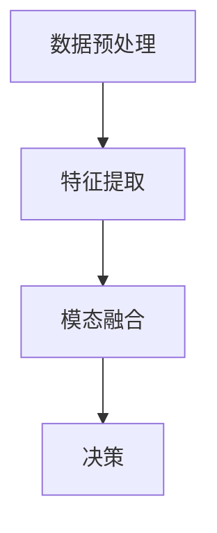

# AI人工智能代理工作流AI Agent WorkFlow：AI代理的多模态感知与处理能力

## 1.背景介绍

在当今的科技时代，人工智能（AI）已经成为推动各行各业变革的核心力量。AI代理（AI Agent）作为AI技术的具体应用，正在逐步改变我们的工作和生活方式。AI代理不仅能够执行复杂的任务，还能通过多模态感知和处理能力，理解和处理来自不同来源的信息，从而实现更高效、更智能的工作流。

多模态感知是指AI代理能够同时处理多种类型的数据，如文本、图像、音频和视频等。这种能力使得AI代理能够在复杂的环境中做出更准确的决策，并提供更优质的服务。本文将深入探讨AI代理的多模态感知与处理能力，介绍其核心概念、算法原理、数学模型、项目实践、实际应用场景、工具和资源推荐，并展望其未来发展趋势与挑战。

## 2.核心概念与联系

### 2.1 AI代理

AI代理是指能够自主执行任务的智能系统。它们可以通过学习和适应环境，完成特定的任务，如数据分析、自然语言处理、图像识别等。AI代理通常由感知模块、决策模块和执行模块组成。

### 2.2 多模态感知

多模态感知是指AI代理能够同时处理和理解来自不同模态的数据，如文本、图像、音频和视频等。这种能力使得AI代理能够在复杂的环境中做出更准确的决策。

### 2.3 多模态处理

多模态处理是指AI代理能够将来自不同模态的数据进行融合和分析，从而提取有用的信息。这种处理方式通常涉及到数据预处理、特征提取、模态融合和决策等步骤。

### 2.4 核心联系

多模态感知和处理能力是AI代理实现智能决策的关键。通过多模态感知，AI代理能够获取更全面的信息；通过多模态处理，AI代理能够将这些信息进行融合和分析，从而做出更准确的决策。

## 3.核心算法原理具体操作步骤

### 3.1 数据预处理

数据预处理是多模态处理的第一步。它包括数据清洗、数据增强和数据标准化等步骤。数据清洗是指去除数据中的噪声和错误；数据增强是指通过数据变换和扩展，增加数据的多样性；数据标准化是指将数据转换为统一的格式和尺度。

### 3.2 特征提取

特征提取是指从原始数据中提取有用的特征。对于不同模态的数据，特征提取的方法也不同。例如，对于图像数据，可以使用卷积神经网络（CNN）进行特征提取；对于文本数据，可以使用词嵌入（Word Embedding）技术进行特征提取。

### 3.3 模态融合

模态融合是指将来自不同模态的特征进行融合，从而提取更全面的信息。常见的模态融合方法包括特征级融合、决策级融合和模型级融合。特征级融合是指将不同模态的特征进行拼接和组合；决策级融合是指将不同模态的决策结果进行融合；模型级融合是指将不同模态的模型进行联合训练。

### 3.4 决策

决策是多模态处理的最后一步。通过模态融合，AI代理能够获取更全面的信息，从而做出更准确的决策。常见的决策方法包括分类、回归和聚类等。

以下是一个简单的Mermaid流程图，展示了多模态处理的核心步骤：



## 4.数学模型和公式详细讲解举例说明

### 4.1 数据预处理

数据预处理的数学模型主要涉及到数据清洗、数据增强和数据标准化等步骤。例如，数据标准化可以通过以下公式实现：

$$
x' = \frac{x - \mu}{\sigma}
$$

其中，$x$ 是原始数据，$\mu$ 是数据的均值，$\sigma$ 是数据的标准差，$x'$ 是标准化后的数据。

### 4.2 特征提取

特征提取的数学模型因数据模态不同而异。例如，对于图像数据，可以使用卷积神经网络（CNN）进行特征提取。CNN的核心操作是卷积运算，其数学公式如下：

$$
y_{i,j} = \sum_{m=0}^{M-1} \sum_{n=0}^{N-1} x_{i+m,j+n} \cdot w_{m,n}
$$

其中，$x$ 是输入图像，$w$ 是卷积核，$y$ 是卷积结果，$M$ 和 $N$ 分别是卷积核的高度和宽度。

### 4.3 模态融合

模态融合的数学模型主要涉及到特征级融合、决策级融合和模型级融合等方法。例如，特征级融合可以通过以下公式实现：

$$
z = [f_1, f_2, \ldots, f_n]
$$

其中，$f_i$ 是第 $i$ 个模态的特征，$z$ 是融合后的特征向量。

### 4.4 决策

决策的数学模型主要涉及到分类、回归和聚类等方法。例如，分类可以通过以下公式实现：

$$
y = \text{softmax}(Wx + b)
$$

其中，$x$ 是输入特征，$W$ 是权重矩阵，$b$ 是偏置向量，$y$ 是分类结果。

## 5.项目实践：代码实例和详细解释说明

### 5.1 数据预处理

以下是一个简单的Python代码示例，展示了如何进行数据预处理：

```python
import numpy as np

# 生成随机数据
data = np.random.rand(100, 10)

# 数据标准化
mean = np.mean(data, axis=0)
std = np.std(data, axis=0)
data_normalized = (data - mean) / std

print(data_normalized)
```

### 5.2 特征提取

以下是一个简单的Python代码示例，展示了如何使用卷积神经网络（CNN）进行图像特征提取：

```python
import tensorflow as tf
from tensorflow.keras import layers, models

# 构建卷积神经网络
model = models.Sequential()
model.add(layers.Conv2D(32, (3, 3), activation='relu', input_shape=(28, 28, 1)))
model.add(layers.MaxPooling2D((2, 2)))
model.add(layers.Conv2D(64, (3, 3), activation='relu'))
model.add(layers.MaxPooling2D((2, 2)))
model.add(layers.Conv2D(64, (3, 3), activation='relu'))

# 打印模型结构
model.summary()
```

### 5.3 模态融合

以下是一个简单的Python代码示例，展示了如何进行特征级融合：

```python
import numpy as np

# 生成随机特征
feature1 = np.random.rand(100, 10)
feature2 = np.random.rand(100, 20)

# 特征级融合
fused_feature = np.concatenate((feature1, feature2), axis=1)

print(fused_feature)
```

### 5.4 决策

以下是一个简单的Python代码示例，展示了如何进行分类决策：

```python
import tensorflow as tf
from tensorflow.keras import layers, models

# 构建分类模型
model = models.Sequential()
model.add(layers.Dense(64, activation='relu', input_shape=(30,)))
model.add(layers.Dense(10, activation='softmax'))

# 打印模型结构
model.summary()
```

## 6.实际应用场景

### 6.1 医疗诊断

在医疗诊断中，AI代理可以通过多模态感知和处理能力，分析患者的病历、影像数据和基因数据，从而提供更准确的诊断和治疗方案。

### 6.2 自动驾驶

在自动驾驶中，AI代理可以通过多模态感知和处理能力，分析车辆的传感器数据、摄像头数据和地图数据，从而实现更安全和高效的自动驾驶。

### 6.3 智能客服

在智能客服中，AI代理可以通过多模态感知和处理能力，分析用户的文本、语音和情感数据，从而提供更智能和个性化的服务。

### 6.4 安防监控

在安防监控中，AI代理可以通过多模态感知和处理能力，分析监控视频、音频和传感器数据，从而实现更智能的安防监控。

## 7.工具和资源推荐

### 7.1 TensorFlow

TensorFlow是一个开源的机器学习框架，支持多模态感知和处理。它提供了丰富的API和工具，方便开发者进行多模态数据的处理和分析。

### 7.2 PyTorch

PyTorch是另一个流行的开源机器学习框架，支持多模态感知和处理。它具有动态计算图和强大的GPU加速能力，适合进行复杂的多模态数据处理任务。

### 7.3 OpenCV

OpenCV是一个开源的计算机视觉库，支持图像和视频的处理。它提供了丰富的图像处理算法和工具，方便开发者进行图像和视频数据的处理和分析。

### 7.4 NLTK

NLTK是一个开源的自然语言处理库，支持文本数据的处理。它提供了丰富的文本处理工具和算法，方便开发者进行文本数据的处理和分析。

## 8.总结：未来发展趋势与挑战

### 8.1 未来发展趋势

随着AI技术的不断发展，AI代理的多模态感知和处理能力将会越来越强。未来，AI代理将能够处理更多类型的数据，提供更智能和个性化的服务。同时，随着计算能力的提升和算法的优化，多模态处理的效率和准确性也将不断提高。

### 8.2 挑战

尽管AI代理的多模态感知和处理能力具有广阔的应用前景，但也面临着一些挑战。例如，多模态数据的融合和分析需要大量的计算资源和复杂的算法；不同模态的数据具有不同的特性，如何有效地进行融合和分析是一个难题；多模态数据的隐私和安全问题也需要引起重视。

## 9.附录：常见问题与解答

### 9.1 什么是多模态感知？

多模态感知是指AI代理能够同时处理和理解来自不同模态的数据，如文本、图像、音频和视频等。

### 9.2 多模态处理的核心步骤有哪些？

多模态处理的核心步骤包括数据预处理、特征提取、模态融合和决策。

### 9.3 如何进行多模态数据的特征提取？

多模态数据的特征提取方法因数据模态不同而异。例如，对于图像数据，可以使用卷积神经网络（CNN）进行特征提取；对于文本数据，可以使用词嵌入（Word Embedding）技术进行特征提取。

### 9.4 多模态处理的常见应用场景有哪些？

多模态处理的常见应用场景包括医疗诊断、自动驾驶、智能客服和安防监控等。

### 9.5 多模态处理面临哪些挑战？

多模态处理面临的挑战包括计算资源和算法的复杂性、不同模态数据的融合和分析难题以及数据的隐私和安全问题。

---

作者：禅与计算机程序设计艺术 / Zen and the Art of Computer Programming