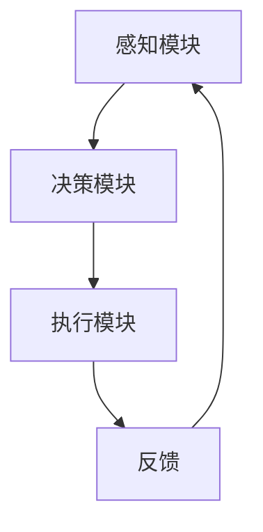

# AI人工智能代理工作流AI Agent WorkFlow：智能代理在物联网系统中的应用

## 1.背景介绍

物联网（IoT）技术的迅猛发展使得我们能够将各种设备和传感器连接到互联网，从而实现数据的收集、传输和分析。然而，随着设备数量的增加和数据量的爆炸式增长，传统的集中式处理方式已经无法满足实时性和高效性的需求。人工智能（AI）代理作为一种新兴的技术，能够在分布式环境中自主决策和执行任务，为物联网系统带来了新的可能性。

## 2.核心概念与联系

### 2.1 人工智能代理

人工智能代理（AI Agent）是一个能够感知环境并采取行动以实现特定目标的计算实体。它通常由感知模块、决策模块和执行模块组成。感知模块负责收集环境信息，决策模块根据预设的算法和策略进行决策，执行模块则负责执行相应的操作。

### 2.2 物联网系统

物联网系统由各种互联设备和传感器组成，这些设备通过网络进行通信和数据交换。物联网系统的核心在于数据的收集、传输和分析，以实现智能化的控制和管理。

### 2.3 AI代理与物联网的结合

将AI代理引入物联网系统，可以实现设备的自主决策和智能控制。AI代理能够实时分析传感器数据，做出快速反应，从而提高系统的效率和可靠性。

## 3.核心算法原理具体操作步骤

### 3.1 感知模块

感知模块负责收集环境信息，通常包括传感器数据的采集和预处理。常用的传感器包括温度传感器、湿度传感器、光传感器等。

### 3.2 决策模块

决策模块是AI代理的核心，负责根据感知模块提供的数据进行决策。常用的算法包括：

- **规则引擎**：基于预定义的规则进行决策。
- **机器学习**：通过训练模型进行预测和决策。
- **强化学习**：通过与环境的交互不断优化决策策略。

### 3.3 执行模块

执行模块负责将决策模块的输出转化为具体的操作。这可能包括控制设备的开关、调整设备的参数等。

以下是一个简单的AI代理工作流的Mermaid流程图：



## 4.数学模型和公式详细讲解举例说明

### 4.1 线性回归模型

线性回归是一种常用的机器学习算法，用于预测连续值。其数学模型为：

$$
y = \beta_0 + \beta_1 x_1 + \beta_2 x_2 + \cdots + \beta_n x_n + \epsilon
$$

其中，$y$ 是预测值，$x_i$ 是输入特征，$\beta_i$ 是模型参数，$\epsilon$ 是误差项。

### 4.2 强化学习模型

强化学习通过与环境的交互来学习最优策略。其核心公式为贝尔曼方程：

$$
Q(s, a) = r + \gamma \max_{a'} Q(s', a')
$$

其中，$Q(s, a)$ 是状态 $s$ 下采取动作 $a$ 的价值，$r$ 是即时奖励，$\gamma$ 是折扣因子，$s'$ 是下一个状态，$a'$ 是下一个动作。

### 4.3 实例讲解

假设我们有一个智能温控系统，通过温度传感器收集室内温度数据，并通过AI代理控制空调的开关。我们可以使用线性回归模型预测未来的温度变化，并根据预测结果调整空调的工作状态。

## 5.项目实践：代码实例和详细解释说明

### 5.1 环境搭建

首先，我们需要搭建一个Python环境，并安装必要的库：

```bash
pip install numpy pandas scikit-learn
```

### 5.2 数据收集与预处理

我们使用温度传感器收集室内温度数据，并进行预处理：

```python
import pandas as pd

# 读取温度数据
data = pd.read_csv('temperature_data.csv')

# 数据预处理
data['timestamp'] = pd.to_datetime(data['timestamp'])
data.set_index('timestamp', inplace=True)
```

### 5.3 模型训练

我们使用线性回归模型进行温度预测：

```python
from sklearn.linear_model import LinearRegression

# 特征和标签
X = data[['temperature']]
y = data['temperature'].shift(-1).dropna()

# 模型训练
model = LinearRegression()
model.fit(X[:-1], y)
```

### 5.4 决策与执行

根据预测结果调整空调的工作状态：

```python
# 预测未来温度
future_temp = model.predict([[current_temp]])

# 决策与执行
if future_temp > 25:
    turn_on_ac()
else:
    turn_off_ac()
```

## 6.实际应用场景

### 6.1 智能家居

在智能家居中，AI代理可以实现对家电设备的智能控制。例如，智能灯光系统可以根据环境光线和用户习惯自动调整灯光亮度。

### 6.2 智能农业

在智能农业中，AI代理可以实时监测土壤湿度、温度等参数，并根据作物需求自动调整灌溉系统，提高农业生产效率。

### 6.3 智能交通

在智能交通系统中，AI代理可以实时分析交通流量数据，优化交通信号灯的控制策略，减少交通拥堵。

## 7.工具和资源推荐

### 7.1 开发工具

- **Python**：广泛使用的编程语言，拥有丰富的AI和物联网开发库。
- **TensorFlow**：强大的机器学习框架，支持深度学习模型的训练和部署。
- **Node-RED**：基于流的开发工具，适用于物联网应用的快速开发。

### 7.2 学习资源

- **Coursera**：提供丰富的AI和物联网课程。
- **GitHub**：开源项目的宝库，可以找到许多AI和物联网相关的项目和代码。
- **Arxiv**：学术论文的预印本平台，可以获取最新的AI和物联网研究成果。

## 8.总结：未来发展趋势与挑战

### 8.1 未来发展趋势

随着AI技术和物联网技术的不断发展，AI代理在物联网系统中的应用前景广阔。未来，我们可以期待更多智能化、自动化的物联网应用，例如智能城市、智能医疗等。

### 8.2 挑战

然而，AI代理在物联网系统中的应用也面临一些挑战。例如，数据隐私和安全问题、系统的可靠性和稳定性问题等。解决这些问题需要多方面的努力，包括技术创新、政策法规的完善等。

## 9.附录：常见问题与解答

### 9.1 什么是AI代理？

AI代理是一个能够感知环境并采取行动以实现特定目标的计算实体，通常由感知模块、决策模块和执行模块组成。

### 9.2 AI代理在物联网系统中的作用是什么？

AI代理可以实现设备的自主决策和智能控制，提高物联网系统的效率和可靠性。

### 9.3 如何选择合适的AI算法？

选择合适的AI算法需要根据具体应用场景和需求来确定。常用的算法包括规则引擎、机器学习和强化学习等。

### 9.4 如何确保AI代理的安全性？

确保AI代理的安全性需要从多个方面入手，包括数据加密、访问控制、异常检测等。

### 9.5 AI代理在物联网系统中的应用前景如何？

随着AI技术和物联网技术的不断发展，AI代理在物联网系统中的应用前景广阔，未来可以期待更多智能化、自动化的物联网应用。

---

作者：禅与计算机程序设计艺术 / Zen and the Art of Computer Programming