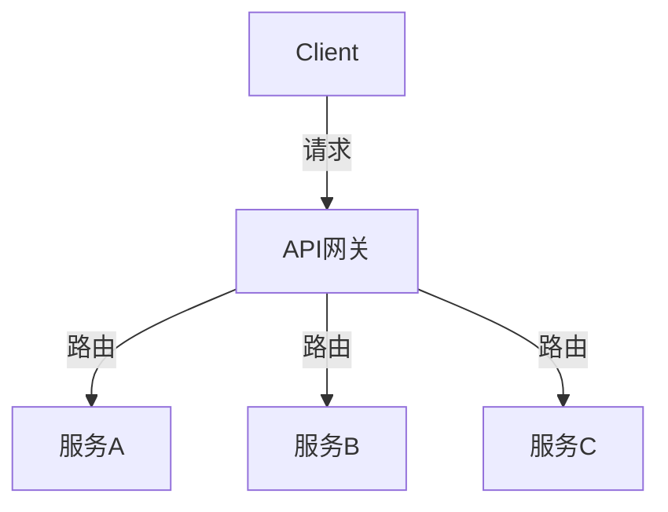
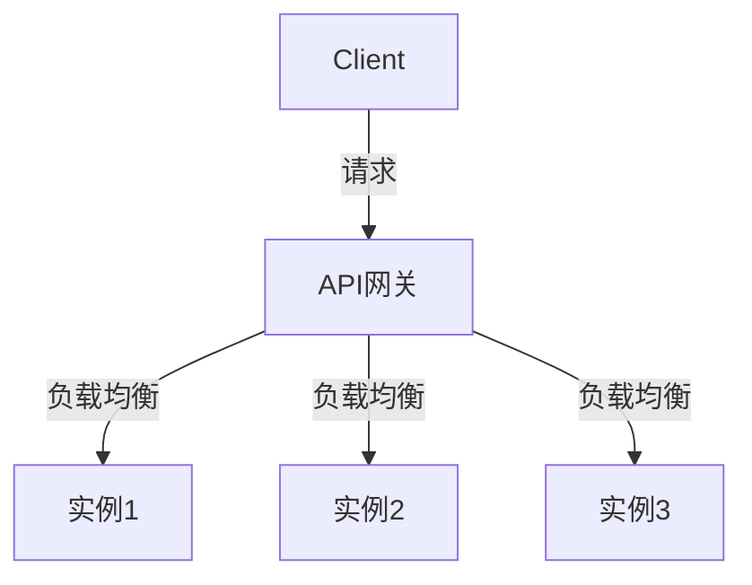
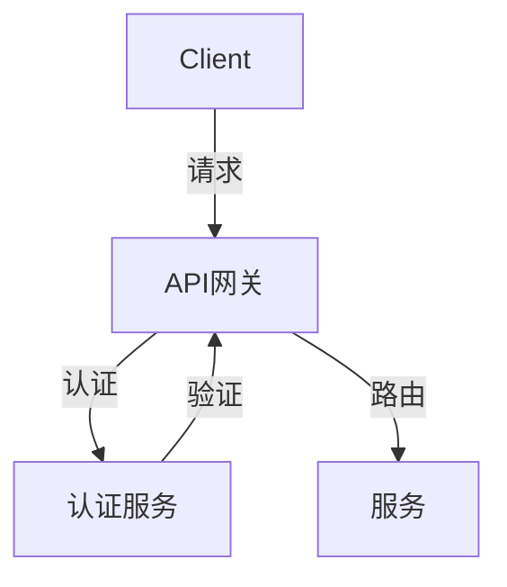
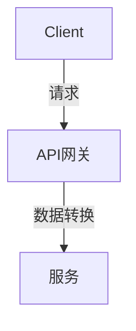

# AI系统API网关原理与代码实战案例讲解

## 1.背景介绍

在现代分布式系统中，API网关作为一个重要的组件，起到了至关重要的作用。它不仅仅是一个简单的请求路由器，更是一个集成了安全、负载均衡、缓存、监控等多种功能的综合性服务。特别是在AI系统中，API网关的作用尤为重要，因为AI系统通常需要处理大量的数据请求，并且需要保证高可用性和高性能。

API网关的概念最早出现在微服务架构中，旨在解决微服务之间的通信问题。随着AI技术的发展，API网关逐渐被引入到AI系统中，用于管理和优化AI模型的调用和数据传输。本文将深入探讨AI系统中的API网关原理，并通过具体的代码实例来展示其实际应用。

## 2.核心概念与联系

### 2.1 API网关的定义

API网关是一个服务器，它作为系统的唯一入口，负责处理所有的API请求。它可以执行各种任务，如请求路由、协议转换、负载均衡、缓存、认证和授权等。

### 2.2 AI系统中的API网关

在AI系统中，API网关不仅仅是一个请求路由器，它还需要处理复杂的数据传输和模型调用。API网关可以帮助AI系统实现以下功能：

- **请求路由**：将请求路由到相应的AI模型或服务。
- **负载均衡**：分配请求到多个实例，以提高系统的可用性和性能。
- **安全性**：提供认证和授权机制，确保数据的安全性。
- **数据转换**：在不同的数据格式之间进行转换，以适应不同的AI模型和服务。

### 2.3 API网关与微服务的关系

API网关通常用于微服务架构中，作为微服务之间的通信桥梁。在AI系统中，API网关也可以用于管理和优化AI模型的调用和数据传输。API网关可以将不同的AI模型和服务集成在一起，提供统一的接口，简化系统的复杂性。

## 3.核心算法原理具体操作步骤

### 3.1 请求路由

请求路由是API网关的基本功能之一。它负责将客户端的请求路由到相应的服务或AI模型。请求路由的实现通常基于URL路径、HTTP方法和请求头等信息。



### 3.2 负载均衡

负载均衡是API网关的另一个重要功能。它可以将请求分配到多个实例，以提高系统的可用性和性能。常见的负载均衡算法包括轮询、随机、最少连接等。



### 3.3 安全性

API网关需要提供认证和授权机制，以确保数据的安全性。常见的认证方式包括API密钥、OAuth、JWT等。



### 3.4 数据转换

数据转换是API网关的高级功能之一。它可以在不同的数据格式之间进行转换，以适应不同的AI模型和服务。例如，将JSON数据转换为XML数据，或将结构化数据转换为非结构化数据。



## 4.数学模型和公式详细讲解举例说明

### 4.1 负载均衡算法

负载均衡算法是API网关的重要组成部分。常见的负载均衡算法包括轮询、随机、最少连接等。下面我们以轮询算法为例，详细讲解其数学模型和公式。

#### 4.1.1 轮询算法

轮询算法是一种简单且常用的负载均衡算法。它将请求依次分配到每个实例，直到所有实例都被分配了一次，然后重新开始。

$$
i = (i + 1) \mod n
$$

其中，$i$ 表示当前实例的索引，$n$ 表示实例的总数。

#### 4.1.2 最少连接算法

最少连接算法是一种基于连接数的负载均衡算法。它将请求分配到当前连接数最少的实例，以实现负载均衡。

$$
i = \arg\min_{j} C_j
$$

其中，$C_j$ 表示实例 $j$ 的当前连接数。

### 4.2 数据转换

数据转换是API网关的高级功能之一。它可以在不同的数据格式之间进行转换，以适应不同的AI模型和服务。下面我们以JSON到XML的转换为例，详细讲解其数学模型和公式。

#### 4.2.1 JSON到XML的转换

JSON和XML是两种常见的数据格式。JSON是一种轻量级的数据交换格式，易于人类阅读和编写。XML是一种标记语言，具有良好的可扩展性和自描述性。JSON到XML的转换可以通过递归遍历JSON对象，并生成相应的XML节点来实现。

$$
\text{XML} = \text{convert}(\text{JSON})
$$

其中，$\text{convert}$ 是一个递归函数，用于将JSON对象转换为XML节点。

## 5.项目实践：代码实例和详细解释说明

### 5.1 项目概述

在本节中，我们将通过一个具体的项目实例，展示如何在AI系统中实现API网关。我们将使用Node.js和Express框架来构建API网关，并集成负载均衡、认证和数据转换等功能。

### 5.2 项目结构

项目结构如下：

```
ai-api-gateway/
├── src/
│   ├── index.js
│   ├── routes/
│   │   ├── aiModelA.js
│   │   ├── aiModelB.js
│   ├── middleware/
│   │   ├── auth.js
│   │   ├── loadBalancer.js
│   │   ├── dataConverter.js
├── package.json
├── README.md
```

### 5.3 代码实现

#### 5.3.1 初始化项目

首先，我们需要初始化Node.js项目，并安装所需的依赖包。

```bash
mkdir ai-api-gateway
cd ai-api-gateway
npm init -y
npm install express axios
```

#### 5.3.2 实现API网关

在 `src/index.js` 文件中，我们将实现API网关的基本功能，包括请求路由、负载均衡、认证和数据转换。

```javascript
const express = require('express');
const authMiddleware = require('./middleware/auth');
const loadBalancerMiddleware = require('./middleware/loadBalancer');
const dataConverterMiddleware = require('./middleware/dataConverter');
const aiModelARoute = require('./routes/aiModelA');
const aiModelBRoute = require('./routes/aiModelB');

const app = express();
const port = 3000;

// 中间件
app.use(authMiddleware);
app.use(loadBalancerMiddleware);
app.use(dataConverterMiddleware);

// 路由
app.use('/aiModelA', aiModelARoute);
app.use('/aiModelB', aiModelBRoute);

app.listen(port, () => {
  console.log(`API Gateway running at http://localhost:${port}`);
});
```

#### 5.3.3 实现认证中间件

在 `src/middleware/auth.js` 文件中，我们将实现认证中间件，用于验证请求的合法性。

```javascript
module.exports = (req, res, next) => {
  const apiKey = req.headers['x-api-key'];
  if (apiKey === 'your-api-key') {
    next();
  } else {
    res.status(401).json({ error: 'Unauthorized' });
  }
};
```

#### 5.3.4 实现负载均衡中间件

在 `src/middleware/loadBalancer.js` 文件中，我们将实现负载均衡中间件，用于将请求分配到不同的实例。

```javascript
const instances = ['http://localhost:3001', 'http://localhost:3002'];
let currentIndex = 0;

module.exports = (req, res, next) => {
  req.targetInstance = instances[currentIndex];
  currentIndex = (currentIndex + 1) % instances.length;
  next();
};
```

#### 5.3.5 实现数据转换中间件

在 `src/middleware/dataConverter.js` 文件中，我们将实现数据转换中间件，用于在不同的数据格式之间进行转换。

```javascript
const xml2js = require('xml2js');

module.exports = (req, res, next) => {
  if (req.headers['content-type'] === 'application/json') {
    const json = req.body;
    const builder = new xml2js.Builder();
    req.body = builder.buildObject(json);
  }
  next();
};
```

#### 5.3.6 实现AI模型路由

在 `src/routes/aiModelA.js` 和 `src/routes/aiModelB.js` 文件中，我们将实现AI模型的路由，用于处理具体的AI模型请求。

```javascript
const express = require('express');
const axios = require('axios');
const router = express.Router();

router.post('/', async (req, res) => {
  try {
    const response = await axios.post(req.targetInstance, req.body);
    res.json(response.data);
  } catch (error) {
    res.status(500).json({ error: 'Internal Server Error' });
  }
});

module.exports = router;
```

## 6.实际应用场景

### 6.1 AI模型服务

在AI系统中，API网关可以用于管理和优化AI模型的调用和数据传输。通过API网关，用户可以方便地调用不同的AI模型，并实现负载均衡和数据转换等功能。

### 6.2 数据处理服务

API网关还可以用于数据处理服务，如数据清洗、数据转换和数据分析等。通过API网关，用户可以将数据请求路由到相应的数据处理服务，并实现数据的转换和处理。

### 6.3 安全认证服务

API网关可以提供统一的安全认证服务，确保数据的安全性。通过API网关，用户可以实现API密钥、OAuth、JWT等多种认证方式，确保数据的合法性和安全性。

## 7.工具和资源推荐

### 7.1 工具推荐

- **Node.js**：一个基于Chrome V8引擎的JavaScript运行时，用于构建高性能的网络应用。
- **Express**：一个基于Node.js的Web应用框架，用于构建API网关和Web服务。
- **Axios**：一个基于Promise的HTTP客户端，用于发送HTTP请求。
- **xml2js**：一个用于将XML数据转换为JavaScript对象的库。

### 7.2 资源推荐

- **《Node.js设计模式》**：一本介绍Node.js设计模式的书籍，适合中高级开发者阅读。
- **《深入浅出Express》**：一本介绍Express框架的书籍，适合初学者和中级开发者阅读。
- **《API网关设计与实现》**：一本介绍API网关设计与实现的书籍，适合中高级开发者阅读。

## 8.总结：未来发展趋势与挑战

API网关在AI系统中的应用前景广阔，但也面临一些挑战。随着AI技术的发展，API网关需要处理越来越复杂的数据请求，并提供更高的性能和可用性。此外，API网关还需要应对安全性和数据隐私等问题。

未来，API网关将继续发展，集成更多的功能和服务，如自动化运维、智能路由和实时监控等。同时，API网关还需要不断优化性能，提高系统的可用性和可靠性。

## 9.附录：常见问题与解答

### 9.1 什么是API网关？

API网关是一个服务器，它作为系统的唯一入口，负责处理所有的API请求。它可以执行各种任务，如请求路由、协议转换、负载均衡、缓存、认证和授权等。

### 9.2 为什么需要API网关？

API网关可以简化系统的复杂性，提高系统的可用性和性能。通过API网关，用户可以方便地调用不同的服务，并实现负载均衡和数据转换等功能。

### 9.3 如何实现API网关？

API网关可以使用Node.js和Express框架来实现。通过编写中间件和路由，用户可以实现请求路由、负载均衡、认证和数据转换等功能。

### 9.4 API网关在AI系统中的应用有哪些？

API网关在AI系统中可以用于管理和优化AI模型的调用和数据传输。通过API网关，用户可以方便地调用不同的AI模型，并实现负载均衡和数据转换等功能。

### 9.5 API网关的未来发展趋势是什么？

未来，API网关将继续发展，集成更多的功能和服务，如自动化运维、智能路由和实时监控等。同时，API网关还需要不断优化性能，提高系统的可用性和可靠性。

---

作者：禅与计算机程序设计艺术 / Zen and the Art of Computer Programming