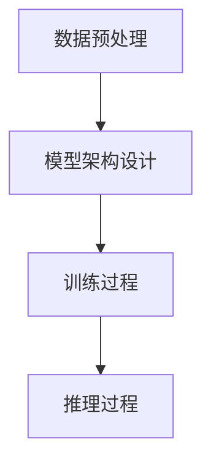

# Cerebras-GPT原理与代码实例讲解

## 1.背景介绍

在人工智能和深度学习领域，生成式预训练模型（Generative Pre-trained Transformer, GPT）已经成为了一个重要的研究方向。Cerebras-GPT是由Cerebras公司开发的一种高效的GPT模型，旨在通过硬件和软件的协同优化，提供更高效的计算能力和更低的延迟。本文将深入探讨Cerebras-GPT的核心概念、算法原理、数学模型、实际应用以及代码实例，帮助读者全面理解这一前沿技术。

## 2.核心概念与联系

### 2.1 GPT模型概述

GPT模型是一种基于Transformer架构的生成式模型，主要用于自然语言处理（NLP）任务。其核心思想是通过大量的文本数据进行预训练，使模型能够生成具有上下文关联的文本。

### 2.2 Cerebras硬件架构

Cerebras公司开发了一种专门用于深度学习的硬件架构——Cerebras Wafer-Scale Engine（WSE）。WSE是一种大规模集成电路，具有数百万个计算核心，能够提供极高的计算能力和内存带宽。

### 2.3 Cerebras-GPT的创新点

Cerebras-GPT结合了GPT模型的强大生成能力和Cerebras硬件的高效计算能力，通过硬件和软件的深度优化，实现了更高效的模型训练和推理。

## 3.核心算法原理具体操作步骤

### 3.1 数据预处理

数据预处理是Cerebras-GPT训练的第一步，主要包括文本清洗、分词、词向量表示等步骤。

### 3.2 模型架构设计

Cerebras-GPT的模型架构基于Transformer，主要包括多头自注意力机制、前馈神经网络、层归一化等组件。

### 3.3 训练过程

训练过程包括前向传播、损失计算、反向传播和参数更新。Cerebras-GPT通过Cerebras硬件的高效计算能力，能够在较短时间内完成大规模数据的训练。

### 3.4 推理过程

推理过程主要包括输入处理、模型推理和输出生成。Cerebras-GPT能够根据输入的上下文生成连贯的文本。



## 4.数学模型和公式详细讲解举例说明

### 4.1 Transformer的自注意力机制

自注意力机制是Transformer的核心组件，其计算公式如下：

$$
\text{Attention}(Q, K, V) = \text{softmax}\left(\frac{QK^T}{\sqrt{d_k}}\right)V
$$

其中，$Q$、$K$、$V$分别表示查询、键和值矩阵，$d_k$表示键的维度。

### 4.2 损失函数

Cerebras-GPT的损失函数通常采用交叉熵损失，其计算公式如下：

$$
\mathcal{L} = -\sum_{i=1}^{N} y_i \log(\hat{y}_i)
$$

其中，$y_i$表示真实标签，$\hat{y}_i$表示预测概率。

### 4.3 参数更新

参数更新采用梯度下降算法，其更新公式如下：

$$
\theta_{t+1} = \theta_t - \eta \nabla_\theta \mathcal{L}
$$

其中，$\theta_t$表示第$t$次迭代的参数，$\eta$表示学习率。

## 5.项目实践：代码实例和详细解释说明

### 5.1 环境配置

首先，确保安装了必要的库和工具：

```bash
pip install torch transformers cerebras
```

### 5.2 数据预处理

```python
from transformers import GPT2Tokenizer

tokenizer = GPT2Tokenizer.from_pretrained('gpt2')
text = "Cerebras-GPT is a powerful model."
tokens = tokenizer.encode(text, return_tensors='pt')
```

### 5.3 模型定义

```python
from transformers import GPT2LMHeadModel

model = GPT2LMHeadModel.from_pretrained('gpt2')
```

### 5.4 模型训练

```python
from torch.optim import AdamW

optimizer = AdamW(model.parameters(), lr=5e-5)
loss_fn = torch.nn.CrossEntropyLoss()

for epoch in range(num_epochs):
    outputs = model(tokens, labels=tokens)
    loss = outputs.loss
    loss.backward()
    optimizer.step()
    optimizer.zero_grad()
    print(f"Epoch {epoch}, Loss: {loss.item()}")
```

### 5.5 模型推理

```python
input_text = "Cerebras-GPT is"
input_tokens = tokenizer.encode(input_text, return_tensors='pt')
output_tokens = model.generate(input_tokens, max_length=50)
output_text = tokenizer.decode(output_tokens[0], skip_special_tokens=True)
print(output_text)
```

## 6.实际应用场景

### 6.1 文本生成

Cerebras-GPT可以用于生成高质量的文本，例如新闻报道、技术文档等。

### 6.2 对话系统

Cerebras-GPT可以用于构建智能对话系统，提供更自然的对话体验。

### 6.3 代码生成

Cerebras-GPT可以用于生成代码片段，辅助程序员进行开发。

## 7.工具和资源推荐

### 7.1 开发工具

- **PyTorch**：一个流行的深度学习框架，支持GPU加速。
- **Transformers**：一个用于NLP任务的库，提供了多种预训练模型。

### 7.2 学习资源

- **《深度学习》**：一本经典的深度学习教材，适合初学者。
- **Cerebras官方文档**：提供了详细的硬件和软件使用指南。

## 8.总结：未来发展趋势与挑战

Cerebras-GPT作为一种高效的生成式预训练模型，具有广泛的应用前景。然而，随着模型规模的不断扩大，如何进一步提高计算效率和降低能耗仍然是一个重要的研究方向。此外，如何在保证模型性能的同时，减少训练数据的依赖，也是未来需要解决的挑战。

## 9.附录：常见问题与解答

### 9.1 Cerebras-GPT与传统GPT的区别是什么？

Cerebras-GPT结合了Cerebras硬件的高效计算能力，能够在较短时间内完成大规模数据的训练和推理。

### 9.2 如何提高Cerebras-GPT的生成质量？

可以通过增加训练数据的多样性、调整模型参数和优化训练过程来提高生成质量。

### 9.3 Cerebras-GPT的应用场景有哪些？

Cerebras-GPT可以用于文本生成、对话系统、代码生成等多个领域。

---

作者：禅与计算机程序设计艺术 / Zen and the Art of Computer Programming