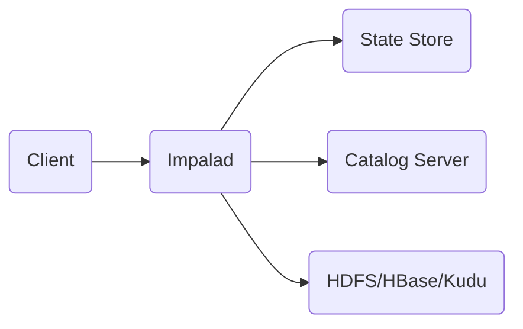
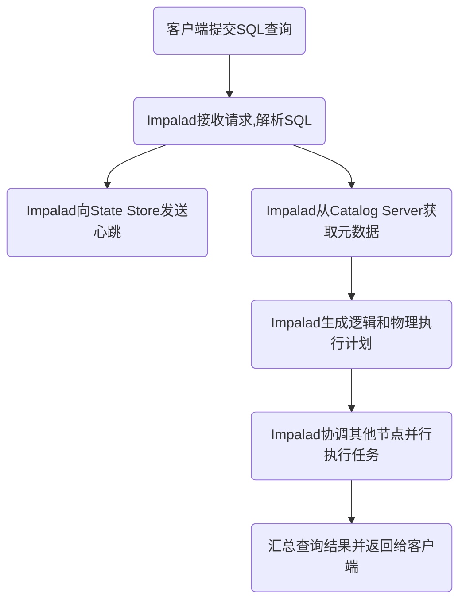

# Impala原理与代码实例讲解

## 1. 背景介绍

### 1.1 大数据处理的挑战
随着数据量的爆炸式增长,传统的数据处理方式已经无法满足实时性和并发性的需求。MapReduce等批处理框架虽然能够处理海量数据,但是延迟较高,无法满足实时交互式查询的需求。

### 1.2 Impala的诞生
Impala是由Cloudera公司开发的一款开源的MPP(大规模并行处理)SQL查询引擎,可以直接在Hadoop的存储层(如HDFS、HBase)上进行高效的数据分析查询。它弥补了Hive等工具在交互式查询上的不足,大幅提升了SQL on Hadoop的性能,被广泛应用于BI分析、即席查询等场景。

### 1.3 Impala的特点
- 支持ANSI SQL语法,兼容多种数据格式(Parquet、ORC等)
- 无需ETL,直接访问Hadoop数据存储
- 使用内存进行中间结果存储,避免不必要的IO
- 支持数据本地化,充分利用Hadoop的计算能力
- 动态元数据管理,自动捕获数据变更
- 基于代价的查询优化器,高效生成执行计划

## 2. 核心概念与联系

### 2.1 Impala架构概览
Impala采用了与商用并行关系数据库类似的MPP架构,由Impalad、State Store和Catalog Server三大组件构成。


### 2.2 Impalad
Impalad是Impala的核心组件,负责接收客户端请求,解析SQL语句,生成和执行物理执行计划。Impalad以守护进程的形式运行在集群的每个节点上,从而实现了MPP架构。

### 2.3 State Store
State Store负责收集和分发集群中Impalad的健康状况和资源使用情况等元数据信息。当某个Impalad发生故障时,State Store会通知集群中的其他Impalad,确保查询可以在剩余的节点上继续执行。

### 2.4 Catalog Server 
Catalog Server是Impala的元数据管理中心,存储了表、分区、函数等元数据信息。当用户提交一个新的SQL语句时,Impalad首先会从Catalog Server获取相关的元数据,然后根据元数据生成查询计划。Catalog Server通过周期性地同步Hive Metastore,确保元数据的一致性。

### 2.5 查询执行流程


## 3. 核心算法原理具体操作步骤

### 3.1 查询执行计划生成
Impala采用Volcano模型来表示和生成查询执行计划。Volcano将整个查询执行计划表示为一棵树,树中的每个节点代表一个操作算子(如扫描、连接、聚合等)。Impala的查询优化器Planner负责对语法树进行一系列基于规则和代价的优化,最终生成物理执行计划。

### 3.2 查询重写
Impala的查询重写主要包括常量折叠、谓词下推、列剪枝等。
- 常量折叠:在编译期将表达式中的常量子表达式进行计算,并用结果替换表达式。
- 谓词下推:将过滤条件尽可能下推到数据源,减少数据扫描量。
- 列剪枝:去掉查询不需要的列,减少数据传输量。

### 3.3 查询优化
Impala采用了基于代价的优化(CBO)策略,主要包括连接顺序优化、聚合下推、分区裁剪等。
- 连接顺序优化:根据表的统计信息(如行数、distinct值等),选择最优的连接顺序。
- 聚合下推:将聚合操作下推到数据源,在扫描时就进行预聚合。
- 分区裁剪:根据查询条件对分区进行过滤,避免扫描不必要的分区。 

### 3.4 代码生成
在生成物理执行计划后,Impala使用LLVM将执行计划编译成机器代码,从而避免了解释执行的开销。Impala为每个查询都生成单独的代码,并应用了一系列底层优化,如循环展开、表达式重排等,最大限度地提升执行效率。

### 3.5 任务调度与执行
Impala采用了拉式的任务调度模型。当一个Impalad完成了当前的任务后,会主动从调度队列中获取新的任务,从而实现负载均衡。在执行过程中,Impala充分利用了数据本地性,尽量将任务调度到数据所在的节点上执行,减少网络传输开销。

## 4. 数学模型和公式详细讲解举例说明

### 4.1 Distinct值估计
Impala使用HyperLogLog算法来估计一列的Distinct值数量。HyperLogLog是一种概率算法,可以在固定的内存空间内,以很小的误差估计海量数据集的基数。

假设一列的值哈希后的二进制串为$b_1b_2b_3...$,定义$\rho(y)$为串$y$中前导零的个数,则估计公式为:

$$E=\alpha_mm^2\left(\sum_{j=1}^{m}2^{-M_j}\right)^{-1}$$

其中,$\alpha_m$为可调参数,$m$为桶数,$M_j$为第$j$个桶的最大前导零数量。

例如,假设$m=1024$,哈希后的前几个值为:
```
0011010101...
0000101011...
0111010100...
0001010111...
```
则$M_1=2,M_2=4,M_3=0,M_4=3$,代入公式可得Distinct值的估计。

### 4.2 直方图
Impala使用直方图来表示一列值的分布情况。直方图将列的值域划分为多个区间(bucket),并统计每个区间内的值的数量。Impala采用等高直方图,即每个bucket内的值数量相等。

假设一列的值服从正态分布$N(\mu,\sigma^2)$,概率密度函数为:

$$f(x)=\frac{1}{\sqrt{2\pi}\sigma}\exp\left(-\frac{(x-\mu)^2}{2\sigma^2}\right)$$

则第$i$个bucket的边界值$x_i$满足:

$$\int_{x_{i-1}}^{x_i}f(x)dx=\frac{1}{m}$$

其中,$m$为bucket数量。

例如,假设$\mu=0,\sigma=1,m=10$,则bucket的边界值为:
```
[-∞, -1.28], [-1.28, -0.84], [-0.84, -0.52], [-0.52, -0.25], 
[-0.25, 0], [0, 0.25], [0.25, 0.52], [0.52, 0.84], [0.84, 1.28], [1.28, +∞]
```

## 5. 项目实践：代码实例和详细解释说明

### 5.1 创建Impala表
```sql
CREATE TABLE user_behavior (
  user_id STRING,
  item_id STRING, 
  category_id STRING,
  behavior STRING,
  ts TIMESTAMP,
  dt STRING
)
PARTITIONED BY (dt)
STORED AS PARQUET;
```
说明:
- 使用Parquet列式存储格式,可以获得更好的压缩和查询性能
- 按dt字段进行分区,优化查询

### 5.2 数据导入
```sql
LOAD DATA INPATH '/user_behavior/2022-01-01' 
INTO TABLE user_behavior PARTITION(dt='2022-01-01');
```
说明:
- 使用LOAD DATA语句将数据导入到Impala表中
- 数据按天进行分区,与Hive表的分区方式保持一致

### 5.3 查询示例
```sql
SELECT item_id, count(*) AS cnt
FROM user_behavior
WHERE dt = '2022-01-01' AND behavior = 'buy'
GROUP BY item_id
ORDER BY cnt DESC
LIMIT 10;
```
说明:
- 按照behavior='buy'过滤出购买行为的记录
- 按照item_id分组,统计每个商品的购买次数
- 按照购买次数倒序排序,获取Top10热门商品

### 5.4 查询优化
```sql
-- 物化视图
CREATE MATERIALIZED VIEW user_behavior_mv AS
SELECT item_id, behavior, count(*) AS cnt
FROM user_behavior
GROUP BY item_id, behavior;

-- 使用物化视图进行查询
SELECT item_id, cnt 
FROM user_behavior_mv
WHERE behavior = 'buy'
ORDER BY cnt DESC
LIMIT 10;
```
说明:
- 创建物化视图,预先进行分组聚合
- 通过物化视图,避免了每次查询都进行全表扫描和聚合,大幅提升查询性能

## 6. 实际应用场景

### 6.1 用户行为分析
通过收集用户的浏览、点击、收藏、购买等行为日志,使用Impala进行实时的用户行为分析,挖掘用户的偏好,进行个性化推荐。

### 6.2 广告点击率分析
收集广告展示和点击日志,使用Impala进行实时的广告点击率统计和分析,优化广告投放策略。

### 6.3 异常检测
通过机器指标、业务指标等日志,使用Impala进行实时的异常检测分析,及时发现系统故障和异常行为。

### 6.4 电商BI分析
使用Impala对电商平台的销售、库存、用户、商品等数据进行多维度分析,支持实时的数据可视化和报表展示。

## 7. 工具和资源推荐

### 7.1 Impala官网
https://impala.apache.org/

提供了Impala的下载、文档、教程等资源。

### 7.2 Cloudera Manager
https://www.cloudera.com/products/product-components/cloudera-manager.html

Cloudera Manager是一个企业级的Hadoop管理平台,提供了Impala的安装、配置、监控等功能。

### 7.3 Hue
https://gethue.com/

Hue是一个开源的SQL Web编辑器,提供了友好的Impala查询界面,并支持语法高亮、自动补全等功能。

## 8. 总结：未来发展趋势与挑战

### 8.1 SQL on Hadoop的融合发展
Impala与Hive、Spark SQL等SQL on Hadoop工具在功能和性能上的差距正在逐渐缩小,未来可能会走向融合,提供统一的SQL分析平台。

### 8.2 云原生的发展
随着云计算的普及,Impala也在向云原生架构演进,提供更灵活的部署和扩展能力,以适应云环境下的弹性需求。

### 8.3 机器学习的结合
Impala正在与机器学习平台(如TensorFlow)进行整合,支持SQL与机器学习的无缝结合,简化机器学习的数据处理流程。

### 8.4 实时性的挑战
虽然Impala在交互式查询上已经有了很大的提升,但是对于秒级别的实时分析场景,仍然存在一定的局限性,需要与Flink等流处理引擎配合使用。

## 9. 附录：常见问题与解答

### 9.1 Impala与Hive的区别是什么?
Impala是MPP架构,专门为交互式查询进行了优化;而Hive是MapReduce架构,主要面向批处理场景。Impala通过内存计算、代码生成、数据本地化等技术,大幅提升了查询性能。

### 9.2 Impala支持哪些文件格式?
Impala支持多种常见的文件格式,如Parquet、ORC、Avro、SequenceFile、RCFile等。推荐使用Parquet列式存储,可以获得更好的查询性能。

### 9.3 Impala如何处理数据倾斜?
可以使用COMPUTE STATS语句收集表和列的统计信息,帮助Impala优化器生成更合理的查询计划。对于严重倾斜的数据,可以考虑进行数据预处理,提前进行聚合,或者使用随机数对倾斜键进行打散。

### 9.4 Impala的容错机制是怎样的?
Impala通过State Store来监控各