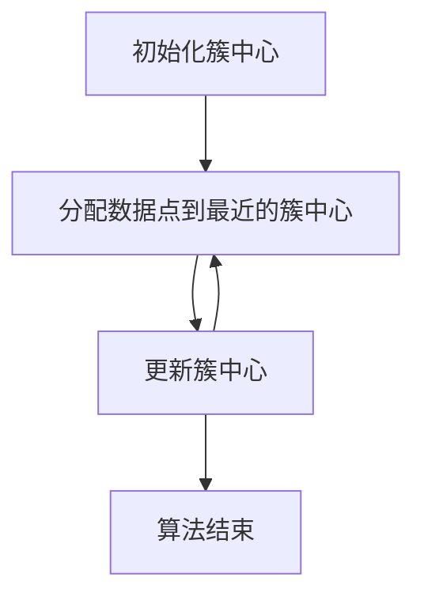

# K-Means - 原理与代码实例讲解

## 1.背景介绍

K-Means 是一种广泛应用于数据挖掘和机器学习领域的聚类算法。它通过将数据集划分为 K 个簇，使得同一簇内的数据点尽可能相似，而不同簇之间的数据点尽可能不同。K-Means 算法因其简单性和高效性，成为了许多实际应用中的首选算法。

## 2.核心概念与联系

### 2.1 聚类

聚类是一种无监督学习方法，旨在将数据集划分为若干个簇，使得同一簇内的数据点具有较高的相似性，而不同簇之间的数据点具有较大的差异性。

### 2.2 K-Means 算法

K-Means 算法是一种迭代优化算法，其目标是最小化簇内数据点到簇中心的距离平方和。算法的核心思想是通过不断调整簇中心的位置，逐步优化簇的划分。

### 2.3 簇中心

簇中心是每个簇的代表点，通常是簇内所有数据点的均值。簇中心的位置在每次迭代中都会更新，以更好地代表簇内的数据点。

## 3.核心算法原理具体操作步骤

K-Means 算法的具体操作步骤如下：

1. **初始化**：随机选择 K 个数据点作为初始簇中心。
2. **分配数据点**：将每个数据点分配到距离最近的簇中心。
3. **更新簇中心**：计算每个簇的均值，并将其作为新的簇中心。
4. **重复步骤 2 和 3**，直到簇中心不再发生变化或达到预定的迭代次数。

以下是 K-Means 算法的 Mermaid 流程图：



## 4.数学模型和公式详细讲解举例说明

K-Means 算法的目标是最小化以下目标函数：

$$
J = \sum_{i=1}^{K} \sum_{x \in C_i} \| x - \mu_i \|^2
$$

其中，$K$ 是簇的数量，$C_i$ 是第 $i$ 个簇，$\mu_i$ 是第 $i$ 个簇的中心，$x$ 是数据点，$\| x - \mu_i \|$ 表示数据点 $x$ 到簇中心 $\mu_i$ 的欧氏距离。

### 举例说明

假设我们有以下数据点：$(1, 1)$, $(2, 1)$, $(4, 3)$, $(5, 4)$，并且我们希望将它们划分为 2 个簇。

1. **初始化**：随机选择 $(1, 1)$ 和 $(5, 4)$ 作为初始簇中心。
2. **分配数据点**：
   - $(1, 1)$ 距离 $(1, 1)$ 最近，分配到簇 1。
   - $(2, 1)$ 距离 $(1, 1)$ 最近，分配到簇 1。
   - $(4, 3)$ 距离 $(5, 4)$ 最近，分配到簇 2。
   - $(5, 4)$ 距离 $(5, 4)$ 最近，分配到簇 2。
3. **更新簇中心**：
   - 簇 1 的新中心为 $(1.5, 1)$。
   - 簇 2 的新中心为 $(4.5, 3.5)$。
4. **重复步骤 2 和 3**，直到簇中心不再变化。

## 5.项目实践：代码实例和详细解释说明

以下是一个使用 Python 实现 K-Means 算法的代码实例：

```python
import numpy as np
import matplotlib.pyplot as plt

def initialize_centroids(X, k):
    indices = np.random.choice(X.shape[0], k, replace=False)
    return X[indices]

def assign_clusters(X, centroids):
    distances = np.linalg.norm(X[:, np.newaxis] - centroids, axis=2)
    return np.argmin(distances, axis=1)

def update_centroids(X, labels, k):
    centroids = np.zeros((k, X.shape[1]))
    for i in range(k):
        centroids[i] = X[labels == i].mean(axis=0)
    return centroids

def kmeans(X, k, max_iters=100):
    centroids = initialize_centroids(X, k)
    for _ in range(max_iters):
        labels = assign_clusters(X, centroids)
        new_centroids = update_centroids(X, labels, k)
        if np.all(centroids == new_centroids):
            break
        centroids = new_centroids
    return centroids, labels

# 示例数据
X = np.array([[1, 1], [2, 1], [4, 3], [5, 4]])

# 运行 K-Means 算法
k = 2
centroids, labels = kmeans(X, k)

# 可视化结果
plt.scatter(X[:, 0], X[:, 1], c=labels)
plt.scatter(centroids[:, 0], centroids[:, 1], marker='x', color='red')
plt.show()
```

### 代码解释

1. **初始化簇中心**：`initialize_centroids` 函数随机选择 K 个数据点作为初始簇中心。
2. **分配数据点**：`assign_clusters` 函数计算每个数据点到簇中心的距离，并将其分配到最近的簇。
3. **更新簇中心**：`update_centroids` 函数计算每个簇的均值，并将其作为新的簇中心。
4. **迭代**：`kmeans` 函数不断重复分配数据点和更新簇中心的过程，直到簇中心不再变化或达到预定的迭代次数。

## 6.实际应用场景

K-Means 算法在许多实际应用中得到了广泛应用，包括但不限于以下场景：

### 6.1 图像压缩

通过将图像的像素点聚类为若干个簇，可以减少图像的颜色数量，从而实现图像压缩。

### 6.2 客户细分

在市场营销中，可以使用 K-Means 算法将客户划分为不同的群体，以便进行有针对性的营销策略。

### 6.3 文本聚类

在自然语言处理领域，可以使用 K-Means 算法将文档聚类为若干个主题，以便进行主题建模和信息检索。

## 7.工具和资源推荐

### 7.1 Python 库

- **scikit-learn**：一个强大的机器学习库，提供了 K-Means 算法的实现。
- **NumPy**：一个用于科学计算的库，提供了高效的数组操作。

### 7.2 在线资源

- **Kaggle**：一个数据科学竞赛平台，提供了丰富的数据集和代码示例。
- **Coursera**：一个在线学习平台，提供了许多关于机器学习和数据挖掘的课程。

## 8.总结：未来发展趋势与挑战

K-Means 算法虽然简单高效，但也存在一些局限性，如对初始簇中心敏感、难以处理非凸形状的簇等。未来的发展趋势包括：

### 8.1 改进算法

研究人员正在探索改进 K-Means 算法的方法，如 K-Means++、Mini-Batch K-Means 等，以提高算法的稳定性和效率。

### 8.2 结合深度学习

将 K-Means 算法与深度学习相结合，可以在高维数据和复杂数据结构中实现更好的聚类效果。

### 8.3 应用扩展

随着数据量的不断增加和应用场景的不断扩展，K-Means 算法在大数据分析、智能制造、医疗健康等领域的应用前景广阔。

## 9.附录：常见问题与解答

### 问题 1：如何选择 K 的值？

选择 K 的值通常依赖于经验和具体应用场景。常用的方法包括肘部法、轮廓系数等。

### 问题 2：K-Means 算法对初始簇中心敏感吗？

是的，K-Means 算法对初始簇中心非常敏感。不同的初始簇中心可能导致不同的聚类结果。K-Means++ 是一种改进的初始化方法，可以有效缓解这一问题。

### 问题 3：K-Means 算法能处理非凸形状的簇吗？

K-Means 算法假设簇是凸形状的，因此难以处理非凸形状的簇。对于非凸形状的簇，可以考虑使用 DBSCAN、Spectral Clustering 等算法。

### 问题 4：K-Means 算法的时间复杂度是多少？

K-Means 算法的时间复杂度为 $O(n \cdot k \cdot t)$，其中 $n$ 是数据点的数量，$k$ 是簇的数量，$t$ 是迭代次数。

### 问题 5：如何评估 K-Means 算法的聚类效果？

常用的评估指标包括簇内平方和（Within-Cluster Sum of Squares, WCSS）、轮廓系数（Silhouette Coefficient）等。

---

作者：禅与计算机程序设计艺术 / Zen and the Art of Computer Programming