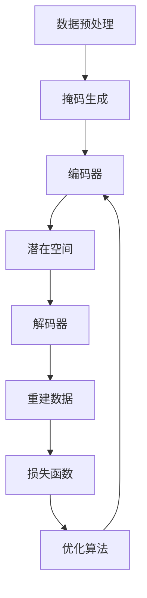

# MAE原理与代码实例讲解

## 1.背景介绍

在现代机器学习和深度学习领域，自动编码器（Autoencoder, AE）是一种非常重要的神经网络模型。自动编码器的主要任务是学习数据的低维表示，同时尽可能地保留原始数据的特征。MAE（Masked Autoencoder）是自动编码器的一种变体，它在处理高维数据（如图像、文本等）时表现出色。MAE通过掩码机制（Masking Mechanism）来增强模型的鲁棒性和泛化能力。

在这篇文章中，我们将深入探讨MAE的原理、算法、数学模型，并通过代码实例来展示其实际应用。我们还将讨论MAE在不同领域的应用场景，并推荐一些有用的工具和资源。

## 2.核心概念与联系

### 2.1 自动编码器（Autoencoder）

自动编码器是一种无监督学习模型，通常由编码器（Encoder）和解码器（Decoder）组成。编码器将输入数据映射到一个低维的潜在空间（Latent Space），而解码器则将潜在空间中的表示重建回原始数据。

### 2.2 掩码机制（Masking Mechanism）

掩码机制是指在输入数据中随机选择一部分数据进行掩盖（Mask），然后训练模型在不完整的数据上进行重建。这种机制可以增强模型的鲁棒性和泛化能力。

### 2.3 MAE（Masked Autoencoder）

MAE结合了自动编码器和掩码机制，通过在输入数据中随机掩盖一部分数据来训练模型。MAE的目标是通过学习数据的低维表示来重建被掩盖的数据。

## 3.核心算法原理具体操作步骤

### 3.1 数据预处理

在使用MAE之前，需要对数据进行预处理。对于图像数据，通常需要进行归一化和数据增强。对于文本数据，则需要进行分词和向量化。

### 3.2 掩码生成

在数据预处理之后，需要生成掩码。掩码是一个与输入数据形状相同的二值矩阵，其中1表示保留的数据，0表示被掩盖的数据。

### 3.3 编码器

编码器将掩盖后的数据映射到一个低维的潜在空间。编码器通常由多个卷积层或全连接层组成。

### 3.4 解码器

解码器将潜在空间中的表示重建回原始数据。解码器通常由多个反卷积层或全连接层组成。

### 3.5 损失函数

MAE的损失函数通常是重建误差，即原始数据与重建数据之间的差异。常用的损失函数包括均方误差（MSE）和交叉熵（Cross-Entropy）。

### 3.6 训练过程

在训练过程中，模型通过最小化损失函数来更新参数。常用的优化算法包括随机梯度下降（SGD）和Adam。



## 4.数学模型和公式详细讲解举例说明

### 4.1 自动编码器的数学模型

自动编码器的目标是最小化输入数据 $x$ 与重建数据 $\hat{x}$ 之间的差异。其数学模型可以表示为：

$$
\hat{x} = D(E(x))
$$

其中，$E$ 表示编码器，$D$ 表示解码器。

### 4.2 掩码机制的数学模型

掩码机制通过生成一个掩码矩阵 $M$ 来掩盖输入数据的一部分。掩盖后的数据可以表示为：

$$
x_{masked} = x \odot M
$$

其中，$\odot$ 表示逐元素相乘。

### 4.3 MAE的数学模型

MAE的目标是通过学习掩盖后的数据 $x_{masked}$ 的低维表示来重建原始数据 $x$。其数学模型可以表示为：

$$
\hat{x} = D(E(x_{masked}))
$$

### 4.4 损失函数

MAE的损失函数通常是重建误差。对于均方误差（MSE），损失函数可以表示为：

$$
L = \frac{1}{N} \sum_{i=1}^{N} (x_i - \hat{x}_i)^2
$$

其中，$N$ 表示数据的维度。

## 5.项目实践：代码实例和详细解释说明

### 5.1 数据预处理

```python
import numpy as np
import tensorflow as tf
from tensorflow.keras.datasets import mnist

# 加载MNIST数据集
(x_train, _), (x_test, _) = mnist.load_data()
x_train = x_train.astype('float32') / 255.0
x_test = x_test.astype('float32') / 255.0

# 添加通道维度
x_train = np.expand_dims(x_train, axis=-1)
x_test = np.expand_dims(x_test, axis=-1)
```

### 5.2 掩码生成

```python
def generate_mask(shape, mask_ratio=0.5):
    mask = np.random.rand(*shape) > mask_ratio
    return mask.astype('float32')

mask = generate_mask(x_train.shape, mask_ratio=0.5)
x_train_masked = x_train * mask
```

### 5.3 编码器

```python
from tensorflow.keras import layers, models

def build_encoder(input_shape):
    inputs = layers.Input(shape=input_shape)
    x = layers.Conv2D(32, (3, 3), activation='relu', padding='same')(inputs)
    x = layers.MaxPooling2D((2, 2), padding='same')(x)
    x = layers.Conv2D(64, (3, 3), activation='relu', padding='same')(x)
    x = layers.MaxPooling2D((2, 2), padding='same')(x)
    x = layers.Flatten()(x)
    latent = layers.Dense(128, activation='relu')(x)
    return models.Model(inputs, latent)

encoder = build_encoder(x_train.shape[1:])
encoder.summary()
```

### 5.4 解码器

```python
def build_decoder(latent_dim):
    inputs = layers.Input(shape=(latent_dim,))
    x = layers.Dense(7 * 7 * 64, activation='relu')(inputs)
    x = layers.Reshape((7, 7, 64))(x)
    x = layers.Conv2DTranspose(64, (3, 3), activation='relu', padding='same')(x)
    x = layers.UpSampling2D((2, 2))(x)
    x = layers.Conv2DTranspose(32, (3, 3), activation='relu', padding='same')(x)
    x = layers.UpSampling2D((2, 2))(x)
    outputs = layers.Conv2DTranspose(1, (3, 3), activation='sigmoid', padding='same')(x)
    return models.Model(inputs, outputs)

decoder = build_decoder(128)
decoder.summary()
```

### 5.5 损失函数和训练过程

```python
# 构建MAE模型
inputs = layers.Input(shape=x_train.shape[1:])
masked_inputs = layers.Multiply()([inputs, mask])
latent = encoder(masked_inputs)
outputs = decoder(latent)
mae_model = models.Model(inputs, outputs)

# 编译模型
mae_model.compile(optimizer='adam', loss='mse')

# 训练模型
mae_model.fit(x_train, x_train, epochs=50, batch_size=256, validation_data=(x_test, x_test))
```

## 6.实际应用场景

### 6.1 图像修复

MAE可以用于图像修复，即通过学习图像的低维表示来重建被损坏或缺失的部分。这在医学图像处理、卫星图像修复等领域有广泛应用。

### 6.2 数据去噪

MAE可以用于数据去噪，即通过学习数据的低维表示来去除噪声。这在语音识别、图像处理等领域有广泛应用。

### 6.3 特征提取

MAE可以用于特征提取，即通过学习数据的低维表示来提取有用的特征。这在分类、聚类等任务中有广泛应用。

## 7.工具和资源推荐

### 7.1 工具

- TensorFlow: 一个开源的机器学习框架，支持构建和训练深度学习模型。
- Keras: 一个高级神经网络API，能够运行在TensorFlow之上，简化了深度学习模型的构建和训练过程。
- PyTorch: 一个开源的深度学习框架，提供了灵活的模型构建和训练接口。

### 7.2 资源

- [TensorFlow官方文档](https://www.tensorflow.org/): 提供了详细的API文档和教程。
- [Keras官方文档](https://keras.io/): 提供了详细的API文档和教程。
- [PyTorch官方文档](https://pytorch.org/): 提供了详细的API文档和教程。

## 8.总结：未来发展趋势与挑战

MAE作为自动编码器的一种变体，通过掩码机制增强了模型的鲁棒性和泛化能力。随着深度学习技术的不断发展，MAE在图像修复、数据去噪、特征提取等领域有着广泛的应用前景。然而，MAE也面临一些挑战，如模型的训练时间较长、对大规模数据的处理能力有限等。未来，如何提高MAE的训练效率和处理能力，将是一个重要的研究方向。

## 9.附录：常见问题与解答

### 9.1 MAE与传统自动编码器的区别是什么？

MAE通过掩码机制在输入数据中随机掩盖一部分数据，而传统自动编码器则直接使用完整的数据进行训练。掩码机制可以增强模型的鲁棒性和泛化能力。

### 9.2 MAE的训练时间为什么较长？

MAE的训练时间较长主要是因为掩码机制增加了模型的复杂性。此外，MAE通常需要较大的数据集来训练，以保证模型的泛化能力。

### 9.3 如何提高MAE的训练效率？

可以通过以下几种方法提高MAE的训练效率：
- 使用更高效的优化算法，如AdamW。
- 使用分布式训练技术，如数据并行和模型并行。
- 使用更高效的硬件设备，如GPU和TPU。

### 9.4 MAE在实际应用中有哪些限制？

MAE在实际应用中主要面临以下限制：
- 对大规模数据的处理能力有限。
- 模型的训练时间较长。
- 对数据的预处理要求较高。

作者：禅与计算机程序设计艺术 / Zen and the Art of Computer Programming