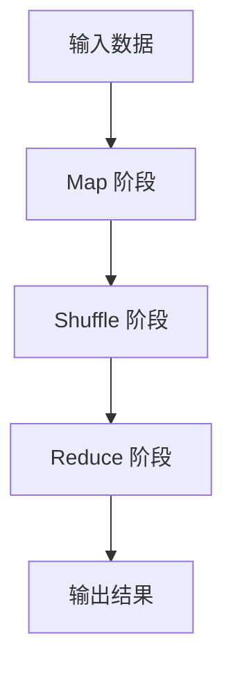

# MapReduce 原理与代码实例讲解

## 1.背景介绍

在大数据时代，处理海量数据成为了一个巨大的挑战。传统的单机处理方式已经无法满足需求，分布式计算应运而生。MapReduce 是由 Google 提出的一个编程模型，用于处理和生成大规模数据集。它通过将任务分解为小块并行处理，极大地提高了数据处理的效率。

MapReduce 的核心思想是将复杂的任务分解为两个阶段：Map 阶段和 Reduce 阶段。Map 阶段负责将输入数据分解为一系列键值对，Reduce 阶段则负责对这些键值对进行汇总和处理。通过这种方式，MapReduce 可以在分布式系统中高效地处理大规模数据。

## 2.核心概念与联系

### 2.1 Map 阶段

Map 阶段是 MapReduce 的第一个阶段。在这个阶段，输入数据被分割成多个小块，每个小块由一个 Map 函数处理。Map 函数将输入数据转换为一系列键值对。这个过程可以并行进行，从而提高处理速度。

### 2.2 Shuffle 阶段

Shuffle 阶段是 MapReduce 的中间阶段。在这个阶段，Map 阶段生成的键值对被重新分配，以便相同键的值被分配到同一个 Reduce 任务中。这个过程涉及数据的排序和传输，是 MapReduce 的关键步骤之一。

### 2.3 Reduce 阶段

Reduce 阶段是 MapReduce 的最后一个阶段。在这个阶段，Shuffle 阶段生成的键值对被传递给 Reduce 函数。Reduce 函数对相同键的值进行汇总和处理，生成最终的输出结果。

### 2.4 MapReduce 流程图



## 3.核心算法原理具体操作步骤

### 3.1 数据分割

MapReduce 的第一个步骤是将输入数据分割成多个小块。每个小块由一个 Map 任务处理。数据分割的方式可以根据具体需求进行调整，例如按行分割或按固定大小分割。

### 3.2 Map 阶段

在 Map 阶段，每个 Map 任务处理一个数据块，并将其转换为一系列键值对。Map 函数的具体实现可以根据需求进行定制。例如，对于一个文本文件，可以将每一行作为一个输入，并将其转换为单词和计数的键值对。

### 3.3 Shuffle 阶段

Shuffle 阶段是 MapReduce 的关键步骤之一。在这个阶段，Map 阶段生成的键值对被重新分配，以便相同键的值被分配到同一个 Reduce 任务中。这个过程涉及数据的排序和传输，是 MapReduce 的性能瓶颈之一。

### 3.4 Reduce 阶段

在 Reduce 阶段，每个 Reduce 任务处理一个键及其对应的值列表。Reduce 函数对这些值进行汇总和处理，生成最终的输出结果。例如，对于单词计数任务，Reduce 函数可以对相同单词的计数进行累加。

## 4.数学模型和公式详细讲解举例说明

MapReduce 的数学模型可以用以下公式表示：

$$
\text{Map}: (k1, v1) \rightarrow \text{list}(k2, v2)
$$

$$
\text{Reduce}: (k2, \text{list}(v2)) \rightarrow \text{list}(v3)
$$

其中，$(k1, v1)$ 是输入数据的键值对，$(k2, v2)$ 是 Map 阶段生成的键值对，$(k2, \text{list}(v2))$ 是 Shuffle 阶段生成的键值对列表，$(k2, \text{list}(v3))$ 是 Reduce 阶段生成的最终输出。

### 4.1 示例：单词计数

假设我们有一个文本文件，内容如下：

```
hello world
hello mapreduce
```

我们希望统计每个单词的出现次数。可以使用以下 Map 和 Reduce 函数：

#### Map 函数

```python
def map_function(line):
    words = line.split()
    for word in words:
        yield (word, 1)
```

#### Reduce 函数

```python
def reduce_function(word, counts):
    yield (word, sum(counts))
```

### 4.2 数学公式解释

对于输入数据 "hello world\nhello mapreduce"，Map 函数生成的键值对如下：

```
("hello", 1), ("world", 1), ("hello", 1), ("mapreduce", 1)
```

在 Shuffle 阶段，这些键值对被重新分配为：

```
("hello", [1, 1]), ("world", [1]), ("mapreduce", [1])
```

在 Reduce 阶段，Reduce 函数对这些键值对进行汇总，生成最终输出：

```
("hello", 2), ("world", 1), ("mapreduce", 1)
```

## 5.项目实践：代码实例和详细解释说明

### 5.1 环境准备

在开始编写 MapReduce 程序之前，我们需要准备好开发环境。可以使用 Hadoop 作为 MapReduce 的实现平台。以下是安装 Hadoop 的基本步骤：

1. 下载 Hadoop 安装包。
2. 解压安装包。
3. 配置 Hadoop 环境变量。
4. 启动 Hadoop 服务。

### 5.2 编写 MapReduce 程序

以下是一个简单的 MapReduce 程序，用于统计文本文件中的单词出现次数。

#### Map 函数

```python
from mrjob.job import MRJob

class MRWordCount(MRJob):

    def mapper(self, _, line):
        words = line.split()
        for word in words:
            yield (word, 1)
```

#### Reduce 函数

```python
    def reducer(self, word, counts):
        yield (word, sum(counts))

if __name__ == '__main__':
    MRWordCount.run()
```

### 5.3 运行 MapReduce 程序

将上述代码保存为 `wordcount.py`，然后在命令行中运行以下命令：

```bash
python wordcount.py input.txt
```

其中，`input.txt` 是输入文本文件。程序将输出每个单词的出现次数。

## 6.实际应用场景

MapReduce 在大数据处理领域有广泛的应用。以下是一些典型的应用场景：

### 6.1 日志分析

在大规模分布式系统中，日志数据量非常庞大。可以使用 MapReduce 对日志数据进行分析，例如统计访问次数、错误率等。

### 6.2 数据挖掘

MapReduce 可以用于大规模数据挖掘任务，例如聚类分析、关联规则挖掘等。通过将数据分割成小块并行处理，可以大大提高数据挖掘的效率。

### 6.3 搜索引擎

搜索引擎需要处理海量的网页数据，可以使用 MapReduce 对网页数据进行索引和排序。例如，Google 的 PageRank 算法就是基于 MapReduce 实现的。

### 6.4 机器学习

MapReduce 可以用于大规模机器学习任务，例如训练模型、预测等。通过将数据分割成小块并行处理，可以大大提高机器学习的效率。

## 7.工具和资源推荐

### 7.1 Hadoop

Hadoop 是一个开源的分布式计算框架，是 MapReduce 的经典实现。Hadoop 提供了丰富的工具和库，可以方便地进行大规模数据处理。

### 7.2 Apache Spark

Apache Spark 是一个快速、通用的分布式计算系统。相比于 Hadoop，Spark 提供了更高的计算性能和更丰富的 API，可以更方便地进行大规模数据处理。

### 7.3 MRJob

MRJob 是一个 Python 库，可以方便地编写和运行 MapReduce 程序。MRJob 提供了简单易用的 API，可以快速上手。

### 7.4 书籍推荐

- 《Hadoop: The Definitive Guide》：这本书详细介绍了 Hadoop 的原理和使用方法，是学习 MapReduce 的经典书籍。
- 《Programming Pig》：这本书介绍了 Pig 语言及其在大数据处理中的应用，是学习大数据处理的好书。

## 8.总结：未来发展趋势与挑战

MapReduce 作为一种经典的大数据处理模型，已经在业界得到了广泛应用。然而，随着数据规模的不断增长和计算需求的不断提高，MapReduce 也面临着一些挑战和发展趋势。

### 8.1 性能优化

MapReduce 的性能瓶颈主要在于 Shuffle 阶段的数据传输和排序。未来的研究方向之一是如何优化 Shuffle 阶段的性能，例如通过改进数据传输协议、优化排序算法等。

### 8.2 实时处理

传统的 MapReduce 模型主要用于批处理任务，无法满足实时数据处理的需求。未来的发展趋势之一是将 MapReduce 与流处理技术结合，实现实时数据处理。

### 8.3 易用性提升

MapReduce 的编程模型相对复杂，需要开发者具备一定的分布式计算知识。未来的发展方向之一是提供更高层次的编程接口和工具，降低开发难度，提高易用性。

## 9.附录：常见问题与解答

### 9.1 MapReduce 与 Hadoop 有什么关系？

MapReduce 是一种编程模型，而 Hadoop 是 MapReduce 的经典实现。Hadoop 提供了 MapReduce 的运行环境和工具，可以方便地进行大规模数据处理。

### 9.2 MapReduce 可以处理哪些类型的数据？

MapReduce 可以处理各种类型的数据，包括结构化数据、半结构化数据和非结构化数据。通过定制 Map 和 Reduce 函数，可以处理不同类型的数据。

### 9.3 MapReduce 的性能如何？

MapReduce 的性能主要取决于数据规模、计算资源和算法实现。通过合理的数据分割、优化算法和充分利用计算资源，可以大大提高 MapReduce 的性能。

### 9.4 如何调试 MapReduce 程序？

调试 MapReduce 程序可以通过日志记录、单步调试和模拟运行等方式进行。Hadoop 提供了丰富的调试工具和日志记录功能，可以方便地进行调试。

### 9.5 MapReduce 的应用场景有哪些？

MapReduce 在大数据处理领域有广泛的应用，包括日志分析、数据挖掘、搜索引擎、机器学习等。通过将数据分割成小块并行处理，可以大大提高数据处理的效率。

---

作者：禅与计算机程序设计艺术 / Zen and the Art of Computer Programming