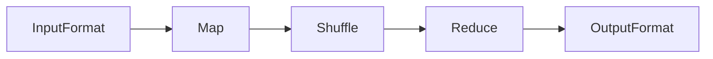
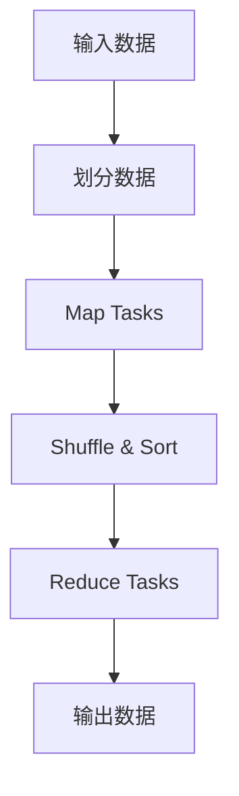
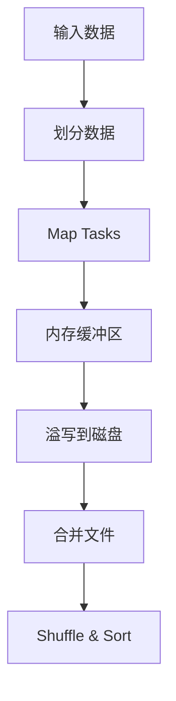

# MapReduce原理与代码实例讲解

## 1. 背景介绍

### 1.1 大数据时代的到来

随着互联网、物联网、移动互联网等新兴技术的快速发展,数据量呈现出爆炸式增长。传统的数据处理方式已经无法满足大数据时代对海量数据的存储和计算需求。在这种背景下,MapReduce作为一种全新的大规模数据处理模型应运而生。

### 1.2 MapReduce的起源

MapReduce编程模型最早由Google的工程师团队在2004年提出,用于解决Google的网页检索计算问题。MapReduce将复杂的计算任务分解为两个主要阶段:Map阶段和Reduce阶段,并通过大量的机器并行执行,从而实现了对海量数据的高效处理。

### 1.3 MapReduce的优势

MapReduce具有以下优势:

- **高度可扩展**:可以通过增加机器数量来线性扩展计算能力
- **容错性强**:任务失败时可自动重新分配和执行
- **编程模型简单**:开发人员只需关注Map和Reduce两个核心函数
- **适合大数据处理**:可以高效处理TB甚至PB级别的海量数据集

## 2. 核心概念与联系

### 2.1 MapReduce编程模型

MapReduce编程模型包括以下几个核心概念:

- **InputFormat**:用于读取输入数据并将其划分为键值对
- **Map**:对输入的键值对执行用户自定义的Map操作,生成中间结果
- **Shuffle**:对Map阶段的输出进行合并、分组和排序
- **Reduce**:对Shuffle后的数据执行用户自定义的Reduce操作,生成最终结果
- **OutputFormat**:用于将Reduce的输出结果写入外部存储系统

这些概念之间的关系如下Mermaid流程图所示:



### 2.2 MapReduce执行流程

MapReduce任务的执行流程大致如下:

1. 输入数据被划分为多个Split
2. 每个Split被分配给一个Map Task执行Map操作
3. Map Task输出的中间结果被分区和排序
4. 每个Reduce Task获取对应分区的数据
5. Reduce Task执行Reduce操作并输出最终结果

该执行流程可以用下面的Mermaid流程图表示:



## 3. 核心算法原理具体操作步骤

### 3.1 Map阶段

Map阶段的主要步骤如下:

1. **InputFormat**读取输入数据,并将其划分为多个逻辑Split
2. **InputSplit**被分配给不同的Map Task执行
3. 每个Map Task执行用户自定义的`map()`函数
4. `map()`函数对输入的键值对执行操作,生成中间结果
5. 中间结果被缓存在内存的环形缓冲区中
6. 当缓冲区达到一定阈值时,中间结果会溢写到本地磁盘
7. 在Map Task完成后,中间结果会被发送到Reduce Task

Map阶段的流程图如下:



### 3.2 Shuffle阶段

Shuffle阶段的主要步骤如下:

1. 从Map Task获取中间结果文件
2. 对中间结果进行分区和排序
3. 将排序后的数据传输到对应的Reduce Task

Shuffle阶段的流程图如下:


### 3.3 Reduce阶段

Reduce阶段的主要步骤如下:

1. 从Shuffle阶段获取对应分区的数据
2. 对每个键执行用户自定义的`reduce()`函数
3. `reduce()`函数对键对应的值集合执行操作,生成最终结果
4. 最终结果被写入到OutputFormat指定的输出路径

Reduce阶段的流程图如下:

```mermaid
graph TD
    ReduceInput[Reduce输入] --> IterateKeys[迭代键]
    IterateKeys --> ReduceFunction[reduce()函数]
    ReduceFunction --> OutputData[输出数据]
```

## 4. 数学模型和公式详细讲解举例说明

在MapReduce中,常见的数学模型和公式包括:

### 4.1 数据分区

MapReduce采用哈希分区(Hash Partitioning)的方式将中间结果划分到不同的Reduce Task中。假设有R个Reduce Task,对于任意一个键值对(key, value),它会被分配到第hash(key) % R个Reduce Task中。

$$
partition(key) = hash(key) \bmod R
$$

其中,hash(key)是一个哈希函数,用于将键映射到一个整数值。常见的哈希函数包括MD5、SHA-1等。

### 4.2 数据排序

在Shuffle阶段,MapReduce会对每个Reduce Task的输入数据进行排序。假设有N个Map Task,每个Map Task输出M条记录,则Shuffle阶段的时间复杂度为:

$$
T(N, M) = O(N \times M \times \log(M))
$$

这是因为需要对每个Map Task的输出进行排序,排序的时间复杂度为O(M log M),总的时间复杂度为O(N × M × log(M))。

### 4.3 数据聚合

在Reduce阶段,MapReduce会对每个键对应的值集合执行聚合操作。假设有R个Reduce Task,每个Reduce Task处理M条记录,则Reduce阶段的时间复杂度为:

$$
T(R, M) = O(R \times M)
$$

这是因为每个Reduce Task需要遍历M条记录,执行用户自定义的reduce()函数,时间复杂度为O(M)。总的时间复杂度为O(R × M)。

## 5. 项目实践:代码实例和详细解释说明

为了更好地理解MapReduce的工作原理,我们将通过一个实际的代码示例来演示MapReduce的使用。在这个示例中,我们将统计一个文本文件中每个单词出现的次数。

### 5.1 项目环境准备

我们将使用Apache Hadoop作为MapReduce的运行环境。Hadoop是一个开源的分布式计算框架,它提供了MapReduce编程模型的实现。

首先,需要下载并安装Hadoop。你可以从Apache Hadoop官网(https://hadoop.apache.org/)获取最新版本的安装包。安装过程请参考官方文档。

### 5.2 输入数据准备

我们将使用一个简单的文本文件作为输入数据。假设文件内容如下:

```
Hello World
Hello Hadoop
Hadoop MapReduce
```

将这个文本文件保存为`input.txt`。

### 5.3 编写Map函数

Map函数的作用是将输入的文本行拆分为单词,并为每个单词生成一个键值对(word, 1)。以下是Map函数的Java代码实现:

```java
import java.io.IOException;
import org.apache.hadoop.io.IntWritable;
import org.apache.hadoop.io.LongWritable;
import org.apache.hadoop.io.Text;
import org.apache.hadoop.mapreduce.Mapper;

public class WordCountMapper extends Mapper<LongWritable, Text, Text, IntWritable> {

    private final static IntWritable one = new IntWritable(1);
    private Text word = new Text();

    @Override
    public void map(LongWritable key, Text value, Context context) throws IOException, InterruptedException {
        String line = value.toString();
        String[] words = line.split("\\s+");
        for (String w : words) {
            word.set(w);
            context.write(word, one);
        }
    }
}
```

在这个Map函数中,我们首先将输入的文本行拆分为单词数组。然后,对于每个单词,我们将其作为键,值为1,输出一个键值对(word, 1)。

### 5.4 编写Reduce函数

Reduce函数的作用是将Map阶段输出的键值对(word, 1)进行汇总,计算每个单词出现的总次数。以下是Reduce函数的Java代码实现:

```java
import java.io.IOException;
import org.apache.hadoop.io.IntWritable;
import org.apache.hadoop.io.Text;
import org.apache.hadoop.mapreduce.Reducer;

public class WordCountReducer extends Reducer<Text, IntWritable, Text, IntWritable> {

    @Override
    public void reduce(Text key, Iterable<IntWritable> values, Context context)
            throws IOException, InterruptedException {
        int sum = 0;
        for (IntWritable value : values) {
            sum += value.get();
        }
        context.write(key, new IntWritable(sum));
    }
}
```

在这个Reduce函数中,我们遍历每个键对应的值集合,将值相加得到单词出现的总次数。然后,我们将键值对(word, count)作为最终结果输出。

### 5.5 运行MapReduce作业

现在,我们已经准备好了所有必需的组件,可以运行MapReduce作业了。以下是运行作业的命令:

```
hadoop jar /path/to/hadoop-mapreduce-examples.jar wordcount input.txt output
```

这个命令将运行WordCount示例程序,输入数据为`input.txt`,输出结果将保存在`output`目录中。

### 5.6 查看输出结果

作业运行完成后,我们可以查看输出结果。输出结果将以键值对的形式存储在`output`目录下的一个或多个文件中。每一行代表一个键值对,键和值之间用制表符分隔。

```
Hadoop  2
Hello   2
MapReduce       1
World   1
```

从输出结果可以看出,单词"Hadoop"和"Hello"各出现了2次,"MapReduce"和"World"各出现了1次。

通过这个示例,我们可以清楚地看到MapReduce的工作原理:Map阶段将输入数据转换为键值对,Reduce阶段对键值对进行聚合计算,最终得到结果。

## 6. 实际应用场景

MapReduce作为一种通用的大数据处理框架,在许多领域都有广泛的应用。以下是一些典型的应用场景:

### 6.1 网页索引和搜索

MapReduce最初就是为了解决Google的网页索引和搜索问题而设计的。在网页索引和搜索中,Map阶段可以用于解析网页内容,提取关键词和链接信息;Reduce阶段可以用于构建反向索引,计算网页的PageRank值等。

### 6.2 日志分析

在大型网站和互联网服务中,每天都会产生海量的日志数据。MapReduce可以用于对这些日志数据进行分析,例如用户访问模式分析、异常日志统计等。Map阶段可以用于解析日志格式,提取关键信息;Reduce阶段可以用于对提取的信息进行聚合和统计。

### 6.3 数据处理

MapReduce也可以用于各种数据处理任务,如数据清洗、数据转换、数据集成等。Map阶段可以用于对原始数据进行过滤和转换;Reduce阶段可以用于合并和整理数据。

### 6.4 机器学习

在机器学习领域,MapReduce也有广泛的应用。例如,在训练大规模机器学习模型时,可以使用MapReduce来并行化计算。Map阶段可以用于对训练数据进行分区和预处理;Reduce阶段可以用于执行模型训练算法。

### 6.5 科学计算

MapReduce也可以用于科学计算领域,如基因组学、天体物理学等。这些领域通常需要处理大量的数据,MapReduce可以提供高效的并行计算能力。

## 7. 工具和资源推荐

### 7.1 Apache Hadoop

Apache Hadoop是最广为人知的开源MapReduce实现。它不仅提供了MapReduce编程模型,还包括HDFS分布式文件系统、YARN资源管理器等组件,构成了一个完整的大数据处理平台。Hadoop具有良好的扩展性和容错性,适合处理大规模数据集。

官方网站: https://hadoop.apache.org/

### 7.2 Apache Spark

Apache Spark是另一种流行的大数据处理框架。它提供了更高级的编程模