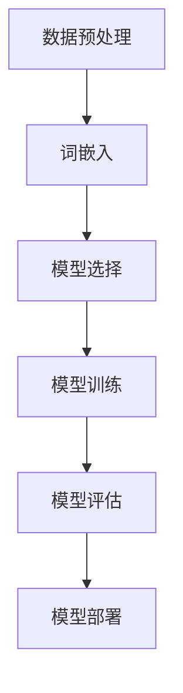

# Python深度学习实践：深度学习在文档自动归类中的应用

## 1.背景介绍

在信息爆炸的时代，文档管理和归类成为了一个重要的挑战。传统的手工归类方法不仅耗时耗力，而且容易出错。随着深度学习技术的迅猛发展，自动化文档归类成为可能。本文将探讨如何利用Python和深度学习技术实现文档的自动归类。

## 2.核心概念与联系

### 2.1 深度学习

深度学习是一种机器学习方法，通过多层神经网络来模拟人脑的工作方式。它在图像识别、自然语言处理等领域取得了显著的成果。

### 2.2 文档归类

文档归类是指将文档按照一定的标准进行分类。传统方法依赖于人工规则，而深度学习方法则通过学习大量的标注数据来自动进行分类。

### 2.3 自然语言处理（NLP）

自然语言处理是计算机科学的一个分支，旨在使计算机能够理解和生成人类语言。文档归类是NLP的一个重要应用。

### 2.4 词嵌入（Word Embedding）

词嵌入是将词语映射到一个连续向量空间的技术，使得语义相似的词在向量空间中距离较近。常用的词嵌入方法有Word2Vec、GloVe等。

## 3.核心算法原理具体操作步骤

### 3.1 数据预处理

数据预处理是深度学习的第一步，包括数据清洗、分词、去停用词等步骤。

### 3.2 词嵌入

使用预训练的词嵌入模型将文本数据转换为向量表示。

### 3.3 模型选择

选择合适的深度学习模型，如卷积神经网络（CNN）、循环神经网络（RNN）等。

### 3.4 模型训练

使用标注数据对模型进行训练，调整模型参数以提高分类准确率。

### 3.5 模型评估

使用验证集对模型进行评估，计算准确率、召回率等指标。

### 3.6 模型部署

将训练好的模型部署到生产环境中，实现自动化文档归类。



## 4.数学模型和公式详细讲解举例说明

### 4.1 词嵌入模型

词嵌入模型将词语映射到向量空间。假设词语 $w_i$ 的向量表示为 $v_i$，则词嵌入模型的目标是最小化以下损失函数：

$$
L = - \sum_{(w_i, w_j) \in D} \log P(w_j | w_i)
$$

其中，$D$ 是词对的集合，$P(w_j | w_i)$ 是在给定词 $w_i$ 的情况下词 $w_j$ 出现的概率。

### 4.2 卷积神经网络（CNN）

卷积神经网络通过卷积层提取文本的局部特征。假设输入文本的向量表示为 $X$，卷积核为 $W$，则卷积操作可以表示为：

$$
Y = f(X * W + b)
$$

其中，$*$ 表示卷积操作，$b$ 是偏置项，$f$ 是激活函数。

### 4.3 循环神经网络（RNN）

循环神经网络通过循环结构处理序列数据。假设输入序列为 $X = \{x_1, x_2, \ldots, x_T\}$，隐藏状态为 $H = \{h_1, h_2, \ldots, h_T\}$，则RNN的计算公式为：

$$
h_t = f(W_h h_{t-1} + W_x x_t + b)
$$

其中，$W_h$ 和 $W_x$ 是权重矩阵，$b$ 是偏置项，$f$ 是激活函数。

## 5.项目实践：代码实例和详细解释说明

### 5.1 数据预处理

```python
import nltk
from nltk.corpus import stopwords
from nltk.tokenize import word_tokenize

# 下载停用词
nltk.download('stopwords')
nltk.download('punkt')

# 加载数据
text = "这是一个示例文档。"

# 分词
tokens = word_tokenize(text)

# 去停用词
filtered_tokens = [word for word in tokens if word not in stopwords.words('chinese')]

print(filtered_tokens)
```

### 5.2 词嵌入

```python
from gensim.models import Word2Vec

# 训练词嵌入模型
model = Word2Vec(sentences=[filtered_tokens], vector_size=100, window=5, min_count=1, workers=4)

# 获取词向量
vector = model.wv['示例']
print(vector)
```

### 5.3 模型选择与训练

```python
import tensorflow as tf
from tensorflow.keras.models import Sequential
from tensorflow.keras.layers import Embedding, Conv1D, GlobalMaxPooling1D, Dense

# 构建模型
model = Sequential([
    Embedding(input_dim=5000, output_dim=100, input_length=100),
    Conv1D(filters=128, kernel_size=5, activation='relu'),
    GlobalMaxPooling1D(),
    Dense(units=10, activation='softmax')
])

# 编译模型
model.compile(optimizer='adam', loss='categorical_crossentropy', metrics=['accuracy'])

# 训练模型
model.fit(X_train, y_train, epochs=10, batch_size=32, validation_data=(X_val, y_val))
```

### 5.4 模型评估

```python
# 评估模型
loss, accuracy = model.evaluate(X_test, y_test)
print(f"Test Accuracy: {accuracy}")
```

### 5.5 模型部署

```python
import joblib

# 保存模型
joblib.dump(model, 'document_classifier.pkl')

# 加载模型
loaded_model = joblib.load('document_classifier.pkl')

# 预测
predictions = loaded_model.predict(X_new)
print(predictions)
```

## 6.实际应用场景

### 6.1 企业文档管理

在企业中，文档管理是一个重要的任务。通过自动化文档归类，可以大大提高文档管理的效率，减少人为错误。

### 6.2 法律文档归类

法律文档通常具有复杂的结构和内容，通过深度学习技术，可以实现法律文档的自动归类，帮助律师和法务人员快速找到相关文档。

### 6.3 医疗文档归类

在医疗领域，文档归类可以帮助医生和研究人员快速查找相关病例和研究文献，提高医疗服务的质量和效率。

## 7.工具和资源推荐

### 7.1 开源工具

- TensorFlow：一个开源的深度学习框架，支持多种神经网络模型。
- Keras：一个高级神经网络API，能够快速构建和训练深度学习模型。
- Gensim：一个用于自然语言处理的Python库，支持词嵌入模型的训练和使用。

### 7.2 数据集

- 20 Newsgroups：一个常用的文本分类数据集，包含20个新闻组的文档。
- Reuters-21578：一个经典的文本分类数据集，包含多个类别的新闻文档。

### 7.3 在线资源

- Coursera：提供多门深度学习和自然语言处理的在线课程。
- GitHub：可以找到许多开源的文档归类项目和代码示例。

## 8.总结：未来发展趋势与挑战

### 8.1 未来发展趋势

随着深度学习技术的不断进步，文档自动归类的准确率和效率将进一步提高。未来，结合更多的上下文信息和多模态数据（如图像、音频等），文档归类的应用场景将更加广泛。

### 8.2 挑战

尽管深度学习在文档归类中取得了显著的成果，但仍然面临一些挑战。例如，如何处理长文本、如何应对多语言文档、如何提高模型的可解释性等。这些问题需要进一步的研究和探索。

## 9.附录：常见问题与解答

### 9.1 如何选择合适的深度学习模型？

选择合适的深度学习模型需要考虑数据的特点和任务的需求。对于短文本，可以选择卷积神经网络（CNN）；对于长文本，可以选择循环神经网络（RNN）或其变种（如LSTM、GRU）。

### 9.2 如何处理多语言文档？

处理多语言文档可以使用多语言词嵌入模型（如MUSE）或多语言预训练模型（如BERT、XLM-R）。这些模型能够将不同语言的文本映射到同一个向量空间，从而实现跨语言的文档归类。

### 9.3 如何提高模型的可解释性？

提高模型的可解释性可以使用注意力机制（Attention Mechanism）或可解释的模型架构（如决策树、线性模型）。此外，可以使用可视化工具（如LIME、SHAP）来解释模型的预测结果。

---

作者：禅与计算机程序设计艺术 / Zen and the Art of Computer Programming