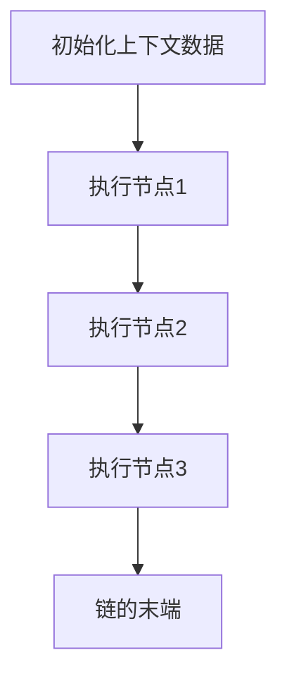

# 【LangChain编程：从入门到实践】RunnableLambda

## 1.背景介绍

在现代软件开发中，链式编程（Chaining Programming）是一种强大的编程范式，它允许开发者通过将多个函数或操作链接在一起，创建出复杂而灵活的功能。LangChain是这一领域中的一个重要框架，它提供了一种简洁而高效的方式来实现链式编程。本文将深入探讨LangChain的核心概念、算法原理、数学模型、实际应用以及未来发展趋势。

## 2.核心概念与联系

### 2.1 LangChain简介

LangChain是一个用于链式编程的框架，它允许开发者通过定义一系列的操作和规则，将这些操作链接在一起，从而实现复杂的功能。LangChain的核心思想是将每个操作视为一个独立的模块，通过链式调用的方式，将这些模块组合在一起。

### 2.2 核心概念

- **链（Chain）**：一系列链接在一起的操作。
- **节点（Node）**：链中的每一个独立操作。
- **上下文（Context）**：在链中传递的数据和状态。
- **规则（Rule）**：定义节点之间的链接关系。

### 2.3 核心联系

LangChain的核心联系在于节点之间的链接关系。每个节点可以接收上下文数据，进行处理后，将结果传递给下一个节点。通过定义规则，可以灵活地控制节点之间的链接方式。

## 3.核心算法原理具体操作步骤

### 3.1 链的创建

创建一个链的基本步骤如下：

1. 定义节点：每个节点代表一个独立的操作。
2. 定义规则：规则决定了节点之间的链接关系。
3. 创建链：将节点和规则组合在一起，创建一个链。

### 3.2 节点的定义

节点的定义通常包括以下几个部分：

- 输入：节点接收的上下文数据。
- 处理：节点对数据进行的操作。
- 输出：节点处理后的结果。

### 3.3 规则的定义

规则的定义包括以下几个部分：

- 条件：决定是否执行链接操作的条件。
- 操作：链接操作的具体实现。

### 3.4 链的执行

链的执行过程如下：

1. 初始化上下文数据。
2. 按照规则依次执行节点操作。
3. 将结果传递给下一个节点，直到链的末端。

以下是一个Mermaid流程图，展示了链的执行过程：



## 4.数学模型和公式详细讲解举例说明

### 4.1 数学模型

LangChain的数学模型可以用图论来表示。每个节点可以视为图中的一个顶点，节点之间的链接关系可以视为图中的边。上下文数据在图中传递，形成一个有向图。

### 4.2 公式

假设有一个链 $C$，包含节点 $N_1, N_2, \ldots, N_k$，上下文数据为 $X$，则链的执行过程可以表示为：

$$
X_{i+1} = f_i(X_i)
$$

其中，$f_i$ 表示节点 $N_i$ 的处理操作，$X_i$ 表示节点 $N_i$ 的输入数据，$X_{i+1}$ 表示节点 $N_i$ 的输出数据。

### 4.3 举例说明

假设有一个简单的链，包含三个节点：加法节点、乘法节点和减法节点。初始上下文数据为 $X = 2$，链的执行过程如下：

1. 加法节点：$X_1 = X + 3 = 5$
2. 乘法节点：$X_2 = X_1 \times 2 = 10$
3. 减法节点：$X_3 = X_2 - 4 = 6$

最终结果为 $6$。

## 5.项目实践：代码实例和详细解释说明

### 5.1 环境准备

首先，确保你的开发环境中已经安装了LangChain框架。可以使用以下命令进行安装：

```bash
pip install langchain
```

### 5.2 代码实例

以下是一个简单的LangChain代码实例，展示了如何创建和执行一个链：

```python
from langchain import Chain, Node, Context

# 定义节点
class AddNode(Node):
    def process(self, context: Context):
        context.data += 3

class MultiplyNode(Node):
    def process(self, context: Context):
        context.data *= 2

class SubtractNode(Node):
    def process(self, context: Context):
        context.data -= 4

# 创建链
chain = Chain()
chain.add_node(AddNode())
chain.add_node(MultiplyNode())
chain.add_node(SubtractNode())

# 初始化上下文数据
context = Context(data=2)

# 执行链
chain.execute(context)

# 输出结果
print(context.data)  # 输出: 6
```

### 5.3 详细解释

1. **定义节点**：我们定义了三个节点，分别是加法节点、乘法节点和减法节点。每个节点都继承自 `Node` 类，并实现了 `process` 方法。
2. **创建链**：我们创建了一个 `Chain` 对象，并将三个节点添加到链中。
3. **初始化上下文数据**：我们创建了一个 `Context` 对象，并初始化数据为 `2`。
4. **执行链**：我们调用 `chain.execute` 方法，执行链中的所有节点操作。
5. **输出结果**：最终结果为 `6`。

## 6.实际应用场景

LangChain在实际应用中有广泛的应用场景，以下是几个典型的例子：

### 6.1 数据处理

在数据处理领域，LangChain可以用于数据清洗、转换和分析。通过定义一系列的数据处理节点，可以轻松实现复杂的数据处理流程。

### 6.2 机器学习

在机器学习领域，LangChain可以用于数据预处理、特征工程和模型训练。通过链式调用，可以将多个数据处理和模型训练步骤组合在一起，提高开发效率。

### 6.3 自动化工作流

在自动化工作流领域，LangChain可以用于定义和执行复杂的工作流。通过定义一系列的操作节点，可以实现自动化的任务调度和执行。

## 7.工具和资源推荐

### 7.1 开发工具

- **PyCharm**：一款强大的Python集成开发环境，支持LangChain开发。
- **Jupyter Notebook**：一个交互式的开发环境，适合进行LangChain的实验和调试。

### 7.2 在线资源

- **LangChain官方文档**：提供了详细的LangChain使用指南和API文档。
- **GitHub**：LangChain的开源代码库，包含了丰富的示例和社区贡献的代码。

### 7.3 学习资源

- **《LangChain编程：从入门到实践》**：一本详细介绍LangChain编程的书籍，适合初学者和进阶开发者。
- **在线课程**：多个在线教育平台提供了LangChain相关的课程，适合系统学习。

## 8.总结：未来发展趋势与挑战

### 8.1 未来发展趋势

LangChain作为一种强大的编程范式，未来有望在多个领域得到广泛应用。随着人工智能和大数据技术的发展，LangChain在数据处理、机器学习和自动化工作流等领域的应用前景广阔。

### 8.2 挑战

尽管LangChain有着广泛的应用前景，但在实际应用中也面临一些挑战。例如，如何高效地管理和调试复杂的链式调用，如何保证链中各个节点的可靠性和稳定性，都是需要解决的问题。

## 9.附录：常见问题与解答

### 9.1 如何安装LangChain？

可以使用以下命令进行安装：

```bash
pip install langchain
```

### 9.2 如何定义一个自定义节点？

可以通过继承 `Node` 类，并实现 `process` 方法来定义一个自定义节点。例如：

```python
class CustomNode(Node):
    def process(self, context: Context):
        # 自定义处理逻辑
        pass
```

### 9.3 如何调试链式调用？

可以使用调试工具（如PyCharm或Jupyter Notebook）逐步执行链中的每个节点操作，检查上下文数据的变化情况。

### 9.4 LangChain是否支持并行执行？

目前LangChain主要支持串行执行，但可以通过自定义节点和规则，实现并行执行的功能。

### 9.5 LangChain是否支持分布式执行？

LangChain本身不支持分布式执行，但可以结合其他分布式计算框架（如Apache Spark）实现分布式执行。

---

作者：禅与计算机程序设计艺术 / Zen and the Art of Computer Programming