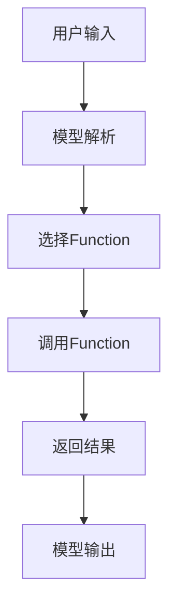

# 【大模型应用开发 动手做AI Agent】创建能使用Function的助手

## 1.背景介绍

在人工智能领域，特别是自然语言处理（NLP）和大模型（Large Language Models, LLMs）的发展中，AI Agent的应用越来越广泛。AI Agent不仅可以理解和生成自然语言，还能通过调用特定的函数（Function）来执行复杂的任务。这种能力使得AI Agent在各种应用场景中变得更加实用和高效。

近年来，随着GPT-3、BERT等大模型的出现，AI Agent的能力得到了极大的提升。然而，如何将这些大模型与具体的函数调用结合起来，创建一个能使用Function的助手，仍然是一个具有挑战性的问题。本篇文章将深入探讨这一问题，提供详细的技术实现步骤和实际应用案例。

## 2.核心概念与联系

### 2.1 大模型（LLM）

大模型是指具有大量参数和复杂结构的深度学习模型，通常用于处理自然语言任务。典型的大模型包括GPT-3、BERT等，它们能够理解和生成高质量的自然语言文本。

### 2.2 AI Agent

AI Agent是一种能够自主执行任务的智能系统。它可以通过与用户交互，理解用户的需求，并调用相应的函数来完成任务。

### 2.3 Function

在编程中，Function是指一段可以被调用执行的代码。Function可以接受输入参数，并返回结果。在AI Agent中，Function可以用于执行特定的任务，如数据处理、信息查询等。

### 2.4 大模型与Function的结合

将大模型与Function结合起来，可以使AI Agent不仅能够理解和生成自然语言，还能通过调用Function来执行具体的任务。这种结合可以大大提升AI Agent的实用性和效率。

## 3.核心算法原理具体操作步骤

### 3.1 数据预处理

在创建能使用Function的助手之前，首先需要进行数据预处理。数据预处理包括数据清洗、数据标注等步骤。数据清洗是指去除数据中的噪声和错误，数据标注是指为数据添加标签，以便模型进行训练。

### 3.2 模型训练

模型训练是指使用预处理后的数据来训练大模型。在训练过程中，模型会不断调整参数，以最小化损失函数。常用的训练算法包括梯度下降、Adam等。

### 3.3 Function定义

在模型训练完成后，需要定义具体的Function。这些Function可以是任何可以被调用执行的代码段。Function的定义需要明确输入参数和返回结果。

### 3.4 模型与Function的结合

将模型与Function结合起来，可以通过以下步骤实现：

1. **输入解析**：模型接收到用户输入后，首先进行解析，提取出关键信息。
2. **Function调用**：根据解析结果，选择合适的Function进行调用。
3. **结果返回**：Function执行完成后，将结果返回给模型，模型再将结果呈现给用户。

以下是一个简单的Mermaid流程图，展示了模型与Function结合的过程：



## 4.数学模型和公式详细讲解举例说明

### 4.1 损失函数

在模型训练过程中，损失函数是一个非常重要的概念。损失函数用于衡量模型预测结果与真实结果之间的差距。常用的损失函数包括均方误差（MSE）、交叉熵损失等。

$$
L(y, \hat{y}) = \frac{1}{n} \sum_{i=1}^{n} (y_i - \hat{y}_i)^2
$$

其中，$y_i$ 是真实结果，$\hat{y}_i$ 是模型预测结果，$n$ 是样本数量。

### 4.2 梯度下降

梯度下降是一种常用的优化算法，用于最小化损失函数。梯度下降通过不断调整模型参数，使得损失函数的值逐渐减小。

$$
\theta = \theta - \alpha \nabla L(\theta)
$$

其中，$\theta$ 是模型参数，$\alpha$ 是学习率，$\nabla L(\theta)$ 是损失函数的梯度。

### 4.3 Function调用

Function调用可以看作是一个映射过程，将输入映射到输出。假设Function $f$ 的输入为 $x$，输出为 $y$，则有：

$$
y = f(x)
$$

在AI Agent中，模型通过解析用户输入，得到输入参数 $x$，然后调用Function $f$，得到输出结果 $y$。

## 5.项目实践：代码实例和详细解释说明

### 5.1 数据预处理

以下是一个简单的数据预处理代码示例：

```python
import pandas as pd

# 读取数据
data = pd.read_csv('data.csv')

# 数据清洗
data = data.dropna()

# 数据标注
data['label'] = data['text'].apply(lambda x: 1 if 'positive' in x else 0)

# 保存预处理后的数据
data.to_csv('preprocessed_data.csv', index=False)
```

### 5.2 模型训练

以下是一个简单的模型训练代码示例：

```python
import torch
import torch.nn as nn
import torch.optim as optim
from torch.utils.data import DataLoader, Dataset

# 定义数据集
class TextDataset(Dataset):
    def __init__(self, data):
        self.data = data

    def __len__(self):
        return len(self.data)

    def __getitem__(self, idx):
        return self.data.iloc[idx]['text'], self.data.iloc[idx]['label']

# 定义模型
class TextModel(nn.Module):
    def __init__(self):
        super(TextModel, self).__init__()
        self.fc = nn.Linear(100, 2)

    def forward(self, x):
        return self.fc(x)

# 读取数据
data = pd.read_csv('preprocessed_data.csv')
dataset = TextDataset(data)
dataloader = DataLoader(dataset, batch_size=32, shuffle=True)

# 初始化模型
model = TextModel()
criterion = nn.CrossEntropyLoss()
optimizer = optim.Adam(model.parameters(), lr=0.001)

# 训练模型
for epoch in range(10):
    for text, label in dataloader:
        optimizer.zero_grad()
        output = model(text)
        loss = criterion(output, label)
        loss.backward()
        optimizer.step()
```

### 5.3 Function定义

以下是一个简单的Function定义代码示例：

```python
def add(a, b):
    return a + b

def subtract(a, b):
    return a - b

def multiply(a, b):
    return a * b

def divide(a, b):
    if b == 0:
        return 'Error: Division by zero'
    return a / b
```

### 5.4 模型与Function的结合

以下是一个简单的模型与Function结合的代码示例：

```python
def ai_agent(input_text):
    # 模型解析
    parsed_input = model.parse(input_text)
    
    # 选择Function
    if 'add' in parsed_input:
        result = add(parsed_input['a'], parsed_input['b'])
    elif 'subtract' in parsed_input:
        result = subtract(parsed_input['a'], parsed_input['b'])
    elif 'multiply' in parsed_input:
        result = multiply(parsed_input['a'], parsed_input['b'])
    elif 'divide' in parsed_input:
        result = divide(parsed_input['a'], parsed_input['b'])
    else:
        result = 'Error: Unknown operation'
    
    # 返回结果
    return result
```

## 6.实际应用场景

### 6.1 客服系统

在客服系统中，AI Agent可以通过调用Function来处理用户的各种请求，如查询订单状态、修改订单信息等。

### 6.2 智能家居

在智能家居中，AI Agent可以通过调用Function来控制家电设备，如开关灯、调节温度等。

### 6.3 金融服务

在金融服务中，AI Agent可以通过调用Function来进行风险评估、投资建议等。

## 7.工具和资源推荐

### 7.1 开发工具

- **PyTorch**：一个开源的深度学习框架，适用于大模型的训练和推理。
- **TensorFlow**：另一个流行的深度学习框架，提供了丰富的工具和资源。
- **Jupyter Notebook**：一个交互式的开发环境，适用于数据预处理、模型训练和结果展示。

### 7.2 数据集

- **IMDB**：一个电影评论数据集，适用于情感分析任务。
- **SQuAD**：一个问答数据集，适用于阅读理解任务。
- **COCO**：一个图像数据集，适用于图像识别和生成任务。

### 7.3 资源推荐

- **《深度学习》**：一本经典的深度学习教材，适合初学者和进阶学习者。
- **《自然语言处理入门》**：一本介绍自然语言处理基础知识的书籍，适合初学者。
- **《Python编程：从入门到实践》**：一本全面介绍Python编程的书籍，适合初学者和进阶学习者。

## 8.总结：未来发展趋势与挑战

### 8.1 未来发展趋势

随着大模型和AI Agent技术的不断发展，未来将会有更多的应用场景和创新应用。例如，AI Agent可以用于医疗诊断、教育辅导、智能交通等领域，提供更加智能和高效的服务。

### 8.2 挑战

尽管AI Agent技术有着广阔的应用前景，但也面临着一些挑战。例如，如何提高模型的鲁棒性和安全性，如何处理复杂和多样化的用户需求，如何保证数据隐私和安全等。这些问题需要研究人员和工程师们不断探索和解决。

## 9.附录：常见问题与解答

### 9.1 如何选择合适的大模型？

选择合适的大模型需要考虑多个因素，如任务类型、数据量、计算资源等。对于自然语言处理任务，可以选择GPT-3、BERT等大模型；对于图像处理任务，可以选择ResNet、VGG等大模型。

### 9.2 如何提高模型的性能？

提高模型性能的方法有很多，如增加数据量、优化模型结构、调整超参数等。此外，还可以使用迁移学习、数据增强等技术来提升模型的性能。

### 9.3 如何处理数据隐私和安全问题？

处理数据隐私和安全问题需要采取多种措施，如数据加密、访问控制、隐私保护等。此外，还可以使用联邦学习等技术，在保证数据隐私的前提下进行模型训练。

### 9.4 如何应对模型的鲁棒性问题？

应对模型的鲁棒性问题可以通过多种方法，如增加数据多样性、使用对抗训练、进行模型验证等。此外，还可以使用模型集成等技术，提高模型的鲁棒性和稳定性。

### 9.5 如何保证Function的正确性和安全性？

保证Function的正确性和安全性需要进行充分的测试和验证。此外，还可以使用代码审查、静态分析等技术，发现和修复潜在的问题。

---

作者：禅与计算机程序设计艺术 / Zen and the Art of Computer Programming