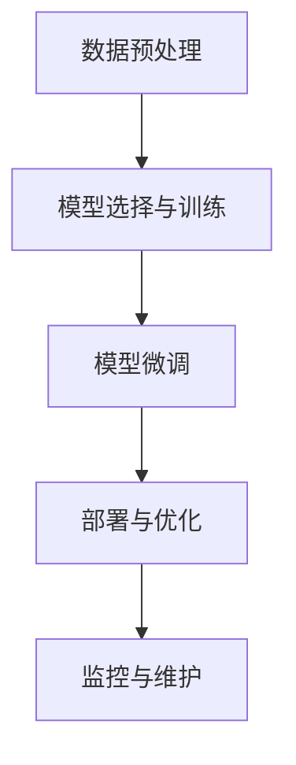

# 【大模型应用开发 动手做AI Agent】期望顶峰和失望低谷

## 1.背景介绍

### 1.1 人工智能的崛起

人工智能（AI）已经从科幻小说中的概念变成了现实世界中的强大工具。随着计算能力的提升和数据量的爆炸性增长，AI技术在各个领域得到了广泛应用。从自动驾驶汽车到智能家居，从医疗诊断到金融分析，AI正在改变我们的生活方式。

### 1.2 大模型的出现

在AI的发展历程中，大模型（Large Models）如GPT-3、BERT等的出现是一个重要的里程碑。这些模型通过训练海量数据，能够生成高质量的文本、进行复杂的任务，并且在许多自然语言处理（NLP）任务中表现出色。大模型的强大能力使得AI Agent的开发成为可能。

### 1.3 AI Agent的定义

AI Agent是一种能够自主执行任务的智能系统。它可以感知环境、做出决策并采取行动。AI Agent的应用范围非常广泛，包括智能客服、自动化交易、智能推荐系统等。本文将深入探讨如何开发AI Agent，并分析其在实际应用中的期望和挑战。

## 2.核心概念与联系

### 2.1 大模型的基本概念

大模型是指参数量非常庞大的深度学习模型。它们通常基于Transformer架构，通过大量的训练数据进行预训练，能够在多种任务中表现出色。大模型的核心优势在于其强大的泛化能力和上下文理解能力。

### 2.2 AI Agent的基本概念

AI Agent是一种能够自主执行任务的智能系统。它通常由感知模块、决策模块和执行模块组成。感知模块负责获取环境信息，决策模块根据感知信息做出决策，执行模块则负责执行决策。

### 2.3 大模型与AI Agent的联系

大模型为AI Agent提供了强大的感知和决策能力。通过大模型，AI Agent能够理解复杂的自然语言指令，并根据指令做出合理的决策。例如，基于GPT-3的大模型可以用于开发智能客服系统，能够理解用户的问题并给出准确的回答。

## 3.核心算法原理具体操作步骤

### 3.1 数据预处理

数据预处理是开发AI Agent的第一步。数据的质量直接影响模型的性能。常见的数据预处理步骤包括数据清洗、数据标注、数据增强等。

### 3.2 模型选择与训练

选择合适的大模型是开发AI Agent的关键。常见的大模型包括GPT-3、BERT、T5等。模型的选择取决于具体的应用场景和任务需求。训练模型需要大量的计算资源和时间，因此通常会使用预训练模型进行微调。

### 3.3 模型微调

模型微调是指在预训练模型的基础上，使用特定任务的数据进行进一步训练。微调可以显著提升模型在特定任务上的性能。常见的微调方法包括监督学习、强化学习等。

### 3.4 部署与优化

模型训练完成后，需要将其部署到生产环境中。部署过程中需要考虑模型的性能、响应时间、资源消耗等因素。常见的优化方法包括模型压缩、量化、剪枝等。

### 3.5 监控与维护

AI Agent的开发并不是一劳永逸的。部署后需要对其进行持续监控和维护，确保其性能稳定。常见的监控指标包括准确率、响应时间、资源使用率等。



## 4.数学模型和公式详细讲解举例说明

### 4.1 Transformer架构

Transformer是大模型的核心架构。它通过自注意力机制（Self-Attention）实现对输入序列的全局依赖建模。Transformer的基本单元是多头自注意力机制和前馈神经网络。

$$
\text{Attention}(Q, K, V) = \text{softmax}\left(\frac{QK^T}{\sqrt{d_k}}\right)V
$$

其中，$Q$、$K$、$V$分别表示查询矩阵、键矩阵和值矩阵，$d_k$表示键的维度。

### 4.2 损失函数

损失函数是模型训练的关键。常见的损失函数包括交叉熵损失、均方误差等。对于分类任务，交叉熵损失函数常用来衡量模型的预测与真实标签之间的差异。

$$
\text{Cross-Entropy Loss} = -\sum_{i=1}^{N} y_i \log(\hat{y}_i)
$$

其中，$y_i$表示真实标签，$\hat{y}_i$表示模型的预测概率。

### 4.3 优化算法

优化算法用于最小化损失函数。常见的优化算法包括随机梯度下降（SGD）、Adam等。Adam优化算法结合了动量和自适应学习率的优点，能够加速模型的收敛。

$$
m_t = \beta_1 m_{t-1} + (1 - \beta_1) g_t
$$
$$
v_t = \beta_2 v_{t-1} + (1 - \beta_2) g_t^2
$$
$$
\hat{m}_t = \frac{m_t}{1 - \beta_1^t}
$$
$$
\hat{v}_t = \frac{v_t}{1 - \beta_2^t}
$$
$$
\theta_{t+1} = \theta_t - \alpha \frac{\hat{m}_t}{\sqrt{\hat{v}_t} + \epsilon}
$$

其中，$m_t$和$v_t$分别表示一阶和二阶动量，$\alpha$表示学习率，$\epsilon$是一个小常数。

## 5.项目实践：代码实例和详细解释说明

### 5.1 数据预处理

```python
import pandas as pd
from sklearn.model_selection import train_test_split

# 读取数据
data = pd.read_csv('data.csv')

# 数据清洗
data = data.dropna()

# 数据分割
train_data, test_data = train_test_split(data, test_size=0.2, random_state=42)
```

### 5.2 模型选择与训练

```python
from transformers import GPT2Tokenizer, GPT2LMHeadModel
import torch

# 加载预训练模型和分词器
tokenizer = GPT2Tokenizer.from_pretrained('gpt2')
model = GPT2LMHeadModel.from_pretrained('gpt2')

# 数据准备
inputs = tokenizer("Hello, my dog is cute", return_tensors="pt")

# 模型训练
outputs = model(**inputs, labels=inputs["input_ids"])
loss = outputs.loss
loss.backward()
```

### 5.3 模型微调

```python
from transformers import Trainer, TrainingArguments

# 定义训练参数
training_args = TrainingArguments(
    output_dir='./results',
    num_train_epochs=3,
    per_device_train_batch_size=4,
    per_device_eval_batch_size=4,
    warmup_steps=500,
    weight_decay=0.01,
    logging_dir='./logs',
)

# 定义Trainer
trainer = Trainer(
    model=model,
    args=training_args,
    train_dataset=train_data,
    eval_dataset=test_data,
)

# 开始训练
trainer.train()
```

### 5.4 部署与优化

```python
from transformers import pipeline

# 加载微调后的模型
model.save_pretrained('./fine_tuned_model')
tokenizer.save_pretrained('./fine_tuned_model')

# 部署模型
nlp = pipeline('text-generation', model='./fine_tuned_model')

# 测试部署
print(nlp("Hello, my dog is"))
```

### 5.5 监控与维护

```python
import psutil

# 监控CPU和内存使用
cpu_usage = psutil.cpu_percent(interval=1)
memory_usage = psutil.virtual_memory().percent

print(f"CPU Usage: {cpu_usage}%")
print(f"Memory Usage: {memory_usage}%")
```

## 6.实际应用场景

### 6.1 智能客服

智能客服系统可以通过大模型理解用户的自然语言问题，并给出准确的回答。它可以显著提升客户服务的效率和用户满意度。

### 6.2 自动化交易

在金融领域，AI Agent可以用于自动化交易。通过分析市场数据和历史交易记录，AI Agent可以做出快速而准确的交易决策。

### 6.3 智能推荐系统

智能推荐系统可以根据用户的历史行为和偏好，推荐个性化的内容或产品。大模型的强大理解能力使得推荐系统能够提供更精准的推荐。

### 6.4 医疗诊断

在医疗领域，AI Agent可以辅助医生进行诊断。通过分析患者的病历和医学影像，AI Agent可以提供诊断建议，提升诊断的准确性和效率。

## 7.工具和资源推荐

### 7.1 开发工具

- **PyTorch**：一个开源的深度学习框架，广泛用于大模型的开发和训练。
- **TensorFlow**：另一个流行的深度学习框架，提供了丰富的工具和资源。
- **Hugging Face Transformers**：一个强大的NLP库，提供了许多预训练的大模型。

### 7.2 数据集

- **OpenAI GPT-3**：一个庞大的预训练语言模型，适用于多种NLP任务。
- **Google BERT**：一个强大的预训练模型，广泛用于文本分类、问答系统等任务。
- **ImageNet**：一个大型图像数据集，广泛用于图像分类和物体检测任务。

### 7.3 学习资源

- **《深度学习》**：一本经典的深度学习教材，适合初学者和进阶学习者。
- **Coursera**：提供了许多高质量的AI和机器学习课程。
- **Kaggle**：一个数据科学竞赛平台，提供了丰富的数据集和学习资源。

## 8.总结：未来发展趋势与挑战

### 8.1 未来发展趋势

- **更大规模的大模型**：随着计算能力的提升和数据量的增加，未来的大模型将会更加庞大，性能也会更强。
- **多模态AI**：未来的AI Agent将不仅限于处理文本，还能够处理图像、音频等多种模态的数据。
- **自监督学习**：自监督学习将成为未来AI发展的重要方向，通过无监督的数据进行预训练，提升模型的泛化能力。

### 8.2 挑战

- **计算资源**：大模型的训练和部署需要大量的计算资源，这对许多企业来说是一个巨大的挑战。
- **数据隐私**：在数据驱动的AI时代，如何保护用户的数据隐私是一个重要的问题。
- **模型解释性**：大模型的复杂性使得其决策过程难以解释，这在某些应用场景中可能会带来风险。

## 9.附录：常见问题与解答

### 9.1 大模型的训练需要多长时间？

大模型的训练时间取决于模型的规模和计算资源。通常需要数天到数周的时间。

### 9.2 如何选择合适的大模型？

选择大模型时需要考虑具体的应用场景和任务需求。可以通过实验比较不同模型的性能，选择最优的模型。

### 9.3 如何优化大模型的性能？

可以通过模型压缩、量化、剪枝等方法优化大模型的性能。此外，合理的超参数调优也可以显著提升模型的性能。

### 9.4 如何保护数据隐私？

可以通过数据加密、差分隐私等技术保护用户的数据隐私。此外，使用联邦学习等分布式学习方法也可以在不共享数据的情况下进行模型训练。

### 9.5 大模型的未来发展方向是什么？

未来的大模型将会更加庞大，性能也会更强。此外，多模态AI和自监督学习将成为未来AI发展的重要方向。

---

作者：禅与计算机程序设计艺术 / Zen and the Art of Computer Programming