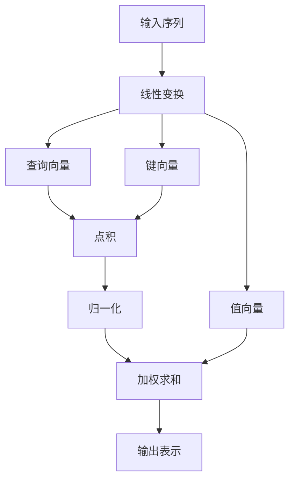

# 【大模型应用开发 动手做AI Agent】第二轮思考：模型决定计算

## 1.背景介绍

在人工智能领域，特别是大模型的应用开发中，模型的选择和设计直接决定了计算的效率和效果。随着深度学习和大数据技术的迅猛发展，AI Agent的应用场景越来越广泛，从自然语言处理到计算机视觉，从推荐系统到自动驾驶，模型的作用无处不在。本篇文章将深入探讨大模型在AI Agent开发中的关键作用，并通过具体的实例和算法解析，帮助读者更好地理解和应用这些技术。

## 2.核心概念与联系

### 2.1 大模型的定义

大模型通常指的是参数量级在亿级甚至百亿级以上的深度学习模型。这些模型通过大量的数据训练，能够在复杂任务中表现出色。典型的大模型包括GPT-3、BERT、T5等。

### 2.2 AI Agent的定义

AI Agent是指能够自主感知环境、做出决策并执行动作的智能体。AI Agent通常由感知模块、决策模块和执行模块组成。

### 2.3 模型与计算的关系

模型决定了计算的复杂度和效率。不同的模型结构和参数量会直接影响计算资源的需求和计算速度。例如，Transformer模型虽然效果显著，但其计算复杂度较高，需要强大的计算资源支持。

## 3.核心算法原理具体操作步骤

### 3.1 Transformer模型

Transformer模型是当前大模型的主流架构，其核心思想是自注意力机制。自注意力机制能够捕捉序列中任意位置的依赖关系，从而提高模型的表现。

#### 3.1.1 自注意力机制

自注意力机制通过计算输入序列中每个元素与其他元素的相关性来生成新的表示。具体步骤如下：

1. 输入序列通过线性变换生成查询（Query）、键（Key）和值（Value）向量。
2. 计算查询与键的点积，得到注意力得分。
3. 对注意力得分进行归一化处理，得到注意力权重。
4. 使用注意力权重对值向量进行加权求和，得到新的表示。



### 3.2 训练与优化

大模型的训练通常需要大量的数据和计算资源。常用的优化算法包括随机梯度下降（SGD）、Adam等。训练过程中的关键步骤包括前向传播、损失计算和反向传播。

## 4.数学模型和公式详细讲解举例说明

### 4.1 自注意力机制的数学表示

设输入序列为 $X = [x_1, x_2, ..., x_n]$，查询、键和值向量分别为 $Q, K, V$，则自注意力机制的计算过程如下：

$$
Q = XW_Q, \quad K = XW_K, \quad V = XW_V
$$

其中，$W_Q, W_K, W_V$ 为线性变换矩阵。

注意力得分为：

$$
\text{Attention}(Q, K, V) = \text{softmax}\left(\frac{QK^T}{\sqrt{d_k}}\right)V
$$

其中，$d_k$ 为键向量的维度。

### 4.2 损失函数

常用的损失函数包括交叉熵损失、均方误差等。以交叉熵损失为例，其定义为：

$$
L = -\sum_{i=1}^N y_i \log(\hat{y}_i)
$$

其中，$y_i$ 为真实标签，$\hat{y}_i$ 为预测概率。

## 5.项目实践：代码实例和详细解释说明

### 5.1 环境配置

首先，确保安装了必要的库，如TensorFlow或PyTorch。

```bash
pip install tensorflow
pip install torch
```

### 5.2 数据准备

以文本分类任务为例，准备训练数据和测试数据。

```python
import tensorflow as tf
from tensorflow.keras.preprocessing.text import Tokenizer
from tensorflow.keras.preprocessing.sequence import pad_sequences

# 示例数据
texts = ["这是一个例子", "这是另一个例子"]
labels = [0, 1]

# 文本预处理
tokenizer = Tokenizer(num_words=10000)
tokenizer.fit_on_texts(texts)
sequences = tokenizer.texts_to_sequences(texts)
data = pad_sequences(sequences, maxlen=100)
```

### 5.3 模型构建

使用TensorFlow构建一个简单的Transformer模型。

```python
from tensorflow.keras.layers import Input, Embedding, MultiHeadAttention, Dense
from tensorflow.keras.models import Model

input_layer = Input(shape=(100,))
embedding_layer = Embedding(input_dim=10000, output_dim=128)(input_layer)
attention_layer = MultiHeadAttention(num_heads=8, key_dim=128)(embedding_layer, embedding_layer)
output_layer = Dense(1, activation='sigmoid')(attention_layer)

model = Model(inputs=input_layer, outputs=output_layer)
model.compile(optimizer='adam', loss='binary_crossentropy', metrics=['accuracy'])
```

### 5.4 模型训练

```python
model.fit(data, labels, epochs=10, batch_size=32)
```

### 5.5 模型评估

```python
loss, accuracy = model.evaluate(data, labels)
print(f"Loss: {loss}, Accuracy: {accuracy}")
```

## 6.实际应用场景

### 6.1 自然语言处理

大模型在自然语言处理中的应用非常广泛，如机器翻译、文本生成、情感分析等。以GPT-3为例，其在文本生成任务中表现出色，能够生成高质量的自然语言文本。

### 6.2 计算机视觉

在计算机视觉领域，大模型同样发挥了重要作用。以ResNet、EfficientNet等为代表的深度学习模型在图像分类、目标检测、图像分割等任务中取得了显著的成果。

### 6.3 推荐系统

大模型在推荐系统中的应用也越来越广泛。通过对用户行为数据的深度学习，大模型能够提供更加精准的推荐结果，提高用户体验。

## 7.工具和资源推荐

### 7.1 开发工具

- TensorFlow：一个开源的深度学习框架，支持大规模的神经网络训练和推理。
- PyTorch：另一个流行的深度学习框架，具有灵活的动态计算图和强大的社区支持。

### 7.2 数据集

- ImageNet：一个大规模的图像数据集，广泛用于图像分类和目标检测任务。
- COCO：一个用于图像分割和目标检测的高质量数据集。
- GLUE：一个用于自然语言理解的基准数据集，包含多个子任务。

### 7.3 学习资源

- 《深度学习》：由Ian Goodfellow等人编写的经典教材，系统介绍了深度学习的基本概念和算法。
- Coursera和Udacity上的深度学习课程：提供了丰富的在线学习资源和实践机会。

## 8.总结：未来发展趋势与挑战

### 8.1 未来发展趋势

随着计算资源的不断提升和算法的不断优化，大模型在各个领域的应用将会更加广泛。未来，AI Agent将更加智能化，能够处理更加复杂的任务，提供更加精准的服务。

### 8.2 挑战

尽管大模型在很多任务中表现出色，但其计算资源需求和训练成本仍然是一个巨大的挑战。此外，大模型的可解释性和安全性问题也需要进一步研究和解决。

## 9.附录：常见问题与解答

### 9.1 大模型的训练需要多长时间？

大模型的训练时间取决于模型的规模、数据量和计算资源。通常情况下，训练一个大模型可能需要数天甚至数周的时间。

### 9.2 如何选择合适的模型？

选择合适的模型需要考虑任务的具体需求、数据的特点和计算资源的限制。可以通过实验和调优来选择最优的模型。

### 9.3 大模型的应用是否存在风险？

大模型的应用确实存在一些风险，如数据隐私、模型偏见和安全性问题。在应用大模型时，需要充分考虑这些风险，并采取相应的措施进行防范。

---

作者：禅与计算机程序设计艺术 / Zen and the Art of Computer Programming