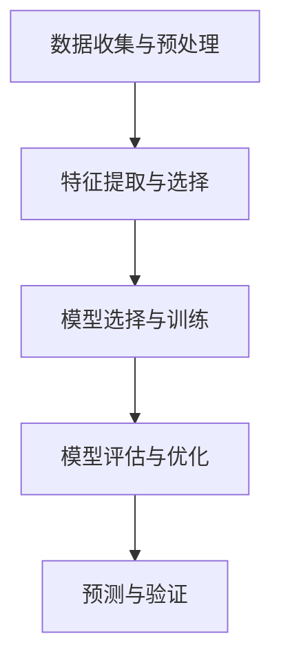

# 一切皆是映射：AI辅助的创新药物发现

## 1.背景介绍

### 1.1 药物发现的传统方法
药物发现是一个复杂且耗时的过程，传统方法通常包括以下几个步骤：靶点识别、先导化合物筛选、优化、临床前研究和临床试验。每个步骤都需要大量的时间和资源，通常需要10-15年和数十亿美元的投入。

### 1.2 人工智能在药物发现中的崛起
随着计算能力的提升和大数据的普及，人工智能（AI）在药物发现中的应用逐渐成为可能。AI可以通过分析大量的生物数据和化学数据，快速识别潜在的药物靶点和先导化合物，从而大大缩短药物发现的时间和成本。

### 1.3 文章目的
本文旨在探讨AI在创新药物发现中的应用，介绍核心概念、算法原理、数学模型、项目实践、实际应用场景、工具和资源，并展望未来的发展趋势与挑战。

## 2.核心概念与联系

### 2.1 映射的概念
在数学和计算机科学中，映射是指将一个集合中的元素关联到另一个集合中的元素的过程。在药物发现中，映射可以理解为将化学结构映射到生物活性，将基因表达数据映射到疾病状态等。

### 2.2 AI与映射的关系
AI技术，特别是机器学习和深度学习，通过复杂的映射函数来学习和预测数据之间的关系。例如，神经网络可以通过训练数据学习化学结构与生物活性之间的映射关系，从而预测新化合物的潜在药效。

### 2.3 药物发现中的映射应用
在药物发现中，映射的应用包括但不限于以下几个方面：
- 化学结构与生物活性的映射
- 基因表达与疾病状态的映射
- 药物靶点与疾病的映射

## 3.核心算法原理具体操作步骤

### 3.1 数据预处理
数据预处理是药物发现中至关重要的一步，包括数据清洗、标准化、特征提取等。常用的方法有：
- 数据清洗：去除噪声和异常值
- 数据标准化：将数据转换为统一的尺度
- 特征提取：从原始数据中提取有用的特征

### 3.2 模型选择与训练
选择合适的AI模型是药物发现的关键步骤。常用的模型包括：
- 线性回归和逻辑回归
- 支持向量机（SVM）
- 随机森林
- 神经网络和深度学习模型

### 3.3 模型评估与优化
模型评估是确保模型性能的关键步骤，常用的评估指标包括准确率、精确率、召回率和F1分数。模型优化方法包括超参数调优、交叉验证等。

### 3.4 实际操作步骤
以下是一个典型的AI辅助药物发现的操作步骤：
1. 数据收集与预处理
2. 特征提取与选择
3. 模型选择与训练
4. 模型评估与优化
5. 预测与验证



## 4.数学模型和公式详细讲解举例说明

### 4.1 线性回归模型
线性回归是一种简单但有效的模型，用于预测连续变量。其数学公式为：
$$
y = \beta_0 + \beta_1 x_1 + \beta_2 x_2 + \cdots + \beta_n x_n + \epsilon
$$
其中，$y$ 是预测值，$x_i$ 是特征，$\beta_i$ 是回归系数，$\epsilon$ 是误差项。

### 4.2 神经网络模型
神经网络是一种复杂的非线性模型，适用于大规模数据的预测。其基本单元是神经元，数学公式为：
$$
a_j = f\left(\sum_{i=1}^{n} w_{ij} x_i + b_j\right)
$$
其中，$a_j$ 是神经元的输出，$x_i$ 是输入，$w_{ij}$ 是权重，$b_j$ 是偏置，$f$ 是激活函数。

### 4.3 示例：化学结构与生物活性的映射
假设我们有一组化学结构数据和对应的生物活性数据，我们可以使用神经网络来学习它们之间的映射关系。具体步骤如下：
1. 数据预处理：将化学结构数据转换为特征向量
2. 模型选择：选择一个合适的神经网络模型
3. 模型训练：使用训练数据训练模型
4. 模型评估：使用测试数据评估模型性能
5. 预测：使用训练好的模型预测新化合物的生物活性

## 5.项目实践：代码实例和详细解释说明

### 5.1 数据预处理
```python
import pandas as pd
from sklearn.preprocessing import StandardScaler

# 读取数据
data = pd.read_csv('chemical_data.csv')

# 数据清洗
data = data.dropna()

# 特征提取
features = data.drop('activity', axis=1)
labels = data['activity']

# 数据标准化
scaler = StandardScaler()
features = scaler.fit_transform(features)
```

### 5.2 模型选择与训练
```python
from sklearn.model_selection import train_test_split
from sklearn.neural_network import MLPRegressor

# 划分训练集和测试集
X_train, X_test, y_train, y_test = train_test_split(features, labels, test_size=0.2, random_state=42)

# 模型选择
model = MLPRegressor(hidden_layer_sizes=(100, 100), max_iter=500)

# 模型训练
model.fit(X_train, y_train)
```

### 5.3 模型评估与优化
```python
from sklearn.metrics import mean_squared_error

# 模型评估
y_pred = model.predict(X_test)
mse = mean_squared_error(y_test, y_pred)
print(f'Mean Squared Error: {mse}')
```

### 5.4 预测与验证
```python
# 预测新化合物的生物活性
new_data = pd.read_csv('new_chemical_data.csv')
new_features = scaler.transform(new_data)
predictions = model.predict(new_features)
print(predictions)
```

## 6.实际应用场景

### 6.1 靶点识别
AI可以通过分析基因表达数据和蛋白质相互作用数据，快速识别潜在的药物靶点。例如，使用深度学习模型可以从基因表达数据中预测与特定疾病相关的靶点。

### 6.2 先导化合物筛选
AI可以通过分析化学结构数据和生物活性数据，快速筛选出潜在的先导化合物。例如，使用神经网络模型可以从化学结构数据中预测化合物的生物活性，从而筛选出具有潜在药效的化合物。

### 6.3 药物重定位
药物重定位是指将已有的药物用于新的治疗用途。AI可以通过分析药物的基因表达数据和疾病的基因表达数据，识别出潜在的药物重定位机会。例如，使用机器学习模型可以从基因表达数据中预测药物对新的疾病的疗效。

## 7.工具和资源推荐

### 7.1 数据库
- PubChem：一个包含大量化学结构和生物活性数据的数据库
- ChEMBL：一个包含药物化学和生物活性数据的数据库
- DrugBank：一个包含药物和靶点信息的数据库

### 7.2 工具
- RDKit：一个用于化学信息学和药物发现的开源工具包
- DeepChem：一个用于深度学习和药物发现的开源工具包
- TensorFlow和PyTorch：两个流行的深度学习框架

### 7.3 资源
- 《Deep Learning for the Life Sciences》：一本介绍深度学习在生命科学中应用的书籍
- Coursera和edX上的相关课程：提供AI和药物发现相关的在线课程

## 8.总结：未来发展趋势与挑战

### 8.1 未来发展趋势
- 多模态数据融合：未来的药物发现将越来越多地依赖于多模态数据的融合，包括基因组数据、蛋白质数据、化学结构数据等。
- 解释性AI：随着AI在药物发现中的应用越来越广泛，解释性AI将变得越来越重要，以便科学家能够理解和信任AI的预测结果。
- 自动化药物发现平台：未来的药物发现将越来越多地依赖于自动化平台，从数据收集、预处理到模型训练和预测，整个过程将实现高度自动化。

### 8.2 挑战
- 数据质量和数量：高质量和大规模的数据是AI模型成功的关键，但在药物发现领域，数据的获取和处理仍然是一个挑战。
- 模型的泛化能力：AI模型在训练数据上的表现往往很好，但在实际应用中，模型的泛化能力仍然是一个挑战。
- 伦理和法规：AI在药物发现中的应用涉及到伦理和法规问题，包括数据隐私、算法透明性等。

## 9.附录：常见问题与解答

### 9.1 AI在药物发现中的优势是什么？
AI可以通过分析大量的生物数据和化学数据，快速识别潜在的药物靶点和先导化合物，从而大大缩短药物发现的时间和成本。

### 9.2 如何选择合适的AI模型？
选择合适的AI模型取决于具体的应用场景和数据特点。常用的模型包括线性回归、逻辑回归、支持向量机、随机森林、神经网络和深度学习模型。

### 9.3 数据预处理的重要性是什么？
数据预处理是药物发现中至关重要的一步，包括数据清洗、标准化、特征提取等。高质量的数据预处理可以提高模型的性能和预测准确性。

### 9.4 AI在药物发现中的未来发展趋势是什么？
未来的药物发现将越来越多地依赖于多模态数据的融合、解释性AI和自动化药物发现平台。

### 9.5 AI在药物发现中的挑战是什么？
AI在药物发现中的挑战包括数据质量和数量、模型的泛化能力、伦理和法规问题等。

---

作者：禅与计算机程序设计艺术 / Zen and the Art of Computer Programming