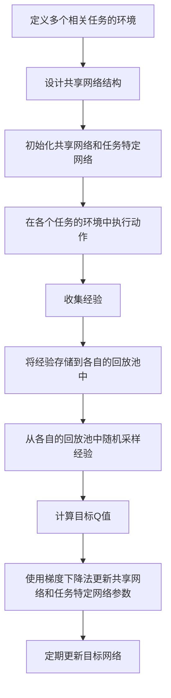

# 一切皆是映射：DQN与多任务学习：共享网络结构的效果分析

## 1.背景介绍

在人工智能和机器学习领域，深度强化学习（Deep Reinforcement Learning, DRL）和多任务学习（Multi-Task Learning, MTL）是两个备受关注的研究方向。深度Q网络（Deep Q-Network, DQN）作为DRL的代表性算法，通过结合深度学习和Q学习，成功解决了许多复杂的决策问题。而多任务学习则通过共享网络结构，提升了模型在多个任务上的泛化能力和效率。

本文旨在探讨DQN与多任务学习的结合，分析共享网络结构在多任务学习中的效果。我们将从核心概念、算法原理、数学模型、项目实践、实际应用、工具资源、未来发展趋势等多个方面进行详细阐述。

## 2.核心概念与联系

### 2.1 深度Q网络（DQN）

DQN是深度强化学习中的一种算法，通过使用深度神经网络来近似Q值函数，从而解决高维状态空间中的决策问题。其核心思想是利用经验回放和目标网络来稳定训练过程。

### 2.2 多任务学习（MTL）

多任务学习是一种机器学习范式，通过在多个相关任务上共享模型参数，提升模型的泛化能力和训练效率。MTL的核心思想是利用任务之间的相关性，通过共享网络结构来实现知识的迁移和共享。

### 2.3 共享网络结构

共享网络结构是多任务学习中的一种常见方法，通过在多个任务上共享部分或全部网络层，减少参数数量，提高训练效率。共享网络结构可以分为硬共享和软共享两种方式。

### 2.4 DQN与MTL的联系

DQN与MTL的结合可以通过共享网络结构来实现，即在多个任务上共享DQN的部分或全部网络层，从而提升模型的泛化能力和训练效率。这种结合方式不仅可以提高单个任务的性能，还可以通过任务之间的知识共享，提升整体系统的表现。

## 3.核心算法原理具体操作步骤

### 3.1 DQN的基本流程

1. 初始化经验回放池和Q网络
2. 在环境中执行动作，收集经验
3. 将经验存储到回放池中
4. 从回放池中随机采样经验，计算目标Q值
5. 使用梯度下降法更新Q网络参数
6. 定期更新目标网络

### 3.2 多任务学习的基本流程

1. 定义多个相关任务
2. 设计共享网络结构
3. 在多个任务上同时训练模型
4. 通过共享网络层实现知识共享
5. 评估模型在各个任务上的表现

### 3.3 DQN与MTL结合的具体操作步骤

1. 定义多个相关任务的环境
2. 设计共享网络结构，包括共享层和任务特定层
3. 初始化共享网络和任务特定网络
4. 在各个任务的环境中执行动作，收集经验
5. 将经验存储到各自的回放池中
6. 从各自的回放池中随机采样经验，计算目标Q值
7. 使用梯度下降法更新共享网络和任务特定网络参数
8. 定期更新目标网络

以下是DQN与MTL结合的流程图：



## 4.数学模型和公式详细讲解举例说明

### 4.1 Q学习的基本公式

Q学习的核心是Q值函数 $Q(s, a)$，表示在状态 $s$ 下采取动作 $a$ 所能获得的期望回报。Q学习的更新公式为：

$$
Q(s, a) \leftarrow Q(s, a) + \alpha \left[ r + \gamma \max_{a'} Q(s', a') - Q(s, a) \right]
$$

其中，$\alpha$ 是学习率，$r$ 是即时奖励，$\gamma$ 是折扣因子，$s'$ 是下一状态，$a'$ 是下一动作。

### 4.2 DQN的损失函数

DQN通过深度神经网络来近似Q值函数，其损失函数为：

$$
L(\theta) = \mathbb{E}_{(s, a, r, s') \sim \mathcal{D}} \left[ \left( r + \gamma \max_{a'} Q(s', a'; \theta^-) - Q(s, a; \theta) \right)^2 \right]
$$

其中，$\theta$ 是Q网络的参数，$\theta^-$ 是目标网络的参数，$\mathcal{D}$ 是经验回放池。

### 4.3 多任务学习的损失函数

在多任务学习中，损失函数可以表示为各个任务损失的加权和：

$$
L_{MTL}(\theta) = \sum_{i=1}^N \lambda_i L_i(\theta)
$$

其中，$N$ 是任务数量，$\lambda_i$ 是任务 $i$ 的权重，$L_i(\theta)$ 是任务 $i$ 的损失函数。

### 4.4 DQN与MTL结合的损失函数

在DQN与MTL结合的情况下，损失函数可以表示为：

$$
L_{DQN-MTL}(\theta, \theta_i) = \sum_{i=1}^N \lambda_i \mathbb{E}_{(s, a, r, s') \sim \mathcal{D}_i} \left[ \left( r + \gamma \max_{a'} Q_i(s', a'; \theta_i^-) - Q_i(s, a; \theta, \theta_i) \right)^2 \right]
$$

其中，$\theta$ 是共享网络的参数，$\theta_i$ 是任务 $i$ 的特定网络参数，$\mathcal{D}_i$ 是任务 $i$ 的经验回放池。

### 4.5 举例说明

假设我们有两个任务：任务A和任务B。任务A的环境是一个迷宫导航问题，任务B的环境是一个机器人抓取问题。我们设计一个共享网络结构，包括一个共享卷积层和两个任务特定的全连接层。

在训练过程中，我们在任务A和任务B的环境中分别执行动作，收集经验，并将经验存储到各自的回放池中。然后，我们从各自的回放池中随机采样经验，计算目标Q值，并使用梯度下降法更新共享网络和任务特定网络参数。

通过这种方式，我们可以实现任务A和任务B之间的知识共享，提升模型的泛化能力和训练效率。

## 5.项目实践：代码实例和详细解释说明

### 5.1 环境设置

首先，我们需要设置两个任务的环境。这里我们使用OpenAI Gym中的CartPole和MountainCar环境作为示例。

```python
import gym

# 创建两个任务的环境
env_A = gym.make('CartPole-v1')
env_B = gym.make('MountainCar-v0')
```

### 5.2 设计共享网络结构

接下来，我们设计一个共享网络结构，包括一个共享卷积层和两个任务特定的全连接层。

```python
import torch
import torch.nn as nn
import torch.optim as optim

class SharedNetwork(nn.Module):
    def __init__(self):
        super(SharedNetwork, self).__init__()
        self.shared_conv = nn.Conv2d(1, 32, kernel_size=3, stride=1, padding=1)
        self.task_A_fc = nn.Linear(32 * 8 * 8, 2)
        self.task_B_fc = nn.Linear(32 * 8 * 8, 3)

    def forward(self, x, task):
        x = torch.relu(self.shared_conv(x))
        x = x.view(x.size(0), -1)
        if task == 'A':
            return self.task_A_fc(x)
        elif task == 'B':
            return self.task_B_fc(x)
```

### 5.3 初始化网络和优化器

```python
# 初始化共享网络
shared_network = SharedNetwork()

# 初始化优化器
optimizer = optim.Adam(shared_network.parameters(), lr=0.001)
```

### 5.4 训练过程

在训练过程中，我们在两个任务的环境中分别执行动作，收集经验，并将经验存储到各自的回放池中。然后，我们从各自的回放池中随机采样经验，计算目标Q值，并使用梯度下降法更新共享网络和任务特定网络参数。

```python
import random
import numpy as np

# 初始化经验回放池
replay_buffer_A = []
replay_buffer_B = []

# 定义超参数
batch_size = 32
gamma = 0.99

# 训练循环
for episode in range(1000):
    # 在任务A的环境中执行动作
    state_A = env_A.reset()
    done_A = False
    while not done_A:
        action_A = shared_network(torch.tensor(state_A, dtype=torch.float32).unsqueeze(0), 'A').argmax().item()
        next_state_A, reward_A, done_A, _ = env_A.step(action_A)
        replay_buffer_A.append((state_A, action_A, reward_A, next_state_A, done_A))
        state_A = next_state_A

    # 在任务B的环境中执行动作
    state_B = env_B.reset()
    done_B = False
    while not done_B:
        action_B = shared_network(torch.tensor(state_B, dtype=torch.float32).unsqueeze(0), 'B').argmax().item()
        next_state_B, reward_B, done_B, _ = env_B.step(action_B)
        replay_buffer_B.append((state_B, action_B, reward_B, next_state_B, done_B))
        state_B = next_state_B

    # 从回放池中随机采样经验
    if len(replay_buffer_A) > batch_size and len(replay_buffer_B) > batch_size:
        batch_A = random.sample(replay_buffer_A, batch_size)
        batch_B = random.sample(replay_buffer_B, batch_size)

        # 计算目标Q值并更新网络参数
        for batch, task in [(batch_A, 'A'), (batch_B, 'B')]:
            states, actions, rewards, next_states, dones = zip(*batch)
            states = torch.tensor(states, dtype=torch.float32)
            actions = torch.tensor(actions, dtype=torch.int64)
            rewards = torch.tensor(rewards, dtype=torch.float32)
            next_states = torch.tensor(next_states, dtype=torch.float32)
            dones = torch.tensor(dones, dtype=torch.float32)

            q_values = shared_network(states, task).gather(1, actions.unsqueeze(1)).squeeze(1)
            next_q_values = shared_network(next_states, task).max(1)[0]
            target_q_values = rewards + gamma * next_q_values * (1 - dones)

            loss = nn.MSELoss()(q_values, target_q_values)

            optimizer.zero_grad()
            loss.backward()
            optimizer.step()
```

### 5.5 详细解释说明

在上述代码中，我们首先创建了两个任务的环境，并设计了一个共享网络结构。然后，我们初始化了共享网络和优化器。在训练过程中，我们在两个任务的环境中分别执行动作，收集经验，并将经验存储到各自的回放池中。接着，我们从各自的回放池中随机采样经验，计算目标Q值，并使用梯度下降法更新共享网络和任务特定网络参数。

通过这种方式，我们实现了任务A和任务B之间的知识共享，提升了模型的泛化能力和训练效率。

## 6.实际应用场景

### 6.1 游戏AI

在游戏AI中，DQN与MTL的结合可以用于训练多个游戏任务的智能体。例如，在一个复杂的游戏环境中，智能体需要同时完成多个子任务，如导航、战斗、资源收集等。通过共享网络结构，智能体可以在不同子任务之间共享知识，提高整体表现。

### 6.2 机器人控制

在机器人控制中，DQN与MTL的结合可以用于训练多种任务的机器人。例如，一个机器人需要同时完成抓取、搬运、组装等任务。通过共享网络结构，机器人可以在不同任务之间共享知识，提高任务完成的效率和准确性。

### 6.3 自动驾驶

在自动驾驶中，DQN与MTL的结合可以用于训练多种驾驶任务的模型。例如，自动驾驶系统需要同时处理车道保持、避障、停车等任务。通过共享网络结构，自动驾驶系统可以在不同任务之间共享知识，提高驾驶安全性和稳定性。

### 6.4 自然语言处理

在自然语言处理（NLP）中，DQN与MTL的结合可以用于训练多种语言任务的模型。例如，一个NLP模型需要同时完成文本分类、情感分析、机器翻译等任务。通过共享网络结构，NLP模型可以在不同任务之间共享知识，提高任务完成的准确性和效率。

## 7.工具和资源推荐

### 7.1 开源框架

- **TensorFlow**：一个广泛使用的深度学习框架，支持多任务学习和强化学习。
- **PyTorch**：一个灵活的深度学习框架，适用于研究和生产环境，支持多任务学习和强化学习。
- **OpenAI Gym**：一个用于开发和比较强化学习算法的工具包，提供了多种环境。

### 7.2 研究论文

- **Playing Atari with Deep Reinforcement Learning**：DQN的开创性论文，介绍了DQN的基本原理和应用。
- **Multi-Task Learning Using Uncertainty to Weigh Losses for Scene Geometry and Semantics**：介绍了多任务学习中的不确定性加权方法。
- **A Survey on Multi-Task Learning**：一篇综述论文，详细介绍了多任务学习的各种方法和应用。

### 7.3 在线课程

- **Deep Reinforcement Learning Specialization**：由DeepLearning.AI提供的深度强化学习专项课程，涵盖DQN等算法。
- **Multi-Task Learning**：由Coursera提供的多任务学习课程，介绍了多任务学习的基本概念和方法。

### 7.4 实用工具

- **Jupyter Notebook**：一个交互式计算环境，适用于编写和分享代码、文档和可视化。
- **Matplotlib**：一个用于创建静态、动画和交互式可视化的Python库。
- **TensorBoard**：一个用于可视化TensorFlow图和训练过程的工具。

## 8.总结：未来发展趋势与挑战

### 8.1 未来发展趋势

1. **更高效的网络结构**：未来的研究将致力于设计更高效的共享网络结构，以进一步提升多任务学习的性能和效率。
2. **自适应任务权重**：研究如何自适应地调整各个任务的权重，以实现更好的任务平衡和知识共享。
3. **跨领域应用**：探索DQN与MTL在更多领域的应用，如医疗诊断、金融预测、智能制造等。

### 8.2 挑战

1. **任务间干扰**：在多任务学习中，不同任务之间的干扰可能会影响模型的性能，如何有效地减少任务间干扰是一个重要的研究方向。
2. **大规模数据处理**：随着任务数量和数据规模的增加，如何高效地处理大规模数据是一个重要的挑战。
3. **模型解释性**：多任务学习模型的复杂性增加了模型的解释难度，如何提高模型的可解释性是一个重要的研究方向。

## 9.附录：常见问题与解答

### 9.1 什么是深度Q网络（DQN）？

深度Q网络（DQN）是一种深度强化学习算法，通过使用深度神经网络来近似Q值函数，从而解决高维状态空间中的决策问题。

### 9.2 什么是多任务学习（MTL）？

多任务学习（MTL）是一种机器学习范式，通过在多个相关任务上共享模型参数，提升模型的泛化能力和训练效率。

### 9.3 共享网络结构是什么？

共享网络结构是多任务学习中的一种常见方法，通过在多个任务上共享部分或全部网络层，减少参数数量，提高训练效率。

### 9.4 DQN与MTL的结合有什么优势？

DQN与MTL的结合可以通过共享网络结构实现任务之间的知识共享，提升模型的泛化能力和训练效率。

### 9.5 如何设计共享网络结构？

共享网络结构可以包括共享层和任务特定层，具体设计取决于任务的相关性和复杂性。

### 9.6 DQN与MTL的结合有哪些实际应用？

DQN与MTL的结合在游戏AI、机器人控制、自动驾驶、自然语言处理等领域有广泛的应用。

### 9.7 未来DQN与MTL的研究方向是什么？

未来的研究将致力于设计更高效的网络结构、自适应任务权重、跨领域应用等方面。

### 9.8 DQN与MTL的结合面临哪些挑战？

DQN与MTL的结合面临任务间干扰、大规模数据处理、模型解释性等挑战。

作者：禅与计算机程序设计艺术 / Zen and the Art of Computer Programming