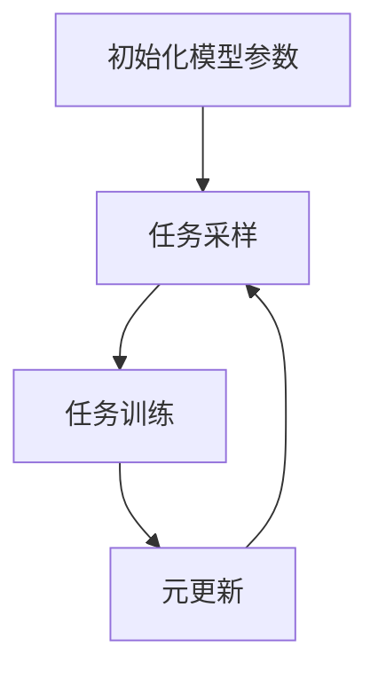
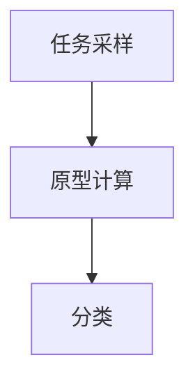

# 一切皆是映射：元学习在医疗图像分析中的突破

## 1.背景介绍

### 1.1 医疗图像分析的重要性

医疗图像分析在现代医学中扮演着至关重要的角色。通过对X光片、CT扫描、MRI等医疗图像的分析，医生可以更准确地诊断疾病，制定治疗方案，提高患者的生存率和生活质量。然而，传统的医疗图像分析方法依赖于专家的经验和手工操作，存在效率低、主观性强等问题。

### 1.2 人工智能在医疗图像分析中的应用

随着人工智能技术的飞速发展，特别是深度学习的崛起，医疗图像分析迎来了新的机遇。深度学习模型，尤其是卷积神经网络（CNN），在图像分类、分割和检测等任务中表现出了卓越的性能。然而，这些模型通常需要大量标注数据进行训练，这在医疗领域往往难以获得。

### 1.3 元学习的引入

元学习（Meta-Learning），也称为“学习如何学习”，是一种通过学习多个任务来提高模型在新任务上的学习能力的方法。元学习在数据稀缺的情况下表现出色，特别适合医疗图像分析这一领域。本文将深入探讨元学习在医疗图像分析中的应用，揭示其核心概念、算法原理、数学模型、实际应用场景以及未来发展趋势。

## 2.核心概念与联系

### 2.1 元学习的基本概念

元学习的核心思想是通过学习多个任务的经验，提升模型在新任务上的学习效率。元学习模型通常包括两个层次的学习过程：元学习过程和任务学习过程。元学习过程负责学习如何快速适应新任务，而任务学习过程则是在具体任务上的学习。

### 2.2 元学习与深度学习的关系

元学习可以看作是深度学习的一个扩展。传统的深度学习模型在单一任务上进行训练，而元学习模型则在多个任务上进行训练，以提高其泛化能力。元学习模型通常使用深度神经网络作为其基础模型，通过优化算法和损失函数的设计，实现快速适应新任务的目标。

### 2.3 元学习在医疗图像分析中的优势

元学习在医疗图像分析中的优势主要体现在以下几个方面：
- **数据效率**：元学习能够在少量标注数据的情况下，快速适应新任务，降低了对大规模标注数据的依赖。
- **泛化能力**：通过在多个任务上进行训练，元学习模型具有更强的泛化能力，能够更好地应对不同类型的医疗图像分析任务。
- **自动化**：元学习模型可以自动调整其参数和结构，减少了对人工调参的依赖，提高了模型的自动化程度。

## 3.核心算法原理具体操作步骤

### 3.1 MAML算法

模型-无关元学习（Model-Agnostic Meta-Learning, MAML）是元学习中的一种经典算法。MAML的核心思想是通过在多个任务上进行训练，找到一个初始模型参数，使得在新任务上进行少量梯度更新后，模型能够快速适应新任务。

#### 3.1.1 MAML算法步骤

1. **初始化模型参数** $\theta$。
2. **任务采样**：从任务分布 $p(T)$ 中采样一批任务 $\{T_i\}$。
3. **任务训练**：对于每个任务 $T_i$，使用当前模型参数 $\theta$ 进行少量梯度更新，得到任务特定的模型参数 $\theta_i'$。
4. **元更新**：使用任务特定的模型参数 $\theta_i'$ 在验证集上计算损失，并对初始模型参数 $\theta$ 进行更新。



### 3.2 ProtoNet算法

原型网络（Prototypical Networks, ProtoNet）是一种基于度量学习的元学习算法。ProtoNet通过学习任务中的原型向量，实现对新任务的快速分类。

#### 3.2.1 ProtoNet算法步骤

1. **任务采样**：从任务分布 $p(T)$ 中采样一批任务 $\{T_i\}$。
2. **原型计算**：对于每个任务 $T_i$，计算每个类别的原型向量。
3. **分类**：对于新样本，计算其与各类别原型向量的距离，并根据距离进行分类。



## 4.数学模型和公式详细讲解举例说明

### 4.1 MAML算法的数学模型

MAML算法的目标是找到一个初始模型参数 $\theta$，使得在新任务上进行少量梯度更新后，模型能够快速适应新任务。其数学模型可以表示为：

$$
\theta' = \theta - \alpha \nabla_\theta \mathcal{L}_{T_i}(f_\theta)
$$

其中，$\alpha$ 是学习率，$\mathcal{L}_{T_i}$ 是任务 $T_i$ 的损失函数，$f_\theta$ 是模型。

在元更新阶段，MAML通过在验证集上计算损失，并对初始模型参数 $\theta$ 进行更新：

$$
\theta \leftarrow \theta - \beta \nabla_\theta \sum_{T_i \sim p(T)} \mathcal{L}_{T_i}(f_{\theta'})
$$

其中，$\beta$ 是元学习率。

### 4.2 ProtoNet算法的数学模型

ProtoNet算法通过计算每个类别的原型向量，实现对新任务的快速分类。其数学模型可以表示为：

$$
c_k = \frac{1}{|S_k|} \sum_{(x_i, y_i) \in S_k} f_\theta(x_i)
$$

其中，$c_k$ 是类别 $k$ 的原型向量，$S_k$ 是类别 $k$ 的样本集合，$f_\theta$ 是模型。

对于新样本 $x$，ProtoNet通过计算其与各类别原型向量的距离，并根据距离进行分类：

$$
\hat{y} = \arg \min_k d(f_\theta(x), c_k)
$$

其中，$d$ 是距离度量函数。

## 5.项目实践：代码实例和详细解释说明

### 5.1 MAML算法的代码实现

以下是一个简单的MAML算法的代码实现示例：

```python
import torch
import torch.nn as nn
import torch.optim as optim

class SimpleModel(nn.Module):
    def __init__(self):
        super(SimpleModel, self).__init__()
        self.fc = nn.Linear(10, 1)

    def forward(self, x):
        return self.fc(x)

def maml_train(model, tasks, meta_lr, task_lr, num_iterations):
    meta_optimizer = optim.Adam(model.parameters(), lr=meta_lr)

    for iteration in range(num_iterations):
        meta_optimizer.zero_grad()
        meta_loss = 0

        for task in tasks:
            task_optimizer = optim.SGD(model.parameters(), lr=task_lr)
            task_loss = compute_task_loss(model, task)
            task_optimizer.zero_grad()
            task_loss.backward()
            task_optimizer.step()

            meta_loss += compute_task_loss(model, task)

        meta_loss.backward()
        meta_optimizer.step()

def compute_task_loss(model, task):
    # 计算任务的损失
    pass

model = SimpleModel()
tasks = [...]  # 任务列表
maml_train(model, tasks, meta_lr=0.001, task_lr=0.01, num_iterations=1000)
```

### 5.2 ProtoNet算法的代码实现

以下是一个简单的ProtoNet算法的代码实现示例：

```python
import torch
import torch.nn as nn
import torch.optim as optim

class SimpleModel(nn.Module):
    def __init__(self):
        super(SimpleModel, self).__init__()
        self.fc = nn.Linear(10, 10)

    def forward(self, x):
        return self.fc(x)

def compute_prototypes(model, support_set):
    prototypes = {}
    for label in support_set:
        samples = support_set[label]
        embeddings = model(samples)
        prototypes[label] = embeddings.mean(dim=0)
    return prototypes

def classify(model, prototypes, query_sample):
    distances = {label: torch.dist(query_sample, prototype) for label, prototype in prototypes.items()}
    return min(distances, key=distances.get)

model = SimpleModel()
support_set = {...}  # 支持集
prototypes = compute_prototypes(model, support_set)
query_sample = torch.randn(1, 10)
predicted_label = classify(model, prototypes, query_sample)
```

## 6.实际应用场景

### 6.1 疾病诊断

元学习在疾病诊断中的应用非常广泛。例如，通过对不同类型的肺部CT扫描图像进行训练，元学习模型可以快速适应新的肺部疾病诊断任务，提高诊断的准确性和效率。

### 6.2 病理图像分析

病理图像分析是医疗图像分析中的一个重要领域。元学习模型可以通过学习不同类型的病理图像，快速适应新的病理图像分析任务，帮助病理学家更准确地识别病变区域。

### 6.3 医疗影像分割

医疗影像分割是将医疗图像中的不同组织或器官分割出来的过程。元学习模型可以通过在多个分割任务上进行训练，提高其在新分割任务上的表现，减少对大规模标注数据的依赖。

## 7.工具和资源推荐

### 7.1 开源框架

- **PyTorch**：一个流行的深度学习框架，支持动态计算图，适合元学习模型的开发。
- **TensorFlow**：另一个流行的深度学习框架，提供了丰富的工具和资源，适合大规模元学习模型的训练。

### 7.2 数据集

- **Medical ImageNet**：一个大规模的医疗图像数据集，包含多种类型的医疗图像，适合元学习模型的训练。
- **LUNA16**：一个肺结节检测数据集，包含大量的肺部CT扫描图像，适合肺部疾病诊断任务。

### 7.3 研究论文

- **Model-Agnostic Meta-Learning for Fast Adaptation of Deep Networks**：MAML算法的原始论文，详细介绍了MAML的算法原理和实验结果。
- **Prototypical Networks for Few-shot Learning**：ProtoNet算法的原始论文，详细介绍了ProtoNet的算法原理和实验结果。

## 8.总结：未来发展趋势与挑战

### 8.1 未来发展趋势

元学习在医疗图像分析中的应用前景广阔。随着医疗数据的不断积累和计算能力的提升，元学习模型将能够在更多的医疗图像分析任务中发挥作用。未来，元学习有望与其他先进技术（如联邦学习、强化学习等）结合，进一步提高其在医疗图像分析中的表现。

### 8.2 挑战

尽管元学习在医疗图像分析中展现了巨大的潜力，但仍面临一些挑战：
- **数据隐私**：医疗数据的隐私保护是一个重要问题，如何在保护数据隐私的前提下进行元学习模型的训练是一个亟待解决的问题。
- **模型解释性**：元学习模型的复杂性增加了其解释难度，如何提高模型的可解释性，使其在医疗领域得到更广泛的应用，是一个重要的研究方向。
- **计算资源**：元学习模型的训练通常需要大量的计算资源，如何提高训练效率，降低计算成本，是一个需要关注的问题。

## 9.附录：常见问题与解答

### 9.1 什么是元学习？

元学习是一种通过学习多个任务来提高模型在新任务上的学习能力的方法。其核心思想是通过在多个任务上进行训练，提升模型在新任务上的学习效率。

### 9.2 元学习在医疗图像分析中的优势是什么？

元学习在医疗图像分析中的优势主要体现在数据效率、泛化能力和自动化程度上。元学习能够在少量标注数据的情况下，快速适应新任务，降低了对大规模标注数据的依赖。

### 9.3 MAML和ProtoNet的区别是什么？

MAML和ProtoNet是两种不同的元学习算法。MAML通过在多个任务上进行训练，找到一个初始模型参数，使得在新任务上进行少量梯度更新后，模型能够快速适应新任务。ProtoNet则通过计算每个类别的原型向量，实现对新任务的快速分类。

### 9.4 如何选择适合的元学习算法？

选择适合的元学习算法需要考虑具体的应用场景和任务需求。如果任务需要在新任务上进行快速适应，可以选择MAML算法。如果任务需要进行快速分类，可以选择ProtoNet算法。

### 9.5 元学习在医疗图像分析中的未来发展趋势是什么？

元学习在医疗图像分析中的未来发展趋势包括与其他先进技术（如联邦学习、强化学习等）结合，提高模型的可解释性，保护数据隐私，以及提高训练效率，降低计算成本。

---

作者：禅与计算机程序设计艺术 / Zen and the Art of Computer Programming