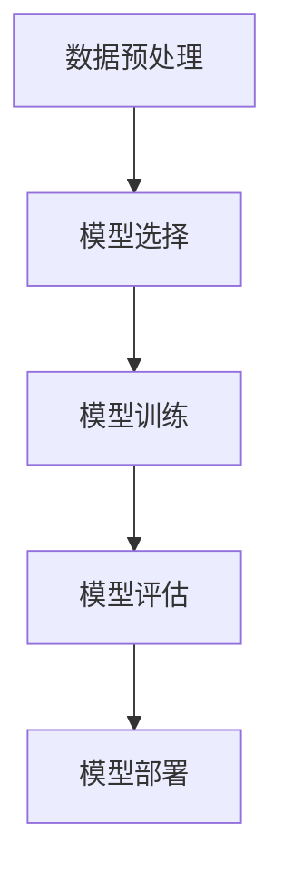

# 一切皆是映射：深度学习在推荐系统中的应用

## 1.背景介绍

推荐系统已经成为现代互联网应用的核心组成部分，从电商平台的商品推荐到社交媒体的内容推荐，推荐系统无处不在。传统的推荐系统主要依赖于协同过滤和基于内容的推荐方法。然而，随着数据量的爆炸性增长和用户需求的多样化，传统方法逐渐暴露出其局限性。深度学习作为一种强大的工具，能够处理复杂的非线性关系和大规模数据，逐渐成为推荐系统领域的主流技术。

## 2.核心概念与联系

### 2.1 映射的概念

在深度学习中，映射是指将输入数据通过一系列变换，转换为输出数据的过程。推荐系统中的映射可以理解为将用户和物品的特征映射到一个共同的隐空间中，从而计算出用户对物品的偏好。

### 2.2 深度学习与推荐系统的联系

深度学习通过多层神经网络的结构，能够捕捉到数据中的复杂模式和特征。推荐系统利用深度学习模型，可以更准确地预测用户的偏好，提高推荐的准确性和多样性。

### 2.3 常见的深度学习模型

在推荐系统中，常用的深度学习模型包括卷积神经网络（CNN）、循环神经网络（RNN）、自编码器（Autoencoder）和图神经网络（GNN）等。这些模型各有特点，适用于不同类型的推荐任务。

## 3.核心算法原理具体操作步骤

### 3.1 数据预处理

数据预处理是推荐系统的基础，包括数据清洗、特征提取和数据归一化等步骤。数据清洗主要是去除噪声数据和缺失值，特征提取则是将用户和物品的属性转换为模型可以处理的特征向量。

### 3.2 模型选择

根据推荐任务的特点选择合适的深度学习模型。例如，对于序列推荐任务，可以选择RNN或LSTM模型；对于图结构数据，可以选择GNN模型。

### 3.3 模型训练

模型训练是指通过优化算法调整模型参数，使得模型能够准确地预测用户的偏好。常用的优化算法包括随机梯度下降（SGD）和Adam等。

### 3.4 模型评估

模型评估是通过一系列指标来衡量模型的性能。常用的评估指标包括准确率、召回率、F1值和AUC等。

### 3.5 模型部署

模型部署是将训练好的模型应用到实际的推荐系统中，为用户提供个性化的推荐服务。



## 4.数学模型和公式详细讲解举例说明

### 4.1 矩阵分解

矩阵分解是推荐系统中常用的技术之一，其基本思想是将用户-物品评分矩阵分解为两个低维矩阵的乘积。假设 $R$ 是用户-物品评分矩阵，$P$ 和 $Q$ 分别是用户和物品的特征矩阵，则有：

$$
R \approx P \cdot Q^T
$$

通过最小化以下损失函数，可以求解 $P$ 和 $Q$：

$$
L = \sum_{(u,i) \in K} (R_{ui} - P_u \cdot Q_i^T)^2 + \lambda (\|P\|^2 + \|Q\|^2)
$$

其中，$K$ 是已知评分的集合，$\lambda$ 是正则化参数。

### 4.2 神经协同过滤

神经协同过滤（Neural Collaborative Filtering, NCF）是将神经网络引入到协同过滤中的一种方法。其基本结构如下：

$$
\hat{y}_{ui} = f(P_u, Q_i)
$$

其中，$f$ 是一个多层感知机（MLP），$P_u$ 和 $Q_i$ 分别是用户和物品的嵌入向量。通过最小化以下损失函数，可以训练模型：

$$
L = \sum_{(u,i) \in K} (y_{ui} - \hat{y}_{ui})^2
$$

### 4.3 自编码器

自编码器是一种无监督学习模型，可以用于推荐系统中的降维和特征提取。其基本结构包括编码器和解码器两个部分：

$$
h = f_{enc}(x)
$$

$$
\hat{x} = f_{dec}(h)
$$

通过最小化重构误差，可以训练自编码器：

$$
L = \|x - \hat{x}\|^2
$$

## 5.项目实践：代码实例和详细解释说明

### 5.1 数据预处理

```python
import pandas as pd
from sklearn.model_selection import train_test_split
from sklearn.preprocessing import StandardScaler

# 读取数据
data = pd.read_csv('ratings.csv')

# 数据清洗
data = data.dropna()

# 特征提取
user_features = data[['user_id', 'age', 'gender']]
item_features = data[['item_id', 'category', 'price']]

# 数据归一化
scaler = StandardScaler()
user_features = scaler.fit_transform(user_features)
item_features = scaler.fit_transform(item_features)

# 划分训练集和测试集
train_data, test_data = train_test_split(data, test_size=0.2)
```

### 5.2 模型选择与训练

```python
import torch
import torch.nn as nn
import torch.optim as optim

class NCF(nn.Module):
    def __init__(self, num_users, num_items, embedding_dim):
        super(NCF, self).__init__()
        self.user_embedding = nn.Embedding(num_users, embedding_dim)
        self.item_embedding = nn.Embedding(num_items, embedding_dim)
        self.fc1 = nn.Linear(embedding_dim * 2, 128)
        self.fc2 = nn.Linear(128, 64)
        self.fc3 = nn.Linear(64, 1)
    
    def forward(self, user, item):
        user_emb = self.user_embedding(user)
        item_emb = self.item_embedding(item)
        x = torch.cat([user_emb, item_emb], dim=-1)
        x = torch.relu(self.fc1(x))
        x = torch.relu(self.fc2(x))
        x = torch.sigmoid(self.fc3(x))
        return x

# 初始化模型
model = NCF(num_users=1000, num_items=1000, embedding_dim=32)
criterion = nn.MSELoss()
optimizer = optim.Adam(model.parameters(), lr=0.001)

# 训练模型
for epoch in range(10):
    for user, item, rating in train_data:
        user = torch.tensor(user, dtype=torch.long)
        item = torch.tensor(item, dtype=torch.long)
        rating = torch.tensor(rating, dtype=torch.float)
        
        optimizer.zero_grad()
        output = model(user, item)
        loss = criterion(output, rating)
        loss.backward()
        optimizer.step()
```

### 5.3 模型评估

```python
from sklearn.metrics import mean_squared_error

# 预测评分
predictions = []
true_ratings = []
for user, item, rating in test_data:
    user = torch.tensor(user, dtype=torch.long)
    item = torch.tensor(item, dtype=torch.long)
    output = model(user, item)
    predictions.append(output.item())
    true_ratings.append(rating)

# 计算均方误差
mse = mean_squared_error(true_ratings, predictions)
print(f'Mean Squared Error: {mse}')
```

## 6.实际应用场景

### 6.1 电商平台

在电商平台中，推荐系统可以根据用户的浏览和购买历史，推荐相关的商品，提高用户的购买率和满意度。

### 6.2 社交媒体

在社交媒体中，推荐系统可以根据用户的兴趣和行为，推荐相关的内容和好友，增加用户的活跃度和粘性。

### 6.3 在线教育

在在线教育平台中，推荐系统可以根据用户的学习历史和兴趣，推荐相关的课程和学习资料，提高用户的学习效果和满意度。

### 6.4 音乐和视频流媒体

在音乐和视频流媒体平台中，推荐系统可以根据用户的播放历史和偏好，推荐相关的音乐和视频，提高用户的体验和留存率。

## 7.工具和资源推荐

### 7.1 工具

- TensorFlow：一个开源的深度学习框架，支持多种深度学习模型的构建和训练。
- PyTorch：一个开源的深度学习框架，具有灵活的动态计算图和强大的社区支持。
- Scikit-learn：一个开源的机器学习库，提供了丰富的预处理、模型选择和评估工具。

### 7.2 资源

- 《深度学习》：一本经典的深度学习教材，详细介绍了深度学习的基本概念和算法。
- 《推荐系统实践》：一本推荐系统领域的经典书籍，介绍了推荐系统的基本原理和实践方法。
- Coursera和Udacity上的深度学习和推荐系统课程：提供了丰富的在线学习资源和实践项目。

## 8.总结：未来发展趋势与挑战

### 8.1 未来发展趋势

随着数据量的不断增长和计算能力的提升，深度学习在推荐系统中的应用将会越来越广泛。未来，推荐系统将更加注重个性化和实时性，能够更好地满足用户的需求。

### 8.2 挑战

尽管深度学习在推荐系统中取得了显著的成果，但仍然面临一些挑战。例如，如何处理数据的稀疏性和冷启动问题，如何提高模型的可解释性和透明度，如何保护用户的隐私等。

## 9.附录：常见问题与解答

### 9.1 什么是推荐系统？

推荐系统是一种信息过滤系统，通过分析用户的行为和偏好，向用户推荐相关的物品或内容。

### 9.2 深度学习在推荐系统中的优势是什么？

深度学习能够处理复杂的非线性关系和大规模数据，能够更准确地预测用户的偏好，提高推荐的准确性和多样性。

### 9.3 如何选择合适的深度学习模型？

根据推荐任务的特点选择合适的深度学习模型。例如，对于序列推荐任务，可以选择RNN或LSTM模型；对于图结构数据，可以选择GNN模型。

### 9.4 如何评估推荐系统的性能？

常用的评估指标包括准确率、召回率、F1值和AUC等。

### 9.5 如何解决推荐系统中的冷启动问题？

可以通过引入外部数据、使用混合推荐方法等方式来解决冷启动问题。

---

作者：禅与计算机程序设计艺术 / Zen and the Art of Computer Programming