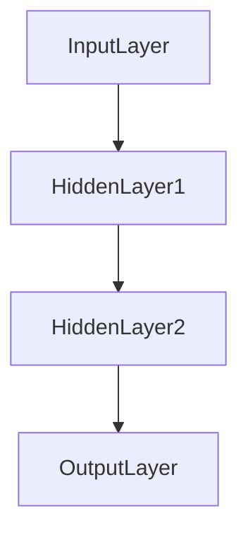

# 一切皆是映射：神经网络中的激活函数深度解析

## 1.背景介绍

在现代人工智能和机器学习领域，神经网络已经成为解决复杂问题的核心工具。无论是图像识别、自然语言处理还是推荐系统，神经网络都展现出了强大的能力。而在神经网络的设计中，激活函数（Activation Function）扮演着至关重要的角色。激活函数不仅影响网络的学习能力，还决定了模型的表达能力和泛化性能。

激活函数的主要作用是引入非线性，使得神经网络能够逼近任意复杂的函数。没有激活函数的神经网络只是一个线性变换，无法解决复杂的非线性问题。因此，理解和选择合适的激活函数是构建高效神经网络的关键。

## 2.核心概念与联系

### 2.1 激活函数的定义

激活函数是应用于神经网络中每个神经元输出的非线性变换函数。其主要目的是引入非线性，使得神经网络能够处理复杂的非线性问题。

### 2.2 常见激活函数

- **Sigmoid 函数**：将输入映射到 (0, 1) 之间，常用于二分类问题。
- **Tanh 函数**：将输入映射到 (-1, 1) 之间，常用于处理归一化数据。
- **ReLU 函数**：将输入小于0的部分置为0，大于0的部分保持不变，常用于深度神经网络。
- **Leaky ReLU 函数**：对 ReLU 函数的改进，允许负值部分有小的斜率。
- **Softmax 函数**：将输入向量转换为概率分布，常用于多分类问题。

### 2.3 激活函数的选择

激活函数的选择直接影响神经网络的性能。不同的激活函数有不同的优缺点，选择合适的激活函数需要根据具体问题和数据特点来决定。

## 3.核心算法原理具体操作步骤

### 3.1 前向传播

在前向传播过程中，激活函数被应用于每一层的输出。以一个简单的三层神经网络为例：



每一层的输出通过激活函数进行非线性变换，然后传递到下一层。

### 3.2 反向传播

在反向传播过程中，激活函数的导数用于计算梯度。以 ReLU 函数为例，其导数在正值部分为1，在负值部分为0。反向传播的步骤如下：

1. 计算损失函数的梯度。
2. 通过链式法则计算每一层的梯度。
3. 更新权重和偏置。

### 3.3 梯度消失与爆炸

在深度神经网络中，梯度消失和梯度爆炸是常见的问题。激活函数的选择可以缓解这些问题。例如，ReLU 函数由于其非饱和性，能够有效缓解梯度消失问题。

## 4.数学模型和公式详细讲解举例说明

### 4.1 Sigmoid 函数

Sigmoid 函数的定义为：

$$
\sigma(x) = \frac{1}{1 + e^{-x}}
$$

其导数为：

$$
\sigma'(x) = \sigma(x) (1 - \sigma(x))
$$

### 4.2 Tanh 函数

Tanh 函数的定义为：

$$
\tanh(x) = \frac{e^x - e^{-x}}{e^x + e^{-x}}
$$

其导数为：

$$
\tanh'(x) = 1 - \tanh^2(x)
$$

### 4.3 ReLU 函数

ReLU 函数的定义为：

$$
\text{ReLU}(x) = \max(0, x)
$$

其导数为：

$$
\text{ReLU}'(x) = 
\begin{cases} 
1 & \text{if } x > 0 \\
0 & \text{if } x \leq 0 
\end{cases}
$$

### 4.4 Softmax 函数

Softmax 函数的定义为：

$$
\text{Softmax}(x_i) = \frac{e^{x_i}}{\sum_{j} e^{x_j}}
$$

其导数为：

$$
\frac{\partial \text{Softmax}(x_i)}{\partial x_j} = \text{Softmax}(x_i) (\delta_{ij} - \text{Softmax}(x_j))
$$

## 5.项目实践：代码实例和详细解释说明

### 5.1 使用 TensorFlow 实现激活函数

以下是使用 TensorFlow 实现常见激活函数的示例代码：

```python
import tensorflow as tf

# 定义输入张量
x = tf.constant([-1.0, 0.0, 1.0, 2.0])

# Sigmoid 函数
sigmoid = tf.nn.sigmoid(x)
print("Sigmoid:", sigmoid.numpy())

# Tanh 函数
tanh = tf.nn.tanh(x)
print("Tanh:", tanh.numpy())

# ReLU 函数
relu = tf.nn.relu(x)
print("ReLU:", relu.numpy())

# Softmax 函数
softmax = tf.nn.softmax(x)
print("Softmax:", softmax.numpy())
```

### 5.2 使用 PyTorch 实现激活函数

以下是使用 PyTorch 实现常见激活函数的示例代码：

```python
import torch

# 定义输入张量
x = torch.tensor([-1.0, 0.0, 1.0, 2.0])

# Sigmoid 函数
sigmoid = torch.sigmoid(x)
print("Sigmoid:", sigmoid.numpy())

# Tanh 函数
tanh = torch.tanh(x)
print("Tanh:", tanh.numpy())

# ReLU 函数
relu = torch.relu(x)
print("ReLU:", relu.numpy())

# Softmax 函数
softmax = torch.softmax(x, dim=0)
print("Softmax:", softmax.numpy())
```

## 6.实际应用场景

### 6.1 图像识别

在图像识别任务中，ReLU 函数由于其计算效率高和缓解梯度消失问题，常被用于卷积神经网络（CNN）中。

### 6.2 自然语言处理

在自然语言处理任务中，Tanh 和 Sigmoid 函数常用于循环神经网络（RNN）和长短期记忆网络（LSTM）中，以处理序列数据。

### 6.3 推荐系统

在推荐系统中，Softmax 函数常用于多分类问题，例如用户对不同物品的偏好预测。

## 7.工具和资源推荐

### 7.1 深度学习框架

- **TensorFlow**：谷歌开发的开源深度学习框架，支持多种激活函数。
- **PyTorch**：Facebook 开发的开源深度学习框架，易于使用和调试。

### 7.2 在线课程

- **Coursera**：提供多种深度学习和神经网络相关课程。
- **edX**：提供由顶级大学和机构开设的深度学习课程。

### 7.3 书籍推荐

- **《深度学习》**：Ian Goodfellow 等人编写的经典教材，详细介绍了激活函数的原理和应用。
- **《神经网络与深度学习》**：Michael Nielsen 编写的入门书籍，适合初学者。

## 8.总结：未来发展趋势与挑战

激活函数在神经网络中的重要性不言而喻。随着深度学习的发展，新的激活函数不断被提出，如 Swish 和 Mish 函数，展示了更好的性能。然而，激活函数的选择仍然是一个需要根据具体问题和数据特点进行权衡的过程。

未来，激活函数的研究将继续深入，新的激活函数可能会进一步提升神经网络的性能。同时，如何有效地结合不同激活函数，构建更强大的神经网络，也是一个值得探索的方向。

## 9.附录：常见问题与解答

### 9.1 为什么需要激活函数？

激活函数引入非线性，使得神经网络能够逼近任意复杂的函数。如果没有激活函数，神经网络只能进行线性变换，无法解决复杂的非线性问题。

### 9.2 如何选择合适的激活函数？

选择激活函数需要根据具体问题和数据特点来决定。一般来说，ReLU 函数在深度神经网络中表现较好，而 Sigmoid 和 Tanh 函数常用于处理归一化数据和序列数据。

### 9.3 激活函数的导数有什么作用？

激活函数的导数用于反向传播过程中计算梯度。不同激活函数的导数形式不同，影响梯度的计算和权重的更新。

### 9.4 什么是梯度消失和梯度爆炸？

梯度消失和梯度爆炸是指在反向传播过程中，梯度逐层减小或增大，导致网络无法有效学习。选择合适的激活函数可以缓解这些问题。

作者：禅与计算机程序设计艺术 / Zen and the Art of Computer Programming