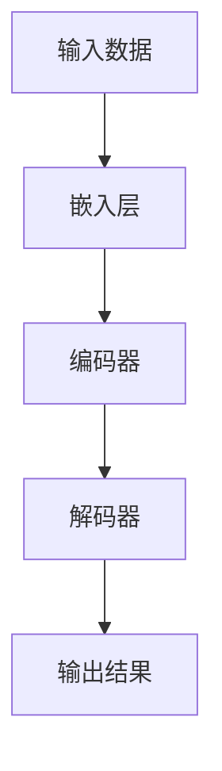

# 从零开始大模型开发与微调：人工智能：思维与实践的融合

## 1.背景介绍

在过去的十年中，人工智能（AI）技术取得了飞速的发展，尤其是大规模预训练模型（Large Pre-trained Models）的出现，彻底改变了自然语言处理（NLP）、计算机视觉（CV）等领域的研究和应用。大模型如GPT-3、BERT、T5等，凭借其强大的学习能力和广泛的适用性，成为了AI领域的明星。然而，如何从零开始开发和微调这些大模型，仍然是一个复杂且具有挑战性的任务。

## 2.核心概念与联系

### 2.1 大模型

大模型是指具有大量参数的深度学习模型，通常通过在大规模数据集上进行预训练来获得强大的特征提取能力。这些模型可以在多个任务上进行微调，从而实现高效的迁移学习。

### 2.2 预训练与微调

预训练是指在大规模通用数据集上训练模型，使其学习到广泛的特征表示。微调则是在特定任务的数据集上进一步训练预训练模型，以适应特定任务的需求。

### 2.3 迁移学习

迁移学习是指将一个任务上学到的知识应用到另一个相关任务上。大模型的预训练和微调过程正是迁移学习的典型应用。

### 2.4 自监督学习

自监督学习是一种无需人工标注数据的学习方法，通过设计特定的任务（如掩码语言模型）来让模型从数据中自我学习。

### 2.5 参数与超参数

参数是模型在训练过程中学习到的权重和偏置，而超参数是训练过程中需要手动设置的参数，如学习率、批量大小等。

## 3.核心算法原理具体操作步骤

### 3.1 数据准备

数据是大模型训练的基础。数据集的选择和处理直接影响模型的性能。常见的数据集包括文本数据集（如Wikipedia、Common Crawl）、图像数据集（如ImageNet）等。

### 3.2 模型架构设计

大模型的架构设计通常基于Transformer结构。Transformer通过自注意力机制（Self-Attention）实现对序列数据的高效建模。



### 3.3 预训练

预训练通常采用自监督学习方法，如掩码语言模型（Masked Language Model, MLM）和自回归语言模型（Autoregressive Language Model, ARLM）。

### 3.4 微调

微调是在特定任务的数据集上进一步训练预训练模型。常见的微调方法包括全参数微调和部分参数微调。

### 3.5 模型评估

模型评估是指通过特定的指标（如准确率、F1分数等）来衡量模型的性能。评估数据集通常与训练数据集不同，以确保模型的泛化能力。

## 4.数学模型和公式详细讲解举例说明

### 4.1 自注意力机制

自注意力机制是Transformer的核心，通过计算输入序列中每个位置的注意力权重来捕捉全局信息。其计算公式如下：

$$
\text{Attention}(Q, K, V) = \text{softmax}\left(\frac{QK^T}{\sqrt{d_k}}\right)V
$$

其中，$Q$、$K$、$V$分别表示查询（Query）、键（Key）和值（Value）矩阵，$d_k$是键的维度。

### 4.2 掩码语言模型

掩码语言模型通过随机掩盖输入序列中的部分词语，并让模型预测这些被掩盖的词语。其损失函数为：

$$
\mathcal{L}_{MLM} = -\sum_{i \in \text{masked}} \log P(x_i | x_{\text{masked}})
$$

### 4.3 自回归语言模型

自回归语言模型通过逐步生成序列中的每个词语，其损失函数为：

$$
\mathcal{L}_{ARLM} = -\sum_{t=1}^{T} \log P(x_t | x_{1:t-1})
$$

## 5.项目实践：代码实例和详细解释说明

### 5.1 环境配置

首先，确保安装了必要的库，如TensorFlow、PyTorch、Transformers等。

```bash
pip install tensorflow torch transformers
```

### 5.2 数据加载

使用Transformers库加载预训练模型和数据集。

```python
from transformers import BertTokenizer, BertForMaskedLM
from transformers import TextDataset, DataCollatorForLanguageModeling

tokenizer = BertTokenizer.from_pretrained('bert-base-uncased')
model = BertForMaskedLM.from_pretrained('bert-base-uncased')

dataset = TextDataset(
    tokenizer=tokenizer,
    file_path='path/to/dataset.txt',
    block_size=128
)

data_collator = DataCollatorForLanguageModeling(
    tokenizer=tokenizer,
    mlm=True,
    mlm_probability=0.15
)
```

### 5.3 模型训练

使用Trainer API进行模型训练。

```python
from transformers import Trainer, TrainingArguments

training_args = TrainingArguments(
    output_dir='./results',
    overwrite_output_dir=True,
    num_train_epochs=3,
    per_device_train_batch_size=8,
    save_steps=10_000,
    save_total_limit=2,
)

trainer = Trainer(
    model=model,
    args=training_args,
    data_collator=data_collator,
    train_dataset=dataset
)

trainer.train()
```

### 5.4 模型评估

使用评估数据集对模型进行评估。

```python
eval_results = trainer.evaluate()
print(f"Perplexity: {eval_results['perplexity']}")
```

## 6.实际应用场景

### 6.1 自然语言处理

大模型在自然语言处理中的应用非常广泛，包括但不限于文本生成、机器翻译、情感分析等。

### 6.2 计算机视觉

在计算机视觉领域，大模型可以用于图像分类、目标检测、图像生成等任务。

### 6.3 医疗健康

大模型在医疗健康领域的应用也在不断增加，如医学影像分析、药物发现、个性化医疗等。

### 6.4 金融科技

在金融科技领域，大模型可以用于风险评估、欺诈检测、智能投顾等。

## 7.工具和资源推荐

### 7.1 开源框架

- TensorFlow
- PyTorch
- Hugging Face Transformers

### 7.2 数据集

- Wikipedia
- Common Crawl
- ImageNet

### 7.3 在线课程

- Coursera: Deep Learning Specialization
- edX: AI for Everyone
- Udacity: Deep Learning Nanodegree

## 8.总结：未来发展趋势与挑战

大模型的发展前景广阔，但也面临诸多挑战。未来，如何提高模型的训练效率、降低计算成本、增强模型的解释性和可控性，将是研究的重点方向。此外，数据隐私和伦理问题也需要引起足够的重视。

## 9.附录：常见问题与解答

### 9.1 如何选择合适的数据集？

选择数据集时，应根据具体任务的需求，选择具有代表性和多样性的数据集。同时，数据集的质量和规模也是需要考虑的重要因素。

### 9.2 如何设置超参数？

超参数的设置通常需要通过实验来确定。可以使用网格搜索（Grid Search）或贝叶斯优化（Bayesian Optimization）等方法来自动化超参数调优过程。

### 9.3 如何处理过拟合问题？

过拟合是指模型在训练数据上表现良好，但在测试数据上表现不佳。可以通过增加数据量、使用正则化方法（如L2正则化、Dropout）等手段来缓解过拟合问题。

### 9.4 如何提高模型的训练效率？

提高模型训练效率的方法包括使用分布式训练、混合精度训练、模型压缩等。

### 9.5 如何评估模型的性能？

模型性能的评估通常通过特定的指标来进行，如准确率、F1分数、困惑度（Perplexity）等。应根据具体任务选择合适的评估指标。

---

作者：禅与计算机程序设计艺术 / Zen and the Art of Computer Programming