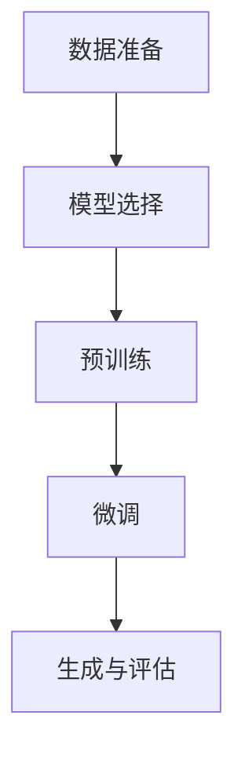

# 从零开始大模型开发与微调：生成式模型实战：古诗词的生成

## 1.背景介绍

在人工智能领域，生成式模型（Generative Models）近年来取得了显著的进展。特别是基于深度学习的生成式模型，如生成对抗网络（GANs）、变分自编码器（VAEs）和自回归模型（Autoregressive Models），在图像生成、文本生成等任务中表现出色。本文将聚焦于生成式模型在古诗词生成中的应用，详细介绍从零开始开发和微调大模型的全过程。

古诗词作为中华文化的瑰宝，具有高度的艺术性和复杂的语言结构。生成古诗词不仅需要模型具备强大的语言理解和生成能力，还需要对诗词的韵律、对仗等特性有深刻的理解。本文将通过具体的实例，展示如何利用生成式模型生成高质量的古诗词。

## 2.核心概念与联系

在深入探讨具体实现之前，我们需要了解一些核心概念和它们之间的联系。

### 2.1 生成式模型

生成式模型旨在学习数据的分布，并能够从中生成新的数据样本。常见的生成式模型包括：

- **生成对抗网络（GANs）**：由生成器和判别器组成，通过对抗训练生成逼真的数据。
- **变分自编码器（VAEs）**：通过编码器和解码器学习数据的潜在表示，并生成新数据。
- **自回归模型（Autoregressive Models）**：如GPT系列，通过逐步生成数据的每个部分。

### 2.2 自然语言处理（NLP）

自然语言处理是人工智能的一个重要分支，涉及计算机对人类语言的理解和生成。生成古诗词属于NLP中的文本生成任务，需要模型具备语言建模能力。

### 2.3 预训练与微调

预训练（Pre-training）是指在大规模数据集上训练模型，使其学习通用的语言表示。微调（Fine-tuning）则是在特定任务的数据集上进一步训练模型，使其适应特定任务的需求。

### 2.4 古诗词的特性

古诗词具有独特的韵律、对仗和意境等特性。生成高质量的古诗词需要模型不仅能生成语法正确的句子，还需符合诗词的艺术性要求。

## 3.核心算法原理具体操作步骤

在本节中，我们将详细介绍生成古诗词的核心算法原理和具体操作步骤。

### 3.1 数据准备

首先，需要准备一个包含大量古诗词的语料库。可以从公开的古诗词数据库中获取数据，并进行预处理，如去除标点符号、分词等。

### 3.2 模型选择

选择适合的生成式模型是关键。本文将使用GPT-3模型，它在文本生成任务中表现优异。GPT-3是一个自回归模型，通过逐步生成每个词来生成完整的句子。

### 3.3 预训练

在大规模通用语料库上预训练GPT-3模型，使其学习通用的语言表示。预训练的目标是最大化生成下一个词的概率。

### 3.4 微调

在古诗词数据集上微调预训练模型，使其适应古诗词的生成任务。微调的目标是使模型生成的文本符合古诗词的特性。

### 3.5 生成与评估

使用微调后的模型生成古诗词，并通过人工评估和自动评估相结合的方法，评估生成结果的质量。

以下是生成古诗词的流程图：



## 4.数学模型和公式详细讲解举例说明

在本节中，我们将详细讲解生成式模型的数学原理和公式，并通过具体例子说明。

### 4.1 自回归模型的数学原理

自回归模型通过条件概率生成序列中的每个词。假设序列为 $x_1, x_2, ..., x_T$，则生成序列的概率为：

$$
P(x_1, x_2, ..., x_T) = \prod_{t=1}^{T} P(x_t | x_1, x_2, ..., x_{t-1})
$$

### 4.2 GPT-3的训练目标

GPT-3的训练目标是最大化条件概率 $P(x_t | x_1, x_2, ..., x_{t-1})$。具体来说，给定一个序列 $x_1, x_2, ..., x_T$，训练目标为：

$$
L = - \sum_{t=1}^{T} \log P(x_t | x_1, x_2, ..., x_{t-1})
$$

### 4.3 微调的数学原理

微调是在特定任务的数据集上进一步训练模型。假设古诗词数据集为 $D = \{(x_1^i, x_2^i, ..., x_T^i)\}_{i=1}^{N}$，微调的目标是最小化在古诗词数据集上的损失：

$$
L_{fine-tune} = - \sum_{i=1}^{N} \sum_{t=1}^{T} \log P(x_t^i | x_1^i, x_2^i, ..., x_{t-1}^i)
$$

### 4.4 举例说明

假设我们有一首古诗词 "春眠不觉晓，处处闻啼鸟"，我们希望模型生成下一句。首先，模型会计算每个词的条件概率：

$$
P(春|<start>) \cdot P(眠|春) \cdot P(不|春眠) \cdot P(觉|春眠不) \cdot P(晓|春眠不觉)
$$

然后，模型会根据这些概率生成下一个词，直到生成完整的句子。

## 5.项目实践：代码实例和详细解释说明

在本节中，我们将通过具体的代码实例，展示如何从零开始开发和微调生成古诗词的模型。

### 5.1 环境配置

首先，配置开发环境。我们需要安装Python和相关的深度学习库，如TensorFlow或PyTorch。

```bash
pip install tensorflow
pip install transformers
```

### 5.2 数据准备

准备古诗词数据集，并进行预处理。

```python
import pandas as pd

# 读取古诗词数据集
data = pd.read_csv('poetry.csv')

# 数据预处理
def preprocess(text):
    text = text.replace('，', '').replace('。', '')
    return text

data['text'] = data['text'].apply(preprocess)
```

### 5.3 模型选择与预训练

使用Transformers库加载预训练的GPT-3模型。

```python
from transformers import GPT2Tokenizer, GPT2LMHeadModel

# 加载预训练的GPT-3模型
tokenizer = GPT2Tokenizer.from_pretrained('gpt2')
model = GPT2LMHeadModel.from_pretrained('gpt2')
```

### 5.4 微调

在古诗词数据集上微调模型。

```python
from transformers import Trainer, TrainingArguments

# 准备数据集
train_encodings = tokenizer(data['text'].tolist(), truncation=True, padding=True, max_length=128)

# 定义训练参数
training_args = TrainingArguments(
    output_dir='./results',
    num_train_epochs=3,
    per_device_train_batch_size=4,
    save_steps=10_000,
    save_total_limit=2,
)

# 定义Trainer
trainer = Trainer(
    model=model,
    args=training_args,
    train_dataset=train_encodings,
)

# 开始训练
trainer.train()
```

### 5.5 生成古诗词

使用微调后的模型生成古诗词。

```python
# 输入起始句子
input_text = "春眠不觉晓"

# 编码输入
input_ids = tokenizer.encode(input_text, return_tensors='pt')

# 生成古诗词
output = model.generate(input_ids, max_length=50, num_return_sequences=1)

# 解码输出
generated_text = tokenizer.decode(output[0], skip_special_tokens=True)
print(generated_text)
```

## 6.实际应用场景

生成式模型在古诗词生成中的应用不仅限于学术研究，还可以在多个实际场景中发挥重要作用。

### 6.1 文化传承与教育

生成古诗词可以用于文化传承和教育，帮助学生更好地理解和学习古诗词。通过生成模型，学生可以与AI互动，生成自己的诗词作品，激发学习兴趣。

### 6.2 文学创作辅助

生成式模型可以作为文学创作的辅助工具，帮助作家和诗人生成灵感。通过与AI合作，创作者可以探索新的创作方向和风格。

### 6.3 文化产品开发

生成古诗词可以应用于文化产品的开发，如诗词书籍、文化纪念品等。通过AI生成的诗词，可以为文化产品增添独特的艺术价值。

## 7.工具和资源推荐

在开发和微调生成式模型的过程中，有许多工具和资源可以帮助我们提高效率和效果。

### 7.1 开发工具

- **Python**：主流的编程语言，广泛应用于人工智能和深度学习领域。
- **TensorFlow**：谷歌开发的开源深度学习框架，支持大规模机器学习任务。
- **PyTorch**：Facebook开发的开源深度学习框架，具有灵活性和易用性。

### 7.2 数据资源

- **古诗词数据库**：如《全唐诗》、《全宋词》等，提供丰富的古诗词数据。
- **公开数据集**：如Kaggle上的古诗词数据集，可以用于模型训练和评估。

### 7.3 预训练模型

- **GPT-3**：OpenAI开发的预训练语言模型，在文本生成任务中表现优异。
- **BERT**：谷歌开发的预训练语言模型，适用于多种NLP任务。

## 8.总结：未来发展趋势与挑战

生成式模型在古诗词生成中的应用展示了人工智能在文化传承和创作中的潜力。然而，未来仍面临许多挑战和发展机遇。

### 8.1 未来发展趋势

- **多模态生成**：结合图像、音频等多模态数据，生成更加丰富的文化作品。
- **个性化生成**：根据用户的喜好和需求，生成个性化的诗词作品。
- **跨语言生成**：实现多语言的诗词生成，促进文化交流和传播。

### 8.2 挑战

- **艺术性与技术性的平衡**：生成的诗词需要在艺术性和技术性之间找到平衡，既要符合诗词的艺术要求，又要具备技术上的可行性。
- **数据质量与多样性**：高质量和多样化的数据是生成高质量诗词的基础，需要不断丰富和优化数据资源。
- **模型的解释性与可控性**：生成式模型的黑箱特性使得其生成过程难以解释和控制，需要进一步研究和改进。

## 9.附录：常见问题与解答

### 9.1 如何选择合适的生成式模型？

选择生成式模型时，需要考虑任务的具体需求和模型的性能。对于文本生成任务，GPT系列模型表现优异，适合生成古诗词。

### 9.2 如何评估生成的古诗词质量？

评估生成的古诗词质量可以通过人工评估和自动评估相结合的方法。人工评估可以从艺术性、语法正确性等方面进行评价，自动评估可以使用BLEU、ROUGE等指标。

### 9.3 如何处理生成的诗词不符合韵律和对仗要求的问题？

可以在微调过程中加入韵律和对仗的约束，或者使用后处理方法对生成的诗词进行修正。

### 9.4 如何提高生成模型的训练效率？

可以通过使用更高效的硬件设备（如GPU、TPU）、优化模型结构和训练算法、使用分布式训练等方法提高训练效率。

### 9.5 如何获取更多的古诗词数据？

可以从公开的古诗词数据库、图书馆、文献资料等渠道获取更多的古诗词数据，并进行数字化和预处理。

---

作者：禅与计算机程序设计艺术 / Zen and the Art of Computer Programming