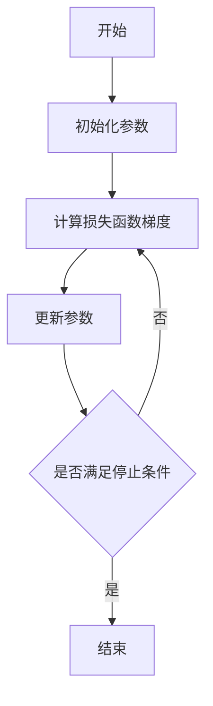

## 1. 背景介绍

在机器学习和深度学习的世界里，梯度下降（Gradient Descent）算法是一种基础且极其重要的优化算法。它被广泛应用于训练各种模型，包括线性回归、神经网络等。梯度下降的核心思想是利用函数的梯度信息来寻找函数的最小值。在实际应用中，这通常意味着找到一组参数，使得损失函数（loss function）的值最小化，从而优化模型的性能。

## 2. 核心概念与联系

在深入梯度下降算法之前，我们需要理解几个核心概念：

- **损失函数（Loss Function）**：衡量模型预测值与真实值之间差异的函数。
- **梯度（Gradient）**：函数在某一点上的导数，表示函数在该点的上升或下降趋势。
- **学习率（Learning Rate）**：决定在梯度下降过程中参数更新的步长大小。
- **局部最小值（Local Minimum）**：函数在某个区域内的最小值点。
- **全局最小值（Global Minimum）**：函数在整个定义域内的最小值点。

这些概念之间的联系是：通过计算损失函数的梯度，我们可以知道参数应该如何更新以减少损失；学习率决定了这些更新的幅度；而我们的目标是找到损失函数的全局最小值或局部最小值。

## 3. 核心算法原理具体操作步骤

梯度下降算法的操作步骤可以用以下流程图表示：



具体步骤如下：

1. **初始化参数**：随机选择一个起点作为参数的初始值。
2. **计算损失函数梯度**：在当前参数下，计算损失函数关于每个参数的梯度。
3. **更新参数**：根据梯度和学习率调整参数值，以减少损失。
4. **判断停止条件**：当梯度接近零或达到预设的迭代次数时停止算法。

## 4. 数学模型和公式详细讲解举例说明

梯度下降算法的数学模型可以表示为：

$$
\theta_{next} = \theta_{current} - \alpha \cdot \nabla_{\theta}J(\theta)
$$

其中，$\theta$ 表示模型参数，$J(\theta)$ 是损失函数，$\alpha$ 是学习率，$\nabla_{\theta}J(\theta)$ 是损失函数关于参数$\theta$的梯度。

例如，对于线性回归模型 $f(x) = wx + b$，其损失函数可以是均方误差：

$$
J(w, b) = \frac{1}{2m} \sum_{i=1}^{m} (f(x^{(i)}) - y^{(i)})^2
$$

其中，$m$ 是样本数量，$x^{(i)}$ 和 $y^{(i)}$ 分别是第$i$个样本的特征和标签。计算损失函数关于$w$和$b$的梯度，我们可以得到：

$$
\nabla_w J(w, b) = \frac{1}{m} \sum_{i=1}^{m} (f(x^{(i)}) - y^{(i)})x^{(i)}
$$

$$
\nabla_b J(w, b) = \frac{1}{m} \sum_{i=1}^{m} (f(x^{(i)}) - y^{(i)})
$$

然后，我们可以使用这些梯度来更新$w$和$b$。

## 5. 项目实践：代码实例和详细解释说明

以下是一个简单的梯度下降算法实现，用于线性回归模型：

```python
import numpy as np

# 损失函数
def compute_loss(X, y, w, b):
    m = len(y)
    loss = 0.5 / m * np.sum((X.dot(w) + b - y) ** 2)
    return loss

# 梯度计算
def compute_gradient(X, y, w, b):
    m = len(y)
    y_pred = X.dot(w) + b
    grad_w = 1 / m * X.T.dot(y_pred - y)
    grad_b = 1 / m * np.sum(y_pred - y)
    return grad_w, grad_b

# 梯度下降算法
def gradient_descent(X, y, w_init, b_init, alpha, num_iters):
    w = w_init
    b = b_init
    for i in range(num_iters):
        grad_w, grad_b = compute_gradient(X, y, w, b)
        w -= alpha * grad_w
        b -= alpha * grad_b
        if i % 100 == 0:
            loss = compute_loss(X, y, w, b)
            print(f"Iteration {i}: Loss {loss}")
    return w, b

# 示例数据
X = np.array([[1], [2], [3]])
y = np.array([2, 4, 6])
w_init = np.zeros((1, 1))
b_init = 0

# 运行梯度下降
w_final, b_final = gradient_descent(X, y, w_init, b_init, alpha=0.01, num_iters=1000)
print(f"Final weights: {w_final}, Final bias: {b_final}")
```

在这个例子中，我们首先定义了损失函数和梯度计算函数，然后实现了梯度下降算法。我们使用了一个简单的线性关系数据集来训练模型，并在每100次迭代后打印出损失值。

## 6. 实际应用场景

梯度下降算法在机器学习和深度学习领域有着广泛的应用，例如：

- **线性回归**：预测房价、股票价格等连续值。
- **逻辑回归**：二分类问题，如垃圾邮件检测、疾病诊断。
- **神经网络训练**：图像识别、语音识别、自然语言处理等。

## 7. 工具和资源推荐

- **NumPy**：进行高效的数值计算。
- **Matplotlib**：可视化损失函数和模型参数的变化。
- **TensorFlow** 和 **PyTorch**：提供自动梯度计算和高级优化算法。

## 8. 总结：未来发展趋势与挑战

梯度下降算法虽然简单有效，但仍面临一些挑战，如选择合适的学习率、避免陷入局部最小值、处理高维数据时的计算效率等。未来的发展趋势可能包括自适应学习率算法、并行和分布式计算技术的应用，以及更高级的优化策略。

## 9. 附录：常见问题与解答

- **Q1：如何选择合适的学习率？**
  - A1：通常通过实验来确定。太小的学习率会导致收敛速度慢，太大则可能导致震荡或发散。

- **Q2：梯度下降算法是否总能找到全局最小值？**
  - A2：不一定。对于非凸函数，梯度下降可能只能找到局部最小值。

- **Q3：如何避免陷入局部最小值？**
  - A3：可以使用多种策略，如随机初始化、动量方法或使用更高级的优化算法。

作者：禅与计算机程序设计艺术 / Zen and the Art of Computer Programming