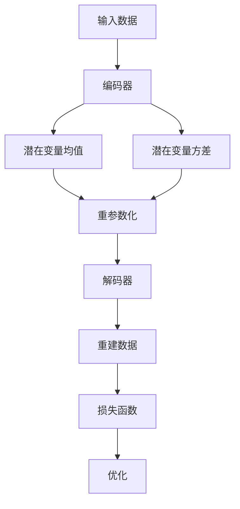

# 变分自编码器与生成模型原理与代码实战案例讲解

## 1.背景介绍

在过去的几年中，生成模型在人工智能和机器学习领域取得了显著的进展。生成模型的目标是学习数据的分布，并能够生成与训练数据相似的新数据。变分自编码器（Variational Autoencoders, VAE）作为一种强大的生成模型，因其在图像生成、数据压缩和异常检测等领域的广泛应用而备受关注。

变分自编码器结合了概率图模型和深度学习的优势，通过引入变分推断方法，使得模型能够高效地进行训练和推断。本文将深入探讨变分自编码器的核心概念、算法原理、数学模型，并通过实际代码示例展示其应用。

## 2.核心概念与联系

### 2.1 自编码器

自编码器是一种无监督学习模型，旨在通过编码器将输入数据压缩到低维表示，再通过解码器将其重建。自编码器的目标是最小化输入数据与重建数据之间的差异。

### 2.2 变分自编码器

变分自编码器在自编码器的基础上引入了概率分布的概念。VAE假设潜在变量服从某种分布（通常是高斯分布），并通过变分推断方法来近似后验分布。VAE的目标是最大化似然函数，同时最小化KL散度。

### 2.3 生成模型

生成模型旨在学习数据的分布，并能够生成与训练数据相似的新数据。VAE作为一种生成模型，通过学习潜在变量的分布，实现数据生成。

## 3.核心算法原理具体操作步骤

### 3.1 编码器和解码器

VAE的编码器将输入数据映射到潜在空间，生成潜在变量的均值和方差。解码器则将潜在变量映射回数据空间，生成重建数据。

### 3.2 变分推断

变分推断通过引入变分分布来近似后验分布。VAE使用重参数化技巧，将随机变量的采样过程转化为确定性操作，从而实现梯度的反向传播。

### 3.3 损失函数

VAE的损失函数由重建误差和KL散度组成。重建误差衡量输入数据与重建数据之间的差异，KL散度衡量近似后验分布与先验分布之间的差异。



## 4.数学模型和公式详细讲解举例说明

### 4.1 变分下界

VAE的目标是最大化似然函数 $p(x)$，但直接计算 $p(x)$ 通常是不可行的。通过引入变分下界（Variational Lower Bound, ELBO），我们可以将问题转化为最大化ELBO：

$$
\log p(x) \geq \mathbb{E}_{q(z|x)}[\log p(x|z)] - \text{KL}(q(z|x) || p(z))
$$

其中，$q(z|x)$ 是近似后验分布，$p(z)$ 是先验分布，$\text{KL}$ 表示KL散度。

### 4.2 重参数化技巧

为了实现梯度的反向传播，VAE引入了重参数化技巧。假设潜在变量 $z$ 服从高斯分布 $N(\mu, \sigma^2)$，我们可以将其表示为：

$$
z = \mu + \sigma \cdot \epsilon
$$

其中，$\epsilon \sim N(0, 1)$ 是标准正态分布的随机变量。

### 4.3 损失函数

VAE的损失函数由重建误差和KL散度组成：

$$
\mathcal{L} = \mathbb{E}_{q(z|x)}[\log p(x|z)] - \text{KL}(q(z|x) || p(z))
$$

重建误差衡量输入数据与重建数据之间的差异，KL散度衡量近似后验分布与先验分布之间的差异。

## 5.项目实践：代码实例和详细解释说明

### 5.1 环境配置

首先，我们需要配置Python环境，并安装必要的库：

```bash
pip install torch torchvision matplotlib
```

### 5.2 数据准备

我们将使用MNIST数据集进行实验：

```python
import torch
from torchvision import datasets, transforms

transform = transforms.Compose([transforms.ToTensor()])
train_dataset = datasets.MNIST(root='./data', train=True, transform=transform, download=True)
train_loader = torch.utils.data.DataLoader(dataset=train_dataset, batch_size=64, shuffle=True)
```

### 5.3 模型定义

定义VAE的编码器和解码器：

```python
import torch.nn as nn
import torch.nn.functional as F

class VAE(nn.Module):
    def __init__(self):
        super(VAE, self).__init__()
        self.fc1 = nn.Linear(784, 400)
        self.fc21 = nn.Linear(400, 20)
        self.fc22 = nn.Linear(400, 20)
        self.fc3 = nn.Linear(20, 400)
        self.fc4 = nn.Linear(400, 784)

    def encode(self, x):
        h1 = F.relu(self.fc1(x))
        return self.fc21(h1), self.fc22(h1)

    def reparameterize(self, mu, logvar):
        std = torch.exp(0.5*logvar)
        eps = torch.randn_like(std)
        return mu + eps*std

    def decode(self, z):
        h3 = F.relu(self.fc3(z))
        return torch.sigmoid(self.fc4(h3))

    def forward(self, x):
        mu, logvar = self.encode(x.view(-1, 784))
        z = self.reparameterize(mu, logvar)
        return self.decode(z), mu, logvar
```

### 5.4 损失函数和优化器

定义损失函数和优化器：

```python
def loss_function(recon_x, x, mu, logvar):
    BCE = F.binary_cross_entropy(recon_x, x.view(-1, 784), reduction='sum')
    KLD = -0.5 * torch.sum(1 + logvar - mu.pow(2) - logvar.exp())
    return BCE + KLD

model = VAE()
optimizer = torch.optim.Adam(model.parameters(), lr=1e-3)
```

### 5.5 训练模型

训练VAE模型：

```python
def train(epoch):
    model.train()
    train_loss = 0
    for batch_idx, (data, _) in enumerate(train_loader):
        optimizer.zero_grad()
        recon_batch, mu, logvar = model(data)
        loss = loss_function(recon_batch, data, mu, logvar)
        loss.backward()
        train_loss += loss.item()
        optimizer.step()
        if batch_idx % 100 == 0:
            print(f'Train Epoch: {epoch} [{batch_idx * len(data)}/{len(train_loader.dataset)} ({100. * batch_idx / len(train_loader):.0f}%)]\tLoss: {loss.item() / len(data):.6f}')

    print(f'====> Epoch: {epoch} Average loss: {train_loss / len(train_loader.dataset):.4f}')

for epoch in range(1, 11):
    train(epoch)
```

### 5.6 生成新数据

使用训练好的模型生成新数据：

```python
with torch.no_grad():
    z = torch.randn(64, 20)
    sample = model.decode(z).cpu()
    sample = sample.view(64, 1, 28, 28)
    grid_img = torchvision.utils.make_grid(sample, nrow=8)
    plt.imshow(grid_img.permute(1, 2, 0))
    plt.show()
```

## 6.实际应用场景

### 6.1 图像生成

VAE可以用于生成与训练数据相似的新图像，广泛应用于图像生成和图像修复等领域。

### 6.2 数据压缩

VAE通过将数据压缩到低维潜在空间，实现数据压缩和降维，适用于数据存储和传输。

### 6.3 异常检测

VAE可以通过重建误差检测异常数据，广泛应用于工业监控和网络安全等领域。

## 7.工具和资源推荐

### 7.1 工具

- **PyTorch**：一个开源的深度学习框架，支持动态计算图和自动微分。
- **TensorFlow**：一个开源的机器学习框架，支持大规模分布式计算。
- **Jupyter Notebook**：一个交互式的计算环境，适用于数据分析和可视化。

### 7.2 资源

- **论文**：Kingma, D. P., & Welling, M. (2013). Auto-Encoding Variational Bayes. arXiv preprint arXiv:1312.6114.
- **书籍**：《深度学习》- Ian Goodfellow, Yoshua Bengio, Aaron Courville
- **在线课程**：Coursera上的深度学习课程

## 8.总结：未来发展趋势与挑战

变分自编码器作为一种强大的生成模型，在图像生成、数据压缩和异常检测等领域展现了广阔的应用前景。未来，随着计算能力的提升和算法的改进，VAE有望在更多实际应用中发挥重要作用。然而，VAE也面临着一些挑战，如生成图像的质量和多样性有待提高，模型的训练和推断效率需要进一步优化。

## 9.附录：常见问题与解答

### 9.1 VAE与GAN的区别是什么？

VAE和GAN都是生成模型，但它们的原理和训练方法不同。VAE通过变分推断近似后验分布，而GAN通过生成器和判别器的对抗训练实现数据生成。

### 9.2 如何选择VAE的潜在空间维度？

潜在空间的维度是一个超参数，需要根据具体任务和数据集进行选择。通常可以通过实验和交叉验证来确定最佳维度。

### 9.3 VAE的重参数化技巧有什么作用？

重参数化技巧将随机变量的采样过程转化为确定性操作，从而实现梯度的反向传播，使得VAE能够通过梯度下降进行训练。

### 9.4 如何提高VAE生成图像的质量？

可以通过增加模型的复杂度（如使用更深的网络结构）、改进损失函数（如引入感知损失）和结合其他生成模型（如GAN）来提高VAE生成图像的质量。

### 9.5 VAE可以应用于哪些领域？

VAE可以应用于图像生成、数据压缩、异常检测、自然语言处理等多个领域，具有广泛的应用前景。

---

作者：禅与计算机程序设计艺术 / Zen and the Art of Computer Programming