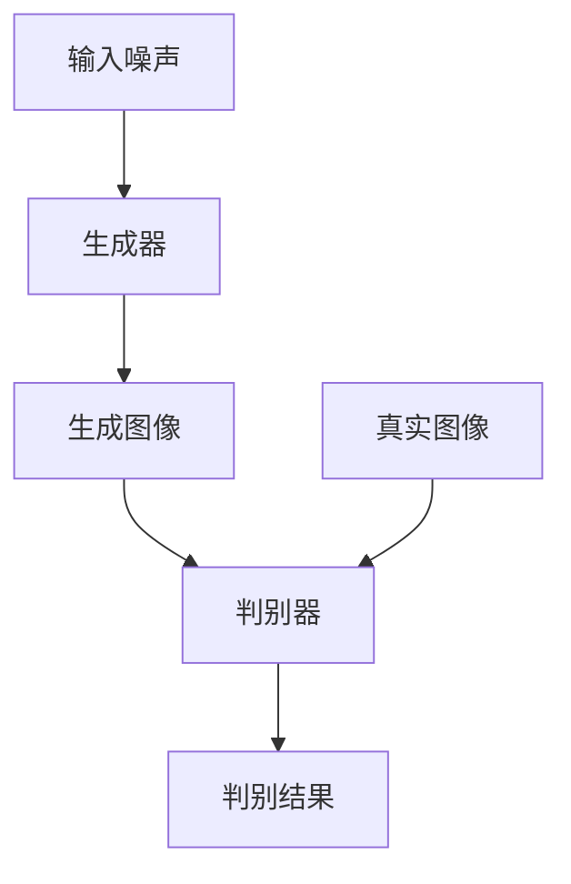

# 基于生成对抗网络的数字化图像风格迁移历史档案构建

## 1.背景介绍

在数字化时代，历史档案的保存和展示面临着前所未有的挑战和机遇。传统的纸质档案容易受损、难以保存，而数字化技术的进步为档案的保存和展示提供了新的可能性。生成对抗网络（GANs）作为一种前沿的深度学习技术，已经在图像生成和风格迁移领域取得了显著的成果。本文将探讨如何利用GANs技术进行数字化图像风格迁移，以构建和保存历史档案。

## 2.核心概念与联系

### 2.1 生成对抗网络（GANs）

生成对抗网络由Ian Goodfellow等人在2014年提出，主要由生成器（Generator）和判别器（Discriminator）两个神经网络组成。生成器负责生成逼真的图像，而判别器则负责区分生成的图像和真实图像。两者通过对抗训练，不断提升生成图像的质量。

### 2.2 风格迁移

风格迁移是一种将一种图像的风格应用到另一种图像上的技术。通过风格迁移，可以将现代图像转换为具有历史风格的图像，从而实现历史档案的数字化保存和展示。

### 2.3 数字化图像档案

数字化图像档案是指通过数字化技术将传统的纸质档案转换为电子档案。这不仅有助于档案的保存，还可以通过互联网进行广泛传播和共享。

## 3.核心算法原理具体操作步骤

### 3.1 GANs的基本结构



### 3.2 风格迁移的实现步骤

1. **数据准备**：收集大量的历史图像和现代图像。
2. **模型训练**：使用GANs进行对抗训练，生成具有历史风格的图像。
3. **图像生成**：将现代图像输入生成器，生成具有历史风格的图像。
4. **结果评估**：使用判别器评估生成图像的质量，并进行优化。

## 4.数学模型和公式详细讲解举例说明

### 4.1 GANs的损失函数

生成器和判别器的损失函数分别为：

$$
L_D = -\mathbb{E}_{x \sim p_{data}(x)}[\log D(x)] - \mathbb{E}_{z \sim p_z(z)}[\log(1 - D(G(z)))]
$$

$$
L_G = -\mathbb{E}_{z \sim p_z(z)}[\log D(G(z))]
$$

### 4.2 风格迁移的损失函数

风格迁移的损失函数通常包括内容损失和风格损失：

$$
L_{content} = \sum_{i,j} (F_{ij}^l - P_{ij}^l)^2
$$

$$
L_{style} = \sum_{l} w_l \sum_{i,j} (G_{ij}^l - A_{ij}^l)^2
$$

其中，$F_{ij}^l$ 和 $P_{ij}^l$ 分别表示生成图像和内容图像在第 $l$ 层的特征图，$G_{ij}^l$ 和 $A_{ij}^l$ 分别表示生成图像和风格图像在第 $l$ 层的Gram矩阵。

## 5.项目实践：代码实例和详细解释说明

### 5.1 数据准备

首先，准备历史图像和现代图像的数据集。可以使用Python的PIL库进行图像的读取和预处理。

```python
from PIL import Image
import os

def load_images(path, size=(256, 256)):
    images = []
    for file in os.listdir(path):
        if file.endswith('.jpg') or file.endswith('.png'):
            img = Image.open(os.path.join(path, file))
            img = img.resize(size)
            images.append(np.array(img))
    return np.array(images)
```

### 5.2 模型训练

使用TensorFlow或PyTorch进行GANs的训练。以下是一个简单的GANs训练示例：

```python
import tensorflow as tf
from tensorflow.keras import layers

def build_generator():
    model = tf.keras.Sequential()
    model.add(layers.Dense(256, input_dim=100))
    model.add(layers.LeakyReLU(alpha=0.2))
    model.add(layers.Dense(512))
    model.add(layers.LeakyReLU(alpha=0.2))
    model.add(layers.Dense(1024))
    model.add(layers.LeakyReLU(alpha=0.2))
    model.add(layers.Dense(28 * 28 * 1, activation='tanh'))
    model.add(layers.Reshape((28, 28, 1)))
    return model

def build_discriminator():
    model = tf.keras.Sequential()
    model.add(layers.Flatten(input_shape=(28, 28, 1)))
    model.add(layers.Dense(512))
    model.add(layers.LeakyReLU(alpha=0.2))
    model.add(layers.Dense(256))
    model.add(layers.LeakyReLU(alpha=0.2))
    model.add(layers.Dense(1, activation='sigmoid'))
    return model

generator = build_generator()
discriminator = build_discriminator()

discriminator.compile(loss='binary_crossentropy', optimizer='adam', metrics=['accuracy'])
discriminator.trainable = False

gan_input = tf.keras.Input(shape=(100,))
generated_image = generator(gan_input)
gan_output = discriminator(generated_image)

gan = tf.keras.Model(gan_input, gan_output)
gan.compile(loss='binary_crossentropy', optimizer='adam')
```

### 5.3 图像生成

使用训练好的生成器生成具有历史风格的图像。

```python
import numpy as np

def generate_images(generator, noise_dim=100, num_images=10):
    noise = np.random.normal(0, 1, (num_images, noise_dim))
    generated_images = generator.predict(noise)
    return generated_images

generated_images = generate_images(generator)
```

## 6.实际应用场景

### 6.1 历史档案的数字化保存

通过风格迁移技术，可以将现代图像转换为具有历史风格的图像，从而实现历史档案的数字化保存。这不仅有助于档案的保存，还可以通过互联网进行广泛传播和共享。

### 6.2 文化遗产的保护和展示

风格迁移技术可以用于文化遗产的保护和展示。例如，可以将现代建筑的照片转换为具有历史风格的图像，从而展示文化遗产的历史风貌。

### 6.3 艺术创作

风格迁移技术还可以用于艺术创作。艺术家可以使用风格迁移技术将现代图像转换为具有特定艺术风格的图像，从而创作出独特的艺术作品。

## 7.工具和资源推荐

### 7.1 开源框架

- TensorFlow：一个开源的机器学习框架，支持深度学习和生成对抗网络。
- PyTorch：另一个流行的深度学习框架，具有灵活性和易用性。

### 7.2 数据集

- ImageNet：一个大型图像数据集，包含超过1400万张图像。
- COCO：一个常用的图像数据集，包含超过20万张图像。

### 7.3 在线资源

- GitHub：一个开源代码托管平台，包含大量的GANs和风格迁移相关的项目。
- arXiv：一个学术论文预印本平台，包含大量的GANs和风格迁移相关的研究论文。

## 8.总结：未来发展趋势与挑战

### 8.1 未来发展趋势

随着深度学习技术的不断进步，生成对抗网络和风格迁移技术将会在更多的领域得到应用。例如，医疗图像处理、自动驾驶、虚拟现实等领域都可以受益于这些技术。

### 8.2 挑战

尽管生成对抗网络和风格迁移技术已经取得了显著的成果，但仍然面临一些挑战。例如，生成图像的质量和多样性、模型的训练时间和计算资源等问题仍需进一步研究和解决。

## 9.附录：常见问题与解答

### 9.1 什么是生成对抗网络？

生成对抗网络（GANs）是一种深度学习模型，由生成器和判别器两个神经网络组成，通过对抗训练生成逼真的图像。

### 9.2 什么是风格迁移？

风格迁移是一种将一种图像的风格应用到另一种图像上的技术，可以用于图像的艺术创作和历史档案的数字化保存。

### 9.3 如何使用GANs进行风格迁移？

通过对抗训练生成器和判别器，可以生成具有特定风格的图像。具体步骤包括数据准备、模型训练、图像生成和结果评估。

### 9.4 GANs的应用场景有哪些？

GANs可以应用于图像生成、风格迁移、数据增强、图像修复等多个领域。

### 9.5 风格迁移的实际应用有哪些？

风格迁移可以用于历史档案的数字化保存、文化遗产的保护和展示、艺术创作等多个领域。

---

作者：禅与计算机程序设计艺术 / Zen and the Art of Computer Programming