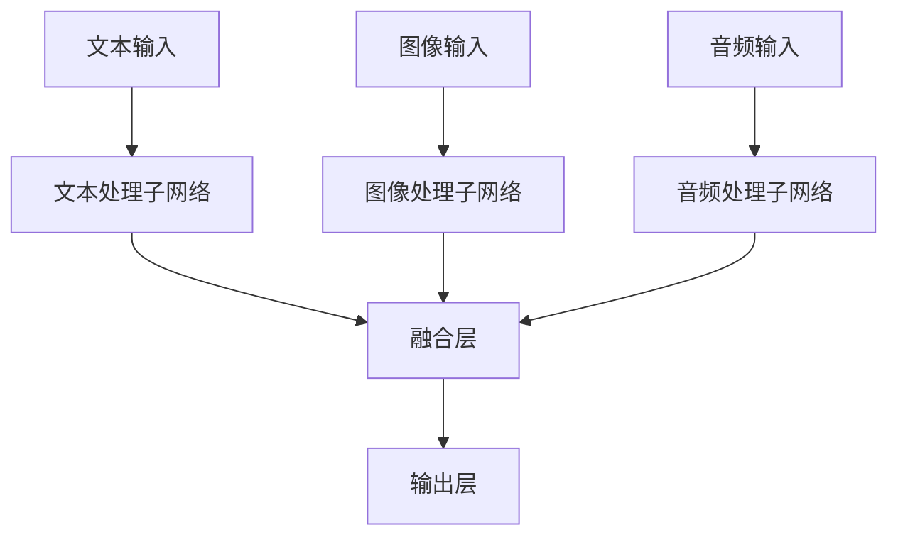

# 多模态大模型：技术原理与实战 应用背景

## 1.背景介绍

### 1.1 多模态大模型的兴起

随着人工智能技术的不断发展，单一模态的数据处理能力已经无法满足复杂应用场景的需求。多模态大模型应运而生，能够同时处理文本、图像、音频等多种数据类型，提供更为全面和准确的分析结果。

### 1.2 多模态大模型的定义

多模态大模型（Multimodal Large Model）是指能够同时处理和理解多种模态数据的人工智能模型。它们通过融合不同模态的数据，提升模型的理解和推理能力。

### 1.3 多模态大模型的应用背景

多模态大模型在医疗、自动驾驶、智能客服等领域有着广泛的应用。例如，在医疗领域，医生可以通过结合患者的病历文本、影像数据和语音描述，做出更准确的诊断。

## 2.核心概念与联系

### 2.1 模态的定义

模态（Modality）是指数据的不同类型或形式，如文本、图像、音频等。每种模态都有其独特的特征和处理方法。

### 2.2 多模态融合

多模态融合是指将不同模态的数据进行整合，以提升模型的整体性能。常见的融合方法包括特征级融合、决策级融合等。

### 2.3 多模态大模型的架构

多模态大模型通常采用多层神经网络架构，包括输入层、隐藏层和输出层。每种模态的数据通过独立的子网络进行处理，最后在融合层进行整合。



## 3.核心算法原理具体操作步骤

### 3.1 数据预处理

数据预处理是多模态大模型的第一步，包括数据清洗、归一化、特征提取等。不同模态的数据需要采用不同的预处理方法。

### 3.2 模态特征提取

每种模态的数据通过独立的子网络进行特征提取。例如，文本数据可以通过BERT模型进行处理，图像数据可以通过ResNet模型进行处理。

### 3.3 特征融合

特征融合是多模态大模型的关键步骤。常见的融合方法包括加权平均、拼接、注意力机制等。

### 3.4 模型训练

多模态大模型的训练过程与单模态模型类似，但需要同时考虑多种模态的数据。常用的优化算法包括SGD、Adam等。

### 3.5 模型评估

模型评估是验证多模态大模型性能的重要步骤。常用的评估指标包括准确率、召回率、F1值等。

## 4.数学模型和公式详细讲解举例说明

### 4.1 特征提取公式

假设 $x_t$ 表示文本特征，$x_i$ 表示图像特征，$x_a$ 表示音频特征。通过特征提取网络，我们可以得到：

$$
h_t = f_t(x_t)
$$

$$
h_i = f_i(x_i)
$$

$$
h_a = f_a(x_a)
$$

### 4.2 特征融合公式

假设我们采用加权平均的方法进行特征融合，融合后的特征表示为：

$$
h_f = \alpha h_t + \beta h_i + \gamma h_a
$$

其中，$\alpha$、$\beta$ 和 $\gamma$ 是融合权重，满足 $\alpha + \beta + \gamma = 1$。

### 4.3 损失函数

假设 $y$ 表示真实标签，$\hat{y}$ 表示模型预测值，常用的损失函数包括交叉熵损失：

$$
L = -\sum_{i=1}^{N} y_i \log(\hat{y}_i)
$$

## 5.项目实践：代码实例和详细解释说明

### 5.1 数据预处理代码示例

```python
import numpy as np
import pandas as pd
from sklearn.preprocessing import StandardScaler

# 加载数据
text_data = pd.read_csv('text_data.csv')
image_data = np.load('image_data.npy')
audio_data = np.load('audio_data.npy')

# 数据清洗
text_data = text_data.dropna()
image_data = image_data[~np.isnan(image_data).any(axis=1)]
audio_data = audio_data[~np.isnan(audio_data).any(axis=1)]

# 数据归一化
scaler = StandardScaler()
text_data = scaler.fit_transform(text_data)
image_data = scaler.fit_transform(image_data)
audio_data = scaler.fit_transform(audio_data)
```

### 5.2 模态特征提取代码示例

```python
import torch
import torch.nn as nn
from transformers import BertModel, BertTokenizer
from torchvision import models

# 文本特征提取
class TextFeatureExtractor(nn.Module):
    def __init__(self):
        super(TextFeatureExtractor, self).__init__()
        self.bert = BertModel.from_pretrained('bert-base-uncased')
    
    def forward(self, x):
        outputs = self.bert(x)
        return outputs.last_hidden_state

# 图像特征提取
class ImageFeatureExtractor(nn.Module):
    def __init__(self):
        super(ImageFeatureExtractor, self).__init__()
        self.resnet = models.resnet50(pretrained=True)
    
    def forward(self, x):
        return self.resnet(x)

# 音频特征提取
class AudioFeatureExtractor(nn.Module):
    def __init__(self):
        super(AudioFeatureExtractor, self).__init__()
        self.lstm = nn.LSTM(input_size=128, hidden_size=256, num_layers=2, batch_first=True)
    
    def forward(self, x):
        outputs, _ = self.lstm(x)
        return outputs[:, -1, :]
```

### 5.3 特征融合代码示例

```python
class MultimodalModel(nn.Module):
    def __init__(self):
        super(MultimodalModel, self).__init__()
        self.text_extractor = TextFeatureExtractor()
        self.image_extractor = ImageFeatureExtractor()
        self.audio_extractor = AudioFeatureExtractor()
        self.fc = nn.Linear(768 + 2048 + 256, 10)  # 假设输出类别为10
    
    def forward(self, text, image, audio):
        text_features = self.text_extractor(text)
        image_features = self.image_extractor(image)
        audio_features = self.audio_extractor(audio)
        combined_features = torch.cat((text_features, image_features, audio_features), dim=1)
        output = self.fc(combined_features)
        return output
```

### 5.4 模型训练代码示例

```python
import torch.optim as optim

# 初始化模型
model = MultimodalModel()
criterion = nn.CrossEntropyLoss()
optimizer = optim.Adam(model.parameters(), lr=0.001)

# 训练模型
for epoch in range(10):
    for text, image, audio, labels in dataloader:
        optimizer.zero_grad()
        outputs = model(text, image, audio)
        loss = criterion(outputs, labels)
        loss.backward()
        optimizer.step()
    print(f'Epoch {epoch+1}, Loss: {loss.item()}')
```

## 6.实际应用场景

### 6.1 医疗诊断

多模态大模型可以结合病历文本、影像数据和语音描述，帮助医生做出更准确的诊断。例如，通过分析患者的CT影像和病历记录，模型可以辅助医生判断是否存在肺炎。

### 6.2 自动驾驶

在自动驾驶领域，多模态大模型可以结合摄像头图像、激光雷达数据和GPS信息，提升车辆的环境感知能力。例如，通过融合不同传感器的数据，模型可以更准确地识别道路上的行人和障碍物。

### 6.3 智能客服

智能客服系统可以结合用户的文本输入、语音输入和历史记录，提供更为智能和个性化的服务。例如，通过分析用户的语音情感和文本内容，系统可以更准确地理解用户的需求。

## 7.工具和资源推荐

### 7.1 开源框架

- **TensorFlow**：谷歌开发的开源机器学习框架，支持多模态数据处理。
- **PyTorch**：Facebook开发的开源深度学习框架，广泛应用于多模态大模型的研究和开发。

### 7.2 数据集

- **COCO**：一个大规模的图像数据集，包含丰富的图像和文本描述。
- **LibriSpeech**：一个大规模的语音数据集，广泛用于语音识别和处理任务。

### 7.3 预训练模型

- **BERT**：一个强大的文本特征提取模型，广泛应用于自然语言处理任务。
- **ResNet**：一个经典的图像特征提取模型，广泛应用于计算机视觉任务。

## 8.总结：未来发展趋势与挑战

### 8.1 未来发展趋势

多模态大模型的发展前景广阔，未来可能会在以下几个方面取得突破：

- **更高效的特征融合方法**：研究更高效的特征融合方法，提升模型的性能。
- **更大规模的数据集**：构建更大规模的多模态数据集，提升模型的泛化能力。
- **更智能的应用场景**：探索多模态大模型在更多智能应用场景中的应用。

### 8.2 面临的挑战

尽管多模态大模型有着广阔的应用前景，但也面临一些挑战：

- **数据标注成本高**：多模态数据的标注成本较高，限制了数据集的规模。
- **计算资源需求大**：多模态大模型的训练需要大量的计算资源，限制了模型的应用范围。
- **模型解释性差**：多模态大模型的复杂性较高，模型的解释性较差，限制了其在某些领域的应用。

## 9.附录：常见问题与解答

### 9.1 多模态大模型的优势是什么？

多模态大模型能够同时处理和理解多种模态的数据，提供更为全面和准确的分析结果。例如，在医疗诊断中，结合病历文本和影像数据可以提升诊断的准确性。

### 9.2 多模态大模型的训练难点是什么？

多模态大模型的训练难点主要在于数据的预处理和特征融合。不同模态的数据需要采用不同的预处理方法，特征融合方法的选择也会影响模型的性能。

### 9.3 如何选择合适的特征融合方法？

特征融合方法的选择需要根据具体的应用场景和数据特点来确定。常见的融合方法包括加权平均、拼接、注意力机制等，可以通过实验比较不同方法的效果。

### 9.4 多模态大模型的应用前景如何？

多模态大模型在医疗、自动驾驶、智能客服等领域有着广泛的应用前景。随着技术的不断发展，多模态大模型将会在更多智能应用场景中发挥重要作用。

---

作者：禅与计算机程序设计艺术 / Zen and the Art of Computer Programming