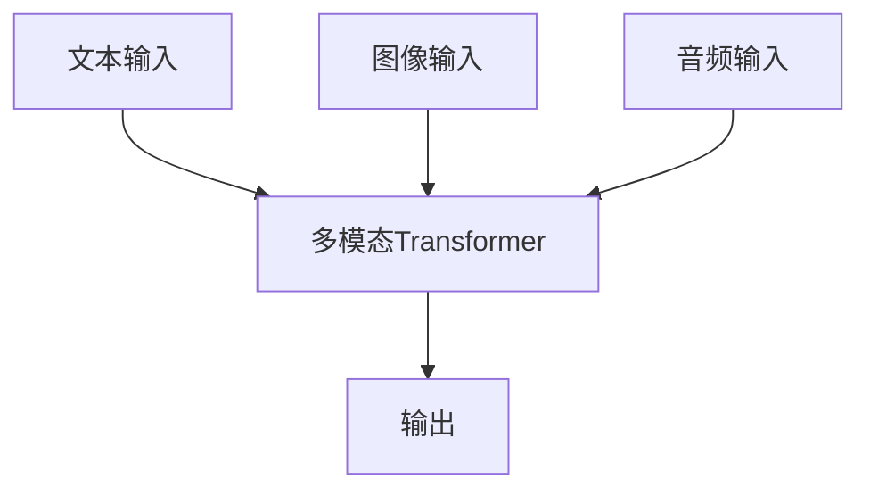
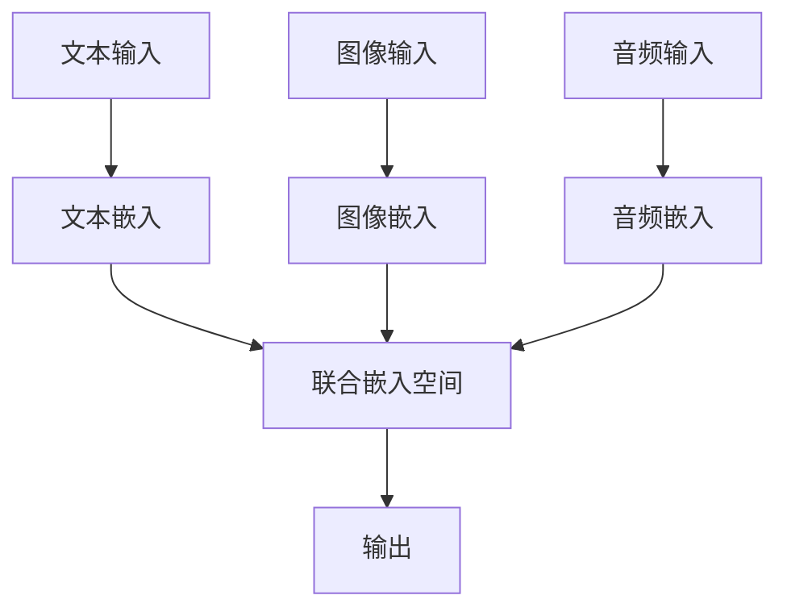

# 多模态大模型：技术原理与实战 微调实战

## 1.背景介绍

在人工智能领域，多模态大模型（Multimodal Large Models, MLMs）正逐渐成为研究和应用的热点。多模态大模型能够处理和理解多种类型的数据，如文本、图像、音频等，从而实现更为复杂和智能的任务。这些模型的出现不仅推动了技术的进步，也为实际应用带来了新的可能性。

### 1.1 多模态大模型的定义

多模态大模型是指能够同时处理多种模态数据的深度学习模型。与传统的单模态模型不同，多模态大模型可以综合利用不同类型的数据，从而在理解和生成复杂信息方面表现出色。

### 1.2 发展历程

多模态大模型的发展经历了几个重要阶段。从最初的单模态模型到多模态融合，再到如今的大规模预训练模型，每一步都标志着技术的重大进步。

### 1.3 重要性和应用前景

多模态大模型在自然语言处理、计算机视觉、语音识别等领域都有广泛的应用前景。例如，自动驾驶汽车需要同时处理图像和雷达数据，智能助理需要理解语音和文本信息。

## 2.核心概念与联系

在深入探讨多模态大模型的技术原理和实战应用之前，我们需要了解一些核心概念和它们之间的联系。

### 2.1 模态

模态是指数据的类型或形式。常见的模态包括文本、图像、音频、视频等。每种模态都有其独特的特征和处理方法。

### 2.2 多模态融合

多模态融合是指将不同模态的数据进行综合处理，以实现更为复杂的任务。常见的多模态融合方法包括特征级融合、决策级融合等。

### 2.3 预训练模型

预训练模型是指在大规模数据集上进行预训练的深度学习模型。这些模型在预训练阶段学习到丰富的特征表示，然后可以通过微调（fine-tuning）在特定任务上进行优化。

### 2.4 微调

微调是指在预训练模型的基础上，使用特定任务的数据进行进一步训练，以提高模型在该任务上的表现。微调通常需要较少的数据和计算资源。

### 2.5 核心联系

多模态大模型通过多模态融合技术，将不同模态的数据进行综合处理，并利用预训练模型的强大特征表示能力，通过微调实现特定任务的优化。

## 3.核心算法原理具体操作步骤

多模态大模型的核心算法涉及多个步骤，包括数据预处理、模型设计、训练和评估等。下面我们详细介绍这些步骤。

### 3.1 数据预处理

数据预处理是多模态大模型训练的第一步。不同模态的数据需要进行不同的预处理操作。

#### 3.1.1 文本数据预处理

文本数据通常需要进行分词、去停用词、词向量表示等操作。常用的工具包括NLTK、spaCy等。

#### 3.1.2 图像数据预处理

图像数据通常需要进行归一化、数据增强等操作。常用的工具包括OpenCV、Pillow等。

#### 3.1.3 音频数据预处理

音频数据通常需要进行采样、特征提取等操作。常用的工具包括Librosa、PyDub等。

### 3.2 模型设计

多模态大模型的设计需要考虑如何有效地融合不同模态的数据。常见的模型架构包括多模态Transformer、联合嵌入模型等。

#### 3.2.1 多模态Transformer

多模态Transformer是一种基于Transformer架构的多模态模型。它通过自注意力机制实现不同模态数据的融合。



#### 3.2.2 联合嵌入模型

联合嵌入模型通过将不同模态的数据映射到同一嵌入空间，实现多模态数据的融合。



### 3.3 训练

多模态大模型的训练通常分为预训练和微调两个阶段。

#### 3.3.1 预训练

预训练阶段在大规模多模态数据集上进行，目的是学习到丰富的特征表示。

#### 3.3.2 微调

微调阶段在特定任务的数据集上进行，目的是优化模型在该任务上的表现。

### 3.4 评估

模型评估是多模态大模型训练的最后一步。常用的评估指标包括准确率、精确率、召回率、F1值等。

## 4.数学模型和公式详细讲解举例说明

在多模态大模型中，数学模型和公式是理解其工作原理的关键。下面我们详细讲解一些核心的数学模型和公式。

### 4.1 自注意力机制

自注意力机制是多模态Transformer的核心。它通过计算输入序列中每个元素与其他元素的相关性，实现信息的加权融合。

$$
\text{Attention}(Q, K, V) = \text{softmax}\left(\frac{QK^T}{\sqrt{d_k}}\right)V
$$

其中，$Q$、$K$、$V$分别表示查询、键和值矩阵，$d_k$表示键的维度。

### 4.2 损失函数

损失函数是模型训练的目标函数。常用的损失函数包括交叉熵损失、均方误差等。

#### 4.2.1 交叉熵损失

交叉熵损失常用于分类任务。其公式为：

$$
L = -\sum_{i=1}^{N} y_i \log(\hat{y}_i)
$$

其中，$y_i$表示真实标签，$\hat{y}_i$表示预测概率。

#### 4.2.2 均方误差

均方误差常用于回归任务。其公式为：

$$
L = \frac{1}{N} \sum_{i=1}^{N} (y_i - \hat{y}_i)^2
$$

其中，$y_i$表示真实值，$\hat{y}_i$表示预测值。

### 4.3 优化算法

优化算法用于最小化损失函数。常用的优化算法包括随机梯度下降（SGD）、Adam等。

#### 4.3.1 随机梯度下降

随机梯度下降的更新公式为：

$$
\theta_{t+1} = \theta_t - \eta \nabla L(\theta_t)
$$

其中，$\theta_t$表示参数，$\eta$表示学习率，$\nabla L(\theta_t)$表示损失函数的梯度。

#### 4.3.2 Adam

Adam优化算法结合了动量和自适应学习率的优点。其更新公式为：

$$
m_t = \beta_1 m_{t-1} + (1 - \beta_1) \nabla L(\theta_t)
$$

$$
v_t = \beta_2 v_{t-1} + (1 - \beta_2) (\nabla L(\theta_t))^2
$$

$$
\hat{m}_t = \frac{m_t}{1 - \beta_1^t}
$$

$$
\hat{v}_t = \frac{v_t}{1 - \beta_2^t}
$$

$$
\theta_{t+1} = \theta_t - \eta \frac{\hat{m}_t}{\sqrt{\hat{v}_t} + \epsilon}
$$

其中，$m_t$和$v_t$分别表示一阶和二阶动量估计，$\beta_1$和$\beta_2$是动量参数，$\epsilon$是一个小常数。

## 5.项目实践：代码实例和详细解释说明

为了更好地理解多模态大模型的实际应用，我们将通过一个具体的项目实例来展示其微调过程。我们将使用一个预训练的多模态Transformer模型，并在一个图文匹配任务上进行微调。

### 5.1 环境准备

首先，我们需要准备开发环境。确保安装了以下依赖：

- Python 3.8+
- PyTorch
- Transformers
- OpenCV
- Pillow

### 5.2 数据集准备

我们将使用Flickr30k数据集，该数据集包含图像和对应的文本描述。下载并解压数据集后，确保数据文件结构如下：

```
data/
  ├── flickr30k_images/
  ├── flickr30k_texts/
```

### 5.3 代码实现

#### 5.3.1 数据预处理

首先，我们需要编写数据预处理代码，将图像和文本数据转换为模型可接受的格式。

```python
import os
import torch
from PIL import Image
from transformers import BertTokenizer, BertModel
from torchvision import transforms

# 图像预处理
image_transform = transforms.Compose([
    transforms.Resize((224, 224)),
    transforms.ToTensor(),
    transforms.Normalize(mean=[0.485, 0.456, 0.406], std=[0.229, 0.224, 0.225]),
])

# 文本预处理
tokenizer = BertTokenizer.from_pretrained('bert-base-uncased')

def preprocess_image(image_path):
    image = Image.open(image_path).convert('RGB')
    return image_transform(image)

def preprocess_text(text):
    return tokenizer(text, return_tensors='pt', padding=True, truncation=True, max_length=128)
```

#### 5.3.2 模型定义

接下来，我们定义多模态Transformer模型。我们将使用预训练的BERT模型处理文本数据，并使用ResNet模型处理图像数据。

```python
import torch.nn as nn
from torchvision.models import resnet50

class MultimodalTransformer(nn.Module):
    def __init__(self):
        super(MultimodalTransformer, self).__init__()
        self.text_model = BertModel.from_pretrained('bert-base-uncased')
        self.image_model = resnet50(pretrained=True)
        self.image_model.fc = nn.Linear(self.image_model.fc.in_features, 768)
        self.fc = nn.Linear(768 * 2, 2)  # 二分类任务

    def forward(self, text_input, image_input):
        text_output = self.text_model(**text_input).last_hidden_state[:, 0, :]
        image_output = self.image_model(image_input)
        combined_output = torch.cat((text_output, image_output), dim=1)
        return self.fc(combined_output)
```

#### 5.3.3 训练和评估

最后，我们编写训练和评估代码。

```python
import torch.optim as optim
from torch.utils.data import DataLoader, Dataset

class Flickr30kDataset(Dataset):
    def __init__(self, image_dir, text_dir):
        self.image_dir = image_dir
        self.text_dir = text_dir
        self.image_files = os.listdir(image_dir)
        self.text_files = os.listdir(text_dir)

    def __len__(self):
        return len(self.image_files)

    def __getitem__(self, idx):
        image_path = os.path.join(self.image_dir, self.image_files[idx])
        text_path = os.path.join(self.text_dir, self.text_files[idx])
        image = preprocess_image(image_path)
        with open(text_path, 'r') as f:
            text = f.read()
        text = preprocess_text(text)
        return image, text

# 数据加载
train_dataset = Flickr30kDataset('data/flickr30k_images', 'data/flickr30k_texts')
train_loader = DataLoader(train_dataset, batch_size=32, shuffle=True)

# 模型、损失函数和优化器
model = MultimodalTransformer()
criterion = nn.CrossEntropyLoss()
optimizer = optim.Adam(model.parameters(), lr=1e-4)

# 训练循环
for epoch in range(10):
    model.train()
    for images, texts in train_loader:
        optimizer.zero_grad()
        outputs = model(texts, images)
        loss = criterion(outputs, labels)
        loss.backward()
        optimizer.step()
    print(f'Epoch {epoch+1}, Loss: {loss.item()}')

# 模型评估
model.eval()
# 评估代码省略
```

## 6.实际应用场景

多模态大模型在多个实际应用场景中展现了其强大的能力。以下是一些典型的应用场景。

### 6.1 自动驾驶

在自动驾驶领域，多模态大模型可以综合处理来自摄像头、雷达、激光雷达等多种传感器的数据，从而实现更为精准的环境感知和决策。

### 6.2 智能助理

智能助理需要理解用户的语音指令，并结合上下文信息进行响应。多模态大模型可以同时处理语音和文本数据，从而提供更为智能的交互体验。

### 6.3 医疗影像分析

在医疗影像分析中，多模态大模型可以结合患者的病历文本和影像数据，提供更为准确的诊断和治疗建议。

### 6.4 多媒体检索

多媒体检索系统需要处理图像、视频、音频等多种类型的数据。多模态大模型可以实现跨模态的检索，提高检索的准确性和效率。

## 7.工具和资源推荐

在多模态大模型的研究和应用中，有许多工具和资源可以帮助我们更好地实现目标。以下是一些推荐的工具和资源。

### 7.1 开源框架

- **PyTorch**：一个灵活且高效的深度学习框架，广泛用于多模态大模型的研究和应用。
- **Transformers**：由Hugging Face提供的预训练模型库，支持多种预训练模型和微调任务。

### 7.2 数据集

- **Flickr30k**：一个包含图像和文本描述的数据集，常用于图文匹配任务。
- **COCO**：一个大规模图像数据集，包含丰富的图像和标注信息，广泛用于计算机视觉任务。

### 7.3 论文和书籍

- **《Attention is All You Need》**：介绍Transformer模型的经典论文。
- **《Deep Learning》**：一本全面介绍深度学习技术的书籍，适合初学者和进阶读者。

## 8.总结：未来发展趋势与挑战

多模态大模型在人工智能领域展现了巨大的潜力，但也面临着一些挑战和未来的发展趋势。

### 8.1 未来发展趋势

- **更大规模的预训练模型**：随着计算资源的增加和数据集的扩展，未来的多模态大模型将变得更加庞大和复杂。
- **更高效的模型架构**：研究人员将继续探索更高效的模型架构，以提高多模态大模型的性能和可扩展性。
- **更多样化的应用场景**：多模态大模型将在更多的实际应用场景中得到应用，如智能制造、智慧城市等。

### 8.2 挑战

- **数据标注和获取**：多模态数据的标注和获取成本较高，如何高效地获取和标注数据是一个重要的挑战。
- **模型解释性**：多模态大模型的复杂性增加了其解释的难度，如何提高模型的可解释性是一个亟待解决的问题。
- **计算资源需求**：多模态大模型的训练和推理需要大量的计算资源，如何优化计算资源的使用是一个重要的研究方向。

## 9.附录：常见问题与解答

### 9.1 多模态大模型的优势是什么？

多模态大模型能够综合利用不同模态的数据，从而在理解和生成复杂信息方面表现出色。它们在多个实际应用场景中展现了强大的能力，如自动驾驶、智能助理、医疗影像分析等。

### 9.2 如何选择合适的多模态大模型？

选择合适的多模态大模型需要考虑具体的应用场景和任务需求。常见的多模态大模型包括多模态Transformer、联合嵌入模型等。可以根据任务的复杂性和数据的特点选择合适的模型架构。

### 9.3 多模态大模型的训练需要哪些资源？

多模态大模型的训练通常需要大量的计算资源和数据。建议使用高性能的GPU或TPU进行训练，并选择合适的数据集进行预训练和微调。

### 9.4 如何提高多模态大模型的性能？

提高多模态大模型的性能可以从以下几个方面入手：
- 优化模型架构，选择更高效的融合方法。
- 增加训练数据量，提高模型的泛化能力。
- 使用更先进的优化算法，如Adam、LAMB等。

### 9.5 多模态大模型的未来发展方向是什么？

多模态大模型的未来发展方向包括更大规模的预训练模型、更高效的模型架构和更多样化的应用场景。研究人员将继续探索如何提高多模态大模型的性能和可扩展性，并解决数据标注、模型解释性和计算资源需求等挑战。

---

作者：禅与计算机程序设计艺术 / Zen and the Art of Computer Programming