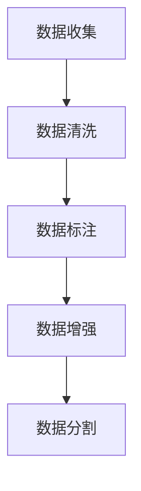

# 大规模语言模型从理论到实践 指令数据的构建

## 1.背景介绍

大规模语言模型（Large Language Models, LLMs）近年来在自然语言处理（NLP）领域取得了显著的进展。诸如GPT-3、BERT等模型在各种任务中表现出色，从文本生成到翻译，再到问答系统。然而，这些模型的成功离不开高质量的训练数据，特别是指令数据的构建。指令数据不仅决定了模型的性能，还影响其在实际应用中的表现。

## 2.核心概念与联系

### 2.1 大规模语言模型

大规模语言模型是基于深度学习的模型，通常包含数十亿到数千亿个参数。它们通过大量的文本数据进行训练，能够理解和生成自然语言。

### 2.2 指令数据

指令数据是指用于训练语言模型的特定类型的数据，通常包括输入和期望输出的对。例如，在问答系统中，输入可能是一个问题，输出则是对应的答案。

### 2.3 数据构建的重要性

高质量的指令数据能够显著提升模型的性能。数据的多样性、准确性和覆盖面直接影响模型的泛化能力和实际应用效果。

## 3.核心算法原理具体操作步骤

### 3.1 数据收集

数据收集是指令数据构建的第一步。需要从各种来源收集大量的文本数据，包括但不限于新闻文章、社交媒体、书籍和科学论文。

### 3.2 数据清洗

收集到的数据通常包含噪音和冗余信息，需要进行清洗。清洗步骤包括去除重复数据、修正拼写错误和过滤不相关内容。

### 3.3 数据标注

数据标注是指为收集到的数据添加标签，使其适合用于训练。例如，在问答系统中，需要为每个问题添加对应的答案。

### 3.4 数据增强

数据增强是通过对现有数据进行变换和扩展，生成更多的训练样本。常见的方法包括同义词替换、句子重构和数据生成。

### 3.5 数据分割

将数据分为训练集、验证集和测试集，以便在不同阶段评估模型的性能。通常，训练集占总数据的70%，验证集和测试集各占15%。



## 4.数学模型和公式详细讲解举例说明

### 4.1 语言模型的数学基础

语言模型的核心是概率论，特别是条件概率。给定一个词序列 $w_1, w_2, ..., w_n$，语言模型的目标是计算该序列的概率 $P(w_1, w_2, ..., w_n)$。

### 4.2 条件概率

条件概率是指在已知前面词的情况下，预测下一个词的概率。公式如下：

$$
P(w_1, w_2, ..., w_n) = P(w_1) \cdot P(w_2|w_1) \cdot P(w_3|w_1, w_2) \cdot ... \cdot P(w_n|w_1, w_2, ..., w_{n-1})
$$

### 4.3 语言模型的训练

训练语言模型的目标是最大化训练数据的似然函数。给定训练数据 $D$，似然函数 $L$ 定义为：

$$
L(\theta) = \prod_{(x, y) \in D} P(y|x; \theta)
$$

其中，$\theta$ 是模型的参数，$x$ 是输入，$y$ 是输出。

### 4.4 损失函数

为了优化模型参数，通常使用负对数似然作为损失函数：

$$
\mathcal{L}(\theta) = -\sum_{(x, y) \in D} \log P(y|x; \theta)
$$

### 4.5 优化算法

常用的优化算法包括随机梯度下降（SGD）和Adam优化器。优化的目标是最小化损失函数，从而找到最优的模型参数。

## 5.项目实践：代码实例和详细解释说明

### 5.1 数据收集与清洗

```python
import pandas as pd
import re

# 数据收集
data = pd.read_csv('data.csv')

# 数据清洗
def clean_text(text):
    text = re.sub(r'\s+', ' ', text)  # 去除多余空格
    text = re.sub(r'\d+', '', text)  # 去除数字
    return text

data['cleaned_text'] = data['text'].apply(clean_text)
```

### 5.2 数据标注

```python
# 假设我们有一个问答数据集
qa_data = [
    {"question": "什么是机器学习？", "answer": "机器学习是一种人工智能技术。"},
    {"question": "Python是什么？", "answer": "Python是一种编程语言。"}
]

# 数据标注
def label_data(qa_data):
    labeled_data = []
    for item in qa_data:
        labeled_data.append((item['question'], item['answer']))
    return labeled_data

labeled_data = label_data(qa_data)
```

### 5.3 数据增强

```python
from nlpaug.augmenter.word import SynonymAug

# 数据增强
aug = SynonymAug(aug_src='wordnet')
augmented_data = [aug.augment(text) for text in data['cleaned_text']]
```

### 5.4 数据分割

```python
from sklearn.model_selection import train_test_split

# 数据分割
train_data, test_data = train_test_split(labeled_data, test_size=0.3, random_state=42)
```

### 5.5 模型训练

```python
from transformers import BertTokenizer, BertForSequenceClassification, Trainer, TrainingArguments

# 加载预训练模型和分词器
tokenizer = BertTokenizer.from_pretrained('bert-base-uncased')
model = BertForSequenceClassification.from_pretrained('bert-base-uncased')

# 数据预处理
train_encodings = tokenizer([x[0] for x in train_data], truncation=True, padding=True)
test_encodings = tokenizer([x[0] for x in test_data], truncation=True, padding=True)

# 创建数据集
class QADataset(torch.utils.data.Dataset):
    def __init__(self, encodings, labels):
        self.encodings = encodings
        self.labels = labels

    def __getitem__(self, idx):
        item = {key: torch.tensor(val[idx]) for key, val in self.encodings.items()}
        item['labels'] = torch.tensor(self.labels[idx])
        return item

    def __len__(self):
        return len(self.labels)

train_dataset = QADataset(train_encodings, [x[1] for x in train_data])
test_dataset = QADataset(test_encodings, [x[1] for x in test_data])

# 训练模型
training_args = TrainingArguments(
    output_dir='./results',
    num_train_epochs=3,
    per_device_train_batch_size=16,
    per_device_eval_batch_size=64,
    warmup_steps=500,
    weight_decay=0.01,
    logging_dir='./logs',
)

trainer = Trainer(
    model=model,
    args=training_args,
    train_dataset=train_dataset,
    eval_dataset=test_dataset
)

trainer.train()
```

## 6.实际应用场景

### 6.1 问答系统

大规模语言模型在问答系统中表现出色，能够理解用户的问题并提供准确的答案。

### 6.2 机器翻译

通过训练大规模语言模型，可以实现高质量的机器翻译，支持多种语言之间的翻译。

### 6.3 文本生成

大规模语言模型能够生成高质量的文本，应用于新闻生成、内容创作等领域。

### 6.4 情感分析

通过训练大规模语言模型，可以实现对文本情感的分析，应用于市场分析、用户反馈等领域。

## 7.工具和资源推荐

### 7.1 工具

- **Hugging Face Transformers**：一个强大的NLP库，支持多种预训练模型。
- **NLTK**：一个用于自然语言处理的Python库，提供了丰富的工具和数据集。
- **spaCy**：一个高效的自然语言处理库，支持多种语言的处理。

### 7.2 资源

- **Kaggle**：提供了丰富的NLP数据集和竞赛。
- **Google Dataset Search**：一个强大的数据集搜索引擎，支持多种领域的数据集搜索。
- **arXiv**：一个开放的学术论文存储库，提供了大量的NLP相关论文。

## 8.总结：未来发展趋势与挑战

大规模语言模型在NLP领域展现了巨大的潜力，但也面临一些挑战。未来的发展趋势包括：

### 8.1 模型规模的进一步扩大

随着计算能力的提升，未来的大规模语言模型将包含更多的参数，能够处理更复杂的任务。

### 8.2 数据质量的提升

高质量的数据是提升模型性能的关键。未来需要更多的高质量数据集，特别是多语言、多领域的数据。

### 8.3 模型的可解释性

大规模语言模型的可解释性是一个重要的研究方向。未来需要更多的研究来解释模型的内部机制，提升其透明度和可信度。

### 8.4 伦理和隐私问题

大规模语言模型在应用中可能涉及伦理和隐私问题。未来需要更多的研究和政策来规范模型的使用，保护用户隐私。

## 9.附录：常见问题与解答

### 9.1 如何选择合适的数据集？

选择数据集时需要考虑数据的多样性、准确性和覆盖面。可以从Kaggle、Google Dataset Search等平台获取高质量的数据集。

### 9.2 如何处理数据中的噪音？

数据清洗是处理噪音的关键步骤。可以使用正则表达式、自然语言处理工具等方法去除噪音。

### 9.3 如何提升模型的性能？

提升模型性能的方法包括数据增强、模型优化和超参数调优。可以使用Hugging Face Transformers等工具进行模型训练和优化。

### 9.4 如何评估模型的性能？

可以使用准确率、召回率、F1分数等指标评估模型的性能。需要在验证集和测试集上进行评估，以确保模型的泛化能力。

### 9.5 如何应对模型的过拟合问题？

可以通过正则化、数据增强和交叉验证等方法应对模型的过拟合问题。需要在训练过程中监控模型的性能，及时调整训练策略。

---

作者：禅与计算机程序设计艺术 / Zen and the Art of Computer Programming