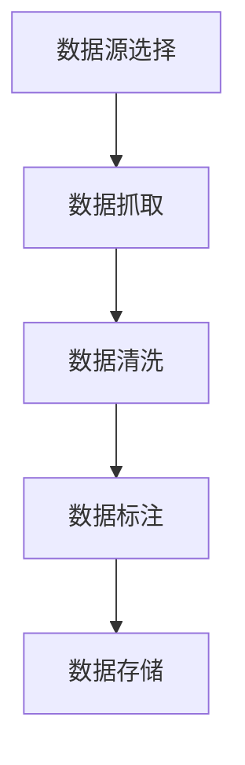

# 大规模语言模型从理论到实践 数据收集

## 1.背景介绍

大规模语言模型（Large Language Models, LLMs）近年来在自然语言处理（NLP）领域取得了显著的进展。诸如GPT-3、BERT等模型在各种任务中表现出色，从文本生成到翻译，再到情感分析和问答系统。这些模型的成功背后离不开大量高质量的数据。然而，数据收集是一个复杂且关键的过程，它直接影响模型的性能和应用效果。

## 2.核心概念与联系

### 2.1 数据收集的定义

数据收集是指从各种来源获取原始数据，并将其整理、清洗和标注，以供模型训练使用的过程。对于大规模语言模型，数据的质量和多样性至关重要。

### 2.2 数据收集与模型性能的关系

数据的质量和多样性直接影响模型的性能。高质量的数据可以提高模型的准确性和泛化能力，而多样化的数据可以增强模型在不同任务和场景下的适应性。

### 2.3 数据收集与伦理问题

在数据收集过程中，必须考虑数据隐私和伦理问题。未经授权的数据使用可能导致法律和道德问题，因此需要遵循相关法规和道德准则。

## 3.核心算法原理具体操作步骤

### 3.1 数据源选择

选择合适的数据源是数据收集的第一步。常见的数据源包括：

- 公开数据集：如Wikipedia、Common Crawl等。
- 专有数据集：如公司内部数据、合作伙伴数据等。
- 用户生成内容：如社交媒体、论坛等。

### 3.2 数据抓取

数据抓取是从数据源中提取数据的过程。常用的方法包括：

- Web爬虫：使用爬虫工具自动抓取网页内容。
- API接口：通过API获取结构化数据。

### 3.3 数据清洗

数据清洗是指对原始数据进行处理，以去除噪声和错误。常见的清洗步骤包括：

- 去重：删除重复的数据。
- 去噪：去除无关或低质量的数据。
- 格式化：将数据转换为统一的格式。

### 3.4 数据标注

数据标注是指为数据添加标签，以便模型能够理解和学习。常见的标注方法包括：

- 手动标注：由人工对数据进行标注。
- 自动标注：使用已有模型或规则对数据进行自动标注。

### 3.5 数据存储

数据存储是指将处理后的数据保存到数据库或文件系统中，以便后续使用。常见的存储方式包括：

- 数据库：如MySQL、MongoDB等。
- 文件系统：如HDFS、S3等。

以下是数据收集流程的Mermaid图示：



## 4.数学模型和公式详细讲解举例说明

### 4.1 数据分布与采样

在数据收集过程中，理解数据的分布和采样方法至关重要。假设我们有一个数据集 $D$，其数据分布为 $P(x)$。为了训练模型，我们需要从 $D$ 中采样一个子集 $S$，其分布为 $Q(x)$。理想情况下，$Q(x)$ 应该尽可能接近 $P(x)$。

### 4.2 数据清洗的数学表示

数据清洗可以看作是一个函数 $f$，将原始数据 $X$ 转换为清洗后的数据 $Y$：

$$
Y = f(X)
$$

其中，$f$ 可以包括去重、去噪和格式化等操作。

### 4.3 数据标注的数学表示

数据标注可以看作是一个函数 $g$，将清洗后的数据 $Y$ 转换为标注数据 $Z$：

$$
Z = g(Y)
$$

其中，$g$ 可以是手动标注或自动标注。

### 4.4 数据存储的数学表示

数据存储可以看作是一个函数 $h$，将标注数据 $Z$ 保存到存储系统中：

$$
h(Z) \rightarrow \text{存储系统}
$$

## 5.项目实践：代码实例和详细解释说明

### 5.1 数据抓取示例

以下是一个使用Python和BeautifulSoup进行网页抓取的示例代码：

```python
import requests
from bs4 import BeautifulSoup

def fetch_data(url):
    response = requests.get(url)
    if response.status_code == 200:
        soup = BeautifulSoup(response.content, 'html.parser')
        return soup.get_text()
    else:
        return None

url = 'https://example.com'
data = fetch_data(url)
print(data)
```

### 5.2 数据清洗示例

以下是一个使用Python进行数据清洗的示例代码：

```python
import re

def clean_data(text):
    # 去除HTML标签
    text = re.sub(r'<.*?>', '', text)
    # 去除非字母字符
    text = re.sub(r'[^a-zA-Z\s]', '', text)
    # 转换为小写
    text = text.lower()
    return text

raw_data = "<html><body>Hello, World!</body></html>"
cleaned_data = clean_data(raw_data)
print(cleaned_data)
```

### 5.3 数据标注示例

以下是一个使用Python进行自动标注的示例代码：

```python
import spacy

nlp = spacy.load('en_core_web_sm')

def annotate_data(text):
    doc = nlp(text)
    annotations = [(ent.text, ent.label_) for ent in doc.ents]
    return annotations

text = "Apple is looking at buying U.K. startup for $1 billion"
annotations = annotate_data(text)
print(annotations)
```

### 5.4 数据存储示例

以下是一个使用Python和SQLite进行数据存储的示例代码：

```python
import sqlite3

def store_data(data):
    conn = sqlite3.connect('example.db')
    c = conn.cursor()
    c.execute('''CREATE TABLE IF NOT EXISTS data (content TEXT)''')
    c.execute("INSERT INTO data (content) VALUES (?)", (data,))
    conn.commit()
    conn.close()

data = "Sample data to be stored"
store_data(data)
```

## 6.实际应用场景

### 6.1 文本生成

大规模语言模型在文本生成任务中表现出色，可以用于自动撰写文章、生成对话等。

### 6.2 机器翻译

通过大规模语言模型，可以实现高质量的机器翻译，支持多种语言之间的互译。

### 6.3 情感分析

大规模语言模型可以用于情感分析，帮助企业了解用户的情感倾向，从而改进产品和服务。

### 6.4 问答系统

大规模语言模型可以用于构建智能问答系统，提供准确和快速的回答。

## 7.工具和资源推荐

### 7.1 数据抓取工具

- BeautifulSoup：一个Python库，用于从HTML和XML文件中提取数据。
- Scrapy：一个用于抓取网站并提取结构化数据的Python框架。

### 7.2 数据清洗工具

- Pandas：一个强大的Python数据分析库，提供数据清洗和处理功能。
- OpenRefine：一个开源数据清洗工具，支持多种数据格式。

### 7.3 数据标注工具

- Labelbox：一个数据标注平台，支持多种标注任务。
- Prodigy：一个用于快速标注数据的Python工具。

### 7.4 数据存储工具

- MySQL：一个流行的关系型数据库管理系统。
- MongoDB：一个NoSQL数据库，适用于存储大规模数据。

## 8.总结：未来发展趋势与挑战

### 8.1 未来发展趋势

随着技术的不断进步，大规模语言模型将继续在NLP领域发挥重要作用。未来的发展趋势包括：

- 更大规模的模型：随着计算能力的提升，未来的语言模型将更加庞大，性能也将更强。
- 多模态模型：结合文本、图像、音频等多种模态的数据，提升模型的理解和生成能力。
- 自监督学习：通过自监督学习方法，减少对标注数据的依赖，提高模型的训练效率。

### 8.2 挑战

尽管大规模语言模型取得了显著进展，但仍面临一些挑战：

- 数据隐私和伦理问题：在数据收集过程中，必须严格遵守相关法规和道德准则。
- 计算资源需求：训练大规模语言模型需要大量的计算资源，成本较高。
- 模型解释性：大规模语言模型的内部机制复杂，难以解释其决策过程。

## 9.附录：常见问题与解答

### 9.1 如何选择合适的数据源？

选择数据源时，应考虑数据的质量、覆盖范围和合法性。优先选择公开数据集和授权数据。

### 9.2 如何处理数据中的噪声？

可以使用正则表达式、自然语言处理技术等方法去除数据中的噪声。

### 9.3 如何确保数据标注的准确性？

可以通过多轮标注和交叉验证等方法提高数据标注的准确性。

### 9.4 如何应对数据隐私问题？

在数据收集和使用过程中，应遵循相关法规和道德准则，确保数据的合法性和隐私性。

### 9.5 如何优化数据存储？

可以根据数据的规模和访问频率选择合适的存储方式，如关系型数据库、NoSQL数据库或分布式文件系统。

---

作者：禅与计算机程序设计艺术 / Zen and the Art of Computer Programming